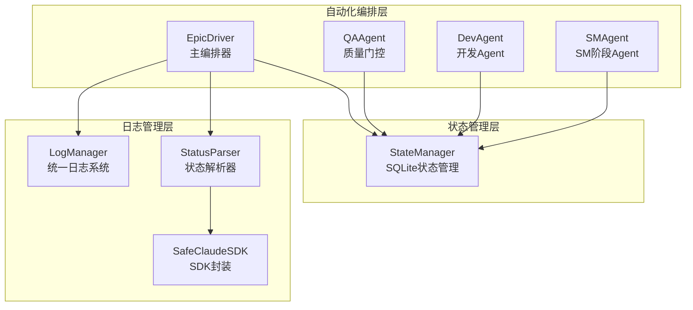
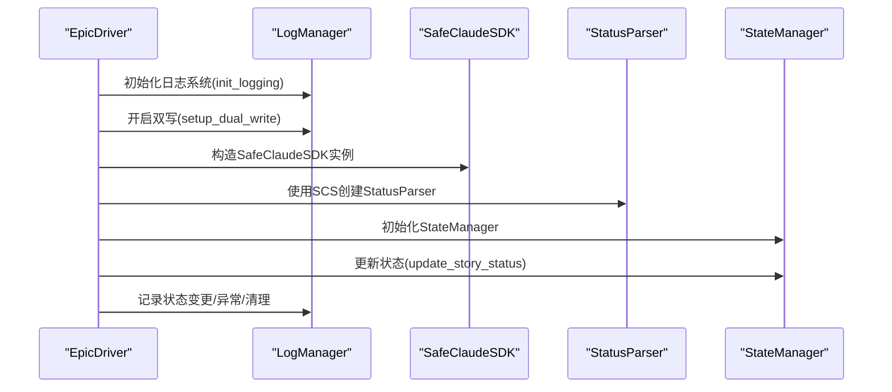
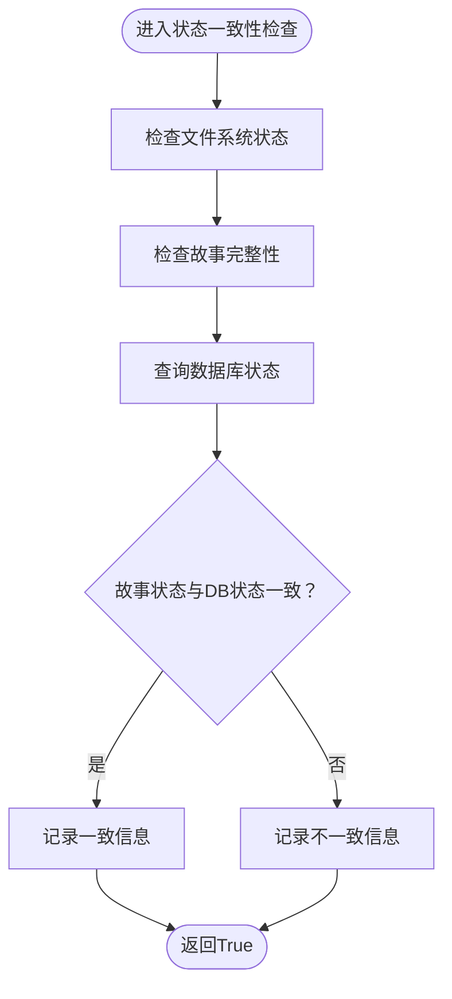
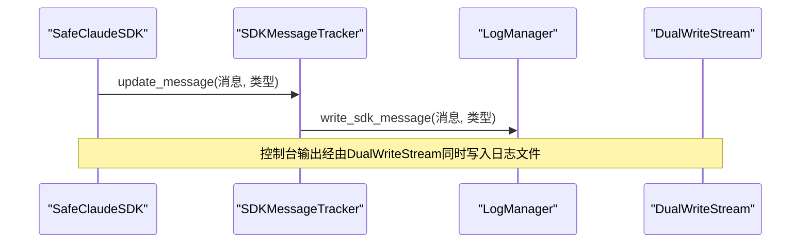
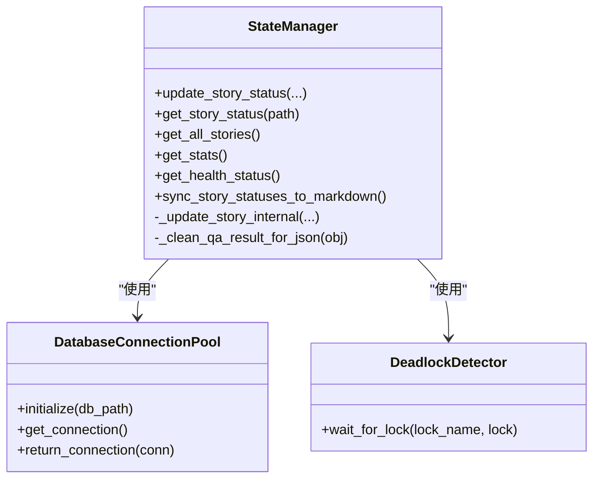
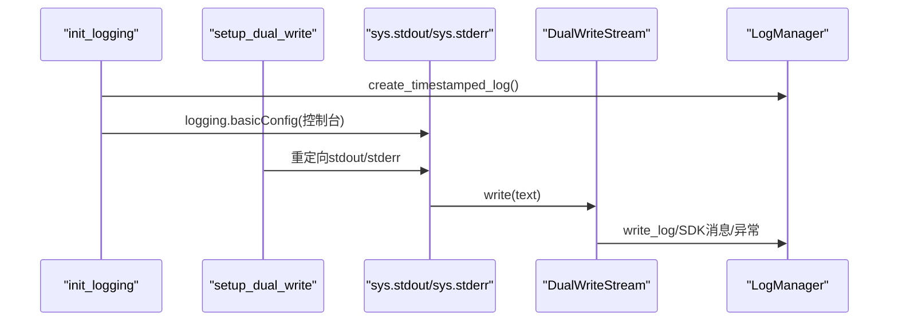
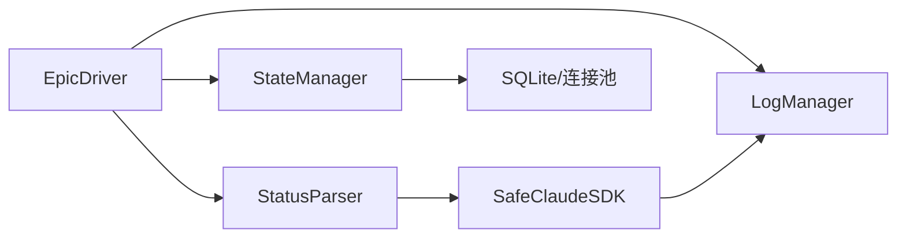

# 状态与日志集成机制

<cite>
**本文引用的文件**
- [epic_driver.py](file://autoBMAD/epic_automation/epic_driver.py)
- [state_manager.py](file://autoBMAD/epic_automation/state_manager.py)
- [log_manager.py](file://autoBMAD/epic_automation/log_manager.py)
- [sdk_wrapper.py](file://autoBMAD/epic_automation/sdk_wrapper.py)
- [story_parser.py](file://autoBMAD/epic_automation/story_parser.py)
- [test_state_manager.py](file://tests-copy/epic_automation/test_state_manager.py)
- [test_epic_driver_state_sync.py](file://tests-copy/test_epic_driver_state_sync.py)
</cite>

## 目录
1. [简介](#简介)
2. [项目结构](#项目结构)
3. [核心组件](#核心组件)
4. [架构总览](#架构总览)
5. [详细组件分析](#详细组件分析)
6. [依赖关系分析](#依赖关系分析)
7. [性能考量](#性能考量)
8. [故障排查指南](#故障排查指南)
9. [结论](#结论)
10. [附录](#附录)

## 简介
本文件聚焦于EpicDriver与StateManager、LogManager的集成机制，系统阐述EpicDriver如何通过状态解析器（StatusParser）与SafeClaudeSDK协作，完成状态值的提取、转换与更新；同时解释日志双写机制（setup_dual_write）的实现原理及结构化日志记录方式。文档还提供状态一致性检查（_check_state_consistency）的实现细节与日志配置初始化流程，并给出关键操作（阶段执行、质量检查）的状态更新与日志记录模式示例路径，便于读者快速定位源码位置并理解交互流程。

## 项目结构
围绕状态与日志集成的关键文件组织如下：
- EpicDriver：主编排器，负责初始化日志系统、构建状态解析器、协调各Agent与StateManager交互。
- StateManager：基于SQLite的状态持久化与并发控制组件，提供状态更新、查询、统计等能力。
- LogManager：统一日志系统，支持自动时间戳日志文件创建、实时增量写入、双写模式（控制台+文件）、SDK消息追踪与落盘。
- SafeClaudeSDK：封装Claude SDK调用，提供消息追踪、周期性输出、异常安全关闭等能力，供StatusParser使用。
- StoryParser：状态解析器，提供核心状态与处理状态之间的映射与规范化，支撑EpicDriver的状态一致性检查与更新。

图表来源
- [epic_driver.py](file://autoBMAD/epic_automation/epic_driver.py#L535-L700)
- [state_manager.py](file://autoBMAD/epic_automation/state_manager.py#L97-L140)
- [log_manager.py](file://autoBMAD/epic_automation/log_manager.py#L18-L60)
- [sdk_wrapper.py](file://autoBMAD/epic_automation/sdk_wrapper.py#L300-L360)
- [story_parser.py](file://autoBMAD/epic_automation/story_parser.py#L80-L120)

章节来源
- [epic_driver.py](file://autoBMAD/epic_automation/epic_driver.py#L535-L700)
- [state_manager.py](file://autoBMAD/epic_automation/state_manager.py#L97-L140)
- [log_manager.py](file://autoBMAD/epic_automation/log_manager.py#L18-L60)
- [sdk_wrapper.py](file://autoBMAD/epic_automation/sdk_wrapper.py#L300-L360)
- [story_parser.py](file://autoBMAD/epic_automation/story_parser.py#L80-L120)

## 核心组件
- EpicDriver：负责初始化LogManager、建立DualWrite流、构造StatusParser（基于SafeClaudeSDK），并在工作流中与StateManager交互，执行阶段推进与质量门控。
- StateManager：提供线程/协程安全的状态更新与查询，支持乐观锁、连接池、迁移与健康检查，保障状态一致性与可靠性。
- LogManager：提供时间戳日志文件、实时增量写入、双写模式（控制台+文件）、SDK消息追踪与异常落盘，确保运行期可观测性。
- SafeClaudeSDK：封装SDK调用，提供消息追踪、周期性输出、异常安全关闭，支持与LogManager联动记录SDK消息。
- StoryParser：提供核心状态与处理状态映射、规范化与回退解析策略，支撑EpicDriver的状态一致性检查与更新。

章节来源
- [epic_driver.py](file://autoBMAD/epic_automation/epic_driver.py#L611-L650)
- [state_manager.py](file://autoBMAD/epic_automation/state_manager.py#L203-L349)
- [log_manager.py](file://autoBMAD/epic_automation/log_manager.py#L377-L426)
- [sdk_wrapper.py](file://autoBMAD/epic_automation/sdk_wrapper.py#L202-L299)
- [story_parser.py](file://autoBMAD/epic_automation/story_parser.py#L80-L124)

## 架构总览
EpicDriver在启动时初始化LogManager并开启双写模式，随后创建StatusParser（由SafeClaudeSDK驱动），在工作流中通过StateManager进行状态持久化与查询。日志系统贯穿SDK消息、状态更新、异常与清理全过程，形成完整的可观测闭环。

图表来源
- [epic_driver.py](file://autoBMAD/epic_automation/epic_driver.py#L611-L650)
- [log_manager.py](file://autoBMAD/epic_automation/log_manager.py#L377-L426)
- [sdk_wrapper.py](file://autoBMAD/epic_automation/sdk_wrapper.py#L300-L360)
- [story_parser.py](file://autoBMAD/epic_automation/story_parser.py#L213-L240)
- [state_manager.py](file://autoBMAD/epic_automation/state_manager.py#L203-L349)

## 详细组件分析

### EpicDriver与状态解析器（StatusParser）集成
- 初始化流程
  - EpicDriver在构造函数中创建LogManager并调用init_logging与setup_dual_write，确保日志系统可用且双写生效。
  - 通过SafeClaudeSDK创建StatusParser实例，用于从故事文档中提取与规范化状态值。
- 状态解析与转换
  - StatusParser提供parse_status方法，优先使用AI解析（SafeClaudeSDK），失败时回退至正则表达式解析。
  - 核心状态值与处理状态值之间存在单向映射关系，便于StateManager统一存储与查询。
- 状态一致性检查（_check_state_consistency）
  - 该方法对文件系统状态、故事完整性与数据库状态进行一致性检查，发现不一致时仅记录信息而不阻断流程。
  - 若数据库查询失败，也会记录调试信息并继续执行，保证流程鲁棒性。

图表来源
- [epic_driver.py](file://autoBMAD/epic_automation/epic_driver.py#L1516-L1560)
- [story_parser.py](file://autoBMAD/epic_automation/story_parser.py#L113-L124)

章节来源
- [epic_driver.py](file://autoBMAD/epic_automation/epic_driver.py#L611-L650)
- [epic_driver.py](file://autoBMAD/epic_automation/epic_driver.py#L1516-L1560)
- [story_parser.py](file://autoBMAD/epic_automation/story_parser.py#L113-L124)

### SafeClaudeSDK与LogManager协同
- SDK消息追踪
  - SafeClaudeSDK通过SDKMessageTracker持续更新最新消息，并将消息类型与内容写入LogManager，实现结构化SDK日志。
- 双写模式
  - setup_dual_write将sys.stdout与sys.stderr重定向到DualWriteStream，使控制台输出与日志文件同时记录，保证运行期可见性。
- 异常与清理
  - SafeClaudeSDK在异常与取消场景下进行安全清理，避免跨任务取消错误；LogManager提供write_exception与close_log，确保异常与收尾日志落盘。

图表来源
- [sdk_wrapper.py](file://autoBMAD/epic_automation/sdk_wrapper.py#L202-L299)
- [log_manager.py](file://autoBMAD/epic_automation/log_manager.py#L406-L426)

章节来源
- [sdk_wrapper.py](file://autoBMAD/epic_automation/sdk_wrapper.py#L202-L299)
- [log_manager.py](file://autoBMAD/epic_automation/log_manager.py#L406-L426)

### StateManager状态更新与查询
- 更新流程
  - update_story_status对外提供统一入口，内部通过异步锁保护数据库操作，支持乐观锁版本校验与错误处理。
  - _update_story_internal负责具体更新或插入逻辑，将QA结果序列化为JSON字符串，确保可持久化。
- 查询与统计
  - get_story_status按路径查询故事状态，支持反序列化QA结果与错误信息。
  - get_all_stories与get_stats提供批量查询与统计能力，便于工作流监控与报表。
- 并发与健康
  - 使用asyncio.Lock与可选的连接池提升并发性能与稳定性；提供health状态查询与清理旧记录能力。

图表来源
- [state_manager.py](file://autoBMAD/epic_automation/state_manager.py#L203-L349)
- [state_manager.py](file://autoBMAD/epic_automation/state_manager.py#L59-L80)
- [state_manager.py](file://autoBMAD/epic_automation/state_manager.py#L370-L404)

章节来源
- [state_manager.py](file://autoBMAD/epic_automation/state_manager.py#L203-L349)
- [state_manager.py](file://autoBMAD/epic_automation/state_manager.py#L59-L80)
- [state_manager.py](file://autoBMAD/epic_automation/state_manager.py#L370-L404)

### 日志双写机制（setup_dual_write）与结构化日志
- 初始化与双写
  - init_logging创建时间戳日志文件并配置基础日志格式；setup_dual_write将stdout与stderr重定向到DualWriteStream，实现控制台与文件的双写。
- 结构化日志
  - LogManager提供write_log、write_sdk_message、write_exception、log_state_resync等方法，统一格式化输出，包含时间戳、耗时、消息类型等信息。
- 生命周期管理
  - cleanup_logging负责关闭当前日志文件并写入收尾信息，确保日志完整性。

图表来源
- [log_manager.py](file://autoBMAD/epic_automation/log_manager.py#L377-L426)
- [log_manager.py](file://autoBMAD/epic_automation/log_manager.py#L300-L359)

章节来源
- [log_manager.py](file://autoBMAD/epic_automation/log_manager.py#L377-L426)
- [log_manager.py](file://autoBMAD/epic_automation/log_manager.py#L300-L359)

### 关键操作示例（状态更新与日志记录模式）
- 阶段执行（开发/审查/完成）
  - EpicDriver在各阶段推进时调用StateManager.update_story_status更新状态、阶段与迭代次数，并通过LogManager记录关键事件与耗时。
  - 参考路径：[状态更新入口](file://autoBMAD/epic_automation/state_manager.py#L203-L349)
- 质量检查（Ruff/Basedpyright/Pytest）
  - QualityGateOrchestrator在每个质量门阶段执行后，使用LogManager记录阶段状态、耗时与结果；StateManager用于记录最终质量门控结果与错误信息。
  - 参考路径：[质量门控执行](file://autoBMAD/epic_automation/epic_driver.py#L166-L448)、[状态更新](file://autoBMAD/epic_automation/state_manager.py#L203-L349)
- 状态一致性检查
  - _check_state_consistency在推进前对文件系统、故事完整性与数据库状态进行一致性检查，记录差异信息但不阻断流程。
  - 参考路径：[一致性检查](file://autoBMAD/epic_automation/epic_driver.py#L1516-L1560)

章节来源
- [state_manager.py](file://autoBMAD/epic_automation/state_manager.py#L203-L349)
- [epic_driver.py](file://autoBMAD/epic_automation/epic_driver.py#L166-L448)
- [epic_driver.py](file://autoBMAD/epic_automation/epic_driver.py#L1516-L1560)

## 依赖关系分析
- EpicDriver依赖LogManager进行日志初始化与双写，依赖StateManager进行状态持久化，依赖StatusParser（由SafeClaudeSDK驱动）进行状态提取与规范化。
- StateManager内部依赖SQLite与可选连接池，提供线程/协程安全的CRUD操作。
- SafeClaudeSDK依赖Claude SDK生成器，通过SDKMessageTracker与LogManager联动记录SDK消息。
- StoryParser提供核心状态与处理状态映射，支撑EpicDriver的状态一致性检查。

图表来源
- [epic_driver.py](file://autoBMAD/epic_automation/epic_driver.py#L611-L650)
- [state_manager.py](file://autoBMAD/epic_automation/state_manager.py#L97-L140)
- [sdk_wrapper.py](file://autoBMAD/epic_automation/sdk_wrapper.py#L300-L360)
- [story_parser.py](file://autoBMAD/epic_automation/story_parser.py#L113-L124)

章节来源
- [epic_driver.py](file://autoBMAD/epic_automation/epic_driver.py#L611-L650)
- [state_manager.py](file://autoBMAD/epic_automation/state_manager.py#L97-L140)
- [sdk_wrapper.py](file://autoBMAD/epic_automation/sdk_wrapper.py#L300-L360)
- [story_parser.py](file://autoBMAD/epic_automation/story_parser.py#L113-L124)

## 性能考量
- 并发与锁管理
  - StateManager使用asyncio.Lock保护数据库操作，避免竞态；可选连接池减少连接获取开销，提升高并发场景下的吞吐。
- 乐观锁与版本控制
  - 更新操作支持expected_version参数，避免并发覆盖；当版本不一致时返回当前版本，便于上层重试或合并。
- 日志写入
  - 双写模式与实时增量写入确保可观测性，但频繁写盘可能带来I/O压力；建议在大批量日志场景下适当降低刷新频率或启用缓冲策略（若扩展）。
- SDK消息追踪
  - SafeClaudeSDK的周期性显示与消息追踪有助于运行期诊断，但过多消息可能增加日志体积；可通过过滤与采样策略控制。

章节来源
- [state_manager.py](file://autoBMAD/epic_automation/state_manager.py#L203-L349)
- [state_manager.py](file://autoBMAD/epic_automation/state_manager.py#L59-L80)
- [sdk_wrapper.py](file://autoBMAD/epic_automation/sdk_wrapper.py#L202-L299)
- [log_manager.py](file://autoBMAD/epic_automation/log_manager.py#L377-L426)

## 故障排查指南
- 状态不一致
  - 使用_log_state_resync与log_state_resync记录状态重同步事件，结合StateManager.get_story_status核对数据库状态。
  - 参考路径：[状态重同步日志](file://autoBMAD/epic_automation/log_manager.py#L243-L261)、[查询状态](file://autoBMAD/epic_automation/state_manager.py#L405-L461)
- SDK执行异常
  - 通过write_exception记录异常堆栈与上下文，配合SafeClaudeSDK的周期性输出定位问题。
  - 参考路径：[异常记录](file://autoBMAD/epic_automation/log_manager.py#L147-L185)、[SDK消息追踪](file://autoBMAD/epic_automation/sdk_wrapper.py#L202-L299)
- 并发冲突与死锁
  - DeadlockDetector与managed_operation提供死锁检测与安全释放，必要时通过get_health_status检查锁与连接池状态。
  - 参考路径：[死锁检测](file://autoBMAD/epic_automation/state_manager.py#L31-L58)、[健康状态](file://autoBMAD/epic_automation/state_manager.py#L605-L626)
- 质量门控失败
  - QualityGateOrchestrator记录各阶段耗时与结果，结合StateManager记录的QA结果与错误信息进行复盘。
  - 参考路径：[质量门控](file://autoBMAD/epic_automation/epic_driver.py#L166-L448)、[QA结果序列化](file://autoBMAD/epic_automation/state_manager.py#L350-L369)

章节来源
- [log_manager.py](file://autoBMAD/epic_automation/log_manager.py#L147-L185)
- [log_manager.py](file://autoBMAD/epic_automation/log_manager.py#L243-L261)
- [sdk_wrapper.py](file://autoBMAD/epic_automation/sdk_wrapper.py#L202-L299)
- [state_manager.py](file://autoBMAD/epic_automation/state_manager.py#L31-L58)
- [state_manager.py](file://autoBMAD/epic_automation/state_manager.py#L605-L626)
- [epic_driver.py](file://autoBMAD/epic_automation/epic_driver.py#L166-L448)

## 结论
EpicDriver通过LogManager与SafeClaudeSDK的紧密协作，实现了结构化日志与可观测性；借助StateManager的并发安全与乐观锁机制，保障了状态更新的一致性与可靠性。StatusParser与核心状态映射体系为状态一致性检查提供了坚实基础。整体架构在保证流程鲁棒性的同时，兼顾性能与可维护性，适合在复杂自动化流水线中长期演进。

## 附录
- 状态值映射与规范化
  - 核心状态值与处理状态值映射关系见ProcessingStatus枚举与core_status_to_processing函数。
  - 参考路径：[状态映射](file://autoBMAD/epic_automation/story_parser.py#L80-L124)
- 测试参考
  - 状态管理器单元测试覆盖状态更新、查询、统计与并发场景，可作为行为验证的参考。
  - 参考路径：[状态管理器测试](file://tests-copy/epic_automation/test_state_manager.py#L51-L190)

章节来源
- [story_parser.py](file://autoBMAD/epic_automation/story_parser.py#L80-L124)
- [test_state_manager.py](file://tests-copy/epic_automation/test_state_manager.py#L51-L190)