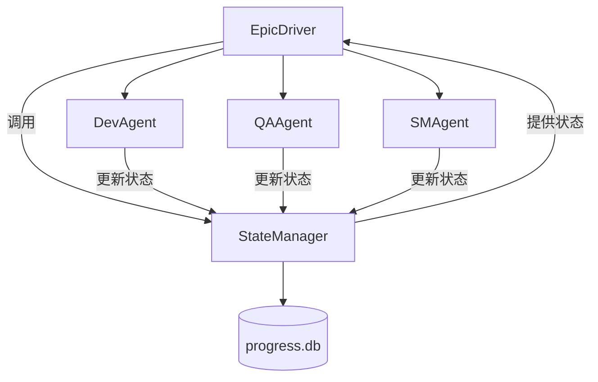
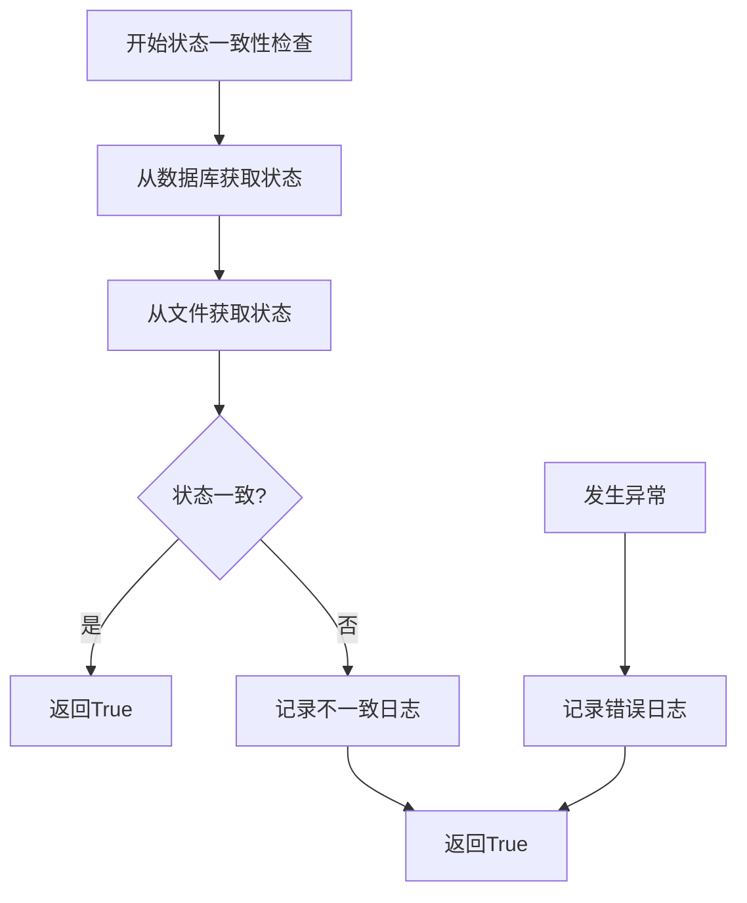

# 状态管理集成

<cite>
**本文档引用的文件**
- [epic_driver.py](file://autoBMAD/epic_automation/epic_driver.py)
- [state_manager.py](file://autoBMAD/epic_automation/state_manager.py)
- [dev_agent.py](file://autoBMAD/epic_automation/dev_agent.py)
- [qa_agent.py](file://autoBMAD/epic_automation/qa_agent.py)
- [story_parser.py](file://autoBMAD/epic_automation/story_parser.py)
- [sm_agent.py](file://autoBMAD/epic_automation/sm_agent.py)
</cite>

## 目录
1. [引言](#引言)
2. [EpicDriver与StateManager集成概览](#epicdriver与statemanager集成概览)
3. [状态值提取与转换流程](#状态值提取与转换流程)
4. [update_story_status方法详解](#update_story_status方法详解)
5. [状态一致性检查机制](#状态一致性检查机制)
6. [各阶段状态更新模式](#各阶段状态更新模式)
7. [状态映射逻辑](#状态映射逻辑)
8. [版本控制与错误处理](#版本控制与错误处理)
9. [结论](#结论)

## 引言
本文档详细阐述了EpicDriver与StateManager之间的集成机制，重点说明了EpicDriver如何通过`update_story_status()`方法与状态管理系统进行交互。文档涵盖了状态值的提取、转换和更新流程，详细解释了状态一致性检查（`_check_state_consistency`）的实现细节，以及在SM、Dev、QA各阶段中状态更新的具体模式。同时，文档提供了状态映射逻辑、版本控制机制和错误处理策略的完整说明。

## EpicDriver与StateManager集成概览

EpicDriver作为BMAD自动化系统的主要协调器，负责驱动SM-Dev-QA工作流。它通过`StateManager`类与一个SQLite数据库进行交互，以持久化地跟踪每个故事（story）的进度。这种集成确保了即使在系统中断后，工作流的状态也能被准确恢复。



**Diagram sources**
- [epic_driver.py](file://autoBMAD/epic_automation/epic_driver.py#L535-L2172)
- [state_manager.py](file://autoBMAD/epic_automation/state_manager.py#L97-L866)

**Section sources**
- [epic_driver.py](file://autoBMAD/epic_automation/epic_driver.py#L535-L2172)
- [state_manager.py](file://autoBMAD/epic_automation/state_manager.py#L97-L866)

## 状态值提取与转换流程

状态值的提取与转换是整个工作流的基础，它确保了系统能够正确理解故事的当前阶段。

### 状态值提取
状态值主要从故事的Markdown文件中提取。系统采用了一种“AI优先，正则回退”的混合策略：
1.  **AI智能解析**：`SimpleStoryParser`类优先使用`SafeClaudeSDK`调用Claude模型，通过语义理解来解析状态。这比简单的正则匹配更准确，能处理各种格式变体。
2.  **正则表达式回退**：如果AI解析不可用或失败，系统会使用一组精心设计的正则表达式模式来匹配状态字段。这些模式覆盖了多种格式，如`**Status**: Draft`、`Status: Ready for Review`等。

### 状态值转换
提取到的核心状态值（如 "Draft", "Ready for Review"）需要转换为系统内部使用的处理状态值。这一转换由`story_parser.py`中的`core_status_to_processing`函数完成，它将人类可读的状态映射为程序逻辑使用的值。

```mermaid
flowchart TD
A[故事Markdown文件] --> B{AI解析可用?}
B --> |是| C[调用SafeClaudeSDK]
B --> |否| D[使用正则表达式]
C --> E[获取核心状态值<br>(e.g., "Ready for Review")]
D --> E
E --> F[调用 core_status_to_processing()]
F --> G[获取处理状态值<br>(e.g., "review")]
G --> H[用于程序逻辑判断]
```

**Diagram sources**
- [story_parser.py](file://autoBMAD/epic_automation/story_parser.py#L213-L800)
- [dev_agent.py](file://autoBMAD/epic_automation/dev_agent.py#L240-L304)

**Section sources**
- [story_parser.py](file://autoBMAD/epic_automation/story_parser.py#L213-L800)
- [dev_agent.py](file://autoBMAD/epic_automation/dev_agent.py#L240-L304)

## update_story_status方法详解

`update_story_status`是`StateManager`类的核心方法，负责将故事的状态更新到数据库。

### 方法签名与参数
```python
async def update_story_status(
    self,
    story_path: str,
    status: str,
    phase: str | None = None,
    iteration: int | None = None,
    qa_result: Union["dict[str, Any]", None] = None,
    error: str | None = None,
    epic_path: str | None = None,
    lock_timeout: float = 30.0,
    expected_version: int | None = None,
) -> "tuple[bool, int | None]":
```

### 执行流程
1.  **超时保护**：该方法使用`asyncio.wait_for`包装内部逻辑，设置一个`lock_timeout`（默认30秒），以防止操作无限期挂起。
2.  **内部更新**：实际的数据库操作在`_update_story_internal`方法中执行，该方法被`self._lock`（一个`asyncio.Lock`）保护，确保同一时间只有一个协程可以修改数据库。
3.  **乐观锁检查**：当`expected_version`参数被提供时，系统会执行乐观锁检查。它会先查询数据库中该故事的当前版本号，如果与`expected_version`不匹配，则更新失败，返回`False`。这防止了并发更新导致的数据覆盖。
4.  **数据库操作**：
    *   **更新**：如果故事记录已存在，则更新其状态、阶段、迭代次数、QA结果、错误信息和`updated_at`时间戳，并将`version`字段加1。
    *   **插入**：如果故事记录不存在，则插入一条新记录，`version`初始化为1。

### 返回值
该方法返回一个元组`(success, current_version)`。`success`表示操作是否成功，`current_version`是操作后数据库中的最新版本号，可用于后续的乐观锁检查。

**Section sources**
- [state_manager.py](file://autoBMAD/epic_automation/state_manager.py#L203-L349)

## 状态一致性检查机制

`_check_state_consistency`是`EpicDriver`中的一个关键方法，用于在处理故事之前验证其状态的一致性。

### 实现细节
1.  **双重检查**：该方法会同时检查故事文件中的状态和数据库中的状态。
2.  **数据库状态获取**：通过调用`state_manager.get_story_status(story_path)`从数据库中获取最新的状态记录。
3.  **文件状态获取**：通过`_parse_story_status_sync`方法从故事文件中解析出当前状态。
4.  **一致性比较**：将两个状态值进行比较。如果发现不一致，会记录一条信息日志，但**不会阻止**工作流的继续执行。

### 设计哲学
这种“信息性而非阻断性”的设计是关键。它允许系统在状态不一致时继续运行，而不是因潜在的、可恢复的不一致而失败。这提高了系统的鲁棒性，因为状态不一致可能是由之前的失败操作或并发访问引起的，系统应该有能力通过后续的更新操作来纠正它。



**Diagram sources**
- [epic_driver.py](file://autoBMAD/epic_automation/epic_driver.py#L1537-L1553)

**Section sources**
- [epic_driver.py](file://autoBMAD/epic_automation/epic_driver.py#L1537-L1553)

## 各阶段状态更新模式

在SM、Dev、QA三个阶段，状态更新遵循特定的模式。

### SM阶段 (SMAgent)
SM阶段主要负责故事的创建和初始状态设置。
*   **触发**：当`create_stories_from_epic`方法成功创建故事文件后。
*   **状态更新**：调用`_update_story_statuses`方法，将所有新创建的故事状态从 "Draft" 更新为 "Ready for Development"。
*   **模式**：批量更新，确保所有故事都进入开发准备状态。

### Dev阶段 (DevAgent)
Dev阶段负责实现故事的功能。
*   **触发**：在开发任务成功完成后。
*   **状态更新**：调用`state_manager.update_story_status`，将状态更新为`"review"`（处理状态值），这对应于核心状态值 "Ready for Review"。
*   **模式**：单次更新，标志着开发阶段的完成。

### QA阶段 (QAAgent)
QA阶段负责对开发成果进行质量审查。
*   **触发**：在QA审查完成后，根据审查结果。
*   **状态更新**：
    *   如果QA通过，状态更新为`ProcessingStatus.QA_PASS.value` (`"qa_pass"`)。
    *   如果QA发现非关键问题，状态更新为`ProcessingStatus.QA_CONCERNS.value` (`"qa_concerns"`)。
    *   如果QA发现关键问题，状态更新为`ProcessingStatus.QA_FAIL.value` (`"qa_fail"`)。
*   **模式**：基于审查结果的条件更新。

**Section sources**
- [sm_agent.py](file://autoBMAD/epic_automation/sm_agent.py#L621-L720)
- [dev_agent.py](file://autoBMAD/epic_automation/dev_agent.py#L289-L294)
- [qa_agent.py](file://autoBMAD/epic_automation/qa_agent.py#L282-L288)

## 状态映射逻辑

系统使用两套状态值：**核心状态值**（Core Status）和**处理状态值**（Processing Status）。

### 核心状态值 (Core Status)
这些是用户在故事文件中看到的、人类可读的状态，定义在`story_parser.py`中：
*   `CORE_STATUS_DRAFT` = "Draft"
*   `CORE_STATUS_READY_FOR_DEVELOPMENT` = "Ready for Development"
*   `CORE_STATUS_IN_PROGRESS` = "In Progress"
*   `CORE_STATUS_READY_FOR_REVIEW` = "Ready for Review"
*   `CORE_STATUS_READY_FOR_DONE` = "Ready for Done"
*   `CORE_STATUS_DONE` = "Done"
*   `CORE_STATUS_FAILED` = "Failed"

### 处理状态值 (Processing Status)
这些是系统内部用于程序逻辑判断的状态，定义为`ProcessingStatus`枚举：
*   `PENDING` = "pending"
*   `IN_PROGRESS` = "in_progress"
*   `REVIEW` = "review"
*   `COMPLETED` = "completed"
*   `FAILED` = "failed"
*   `QA_PASS` = "qa_pass"
*   `QA_CONCERNS` = "qa_concerns"
*   `QA_FAIL` = "qa_fail"
*   `QA_WAIVED` = "qa_waived"

### 映射关系
`CORE_TO_PROCESSING_MAPPING`字典定义了从核心状态到处理状态的单向映射：
```python
CORE_TO_PROCESSING_MAPPING = {
    CORE_STATUS_DRAFT: "pending",
    CORE_STATUS_READY_FOR_DEVELOPMENT: "pending",
    CORE_STATUS_IN_PROGRESS: "in_progress",
    CORE_STATUS_READY_FOR_REVIEW: "review",
    CORE_STATUS_READY_FOR_DONE: "review",
    CORE_STATUS_DONE: "completed",
    CORE_STATUS_FAILED: "failed",
}
```
这个映射简化了程序逻辑，例如，所有“待处理”的状态（Draft, Ready for Development）都被映射为`"pending"`。

**Section sources**
- [story_parser.py](file://autoBMAD/epic_automation/story_parser.py#L59-L111)

## 版本控制与错误处理

### 版本控制
`StateManager`通过数据库表中的`version`字段实现了乐观锁。
*   每次成功更新故事状态时，`version`都会递增。
*   当调用`update_story_status`并提供`expected_version`时，系统会检查数据库中的当前版本是否与期望版本一致。如果不一致，更新将失败，防止了并发更新导致的数据丢失。

### 错误处理
系统在多个层面实现了稳健的错误处理：
1.  **数据库操作**：`_update_story_internal`方法被`asyncio.Lock`保护，防止并发冲突。`update_story_status`方法本身有超时保护。
2.  **SDK调用**：`SDKSessionManager`通过`IsolatedSDKContext`隔离了不同Agent的SDK调用，防止了cancel scope的错误传播。
3.  **状态检查**：`_check_state_consistency`方法在遇到错误时会记录日志但继续执行，保证了工作流的韧性。
4.  **回退机制**：`SimpleStoryParser`在AI解析失败时会自动回退到正则表达式解析，确保了状态提取的可靠性。

**Section sources**
- [state_manager.py](file://autoBMAD/epic_automation/state_manager.py#L294-L304)
- [sdk_session_manager.py](file://autoBMAD/epic_automation/sdk_session_manager.py#L123-L204)

## 结论
EpicDriver与StateManager的集成机制设计精巧，通过`update_story_status`方法实现了可靠的状态持久化。系统采用“AI优先，正则回退”的策略提取状态，并通过`core_status_to_processing`函数进行转换。`_check_state_consistency`方法以非阻断的方式确保了状态的一致性。在SM、Dev、QA各阶段，状态更新遵循清晰的模式。通过`version`字段的乐观锁和多层错误处理，系统具备了强大的并发处理能力和容错性，确保了BMAD自动化工作流的稳定运行。