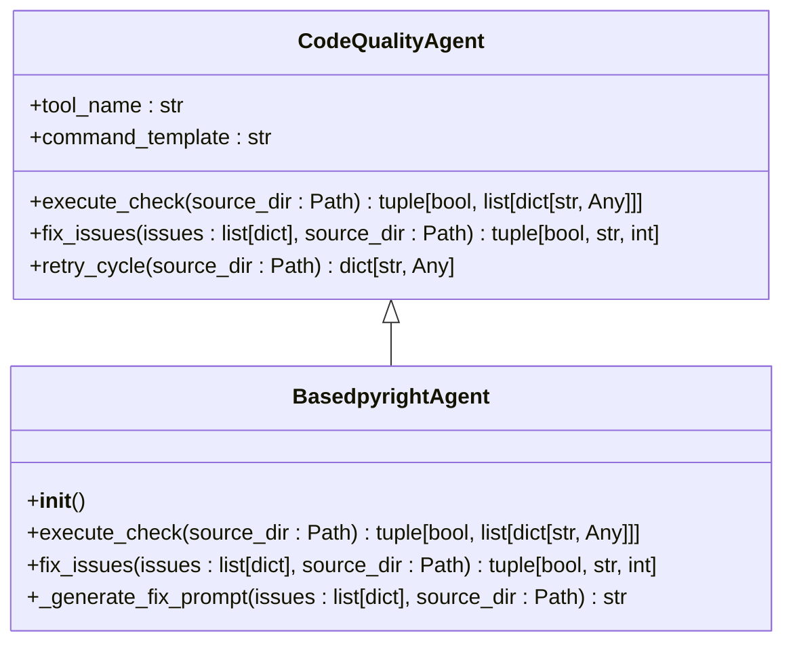
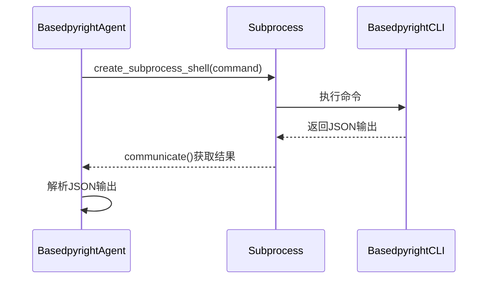
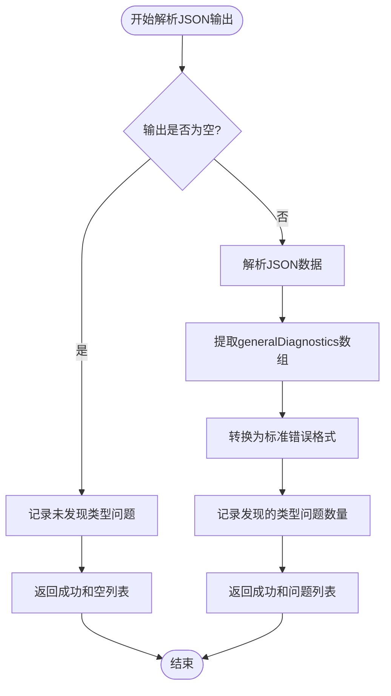
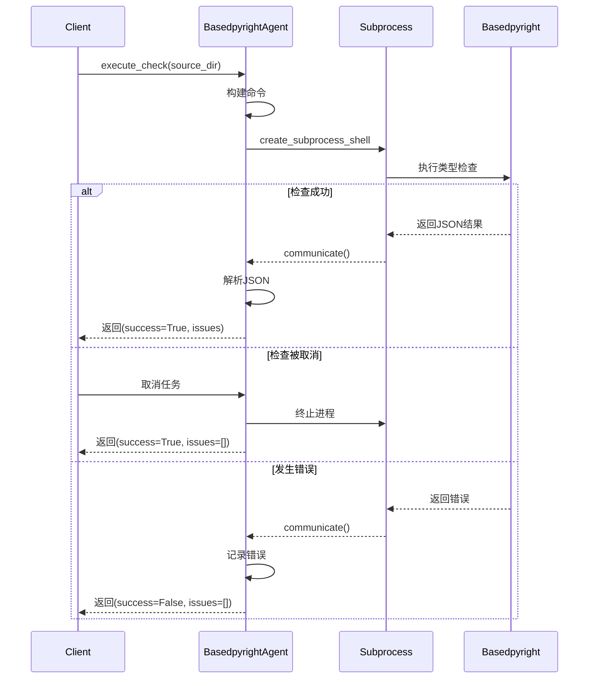
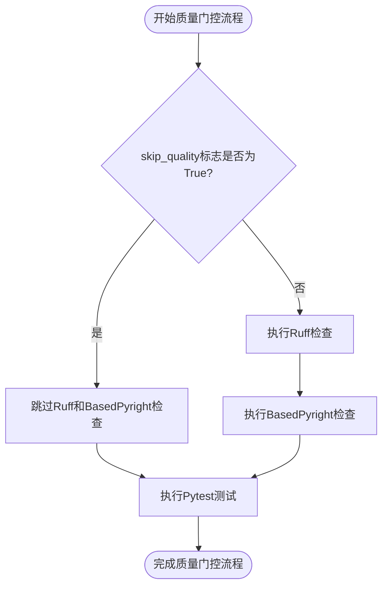
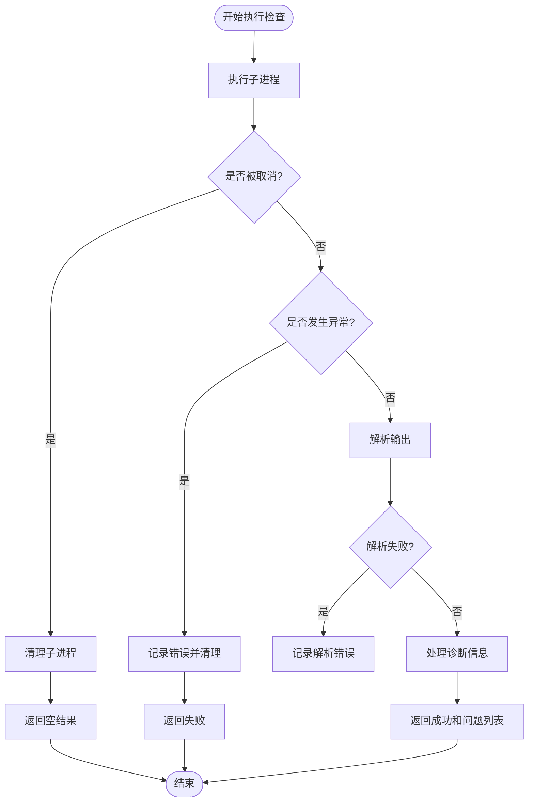
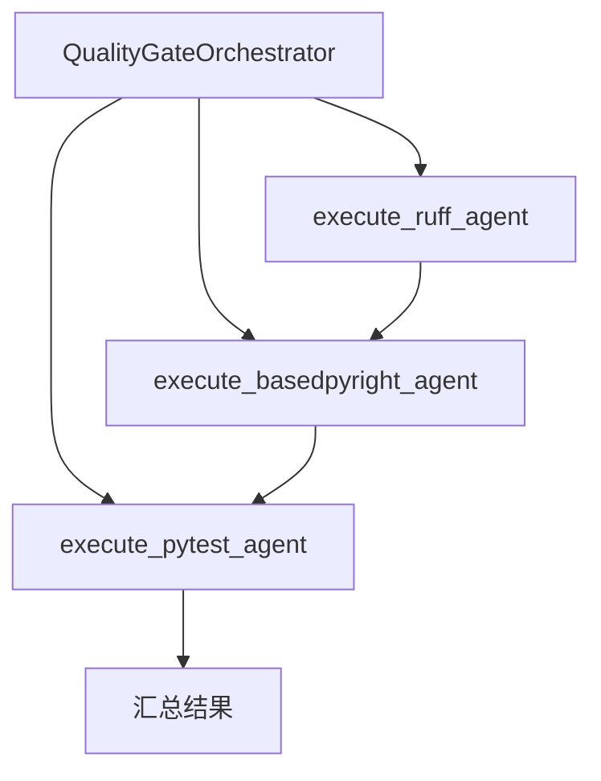
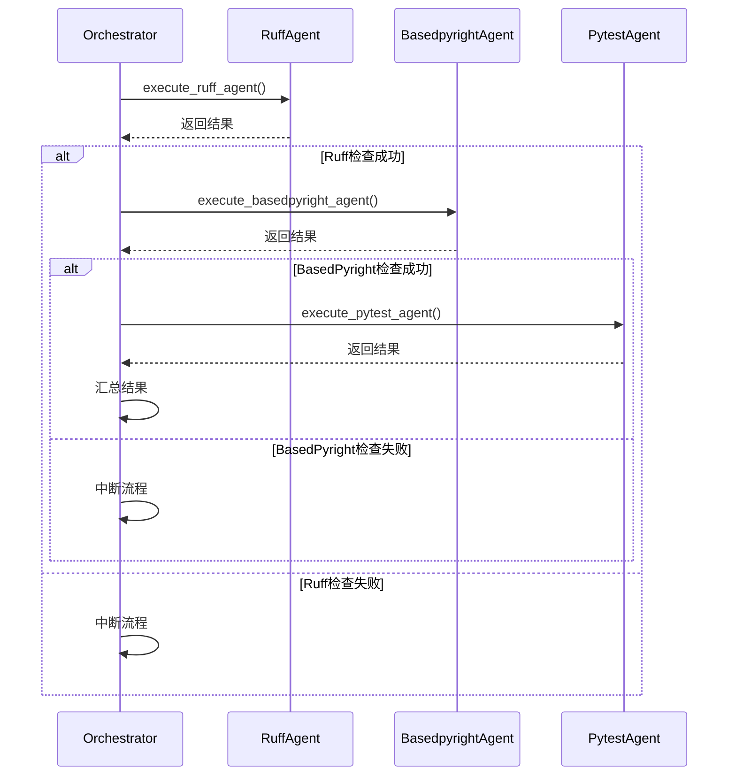
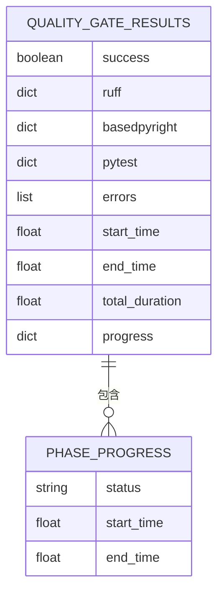

# BasedPyright类型检查

<cite>
**本文档引用的文件**
- [quality_agents.py](file://autoBMAD/epic_automation/quality_agents.py)
- [epic_driver.py](file://autoBMAD/epic_automation/epic_driver.py)
- [test_quality_agents.py](file://tests-copy/epic_automation/test_quality_agents.py)
- [test_quality_gates_complete.py](file://tests-copy/integration/test_quality_gates_complete.py)
- [architecture.md](file://docs-copy/architecture/architecture.md)
</cite>

## 目录
1. [简介](#简介)
2. [BasedpyrightAgent类实现机制](#basedpyrightagent类实现机制)
3. [execute_basedpyright_agent方法执行流程](#execute_basedpyright_agent方法执行流程)
4. [--skip-quality CLI标志控制](#--skip-quality-cli标志控制)
5. [依赖管理与异常处理](#依赖管理与异常处理)
6. [与QualityGateOrchestrator集成](#与qualitygateorchestrator集成)
7. [结果聚合与进度跟踪](#结果聚合与进度跟踪)
8. [结论](#结论)

## 简介

BasedPyright质量门控系统是自动化代码质量保证流程的核心组件，专门用于执行Python代码的静态类型检查。该系统通过BasedpyrightAgent类实现，能够与Ruff代码检查和Pytest测试框架协同工作，形成完整的质量保证管道。BasedPyright作为Pyright的增强版本，提供了更严格的类型检查功能，能够发现潜在的类型错误，提高代码的可靠性和可维护性。

质量门控流程在开发-测试周期完成后自动触发，确保代码在合并前满足预定的质量标准。该系统设计为可配置和可扩展，支持跳过特定检查阶段，适应不同的开发和部署场景。通过与Claude SDK集成，系统还具备自动生成类型注解修复建议的能力，进一步提升了开发效率。

## BasedpyrightAgent类实现机制

BasedpyrightAgent类继承自CodeQualityAgent基类，实现了基于subprocess的外部命令执行机制。该类的核心功能是通过命令行调用basedpyright工具，执行静态类型检查，并解析其JSON格式的输出结果。



**类图来源**
- [quality_agents.py](file://autoBMAD/epic_automation/quality_agents.py#L566-L760)

**本节来源**
- [quality_agents.py](file://autoBMAD/epic_automation/quality_agents.py#L566-L760)

### 命令执行与子进程管理

BasedpyrightAgent使用asyncio.create_subprocess_shell方法异步执行basedpyright命令。命令模板在初始化时定义为"basedpyright --outputformat=json {source_dir}"，确保输出为JSON格式，便于后续解析。



**序列图来源**
- [quality_agents.py](file://autoBMAD/epic_automation/quality_agents.py#L581-L644)

**本节来源**
- [quality_agents.py](file://autoBMAD/epic_automation/quality_agents.py#L581-L644)

### JSON输出解析与类型错误提取

执行结果的JSON输出包含版本信息和generalDiagnostics数组。BasedpyrightAgent解析这些数据，提取出文件路径、行号、列号、严重性、错误信息和规则ID等关键信息，并转换为统一的错误对象格式。



**流程图来源**
- [quality_agents.py](file://autoBMAD/epic_automation/quality_agents.py#L645-L691)

**本节来源**
- [quality_agents.py](file://autoBMAD/epic_automation/quality_agents.py#L645-L691)

## execute_basedpyright_agent方法执行流程

execute_basedpyright_agent方法（在代码中体现为execute_check）是BasedpyrightAgent的核心执行方法，负责协调整个类型检查过程。该方法采用异步编程模型，确保在执行长时间运行的外部命令时不会阻塞主线程。

执行流程从构建命令开始，将source_dir参数代入预定义的命令模板中。然后使用asyncio.create_subprocess_shell创建子进程，通过stdout和stderr管道捕获命令的输出。为了处理可能的取消操作，代码中包含了对asyncio.CancelledError的特殊处理，确保在取消检查时能够正确清理子进程。



**序列图来源**
- [quality_agents.py](file://autoBMAD/epic_automation/quality_agents.py#L581-L695)

**本节来源**
- [quality_agents.py](file://autoBMAD/epic_automation/quality_agents.py#L581-L695)

## --skip-quality CLI标志控制

--skip-quality命令行标志为质量门控流程提供了灵活的控制机制，允许用户在特定情况下跳过基于Ruff和BasedPyright的质量检查。这一功能在快速迭代、调试或临时部署等场景中非常有用，可以显著缩短构建和部署时间。

当--skip-quality标志被设置为True时，QualityGateOrchestrator在执行execute_ruff_agent和execute_basedpyright_agent方法时会立即返回一个标记为"skipped"的结果，而不会实际执行相应的检查。这确保了流程的完整性，同时避免了不必要的计算开销。



**流程图来源**
- [epic_driver.py](file://autoBMAD/epic_automation/epic_driver.py#L167-L170)
- [epic_driver.py](file://autoBMAD/epic_automation/epic_driver.py#L231-L236)

**本节来源**
- [epic_driver.py](file://autoBMAD/epic_automation/epic_driver.py#L167-L170)
- [epic_driver.py](file://autoBMAD/epic_automation/epic_driver.py#L231-L236)

### 标志行为验证

系统通过集成测试验证了--skip-quality标志的正确行为。测试用例确认当该标志被设置时，Ruff和BasedPyright检查被正确跳过，而Pytest测试仍然执行。同时，结果对象中的相应字段被正确标记为"skipped"，确保了结果的准确性和可追溯性。

```python
# 测试--skip-quality标志行为
def test_skip_quality_flag(self, temp_source_dir, temp_test_dir):
    orchestrator = QualityGateOrchestrator(
        source_dir=str(temp_source_dir["source_dir"]),
        test_dir=str(temp_test_dir["test_dir"]),
        skip_quality=True,  # 跳过质量检查
        skip_tests=False
    )
    results = await orchestrator.execute_quality_gates("test-epic")
    
    # 验证质量检查被跳过
    assert results["ruff"]["skipped"] is True
    assert results["basedpyright"]["skipped"] is True
    
    # 验证pytest仍然执行
    assert "skipped" not in results["pytest"] or results["pytest"]["skipped"] is False
```

**本节来源**
- [test_quality_gates_complete.py](file://tests-copy/integration/test_quality_gates_complete.py#L172-L196)

## 依赖管理与异常处理

BasedpyrightAgent的依赖管理采用动态导入策略，确保在缺少必要依赖时能够优雅地降级而不是直接崩溃。在execute_check方法中，系统尝试导入BasedpyrightAgent类，如果导入失败，则记录错误并返回失败结果，而不是抛出异常。

异常处理机制是该系统稳定性的关键。代码中包含了多层异常处理，能够捕获并处理从子进程通信到JSON解析的各种异常。特别是对asyncio.CancelledError的处理，确保了在任务被取消时能够正确清理资源，防止僵尸进程的产生。



**流程图来源**
- [quality_agents.py](file://autoBMAD/epic_automation/quality_agents.py#L595-L695)

**本节来源**
- [quality_agents.py](file://autoBMAD/epic_automation/quality_agents.py#L595-L695)

### 错误恢复与重试机制

系统实现了retry_cycle方法，提供了一种错误恢复机制。该方法允许在检查失败后进行多次重试，增加了流程的鲁棒性。每次重试都会重新执行完整的检查流程，直到达到最大重试次数或检查成功。

```python
async def retry_cycle(
    self, source_dir: Path, max_cycles: int = 3, retries_per_cycle: int = 2
) -> dict[str, Any]:
    """
    执行带重试逻辑的检查和修复循环。
    """
    for cycle_num in range(1, max_cycles + 1):
        success, issues = await self.execute_check(source_dir)
        if not success:
            logger.error(f"第 {cycle_num} 次循环检查失败")
            continue
            
        if not issues:
            logger.info(f"未发现任何问题，停止循环")
            break
            
        # 尝试修复问题
        for retry_num in range(1, retries_per_cycle + 1):
            fix_success, fix_message, fixed_count = await self.fix_issues(issues, source_dir)
            if fix_success:
                break
```

**本节来源**
- [quality_agents.py](file://autoBMAD/epic_automation/quality_agents.py#L279-L421)

## 与QualityGateOrchestrator集成

BasedpyrightAgent与QualityGateOrchestrator紧密集成，作为质量门控管道的第二阶段执行。QualityGateOrchestrator负责协调Ruff、BasedPyright和Pytest三个阶段的执行顺序，确保它们按预定流程依次进行。



**图来源**
- [epic_driver.py](file://autoBMAD/epic_automation/epic_driver.py#L465-L497)

**本节来源**
- [epic_driver.py](file://autoBMAD/epic_automation/epic_driver.py#L465-L497)

### 集成执行流程

集成流程从QualityGateOrchestrator的execute_quality_gates方法开始。该方法按顺序执行三个质量检查阶段：首先执行Ruff代码风格检查，然后执行BasedPyright类型检查，最后执行Pytest单元测试。每个阶段的执行都依赖于前一个阶段的成功完成。



**序列图来源**
- [epic_driver.py](file://autoBMAD/epic_automation/epic_driver.py#L465-L497)

**本节来源**
- [epic_driver.py](file://autoBMAD/epic_automation/epic_driver.py#L465-L497)

## 结果聚合与进度跟踪

QualityGateOrchestrator不仅执行各个质量检查阶段，还负责结果的聚合和进度的跟踪。系统维护一个详细的结果字典，记录每个阶段的执行状态、持续时间、开始和结束时间等信息。



**实体关系图来源**
- [epic_driver.py](file://autoBMAD/epic_automation/epic_driver.py#L120-L146)

**本节来源**
- [epic_driver.py](file://autoBMAD/epic_automation/epic_driver.py#L120-L146)

### 进度跟踪实现

进度跟踪通过_update_progress方法实现，该方法更新结果字典中对应阶段的状态信息。系统使用"pending"、"in_progress"、"completed"、"failed"和"error"等状态值来表示各个阶段的执行情况。

```python
def _update_progress(
    self, phase: str, status: str, start: bool = False, end: bool = False
):
    """更新阶段的进度跟踪。"""
    progress_dict = self.results["progress"]
    if phase in progress_dict:
        phase_dict = progress_dict[phase]
        phase_dict["status"] = status
        if start:
            phase_dict["start_time"] = time.time()
        if end:
            phase_dict["end_time"] = time.time()
```

**本节来源**
- [epic_driver.py](file://autoBMAD/epic_automation/epic_driver.py#L149-L161)

## 结论

BasedPyright质量门控系统通过BasedpyrightAgent和QualityGateOrchestrator的协同工作，实现了自动化、可配置的Python代码类型检查流程。该系统采用异步编程模型，确保了高效率和响应性，同时通过完善的异常处理和重试机制保证了流程的稳定性。

--skip-quality CLI标志为开发人员提供了必要的灵活性，允许在特定情况下跳过耗时的质量检查，加快开发迭代速度。系统与Ruff和Pytest的集成形成了完整的质量保证管道，从代码风格、类型安全到功能正确性进行全面验证。

未来的工作可以包括增强错误修复能力，通过更智能的算法自动生成类型注解，以及提供更详细的性能分析和优化建议。此外，可以考虑将质量门控结果可视化，为团队提供更直观的质量趋势分析。

**本节来源**
- [quality_agents.py](file://autoBMAD/epic_automation/quality_agents.py)
- [epic_driver.py](file://autoBMAD/epic_automation/epic_driver.py)