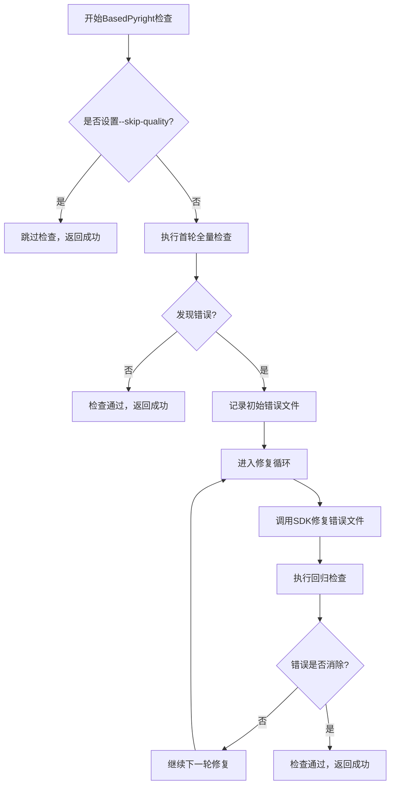
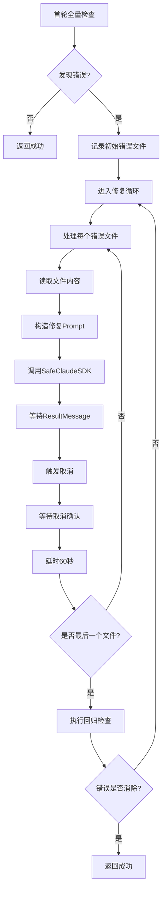

# BasedPyright类型检查

<cite>
**本文档引用的文件**
- [quality_check_controller.py](file://autoBMAD/epic_automation/controllers/quality_check_controller.py)
- [quality_agents.py](file://autoBMAD/epic_automation/agents/quality_agents.py)
- [epic_driver.py](file://autoBMAD/epic_automation/epic_driver.py)
- [test_quality_check_controller.py](file://tests-copy/unit/test_quality_check_controller.py)
</cite>

## 更新摘要
**已做更改**
- 更新了BasedPyright质量门控的实现，使用QualityCheckController进行多轮检查和修复
- 添加了对自动修复类型检查问题的支持
- 详细描述了execute_basedpyright_agent方法的执行流程
- 解释了BasedPyrightAgent类的实现机制
- 说明了--skip-quality CLI标志对检查的控制作用

## 目录
- [BasedPyright类型检查](#basedpyright类型检查)
  - [更新摘要](#更新摘要)
  - [目录](#目录)
  - [执行流程概述](#执行流程概述)
  - [核心组件实现](#核心组件实现)
    - [QualityCheckController](#qualitycheckcontroller)
    - [BasedPyrightAgent](#basedpyrightagent)
  - [多轮检查与修复机制](#多轮检查与修复机制)
  - [异常处理与进度跟踪](#异常处理与进度跟踪)
  - [与QualityGateOrchestrator的集成](#与qualitygateorchestrator的集成)

## 执行流程概述
BasedPyright质量门控的执行流程遵循一个闭环的检查-修复-回归验证模式。当调用execute_basedpyright_agent方法时，系统首先检查--skip-quality标志，如果该标志被设置，则跳过类型检查并返回跳过状态。

如果未跳过检查，系统将初始化QualityCheckController控制器，该控制器负责管理整个检查和修复过程。控制器会执行首轮全量检查，如果发现类型错误，则进入多轮修复循环。在每个循环中，系统会针对每个包含错误的文件调用SDK进行自动修复，然后执行回归检查以验证修复效果。



**Section sources**
- [epic_driver.py](file://autoBMAD/epic_automation/epic_driver.py#L255-L288)
- [quality_check_controller.py](file://autoBMAD/epic_automation/controllers/quality_check_controller.py#L88-L119)

## 核心组件实现

### QualityCheckController
QualityCheckController是质量检查的核心控制器，负责协调检查和修复的整个流程。控制器的主要职责包括：控制多轮循环执行、维护错误文件列表、调用SDK进行自动修复以及决定循环终止条件。

控制器的初始化需要指定工具类型（'ruff'或'basedpyright'）、对应的Agent实例、源代码目录、最大循环次数、SDK调用间延时和SDK超时时间等参数。控制器通过run方法启动完整的检查-修复循环。

```python
class QualityCheckController:
    def __init__(
        self,
        tool: str,
        agent: BaseQualityAgent,
        source_dir: str,
        max_cycles: int = 3,
        sdk_call_delay: int = 60,
        sdk_timeout: int = 600,
    ):
        self.tool = tool
        self.agent = agent
        self.source_dir = source_dir
        self.max_cycles = max_cycles
        self.sdk_call_delay = sdk_call_delay
        self.sdk_timeout = sdk_timeout
        # 状态跟踪
        self.current_cycle = 0
        self.error_files = {}
        self.initial_error_files = []
        self.final_error_files = []
        self.sdk_fix_errors = []
```

控制器的主循环逻辑如下：首先执行首轮全量检查，如果没有发现错误则直接返回成功；否则进入修复循环，最多执行max_cycles轮。在每轮循环中，先调用SDK修复阶段，然后执行回归检查，直到所有错误都被修复或达到最大循环次数。

**Section sources**
- [quality_check_controller.py](file://autoBMAD/epic_automation/controllers/quality_check_controller.py#L25-L73)
- [test_quality_check_controller.py](file://tests-copy/unit/test_quality_check_controller.py#L46-L58)

### BasedPyrightAgent
BasedPyrightAgent是基于BaseQualityAgent基类实现的类型检查代理，负责执行具体的BasedPyright命令并解析结果。代理的主要功能包括：执行BasedPyright检查、解析JSON输出中的类型错误、按文件分组错误以及构造修复Prompt。

代理通过execute方法执行BasedPyright检查，该方法构建并执行basedpyright --outputjson命令，然后解析JSON输出以提取类型错误信息。解析后的结果包含错误数量、警告数量、检查的文件数量以及详细的错误列表。

```python
class BasedPyrightAgent(BaseQualityAgent):
    async def execute(self, source_dir: str, **kwargs: object) -> BasedPyrightResult:
        command = f"basedpyright --outputjson {source_dir}"
        result = await self._run_subprocess(command)
        
        if result.status == "completed":
            try:
                output_dict: dict[str, object] = json.loads(result.stdout) if result.stdout else {}
                issues_list: list[dict[str, object]] = cast(list[dict[str, object]], output_dict.get("generalDiagnostics", []))
                # 提取错误统计信息
                error_count = len([i for i in issues_list if i.get("severity") == "error"])
                warning_count = len([i for i in issues_list if i.get("severity") == "warning"])
                files_set = {i.get("file", "") for i in issues_list}
                files_count = len(files_set)
                
                return BasedPyrightResult(
                    status="completed",
                    errors=error_count,
                    warnings=warning_count,
                    files_checked=files_count,
                    issues=issues_list,
                    message=f"Found {len(issues_list)} type issues"
                )
            except json.JSONDecodeError:
                return BasedPyrightResult(
                    status="completed",
                    errors=0,
                    warnings=0,
                    files_checked=0,
                    issues=[],
                    message="Check completed (no JSON output)"
                )
```

代理还实现了parse_errors_by_file方法，用于将错误按文件路径进行分组，这为后续的文件级修复提供了基础。build_fix_prompt方法则负责构造用于SDK调用的修复Prompt，包含文件路径、文件内容和错误摘要等信息。

**Section sources**
- [quality_agents.py](file://autoBMAD/epic_automation/agents/quality_agents.py#L355-L495)
- [quality_agents.py](file://autoBMAD/epic_automation/agents/quality_agents.py#L427-L464)

## 多轮检查与修复机制
多轮检查与修复机制是BasedPyright质量门控的核心创新，它通过QualityCheckController实现了一个闭环的自动化修复流程。该机制的主要优势在于能够自动识别、修复并验证类型错误，减少了人工干预的需求。

机制的工作流程如下：首先执行首轮全量检查，收集所有类型错误并按文件分组。然后进入修复循环，在每个循环中，系统会遍历每个包含错误的文件，执行以下步骤：读取文件内容、构造修复Prompt、调用SafeClaudeSDK进行修复、等待取消确认，然后延时60秒后处理下一个文件。



控制器通过_current_cycle计数器跟踪当前循环次数，并在达到max_cycles（默认为3）后终止循环。最终结果包含初始错误文件列表、最终错误文件列表、SDK修复尝试情况以及修复过程中的任何错误。

**Section sources**
- [quality_check_controller.py](file://autoBMAD/epic_automation/controllers/quality_check_controller.py#L103-L119)
- [quality_check_controller.py](file://autoBMAD/epic_automation/controllers/quality_check_controller.py#L167-L245)

## 异常处理与进度跟踪
系统实现了全面的异常处理和进度跟踪机制，确保质量门控过程的稳定性和可监控性。在异常处理方面，系统在多个层次上捕获和处理异常，包括子进程执行、JSON解析、文件读取和SDK调用等。

在子进程执行层面，_run_subprocess方法捕获TimeoutError和一般Exception，返回结构化的执行结果，避免异常向上抛出中断流程。在JSON解析层面，execute方法使用try-except块捕获JSONDecodeError，确保即使输出格式异常也能返回合理的默认结果。

```python
async def _run_subprocess(self, command: str, timeout: int = 300) -> SubprocessResult:
    try:
        loop = asyncio.get_event_loop()
        process = await asyncio.wait_for(
            loop.run_in_executor(
                None,
                lambda: subprocess.run(
                    command,
                    shell=True,
                    capture_output=True,
                    text=True,
                    timeout=timeout
                )
            ),
            timeout=timeout + 10
        )
        return SubprocessResult(
            status="completed",
            returncode=process.returncode,
            stdout=process.stdout,
            stderr=process.stderr,
            success=process.returncode == 0
        )
    except TimeoutError:
        return SubprocessResult(
            status="failed",
            returncode=-1,
            stdout="",
            stderr=f"Timeout after {timeout} seconds",
            success=False,
            error=f"Timeout after {timeout} seconds",
            command=command
        )
    except Exception as e:
        return SubprocessResult(
            status="failed",
            returncode=-1,
            stdout="",
            stderr=str(e),
            success=False,
            error=str(e),
            command=command
        )
```

在进度跟踪方面，QualityGateOrchestrator维护了一个详细的进度字典，记录每个阶段的状态、开始时间和结束时间。通过_update_progress方法更新特定阶段的进度，并使用_calculate_duration方法计算执行时长。这种细粒度的进度跟踪使得用户可以实时监控质量门控的执行状态。

**Section sources**
- [quality_agents.py](file://autoBMAD/epic_automation/agents/quality_agents.py#L104-L160)
- [epic_driver.py](file://autoBMAD/epic_automation/epic_driver.py#L166-L182)

## 与QualityGateOrchestrator的集成
BasedPyright质量门控通过QualityGateOrchestrator与其他质量检查工具（如Ruff和Pytest）集成，形成一个完整的质量保证管道。Orchestrator负责协调各个质量门控的执行顺序，并提供统一的接口和结果聚合。

在QualityGateOrchestrator中，execute_basedpyright_agent方法是BasedPyright检查的入口点。该方法首先检查skip_quality标志，如果设置则跳过检查；否则初始化QualityCheckController并启动检查-修复循环。执行结果被聚合到Orchestrator的results字典中，包括执行时长、成功状态和详细结果。

```python
async def execute_basedpyright_agent(self, source_dir: str) -> dict[str, Any]:
    if self.skip_quality:
        self.logger.info("Skipping Basedpyright quality check (--skip-quality flag)")
        return {"success": True, "skipped": True, "message": "Skipped via CLI flag"}
    
    self.logger.info("=== Quality Gate 2/3: BasedPyright Check with SDK Fix ===")
    self._update_progress("phase_2_basedpyright", "in_progress", start=True)
    
    try:
        from .controllers.quality_check_controller import QualityCheckController
        from .agents.quality_agents import BasedPyrightAgent
        
        basedpyright_agent = BasedPyrightAgent()
        
        controller = QualityCheckController(
            tool="basedpyright",
            agent=basedpyright_agent,
            source_dir=source_dir,
            max_cycles=3,
            sdk_call_delay=60,
            sdk_timeout=600,
        )
        
        start_time = time.time()
        basedpyright_result = await controller.run()
        end_time = time.time()
        
        success = basedpyright_result["status"] == "completed"
        
        if success:
            self.logger.info(f"✓ BasedPyright quality gate PASSED after {basedpyright_result['cycles']} cycle(s) "
                           f"in {self._calculate_duration(start_time, end_time)}s")
            self._update_progress("phase_2_basedpyright", "completed", end=True)
            return {
                "success": True,
                "duration": self._calculate_duration(start_time, end_time),
                "result": basedpyright_result,
            }
        else:
            error_msg = (f"BasedPyright quality gate FAILED after {basedpyright_result['cycles']} cycle(s): "
                        f"{len(basedpyright_result['final_error_files'])} file(s) still have type errors")
            self.logger.warning(f"✗ {error_msg}")
            self._update_progress("phase_2_basedpyright", "failed", end=True)
            self.results["errors"].append(error_msg)
            
            return {
                "success": False,
                "error": error_msg,
                "duration": self._calculate_duration(start_time, end_time),
                "result": basedpyright_result,
            }
    
    except Exception as e:
        error_msg = f"BasedPyright execution error: {str(e)}"
        self.logger.error(error_msg, exc_info=True)
        self._update_progress("phase_2_basedpyright", "error", end=True)
        self.results["errors"].append(error_msg)
        return {"success": False, "error": error_msg, "duration": 0.0}
```

这种集成方式使得BasedPyright检查成为质量保证管道中的一个标准化阶段，与其他检查工具具有相同的接口和行为模式，便于维护和扩展。

**Section sources**
- [epic_driver.py](file://autoBMAD/epic_automation/epic_driver.py#L255-L322)
- [epic_driver.py](file://autoBMAD/epic_automation/epic_driver.py#L118-L128)