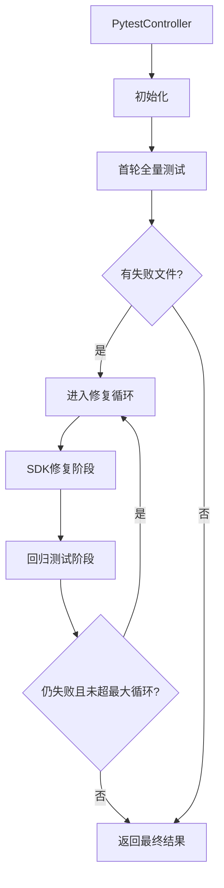
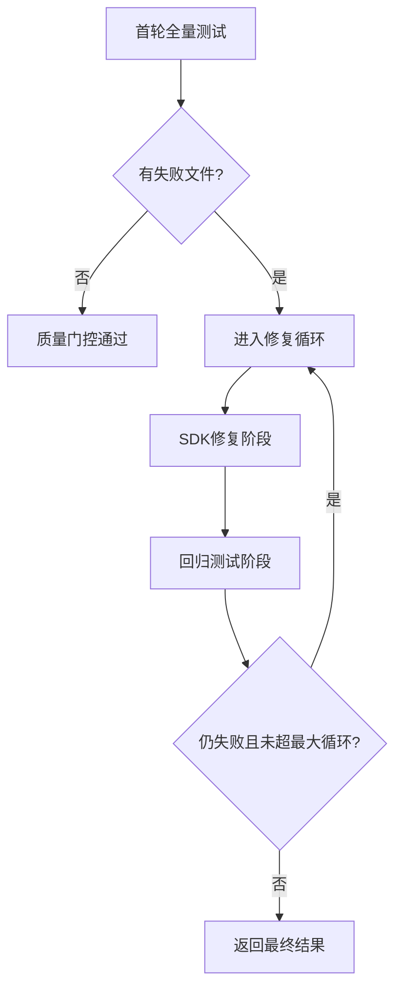

# Pytest测试执行

<cite>
**本文档引用文件**   
- [pytest_controller.py](file://autoBMAD/epic_automation/controllers/pytest_controller.py)
- [quality_agents.py](file://autoBMAD/epic_automation/agents/quality_agents.py)
- [pytest_batch_executor.py](file://autoBMAD/epic_automation/agents/pytest_batch_executor.py)
- [epic_driver.py](file://autoBMAD/epic_automation/epic_driver.py)
</cite>

## 更新摘要
**变更内容**   
- 更新了Pytest质量门控的实现机制，重构为使用PytestController进行批次执行和SDK修复
- 添加了细粒度的测试失败信息收集和自动修复功能
- 详细说明了--skip-tests CLI标志对测试执行的控制作用
- 更新了Pytest执行的依赖管理、异常处理和与QualityGateOrchestrator的集成方式

## 目录
- [Pytest测试执行](#pytest测试执行)
  - [更新摘要](#更新摘要)
  - [目录](#目录)
  - [PytestController架构](#pytestcontroller架构)
  - [PytestAgent执行机制](#pytestagent执行机制)
  - [批次执行策略](#批次执行策略)
  - [SDK自动修复流程](#sdk自动修复流程)
  - [CLI标志控制](#cli标志控制)
  - [异常处理与结果解析](#异常处理与结果解析)
  - [集成与依赖管理](#集成与依赖管理)

## PytestController架构

### PytestController职责
**PytestController** 是Pytest质量门控的核心控制器，负责协调pytest与SDK修复的多轮循环执行。其主要职责包括：

- 控制pytest ↔ SDK修复的多轮循环
- 维护失败文件列表和汇总JSON
- 决定循环终止条件
- 管理测试执行的生命周期



**组件来源**   
- [pytest_controller.py](file://autoBMAD/epic_automation/controllers/pytest_controller.py#L21-L399)

## PytestAgent执行机制

### PytestAgent核心功能
**PytestAgent** 是Pytest测试执行的代理类，继承自BaseQualityAgent，负责具体的测试执行任务。其主要功能包括：

- 执行Pytest测试（目录遍历批次执行）
- 按文件顺序执行pytest命令
- 解析测试结果和失败信息
- 与SDK集成进行自动修复

#### 测试执行流程
1. **初始化**：创建PytestAgent实例，设置名称和任务组
2. **命令构建**：根据测试目录和配置构建pytest命令
3. **子进程执行**：使用subprocess.run执行pytest命令
4. **结果解析**：解析stdout中的测试结果信息
5. **状态判断**：根据返回码和输出判断测试状态

```python
async def execute(
    self,
    source_dir: str,
    test_dir: str
) -> PytestResult:
    """
    执行 Pytest 测试（目录遍历批次执行）
    
    Args:
        source_dir: 源代码目录
        test_dir: 测试目录
        
    Returns:
        PytestResult: 测试结果
    """
```

**组件来源**   
- [quality_agents.py](file://autoBMAD/epic_automation/agents/quality_agents.py#L497-L547)

## 批次执行策略

### 动态批次发现
PytestBatchExecutor采用动态扫描方式发现测试批次，不依赖预设的目录名。通过启发式规则匹配目录配置：

- **冒烟测试**：`.*smoke.*` → 超时30秒，非并行，阻断，优先级1
- **单元测试**：`.*unit.*` → 超时60秒，并行，workers=auto，阻断，优先级2
- **集成测试**：`.*(integration|api).*` → 超时120秒，并行，workers=2，阻断，优先级3
- **端到端测试**：`.*(e2e|end.*end).*` → 超时600秒，非并行，非阻断，优先级4
- **GUI测试**：`.*(gui|ui).*` → 超时300秒，非并行，非阻断，优先级4
- **性能测试**：`.*(perf|performance).*` → 超时600秒，非并行，非阻断，优先级5

```python
HEURISTIC_RULES = [
    (r".*smoke.*", {"timeout": 30, "parallel": False, "blocking": True, "priority": 1}),
    (r".*unit.*", {"timeout": 60, "parallel": True, "workers": "auto", "blocking": True, "priority": 2}),
    (r".*(integration|api).*", {"timeout": 120, "parallel": True, "workers": 2, "blocking": True, "priority": 3}),
    (r".*(e2e|end.*end).*", {"timeout": 600, "parallel": False, "blocking": False, "priority": 4}),
    (r".*(gui|ui).*", {"timeout": 300, "parallel": False, "blocking": False, "priority": 4}),
    (r".*(perf|performance).*", {"timeout": 600, "parallel": False, "blocking": False, "priority": 5}),
]
```

**组件来源**   
- [pytest_batch_executor.py](file://autoBMAD/epic_automation/agents/pytest_batch_executor.py#L32-L40)

### 批次执行逻辑
批次执行器按照优先级顺序执行测试批次，支持阻断和非阻断模式：

- **阻断批次**：如果失败则停止执行后续批次
- **非阻断批次**：即使失败也继续执行后续批次
- **并行执行**：使用pytest-xdist插件支持并行执行
- **覆盖率报告**：为关键批次生成覆盖率报告

```python
async def execute_batches(self) -> dict[str, Any]:
    """
    执行所有批次
    
    Returns:
        Dict[str, Any]: 执行结果汇总
    """
```

**组件来源**   
- [pytest_batch_executor.py](file://autoBMAD/epic_automation/agents/pytest_batch_executor.py#L151-L197)

## SDK自动修复流程

### 多轮修复循环
PytestController实现了完整的多轮修复循环机制：

1. **首轮全量测试**：执行所有测试文件，收集失败文件列表
2. **修复循环**：对失败文件进行SDK修复和回归测试
3. **终止条件**：所有测试通过或达到最大循环次数



### SDK修复实现
PytestAgent通过以下步骤实现SDK修复：

1. **失败信息收集**：从汇总JSON中读取失败文件的详细信息
2. **提示词构造**：使用模板构造包含失败信息的修复提示词
3. **SDK调用**：通过SafeClaudeSDK发起修复请求
4. **取消机制**：收到ResultMessage后触发取消流程
5. **结果处理**：等待取消确认并返回结果

```python
async def run_sdk_fix_for_file(
    self,
    test_file: str,
    source_dir: str,
    summary_json_path: str,
    round_index: int,
) -> dict[str, bool | str]:
    """
    对单个测试文件发起 SDK 修复调用
    
    Args:
        test_file: 测试文件路径
        source_dir: 源代码目录
        summary_json_path: 汇总 JSON 路径
        round_index: 当前轮次
        
    Returns:
        {
            "success": bool,
            "error": str | None,
        }
    """
```

**组件来源**   
- [quality_agents.py](file://autoBMAD/epic_automation/agents/quality_agents.py#L721-L787)

## CLI标志控制

### --skip-tests标志
`--skip-tests` CLI标志用于控制是否跳过pytest执行，为开发和调试提供灵活性：

- **启用跳过**：`--skip-tests` 标志设置为True时跳过测试执行
- **禁用跳过**：默认情况下执行所有测试
- **集成控制**：QualityGateOrchestrator根据此标志决定是否执行PytestAgent

```python
def parse_arguments():
    """
    解析命令行参数
    """
    parser = argparse.ArgumentParser(
        description='autoBMAD Epic Automation System'
    )
    
    # 跳过质量检查
    parser.add_argument('--skip-quality', action='store_true',
                        help='Skip code quality checks')
    
    # 跳过测试执行
    parser.add_argument('--skip-tests', action='store_true',
                        help='Skip pytest execution')
```

**组件来源**   
- [epic_driver.py](file://autoBMAD/epic_automation/epic_driver.py#L2326-L2328)

### 标志使用场景
`--skip-tests`标志适用于以下场景：

- **快速迭代**：在代码修改频繁时跳过耗时的测试执行
- **调试模式**：专注于特定问题的调试，无需运行完整测试套件
- **质量检查**：仅执行代码风格和类型检查，跳过功能测试
- **CI/CD优化**：在特定阶段跳过测试以加快构建速度

```python
class QualityGateOrchestrator:
    def __init__(
        self,
        source_dir: str,
        test_dir: str,
        skip_quality: bool = False,
        skip_tests: bool = False
    ):
        """
        初始化质量门控协调器
        
        Args:
            source_dir: 源代码目录
            test_dir: 测试目录
            skip_quality: 是否跳过质量检查
            skip_tests: 是否跳过测试执行
        """
```

**组件来源**   
- [epic_driver.py](file://autoBMAD/epic_automation/epic_driver.py#L2326-L2328)

## 异常处理与结果解析

### 异常处理机制
PytestController和PytestAgent实现了完善的异常处理机制：

- **超时处理**：设置合理的超时时间，避免测试无限等待
- **子进程异常**：捕获subprocess.run可能抛出的异常
- **JSON解析异常**：安全处理JSON报告的解析过程
- **文件系统异常**：处理文件读写相关的异常

```python
try:
    # 执行命令
    loop = asyncio.get_event_loop()
    
    process = await asyncio.wait_for(
        loop.run_in_executor(
            None,
            lambda: subprocess.run(
                cmd,
                capture_output=True,
                text=True,
                timeout=batch.timeout
            )
        ),
        timeout=batch.timeout + 10
    )
    
    success = process.returncode == 0
    
except asyncio.TimeoutError:
    self.logger.error(f"✗ Batch '{batch.name}' TIMEOUT after {batch.timeout}s")
    return {
        "batch_name": batch.name,
        "success": False,
        "error": f"Timeout after {batch.timeout}s"
    }
except Exception as e:
    self.logger.error(f"✗ Batch '{batch.name}' ERROR: {e}")
    return {
        "batch_name": batch.name,
        "success": False,
        "error": str(e)
    }
```

**组件来源**   
- [pytest_batch_executor.py](file://autoBMAD/epic_automation/agents/pytest_batch_executor.py#L217-L278)

### 结果解析与汇总
测试结果通过结构化的JSON格式进行汇总和报告：

- **批次结果**：每个批次的执行状态、通过/失败测试数
- **失败详情**：详细的失败信息，包括nodeid、错误类型、消息
- **时间戳**：记录每轮执行的时间
- **统计信息**：初始和最终失败文件数、循环次数

```json
{
  "summary": {
    "total_files": 0,
    "failed_files_initial": 0,
    "failed_files_final": 0,
    "cycles": 0
  },
  "rounds": [
    {
      "round_index": 1,
      "round_type": "initial",
      "timestamp": "2026-01-13T20:00:00Z",
      "failed_files": [
        {
          "test_file": "test_broken.py",
          "status": "failed",
          "failures": [
            {
              "nodeid": "test_broken.py::test_broken",
              "failure_type": "failed",
              "message": "AssertionError",
              "short_tb": "test_broken.py:2"
            }
          ]
        }
      ]
    }
  ]
}
```

**组件来源**   
- [pytest_controller.py](file://autoBMAD/epic_automation/controllers/pytest_controller.py#L284-L354)

## 集成与依赖管理

### 与QualityGateOrchestrator集成
PytestController与QualityGateOrchestrator紧密集成，作为质量门控流程的一部分：

- **协调执行**：Orchestrator调用PytestController执行测试
- **结果传递**：将测试结果整合到整体质量门控结果中
- **状态同步**：保持测试执行状态与其他质量检查的一致性
- **错误收集**：统一收集和报告所有质量门控的错误

```python
class QualityGateOrchestrator:
    async def execute_pytest_agent(self, test_dir: str) -> dict[str, Any]:
        """
        执行 Pytest Agent
        
        Args:
            test_dir: 测试目录
            
        Returns:
            测试结果
        """
        if self.skip_tests:
            return {
                "success": True,
                "skipped": True,
                "message": "Tests skipped by --skip-tests flag"
            }
            
        # 创建并执行 PytestController
        controller = PytestController(
            source_dir=self.source_dir,
            test_dir=test_dir
        )
        
        result = await controller.run()
        return result
```

**组件来源**   
- [epic_driver.py](file://autoBMAD/epic_automation/epic_driver.py)

### 依赖管理
Pytest质量门控依赖以下关键组件：

- **pytest**：核心测试框架
- **pytest-json-report**：生成JSON格式的测试报告
- **pytest-xdist**：支持并行执行测试
- **pytest-cov**：代码覆盖率分析
- **SafeClaudeSDK**：与AI模型交互的SDK
- **SDKExecutor**：管理SDK调用和取消流程

```python
# 依赖声明
dependencies = [
    "pytest>=7.0.0",
    "pytest-json-report>=1.5.0",
    "pytest-xdist>=3.0.0",
    "pytest-cov>=4.0.0",
    "safeclaude-sdk>=1.0.0",
    "sdk-executor>=1.0.0"
]
```

**组件来源**   
- [pyproject.toml](file://pyproject.toml)