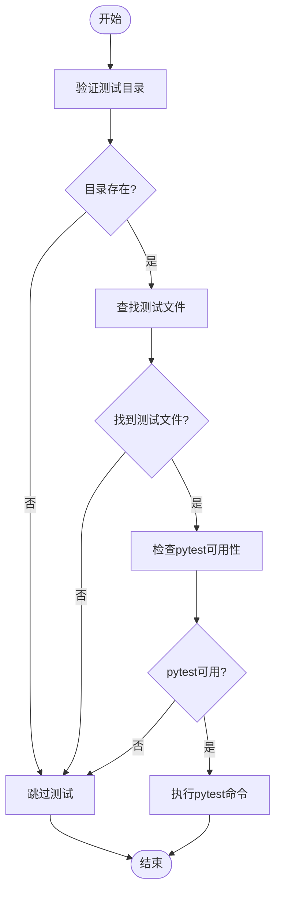
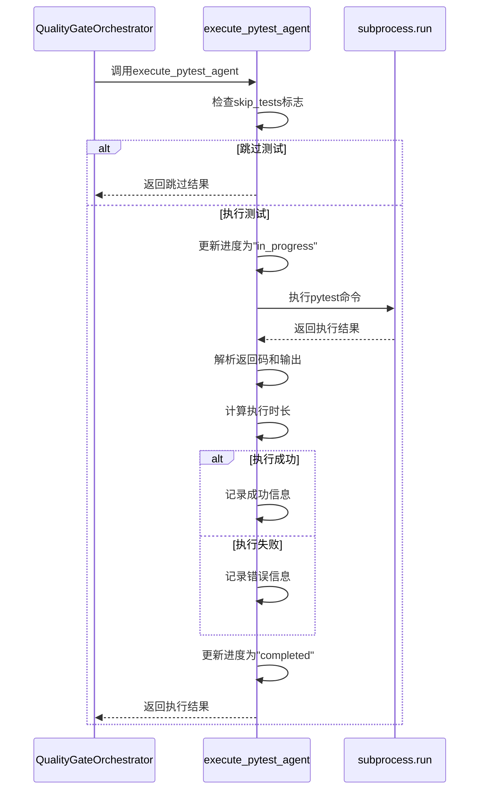
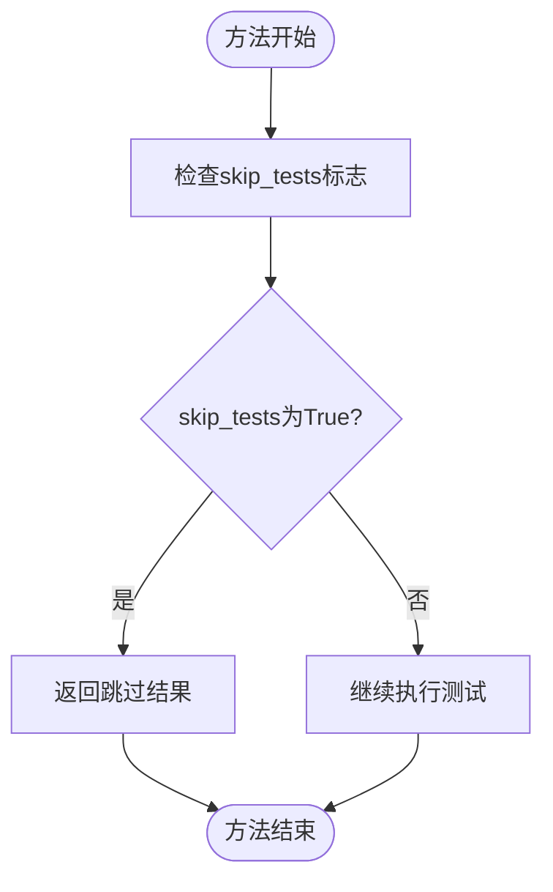
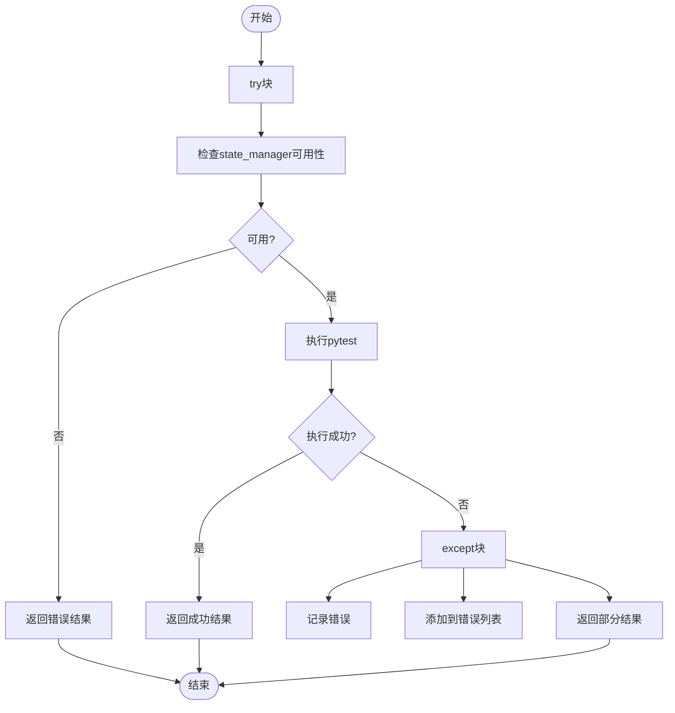
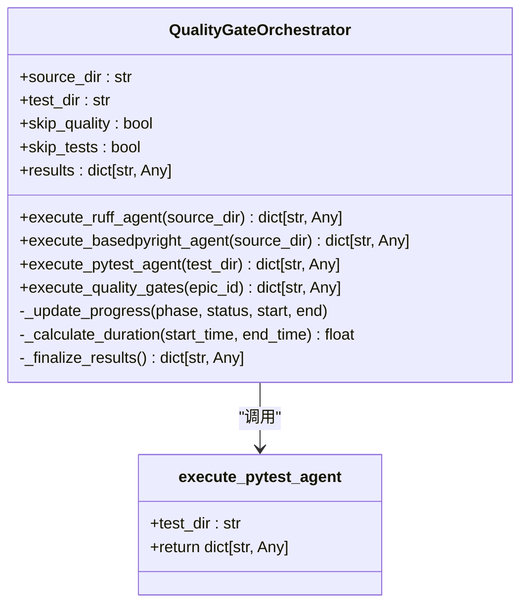
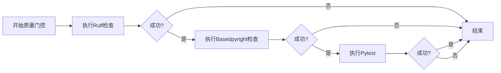

# Pytest测试执行

<cite>
**本文档引用的文件**   
- [epic_driver.py](file://autoBMAD/epic_automation/epic_driver.py)
- [quality_agents.py](file://autoBMAD/epic_automation/quality_agents.py)
- [test_test_automation_agent.py](file://tests-copy/epic_automation/test_test_automation_agent.py)
</cite>

## 目录
1. [简介](#简介)
2. [Pytest执行机制](#pytest执行机制)
3. [execute_pytest_agent方法分析](#execute_pytest_agent方法分析)
4. [CLI标志控制](#cli标志控制)
5. [异常处理与依赖管理](#异常处理与依赖管理)
6. [与QualityGateOrchestrator集成](#与qualitygateorchestrator集成)
7. [测试执行流程示例](#测试执行流程示例)
8. [结论](#结论)

## 简介

Pytest质量门控是自动化测试流程中的关键环节，负责在代码质量检查后执行测试套件验证。该机制通过`execute_pytest_agent`方法实现，集成在`QualityGateOrchestrator`中，作为质量门控管道的最终阶段。Pytest执行不仅验证代码功能正确性，还确保测试覆盖率和稳定性，是持续集成流程中不可或缺的质量保障环节。

**Section sources**
- [epic_driver.py](file://autoBMAD/epic_automation/epic_driver.py#L298-L449)

## Pytest执行机制

Pytest执行机制采用直接的subprocess调用方式，避免了复杂的异步取消作用域问题。执行流程包括测试目录验证、测试文件检测和pytest可用性检查三个关键步骤。

首先，系统验证测试目录是否存在且为有效目录。如果目录不存在，系统会记录警告并跳过测试执行。其次，通过glob模式搜索`test_*.py`和`*_test.py`文件来检测测试文件。如果没有发现测试文件，系统会记录信息并跳过执行。最后，使用`shutil.which("pytest")`检查pytest命令是否可用，确保执行环境的完整性。

**Diagram sources **
- [epic_driver.py](file://autoBMAD/epic_automation/epic_driver.py#L344-L385)

**Section sources**
- [epic_driver.py](file://autoBMAD/epic_automation/epic_driver.py#L344-L385)

## execute_pytest_agent方法分析

`execute_pytest_agent`方法是Pytest执行的核心，负责协调整个测试执行流程。该方法首先检查`skip_tests`标志，如果为True则直接返回跳过结果。然后更新进度跟踪，记录当前阶段为"pytest"。

方法通过subprocess.run执行pytest命令，设置5分钟超时限制。命令参数包括`-v`（详细输出）和`--tb=short`（简短回溯），确保输出信息的可读性。执行结果通过返回码判断：0表示成功，5表示未收集到测试（视为成功），其他值表示失败。

结果解析包括stdout和stderr的捕获，以及执行时长的计算。成功执行时记录通过信息，失败时记录错误并添加到错误列表中。异常处理确保任何执行错误都不会中断整个质量门控流程。

**Diagram sources **
- [epic_driver.py](file://autoBMAD/epic_automation/epic_driver.py#L298-L449)

**Section sources**
- [epic_driver.py](file://autoBMAD/epic_automation/epic_driver.py#L298-L449)

## CLI标志控制

`--skip-tests` CLI标志提供了对测试执行的精细控制。当该标志设置为True时，`execute_pytest_agent`方法会直接返回跳过结果，不执行任何测试。这种设计允许在开发、调试或特定场景下快速跳过耗时的测试执行阶段。

标志的控制逻辑简单而有效：在方法开始时检查`self.skip_tests`属性，如果为True则立即返回包含跳过信息的结果字典。这种方式避免了不必要的资源消耗和执行时间，提高了流程的灵活性。

**Diagram sources **
- [epic_driver.py](file://autoBMAD/epic_automation/epic_driver.py#L300-L302)

**Section sources**
- [epic_driver.py](file://autoBMAD/epic_automation/epic_driver.py#L300-L302)

## 异常处理与依赖管理

Pytest执行的异常处理机制设计为非阻塞性，确保单个阶段的失败不会中断整个质量门控流程。异常被捕获后记录到错误列表中，但流程继续执行。这种设计符合质量门控的非阻塞原则，允许收集所有质量问题。

依赖管理通过动态导入和存在性检查实现。系统首先检查`state_manager`模块的可用性，如果不可用则跳过pytest执行。这种防御性编程确保了系统的健壮性，避免因可选依赖缺失而导致流程中断。

**Diagram sources **
- [epic_driver.py](file://autoBMAD/epic_automation/epic_driver.py#L310-L334)

**Section sources**
- [epic_driver.py](file://autoBMAD/epic_automation/epic_driver.py#L310-L334)

## 与QualityGateOrchestrator集成

`execute_pytest_agent`方法与`QualityGateOrchestrator`紧密集成，作为质量门控管道的第三阶段。在`execute_quality_gates`方法中，pytest执行是最后执行的阶段，位于ruff和basedpyright检查之后。

集成的关键在于进度跟踪和结果聚合。`QualityGateOrchestrator`维护一个包含所有阶段结果的字典，`execute_pytest_agent`的返回结果被存储在`pytest`键下。进度通过`_update_progress`方法实时更新，确保外部系统可以监控执行状态。

**Diagram sources **
- [epic_driver.py](file://autoBMAD/epic_automation/epic_driver.py#L93-L533)

**Section sources**
- [epic_driver.py](file://autoBMAD/epic_automation/epic_driver.py#L93-L533)

## 测试执行流程示例

测试执行流程从`QualityGateOrchestrator.execute_quality_gates`方法开始，按顺序执行三个质量门控阶段。Pytest执行作为最后阶段，只有在前两个阶段成功时才会执行（除非`skip_tests`为True）。

执行流程包括：开始执行、更新进度、运行pytest命令、解析结果、更新进度和返回结果。每个步骤都有相应的日志记录，便于调试和监控。超时设置为5分钟，平衡了执行时间和资源消耗。

**Diagram sources **
- [epic_driver.py](file://autoBMAD/epic_automation/epic_driver.py#L450-L498)

**Section sources**
- [epic_driver.py](file://autoBMAD/epic_automation/epic_driver.py#L450-L498)

## 结论

Pytest质量门控机制通过`execute_pytest_agent`方法实现了健壮的测试执行流程。该机制结合了目录验证、文件检测、可用性检查和异常处理，确保了执行的可靠性和稳定性。`--skip-tests`标志提供了灵活的控制选项，而与`QualityGateOrchestrator`的集成确保了整个质量门控流程的协调一致。这种设计既保证了代码质量，又提供了足够的灵活性以适应不同的开发场景。