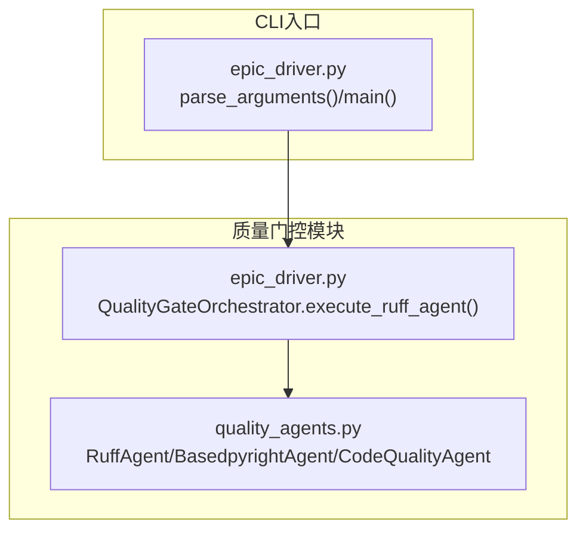
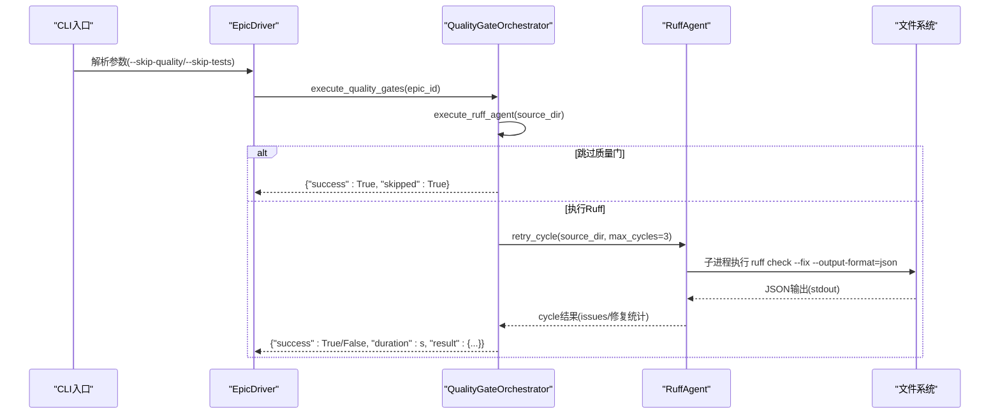
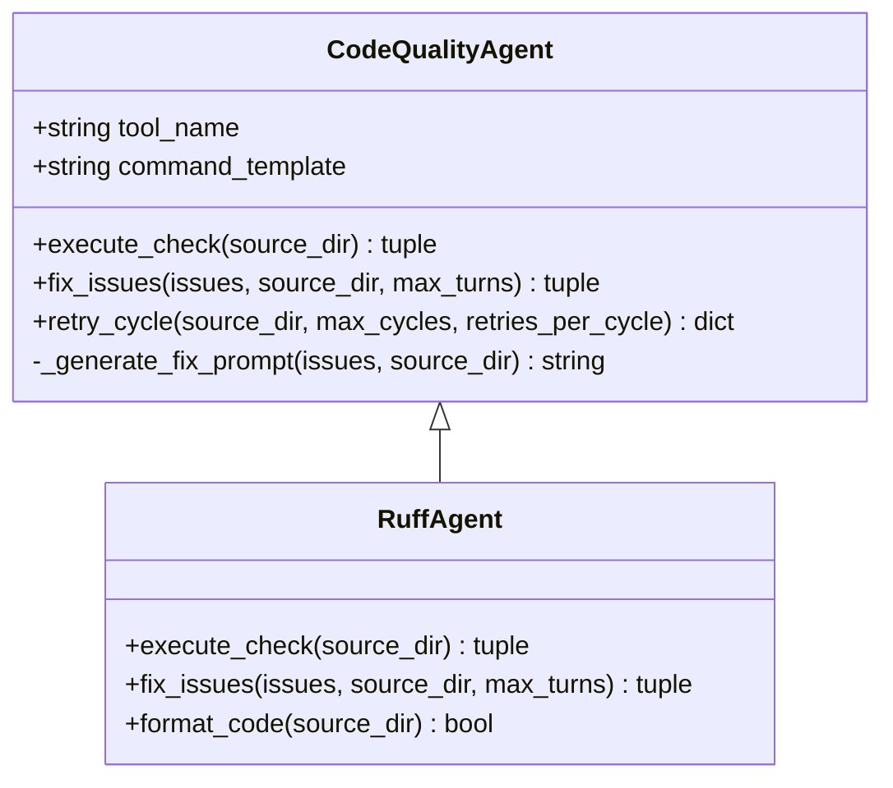
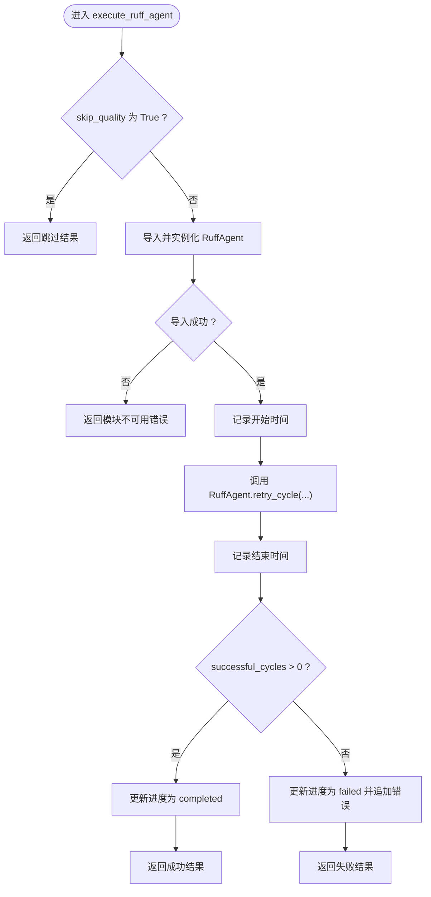
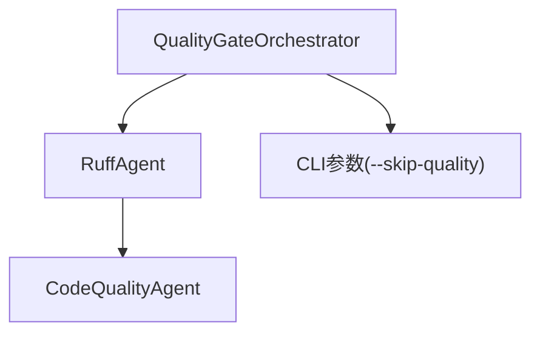

# Ruff代码质量检查

<cite>
**本文引用的文件**
- [quality_agents.py](file://autoBMAD/epic_automation/quality_agents.py)
- [epic_driver.py](file://autoBMAD/epic_automation/epic_driver.py)
- [test_ruff_workflow.py](file://tests-copy/unit/test_ruff_workflow.py)
- [test_quality_gates.py](file://tests-copy/epic_automation/test_quality_gates.py)
- [test_quality_gates_complete.py](file://tests-copy/integration/test_quality_gates_complete.py)
- [AGENTS.md](file://AGENTS.md)
</cite>

## 目录
1. [简介](#简介)
2. [项目结构](#项目结构)
3. [核心组件](#核心组件)
4. [架构总览](#架构总览)
5. [详细组件分析](#详细组件分析)
6. [依赖关系分析](#依赖关系分析)
7. [性能考量](#性能考量)
8. [故障排查指南](#故障排查指南)
9. [结论](#结论)
10. [附录](#附录)

## 简介
本文件聚焦于Ruff代码质量门控的实现与执行流程，围绕以下目标展开：
- 解释execute_ruff_agent方法如何执行Ruff代码检查
- 描述RuffAgent类的实现机制：使用子进程同步执行Ruff命令、JSON输出解析与错误处理策略
- 说明--skip-quality CLI标志对Ruff检查的控制作用
- 提供实际代码示例路径，展示Ruff检查的执行流程、进度跟踪与结果聚合方式
- 讨论依赖管理、异常处理与与QualityGateOrchestrator的集成方式

## 项目结构
Ruff质量门控位于自动化流水线的“质量门”阶段，由EpicDriver驱动，在Dev-QA阶段完成后执行。关键文件与职责如下：
- quality_agents.py：定义通用CodeQualityAgent基类与RuffAgent、BasedpyrightAgent等质量工具代理；实现子进程执行、JSON解析、重试循环与自动修复提示生成
- epic_driver.py：定义QualityGateOrchestrator与EpicDriver，负责质量门管线编排、进度跟踪、错误收集与CLI参数解析（含--skip-quality）

图表来源
- [quality_agents.py](file://autoBMAD/epic_automation/quality_agents.py#L41-L120)
- [epic_driver.py](file://autoBMAD/epic_automation/epic_driver.py#L166-L228)

章节来源
- [epic_driver.py](file://autoBMAD/epic_automation/epic_driver.py#L166-L228)
- [quality_agents.py](file://autoBMAD/epic_automation/quality_agents.py#L41-L120)

## 核心组件
- RuffAgent：继承自CodeQualityAgent，封装Ruff命令执行、JSON输出解析、自动修复提示生成与格式化调用
- CodeQualityAgent：抽象基类，提供统一的子进程执行框架、JSON解析、重试循环与SDK修复调用
- QualityGateOrchestrator.execute_ruff_agent：质量门控编排器中的Ruff执行入口，支持--skip-quality跳过

章节来源
- [quality_agents.py](file://autoBMAD/epic_automation/quality_agents.py#L41-L120)
- [quality_agents.py](file://autoBMAD/epic_automation/quality_agents.py#L466-L564)
- [epic_driver.py](file://autoBMAD/epic_automation/epic_driver.py#L166-L228)

## 架构总览
Ruff质量门控的端到端流程如下：
- CLI解析参数（含--skip-quality），EpicDriver在Dev-QA完成后调用execute_quality_gates
- QualityGateOrchestrator.execute_ruff_agent根据skip_quality决定是否执行
- 若执行，则导入并实例化RuffAgent，调用其retry_cycle进行多轮检查与修复
- 结果通过进度字典与错误列表聚合，并返回结构化结果

图表来源
- [epic_driver.py](file://autoBMAD/epic_automation/epic_driver.py#L166-L228)
- [epic_driver.py](file://autoBMAD/epic_automation/epic_driver.py#L450-L532)
- [quality_agents.py](file://autoBMAD/epic_automation/quality_agents.py#L279-L421)

章节来源
- [epic_driver.py](file://autoBMAD/epic_automation/epic_driver.py#L166-L228)
- [epic_driver.py](file://autoBMAD/epic_automation/epic_driver.py#L450-L532)
- [quality_agents.py](file://autoBMAD/epic_automation/quality_agents.py#L279-L421)

## 详细组件分析

### RuffAgent与CodeQualityAgent实现机制
- 命令模板与初始化：RuffAgent使用命令模板构建Ruff检查命令，启用JSON输出格式
- 子进程执行策略：
  - CodeQualityAgent.execute_check采用同步子进程并在独立线程中运行，避免取消作用域传播；通过asyncio.shield保护Future，确保在取消时仍等待线程完成
  - RuffAgent.execute_check直接复用父类execute_check，从而具备相同的隔离与保护机制
- JSON输出解析：从stdout读取UTF-8文本并解析为JSON数组；若解析失败，记录原始输出便于诊断
- 重试循环：retry_cycle按最大周期数执行检查与修复，累计问题总数、修复数量与成功周期数；每轮结束后可触发格式化
- 自动修复提示生成：基于问题摘要构造提示词，调用Claude SDK生成修复建议
- 格式化：RuffAgent.format_code在每轮结束后执行ruff format，即使出现警告也视为流程完成

图表来源
- [quality_agents.py](file://autoBMAD/epic_automation/quality_agents.py#L41-L120)
- [quality_agents.py](file://autoBMAD/epic_automation/quality_agents.py#L466-L564)

章节来源
- [quality_agents.py](file://autoBMAD/epic_automation/quality_agents.py#L41-L120)
- [quality_agents.py](file://autoBMAD/epic_automation/quality_agents.py#L279-L421)
- [quality_agents.py](file://autoBMAD/epic_automation/quality_agents.py#L466-L564)

### execute_ruff_agent执行流程与进度跟踪
- 条件判断：当skip_quality为True时，直接返回跳过结果，不执行任何子进程
- 导入与实例化：动态导入RuffAgent，若导入失败则返回错误信息
- 执行与计时：记录开始时间，调用RuffAgent.retry_cycle，记录结束时间
- 成功判定：依据successful_cycles>0作为成功标准；失败时将错误信息追加至errors列表
- 进度更新：在开始、完成、失败、错误节点更新进度字典与当前阶段标识

图表来源
- [epic_driver.py](file://autoBMAD/epic_automation/epic_driver.py#L166-L228)

章节来源
- [epic_driver.py](file://autoBMAD/epic_automation/epic_driver.py#L166-L228)

### JSON输出解析与错误处理策略
- 子进程输出解析：从stdout读取UTF-8文本，尝试解析为JSON；解析失败时记录原始输出，便于定位问题
- 取消与超时处理：同步子进程在独立线程执行，使用timeout与取消保护；在取消发生时等待线程完成或超时，避免资源泄漏
- 异常捕获：统一捕获子进程异常与解析异常，返回空列表或错误信息，保证流程继续

章节来源
- [quality_agents.py](file://autoBMAD/epic_automation/quality_agents.py#L81-L154)
- [quality_agents.py](file://autoBMAD/epic_automation/quality_agents.py#L135-L149)

### --skip-quality CLI标志控制
- 参数解析：CLI解析器添加--skip-quality选项，默认False
- 行为影响：
  - 在QualityGateOrchestrator.execute_ruff_agent中，若skip_quality为True，直接返回跳过结果
  - 在EpicDriver.execute_quality_gates中，若skip_quality为True，质量门阶段会被跳过，但仍会继续后续流程
- 测试验证：单元测试覆盖了--skip-quality传入后，execute_ruff_agent返回跳过结果的行为

章节来源
- [epic_driver.py](file://autoBMAD/epic_automation/epic_driver.py#L2022-L2121)
- [epic_driver.py](file://autoBMAD/epic_automation/epic_driver.py#L166-L228)
- [test_quality_gates.py](file://tests-copy/epic_automation/test_quality_gates.py#L43-L83)
- [test_quality_gates_complete.py](file://tests-copy/integration/test_quality_gates_complete.py#L580-L614)

### 与QualityGateOrchestrator的集成方式
- 编排器职责：维护results结构（success、ruff、basedpyright、pytest、errors、progress等），在各阶段更新进度与当前阶段
- Ruff集成点：execute_ruff_agent负责调用RuffAgent.retry_cycle，聚合结果并返回结构化字典
- 错误聚合：将失败信息写入errors列表，最终在finalize阶段汇总

章节来源
- [epic_driver.py](file://autoBMAD/epic_automation/epic_driver.py#L94-L147)
- [epic_driver.py](file://autoBMAD/epic_automation/epic_driver.py#L166-L228)
- [epic_driver.py](file://autoBMAD/epic_automation/epic_driver.py#L450-L532)

### 依赖管理与工具链
- Ruff命令：使用ruff check --fix --output-format=json执行检查与自动修复
- 基础库：使用subprocess与asyncio子进程接口，配合concurrent.futures线程池实现隔离
- 可选依赖：Claude SDK用于生成修复提示；若缺失则记录警告并跳过修复生成

章节来源
- [quality_agents.py](file://autoBMAD/epic_automation/quality_agents.py#L466-L564)
- [quality_agents.py](file://autoBMAD/epic_automation/quality_agents.py#L155-L278)
- [AGENTS.md](file://AGENTS.md#L118-L133)

## 依赖关系分析
- 组件耦合：
  - QualityGateOrchestrator与RuffAgent通过动态导入解耦，便于在缺失依赖时优雅降级
  - RuffAgent与CodeQualityAgent通过继承实现复用，子类仅覆盖特定行为
- 外部依赖：
  - Ruff工具与可选Claude SDK
  - CLI参数解析与日志系统

图表来源
- [epic_driver.py](file://autoBMAD/epic_automation/epic_driver.py#L166-L228)
- [quality_agents.py](file://autoBMAD/epic_automation/quality_agents.py#L41-L120)
- [quality_agents.py](file://autoBMAD/epic_automation/quality_agents.py#L466-L564)

章节来源
- [epic_driver.py](file://autoBMAD/epic_automation/epic_driver.py#L166-L228)
- [quality_agents.py](file://autoBMAD/epic_automation/quality_agents.py#L41-L120)
- [quality_agents.py](file://autoBMAD/epic_automation/quality_agents.py#L466-L564)

## 性能考量
- 子进程执行：采用同步子进程并在独立线程运行，避免取消作用域传播，减少任务中断带来的开销
- JSON解析：单次解析，结构化数据，避免重复扫描
- 重试策略：最大3个周期，每周期最多2次重试，平衡稳定性与耗时
- 取消处理：在取消发生时等待线程完成或超时，防止资源泄漏

[本节为通用指导，无需列出具体文件来源]

## 故障排查指南
- Ruff未安装或不可用：CLI解析器会检测工具是否存在；若不存在，应在环境中安装Ruff
- JSON解析失败：检查Ruff输出格式是否符合预期；查看原始输出日志以定位问题
- 取消与超时：若出现取消错误，确认是否为取消作用域导致；系统已提供保护逻辑
- 跳过质量门：使用--skip-quality可临时跳过Ruff与BasedPyright检查，便于快速迭代

章节来源
- [test_ruff_workflow.py](file://tests-copy/unit/test_ruff_workflow.py#L82-L100)
- [test_ruff_workflow.py](file://tests-copy/unit/test_ruff_workflow.py#L158-L199)
- [epic_driver.py](file://autoBMAD/epic_automation/epic_driver.py#L2022-L2121)

## 结论
Ruff质量门控通过RuffAgent与CodeQualityAgent实现了稳健的子进程执行、JSON输出解析与重试循环；QualityGateOrchestrator提供清晰的进度跟踪与错误聚合。--skip-quality标志允许在开发阶段灵活跳过质量门，同时保留生产环境下的严格校验能力。整体设计兼顾可靠性、可维护性与可扩展性。

[本节为总结性内容，无需列出具体文件来源]

## 附录
- 示例路径参考（不展示具体代码内容）：
  - RuffAgent初始化与命令模板：[quality_agents.py](file://autoBMAD/epic_automation/quality_agents.py#L466-L476)
  - CodeQualityAgent.execute_check子进程执行与解析：[quality_agents.py](file://autoBMAD/epic_automation/quality_agents.py#L81-L154)
  - RuffAgent.retry_cycle重试循环与聚合统计：[quality_agents.py](file://autoBMAD/epic_automation/quality_agents.py#L279-L421)
  - QualityGateOrchestrator.execute_ruff_agent跳过与执行分支：[epic_driver.py](file://autoBMAD/epic_automation/epic_driver.py#L166-L228)
  - CLI参数解析--skip-quality：[epic_driver.py](file://autoBMAD/epic_automation/epic_driver.py#L2022-L2121)
  - 单元测试验证跳过行为：[test_quality_gates.py](file://tests-copy/epic_automation/test_quality_gates.py#L43-L83)
  - 集成测试验证跳过行为与完整流程：[test_quality_gates_complete.py](file://tests-copy/integration/test_quality_gates_complete.py#L580-L614)