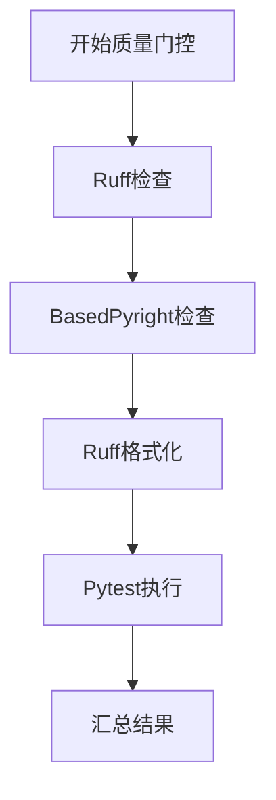

# 质量门控执行机制

<cite>
**本文档引用文件**  
- [epic_driver.py](file://autoBMAD/epic_automation/epic_driver.py)
- [quality_agents.py](file://autoBMAD/epic_automation/agents/quality_agents.py)
- [quality_check_controller.py](file://autoBMAD/epic_automation/controllers/quality_check_controller.py)
- [pytest_controller.py](file://autoBMAD/epic_automation/controllers/pytest_controller.py)
</cite>

## 更新摘要
**变更内容**  
- 将质量门控流程重构为四个阶段：Ruff检查、BasedPyright检查、Ruff格式化和Pytest执行
- 每个阶段非阻断以提供全面反馈
- 添加Ruff格式化阶段作为最终代码格式化步骤
- 更新CLI标志对质量门控流程的控制机制

## 目录
- [质量门控执行机制](#质量门控执行机制)
  - [更新摘要](#更新摘要)
  - [目录](#目录)
  - [质量门控协调器设计](#质量门控协调器设计)
    - [QualityGateOrchestrator类结构](#qualitygateorchestrator类结构)
    - [四阶段执行流程](#四阶段执行流程)
  - [质量检查工具实现](#质量检查工具实现)
    - [Ruff检查与自动修复](#ruff检查与自动修复)
    - [BasedPyright类型检查](#basedpyright类型检查)
    - [Pytest测试执行](#pytest测试执行)
  - [CLI标志控制](#cli标志控制)
    - [跳过质量检查](#跳过质量检查)
    - [跳过测试执行](#跳过测试执行)
  - [执行结果聚合与错误处理](#执行结果聚合与错误处理)
    - [进度跟踪机制](#进度跟踪机制)
    - [异常处理策略](#异常处理策略)

## 质量门控协调器设计

### QualityGateOrchestrator类结构
`QualityGateOrchestrator`类作为质量门控的协调器，负责管理整个质量检查流水线的执行。该类初始化时接收源代码目录、测试目录以及控制标志（`skip_quality`和`skip_tests`），并创建相应的质量检查代理实例。

**类属性**  
- `source_dir`: 源代码目录路径
- `test_dir`: 测试代码目录路径
- `skip_quality`: 是否跳过Ruff和BasedPyright质量检查
- `skip_tests`: 是否跳过Pytest执行
- `results`: 存储各阶段执行结果的字典结构
- `progress`: 进度跟踪信息，包含各阶段的状态、开始和结束时间

**Section sources**  
- [epic_driver.py](file://autoBMAD/epic_automation/epic_driver.py#L93-L140)

### 四阶段执行流程
质量门控流程被重构为四个明确的阶段，每个阶段依次执行但不阻断后续阶段，以提供全面的反馈信息：

1. **第一阶段：Ruff检查** - 执行代码风格检查并尝试自动修复
2. **第二阶段：BasedPyright检查** - 执行类型检查并尝试自动修复
3. **第三阶段：Ruff格式化** - 对代码进行最终格式化
4. **第四阶段：Pytest执行** - 运行测试套件验证功能正确性

每个阶段的执行结果都会被记录在`results`字典中，即使某个阶段失败也不会中断整个流程，确保所有质量检查都能提供反馈。



**Diagram sources**  
- [epic_driver.py](file://autoBMAD/epic_automation/epic_driver.py#L520-L577)

## 质量检查工具实现

### Ruff检查与自动修复
Ruff检查阶段使用`RuffAgent`和`QualityCheckController`实现代码风格检查和自动修复。控制器会执行多轮循环，每轮包括检查、SDK修复和回归检查三个步骤。

**执行流程**  
1. 执行Ruff检查获取错误文件列表
2. 对每个有错误的文件，构造修复Prompt并调用SDK进行修复
3. 等待1分钟延迟后处理下一个文件（避免API速率限制）
4. 重复上述过程最多3轮或直到所有问题解决

**Section sources**  
- [quality_check_controller.py](file://autoBMAD/epic_automation/controllers/quality_check_controller.py#L73-L119)
- [quality_agents.py](file://autoBMAD/epic_automation/agents/quality_agents.py#L163-L247)

### BasedPyright类型检查
BasedPyright检查阶段与Ruff检查类似，使用相同的控制器模式执行类型检查和自动修复。该阶段专注于发现和修复Python类型注解相关的问题。

**特点**  
- 使用`--outputjson`参数获取结构化输出
- 按文件分组错误信息以便精确修复
- 与Ruff检查共享相同的SDK修复机制

**Section sources**  
- [quality_check_controller.py](file://autoBMAD/epic_automation/controllers/quality_check_controller.py#L73-L119)
- [quality_agents.py](file://autoBMAD/epic_automation/agents/quality_agents.py#L355-L464)

### Pytest测试执行
Pytest执行阶段使用`PytestController`管理测试执行和修复循环。该控制器会遍历测试目录下的所有测试文件，依次执行并记录失败情况。

**执行策略**  
- 首轮执行所有测试文件
- 对失败的文件进行SDK修复
- 执行回归测试验证修复效果
- 最多重复3轮修复尝试

**Section sources**  
- [pytest_controller.py](file://autoBMAD/epic_automation/controllers/pytest_controller.py#L64-L112)
- [quality_agents.py](file://autoBMAD/epic_automation/agents/quality_agents.py#L497-L787)

## CLI标志控制

### 跳过质量检查
通过`--skip-quality`命令行标志可以跳过Ruff和BasedPyright质量检查阶段。当此标志被设置时，相关检查将被跳过，但会在日志中记录跳过信息。

**使用示例**  
```bash
python -m autoBMAD.epic_automation.epic_driver docs/epics/my-epic.md --skip-quality
```

**Section sources**  
- [epic_driver.py](file://autoBMAD/epic_automation/epic_driver.py#L2320-L2324)

### 跳过测试执行
通过`--skip-tests`命令行标志可以跳过Pytest执行阶段。此标志对于快速迭代开发非常有用，可以在不运行完整测试套件的情况下验证代码变更。

**使用示例**  
```bash
python -m autoBMAD.epic_automation.epic_driver docs/epics/my-epic.md --skip-tests
```

**Section sources**  
- [epic_driver.py](file://autoBMAD/epic_automation/epic_driver.py#L2326-L2327)

## 执行结果聚合与错误处理

### 进度跟踪机制
质量门控流程内置了详细的进度跟踪机制，通过`progress`字典记录每个阶段的执行状态：

**进度信息结构**  
- `current_phase`: 当前执行阶段
- `phase_1_ruff`: Ruff检查阶段信息
- `phase_2_basedpyright`: BasedPyright检查阶段信息  
- `phase_final_format`: Ruff格式化阶段信息
- `phase_3_pytest`: Pytest执行阶段信息

每个阶段包含状态、开始时间和结束时间，便于性能分析和问题排查。

**Section sources**  
- [epic_driver.py](file://autoBMAD/epic_automation/epic_driver.py#L141-L163)

### 异常处理策略
质量门控流程实现了全面的异常处理策略，确保即使在部分检查失败的情况下也能提供完整的反馈：

**错误处理原则**  
- Ruff和BasedPyright检查失败不阻断流程
- Ruff格式化失败被视为警告而非错误
- Pytest执行失败会影响整体结果但不中断流程
- 所有异常都会被记录并在最终结果中汇总

这种非阻断的设计理念确保开发者能够一次性获得所有质量检查的反馈，而不是在修复一个问题后才能看到下一个问题。

**Section sources**  
- [epic_driver.py](file://autoBMAD/epic_automation/epic_driver.py#L579-L611)