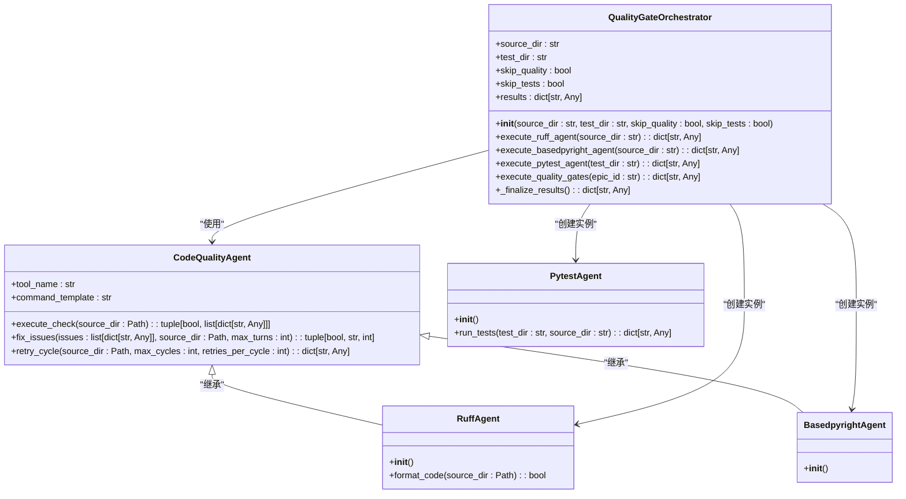
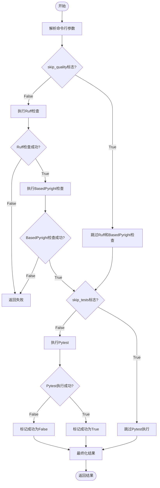
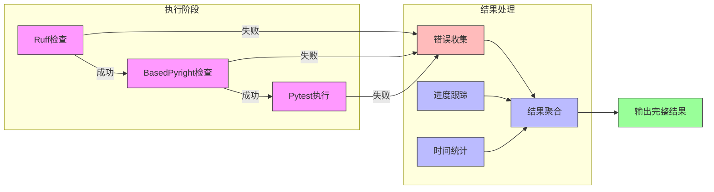
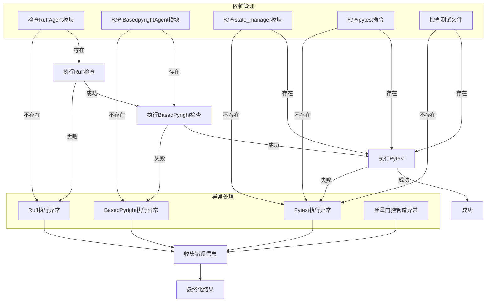

# 质量门控执行机制

<cite>
**本文档引用的文件**   
- [epic_driver.py](file://autoBMAD/epic_automation/epic_driver.py)
- [quality_agents.py](file://autoBMAD/epic_automation/quality_agents.py)
- [test_epic_driver.py](file://tests-copy/epic_automation/test_epic_driver.py)
- [test_quality_gates.py](file://tests-copy/epic_automation/test_quality_gates.py)
- [test_quality_gates_complete.py](file://tests-copy/integration/test_quality_gates_complete.py)
</cite>

## 目录
1. [引言](#引言)
2. [核心组件分析](#核心组件分析)
3. [QualityGateOrchestrator类设计模式](#qualitygateorchestrator类设计模式)
4. [质量门控执行流程](#质量门控执行流程)
5. [CLI标志控制机制](#cli标志控制机制)
6. [异步执行与结果聚合](#异步执行与结果聚合)
7. [依赖管理与异常处理](#依赖管理与异常处理)
8. [结论](#结论)

## 引言
质量门控是EpicDriver自动化流程中的关键环节，用于确保代码质量和功能完整性。该机制通过协调器模式依次执行Ruff、BasedPyright和Pytest检查，形成完整的质量保障体系。本文档详细分析execute_quality_gates方法的实现原理、设计模式和控制机制。

## 核心组件分析

QualityGateOrchestrator类作为质量门控的核心协调器，负责管理Ruff、BasedPyright和Pytest三个质量检查工具的执行流程。该类通过责任链模式实现检查的顺序执行，并在遇到失败时中断后续检查。

**Section sources**
- [epic_driver.py](file://autoBMAD/epic_automation/epic_driver.py#L94-L532)
- [quality_agents.py](file://autoBMAD/epic_automation/quality_agents.py#L41-L759)

## QualityGateOrchestrator类设计模式



**Diagram sources**
- [epic_driver.py](file://autoBMAD/epic_automation/epic_driver.py#L94-L532)
- [quality_agents.py](file://autoBMAD/epic_automation/quality_agents.py#L41-L759)

## 质量门控执行流程

```mermaid
sequenceDiagram
participant Orchestrator as QualityGateOrchestrator
participant Ruff as RuffAgent
participant Basedpyright as BasedpyrightAgent
participant Pytest as PytestAgent
Orchestrator->>Orchestrator : execute_quality_gates()
alt skip_quality为False
Orchestrator->>Ruff : execute_ruff_agent()
Ruff-->>Orchestrator : 返回检查结果
alt Ruff检查失败
Orchestrator->>Orchestrator : 中断流程，返回失败
else
Orchestrator->>Basedpyright : execute_basedpyright_agent()
Basedpyright-->>Orchestrator : 返回类型检查结果
alt BasedPyright检查失败
Orchestrator->>Orchestrator : 中断流程，返回失败
else
alt skip_tests为False
Orchestrator->>Pytest : execute_pytest_agent()
Pytest-->>Orchestrator : 返回测试结果
end
end
end
Orchestrator->>Orchestrator : _finalize_results()
Orchestrator-->>调用者 : 返回最终结果
```

**Diagram sources**
- [epic_driver.py](file://autoBMAD/epic_automation/epic_driver.py#L450-L507)
- [test_epic_driver.py](file://tests-copy/epic_automation/test_epic_driver.py#L114-L313)

## CLI标志控制机制



**Diagram sources**
- [epic_driver.py](file://autoBMAD/epic_automation/epic_driver.py#L569-L570)
- [epic_driver.py](file://autoBMAD/epic_automation/epic_driver.py#L2111-L2119)
- [test_quality_gates.py](file://tests-copy/epic_automation/test_quality_gates.py#L280-L309)

## 异步执行与结果聚合



**Diagram sources**
- [epic_driver.py](file://autoBMAD/epic_automation/epic_driver.py#L119-L147)
- [epic_driver.py](file://autoBMAD/epic_automation/epic_driver.py#L508-L532)
- [test_quality_gates_complete.py](file://tests-copy/integration/test_quality_gates_complete.py#L340-L368)

## 依赖管理与异常处理



**Diagram sources**
- [epic_driver.py](file://autoBMAD/epic_automation/epic_driver.py#L178-L189)
- [epic_driver.py](file://autoBMAD/epic_automation/epic_driver.py#L244-L257)
- [epic_driver.py](file://autoBMAD/epic_automation/epic_driver.py#L310-L334)
- [epic_driver.py](file://autoBMAD/epic_automation/epic_driver.py#L500-L506)

## 结论
QualityGateOrchestrator类通过责任链设计模式实现了质量门控的顺序执行和失败中断机制。该机制通过CLI标志提供了灵活的控制选项，允许跳过特定的质量检查阶段。异步执行模型确保了各检查工具的独立运行，同时通过完善的结果聚合和错误处理机制提供了全面的执行反馈。这种设计既保证了代码质量的严格把控，又提供了足够的灵活性以适应不同的开发场景。