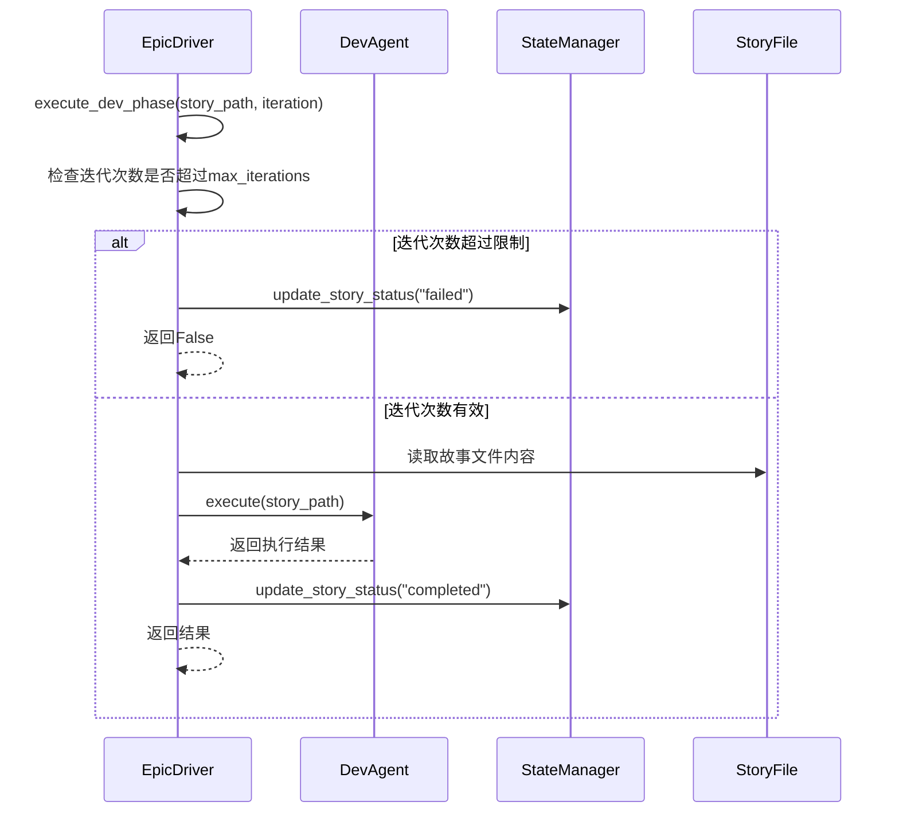
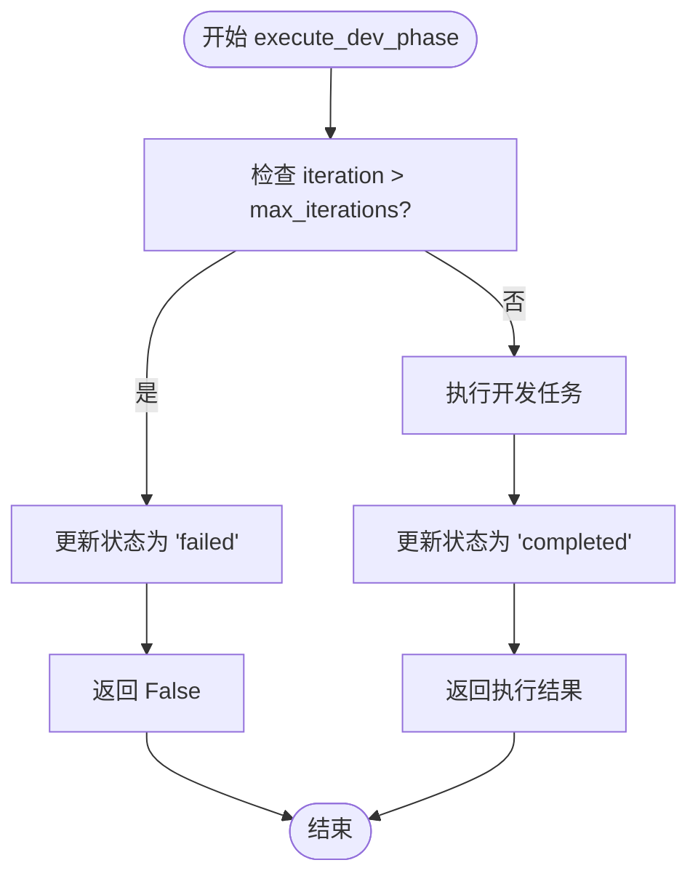

# Dev阶段执行

<cite>
**本文档引用的文件**   
- [epic_driver.py](file://autoBMAD/epic_automation/epic_driver.py)
- [dev_agent.py](file://autoBMAD/epic_automation/dev_agent.py)
- [state_manager.py](file://autoBMAD/epic_automation/state_manager.py)
- [qa_agent.py](file://autoBMAD/epic_automation/qa_agent.py)
</cite>

## 目录
1. [介绍](#介绍)
2. [execute_dev_phase方法实现](#executedevphasemethod实现)
3. [重试机制与迭代控制](#重试机制与迭代控制)
4. [状态管理器集成](#状态管理器集成)
5. [与质量门控系统的衔接](#与质量门控系统的衔接)
6. [并发模式执行特性](#并发模式执行特性)
7. [错误处理策略](#错误处理策略)
8. [结论](#结论)

## 介绍
本文档详细阐述了EpicDriver中Dev阶段的执行机制，重点分析`execute_dev_phase`方法的实现。该方法是BMAD自动化系统中开发阶段的核心，负责协调开发代理（DevAgent）执行开发任务，并通过状态管理器（StateManager）跟踪和更新故事状态。文档将深入探讨该方法如何集成重试机制、处理迭代控制、与质量门控系统衔接，以及在并发模式下的执行特性。

## execute_dev_phase方法实现
`execute_dev_phase`方法是EpicDriver类中的核心方法，负责执行开发阶段的逻辑。该方法接收故事文件路径和当前迭代次数作为参数，并返回一个布尔值表示执行是否成功。



**Diagram sources**
- [epic_driver.py](file://autoBMAD/epic_automation/epic_driver.py#L1153-L1202)

**Section sources**
- [epic_driver.py](file://autoBMAD/epic_automation/epic_driver.py#L1153-L1202)

## 重试机制与迭代控制
`execute_dev_phase`方法通过`iteration`参数和`max_iterations`配置实现了防止无限循环的安全机制。

1.  **迭代参数跟踪**：`iteration`参数在每次执行开发阶段时递增，用于跟踪当前是第几次尝试。
2.  **最大迭代限制**：`max_iterations`是EpicDriver初始化时传入的配置，定义了允许的最大重试次数。
3.  **安全防护**：在方法开始时，会检查当前`iteration`是否超过了`self.max_iterations`。如果超过，方法会记录错误日志，将故事状态更新为"failed"，并返回`False`，从而终止该故事的处理流程。

此机制确保了即使开发任务因某种原因无法成功完成，系统也不会陷入无限循环，保证了整体流程的健壮性。



**Diagram sources**
- [epic_driver.py](file://autoBMAD/epic_automation/epic_driver.py#L1167-L1174)

**Section sources**
- [epic_driver.py](file://autoBMAD/epic_automation/epic_driver.py#L1167-L1174)

## 状态管理器集成
`execute_dev_phase`方法与`StateManager`紧密集成，用于持久化故事的处理状态。

1.  **执行成功**：当`DevAgent.execute()`方法成功返回`True`后，`execute_dev_phase`会调用`StateManager.update_story_status()`方法，将故事的状态更新为"completed"，并记录当前的`phase`（阶段）为"dev"和`iteration`（迭代次数）。
2.  **执行失败**：如果在执行过程中发生异常，方法会捕获异常，并调用`update_story_status()`将状态更新为"error"，同时将错误信息作为`error`参数存储。
3.  **状态更新失败处理**：代码中还包含对状态更新失败的处理。如果`update_story_status`返回失败，方法会记录警告日志，但仍然继续执行流程，体现了系统设计的容错性。

这种集成确保了故事的处理进度和结果被可靠地记录在数据库中，为后续的QA阶段和流程监控提供了数据支持。

**Section sources**
- [epic_driver.py](file://autoBMAD/epic_automation/epic_driver.py#L1188-L1209)
- [state_manager.py](file://autoBMAD/epic_automation/state_manager.py#L203-L245)

## 与质量门控系统的衔接
Dev阶段的执行是整个质量门控流程的起点。`execute_dev_phase`方法的成功执行是触发后续质量检查的前提。

1.  **流程顺序**：在EpicDriver的主流程`run()`方法中，`execute_dev_phase`是`execute_dev_qa_cycle`的一部分。只有当开发和QA循环成功完成后，系统才会进入质量门控阶段。
2.  **质量门控执行**：在`run()`方法的末尾，会调用`execute_quality_gates()`方法。该方法会依次执行Ruff、Basedpyright和Pytest等质量检查。
3.  **非阻塞性设计**：值得注意的是，质量门控的失败是**非阻塞**的。即使质量检查失败，EpicDriver仍然会返回成功，允许开发人员在事后审查和修复问题。这体现了流程的灵活性。

```mermaid
graph TD
A[开始] --> B[执行 Dev-QA 循环]
B --> C{Dev-QA 成功?}
C --> |是| D[执行质量门控]
C --> |否| E[流程失败]
D --> F{质量门控成功?}
F --> |是| G[流程成功]
F --> |否| H[流程成功 (非阻塞警告)]
G --> I[结束]
H --> I
E --> I
```

**Diagram sources**
- [epic_driver.py](file://autoBMAD/epic_automation/epic_driver.py#L1911-L2008)

**Section sources**
- [epic_driver.py](file://autoBMAD/epic_automation/epic_driver.py#L1911-L2008)
- [quality_agents.py](file://autoBMAD/epic_automation/quality_agents.py)

## 并发模式执行特性
当EpicDriver以`concurrent=True`模式运行时，其执行特性会发生显著变化。

1.  **并行处理**：在并发模式下，多个故事的`process_story`任务会被同时启动，而不是串行执行。这可以显著提高处理大量故事时的效率。
2.  **实验性警告**：代码中明确指出“Concurrent processing is experimental and not fully tested with quality gates”，表明并发模式仍处于实验阶段，可能与质量门控存在兼容性问题。
3.  **资源竞争**：并发执行可能会导致对共享资源（如文件系统、数据库）的竞争。`StateManager`使用了`asyncio.Lock`来确保数据库操作的原子性，防止了数据竞争。
4.  **日志复杂性**：由于多个任务的日志会交错输出，调试并发模式下的问题会更加复杂。

**Section sources**
- [epic_driver.py](file://autoBMAD/epic_automation/epic_driver.py#L1883-L1886)

## 错误处理策略
`execute_dev_phase`方法采用了分层的错误处理策略。

1.  **顶层异常捕获**：整个方法体被一个`try-except`块包裹，用于捕获任何未预期的异常。这确保了即使发生严重错误，方法也能优雅地失败，而不是让整个程序崩溃。
2.  **特定条件处理**：对于可预见的失败条件（如超过最大迭代次数），方法会进行显式的条件判断和处理，提供更精确的错误信息。
3.  **状态持久化**：无论失败原因是什么，方法都会尝试将失败状态（"failed"或"error"）写入`StateManager`。这保证了失败信息不会丢失，便于后续排查。
4.  **日志记录**：方法在关键步骤（如开始、迭代检查、成功、失败）都记录了不同级别的日志（info, warning, error），为监控和调试提供了丰富的信息。

**Section sources**
- [epic_driver.py](file://autoBMAD/epic_automation/epic_driver.py#L1204-L1209)

## 结论
`execute_dev_phase`方法是EpicDriver中一个设计精良的核心组件。它通过集成`max_iterations`配置和`iteration`参数，有效地防止了无限循环。该方法与`StateManager`深度集成，确保了状态的可靠持久化，并通过清晰的错误处理策略保证了流程的健壮性。虽然其与质量门控系统的衔接和在并发模式下的执行仍有一些需要注意的地方，但整体设计体现了高内聚、低耦合和容错性的原则，为自动化开发流程的稳定运行提供了坚实的基础。