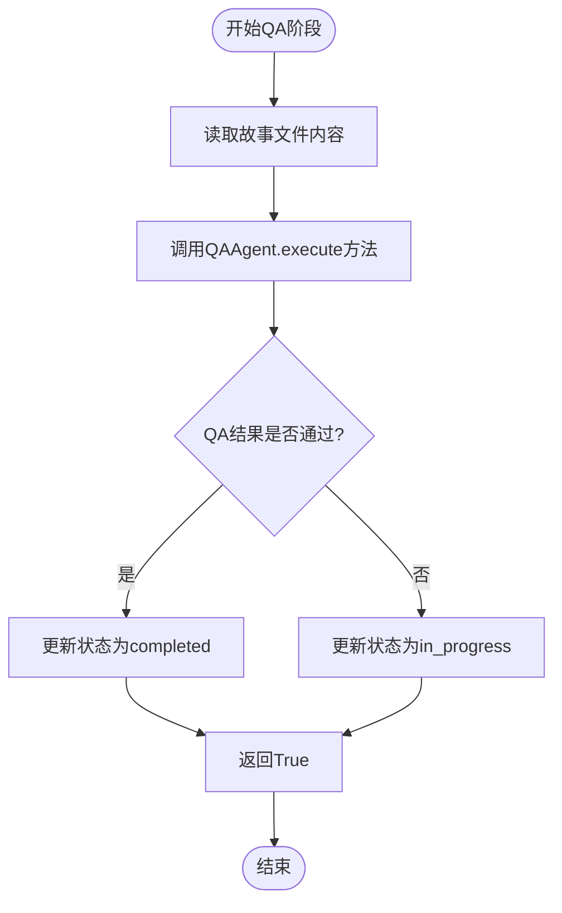
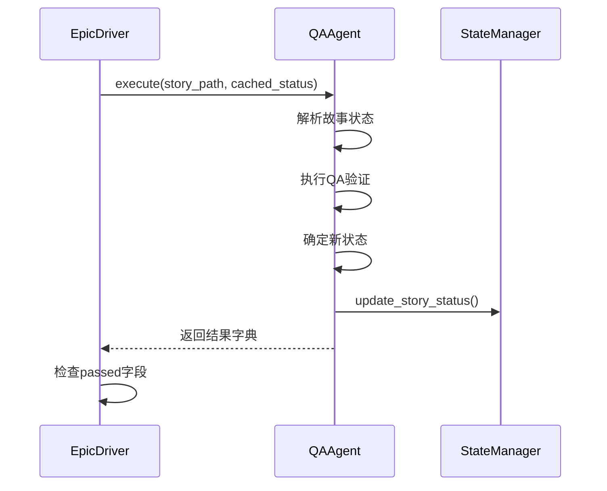
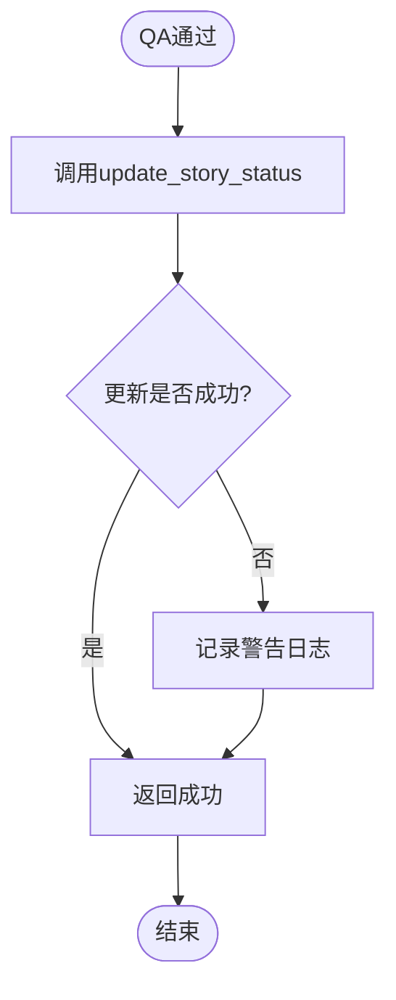
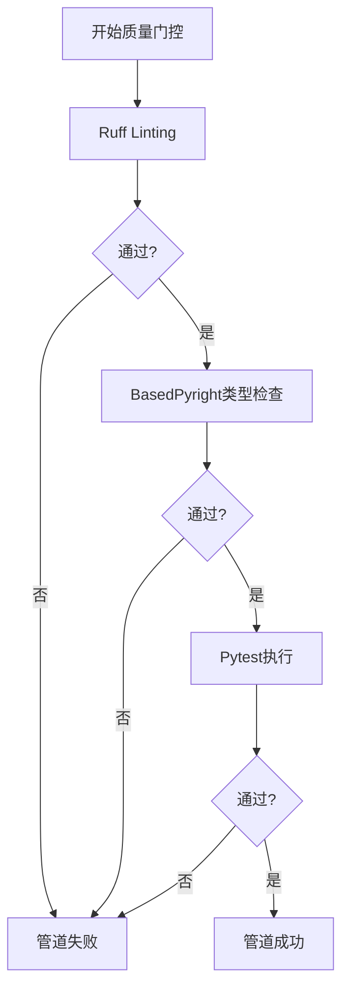
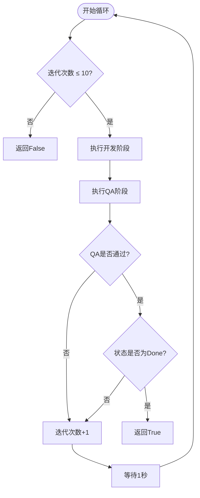

# QA阶段执行

<cite>
**本文档引用的文件**
- [epic_driver.py](file://autoBMAD/epic_automation/epic_driver.py)
- [qa_agent.py](file://autoBMAD/epic_automation/qa_agent.py)
- [state_manager.py](file://autoBMAD/epic_automation/state_manager.py)
- [quality_agents.py](file://autoBMAD/epic_automation/quality_agents.py)
</cite>

## 目录
1. [简介](#简介)
2. [execute_qa_phase方法实现](#execute_qa_phase方法实现)
3. [与QAAgent的集成](#与qaagent的集成)
4. [状态更新机制](#状态更新机制)
5. [输入参数与日志记录](#输入参数与日志记录)
6. [与质量门控系统的集成](#与质量门控系统的集成)
7. [SM-Dev-QA循环终止条件](#sm-dev-qa循环终止条件)

## 简介
本文档详细说明了EpicDriver中QA阶段的执行机制，重点分析`execute_qa_phase`方法的实现。该方法是SM-Dev-QA自动化循环中的关键组成部分，负责协调质量验证流程、处理状态更新以及与质量门控系统的集成。

**Section sources**
- [epic_driver.py](file://autoBMAD/epic_automation/epic_driver.py#L1210-L1263)

## execute_qa_phase方法实现
`execute_qa_phase`方法是EpicDriver中负责执行质量保证阶段的核心方法。该方法的主要职责是调用QAAgent进行质量验证，并根据验证结果决定后续流程。

该方法的实现遵循以下流程：
1. 读取指定故事路径的文件内容
2. 调用QAAgent的`execute`方法执行质量验证
3. 根据验证结果判断是否通过
4. 如果通过，则尝试将故事状态更新为"completed"
5. 如果未通过，则将状态设置为"in_progress"以便进行修复

方法返回一个布尔值，表示QA阶段是否成功通过。在执行过程中，方法会记录详细的日志信息，包括QA阶段的开始、结果以及状态更新操作。

**Diagram sources**
- [epic_driver.py](file://autoBMAD/epic_automation/epic_driver.py#L1210-L1263)

**Section sources**
- [epic_driver.py](file://autoBMAD/epic_automation/epic_driver.py#L1210-L1263)

## 与QAAgent的集成
`execute_qa_phase`方法通过调用QAAgent的`execute`方法来执行质量验证。QAAgent是专门负责质量保证任务的代理，它实现了完整的QA执行流程。

QAAgent的`execute`方法执行以下步骤：
1. 获取故事文档的核心状态值
2. 将核心状态转换为处理状态值
3. 执行QA验证（包括代码质量检查、类型检查和测试执行）
4. 根据验证结果确定新的处理状态值
5. 更新数据库中的故事状态
6. 基于核心状态值进行业务决策

当`execute_qa_phase`调用QAAgent的`execute`方法时，会传递故事路径和可选的缓存状态参数。QAAgent返回一个包含'passed'字段的结果字典，`execute_qa_phase`方法通过检查这个字段来判断QA是否通过。

**Diagram sources**
- [qa_agent.py](file://autoBMAD/epic_automation/qa_agent.py#L222-L328)
- [epic_driver.py](file://autoBMAD/epic_automation/epic_driver.py#L1229-L1232)

**Section sources**
- [qa_agent.py](file://autoBMAD/epic_automation/qa_agent.py#L222-L328)

## 状态更新机制
在QA阶段通过后，`execute_qa_phase`方法会调用StateManager将故事状态更新为"completed"。StateManager是负责管理故事进度的组件，它使用SQLite数据库来持久化状态信息。

状态更新过程包括以下步骤：
1. 调用`update_story_status`方法，传入故事路径和目标状态"completed"
2. 如果状态更新成功，方法正常返回
3. 如果状态更新失败，方法会记录警告日志，但仍然返回True表示QA阶段通过

这种设计确保了即使状态更新失败，也不会影响QA阶段的整体成功判断。警告处理机制允许系统在数据库操作出现问题时继续执行，同时记录问题以便后续排查。

**Diagram sources**
- [epic_driver.py](file://autoBMAD/epic_automation/epic_driver.py#L1236-L1248)
- [state_manager.py](file://autoBMAD/epic_automation/state_manager.py#L203-L249)

**Section sources**
- [epic_driver.py](file://autoBMAD/epic_automation/epic_driver.py#L1236-L1248)

## 输入参数与日志记录
`execute_qa_phase`方法接受一个必需的参数`story_path`，表示要进行质量验证的故事文件路径。该方法在执行过程中会生成详细的日志记录，包括：

- QA阶段开始的日志
- QA结果的日志（通过或失败）
- 状态更新操作的日志
- 任何错误或异常的日志

日志记录模式遵循统一的格式，便于追踪和调试。每个日志条目都包含时间戳、日志级别和详细的上下文信息。例如，当QA通过时，会记录"QA phase passed for {story_path}"；当状态更新失败时，会记录"Completion state update failed for {story_path} but QA passed successfully"。

这些日志信息对于监控自动化流程的执行状态、诊断问题和优化性能至关重要。

**Section sources**
- [epic_driver.py](file://autoBMAD/epic_automation/epic_driver.py#L1211-L1263)

## 与质量门控系统的集成
QA阶段与质量门控系统紧密集成，通过QualityGateOrchestrator类协调多个质量检查。质量门控管道包括三个主要阶段：

1. **Ruff Linting**: 执行代码风格和质量检查
2. **BasedPyright Type Checking**: 执行类型检查
3. **Pytest Execution**: 执行单元测试

每个质量门控阶段都有明确的成功标准：
- Ruff和BasedPyright检查要求没有严重错误
- Pytest执行要求所有测试通过

质量门控管道支持跳过选项（`--skip-quality`和`--skip-tests`），允许在特定情况下绕过某些检查。管道执行是顺序的，如果任何阶段失败，后续阶段将被跳过，确保快速失败。

**Diagram sources**
- [epic_driver.py](file://autoBMAD/epic_automation/epic_driver.py#L94-L533)

**Section sources**
- [epic_driver.py](file://autoBMAD/epic_automation/epic_driver.py#L94-L533)

## SM-Dev-QA循环终止条件
SM-Dev-QA循环的终止条件由`_execute_story_processing`方法中的循环控制逻辑决定。循环的主要终止条件包括：

1. **QA通过且状态为"Done"**: 当QA阶段通过并且故事状态为"Done"时，循环成功终止，返回True。
2. **达到最大循环次数**: 循环最多执行10次（`max_dev_qa_cycles = 10`），如果达到最大次数仍未成功，循环终止并返回False。
3. **异常情况**: 如果在处理过程中发生未处理的异常，循环将捕获异常，记录错误日志，并返回False。

循环在每次迭代之间有1秒的延迟（`await asyncio.sleep(1.0)`），以避免过于频繁的执行。这种设计平衡了执行效率和系统资源的使用。

**Diagram sources**
- [epic_driver.py](file://autoBMAD/epic_automation/epic_driver.py#L1336-L1376)

**Section sources**
- [epic_driver.py](file://autoBMAD/epic_automation/epic_driver.py#L1336-L1376)