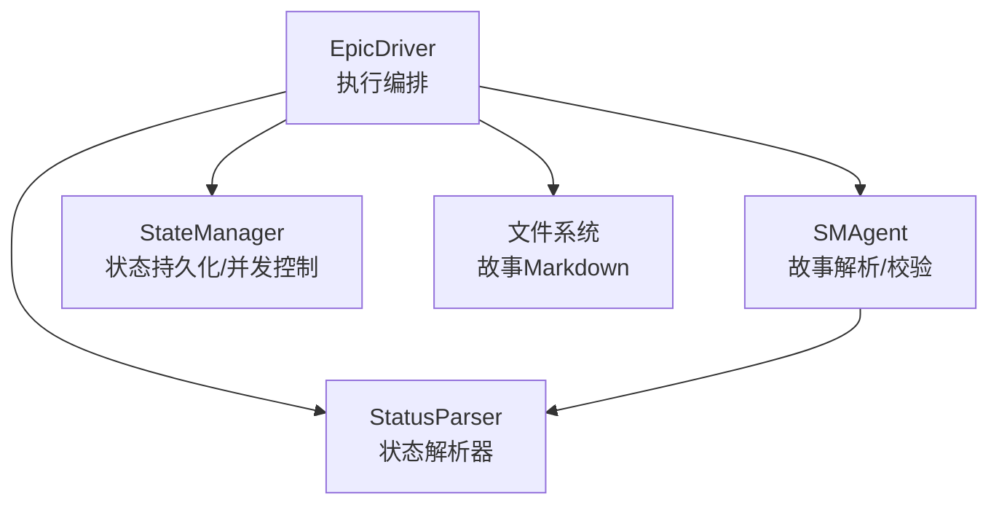
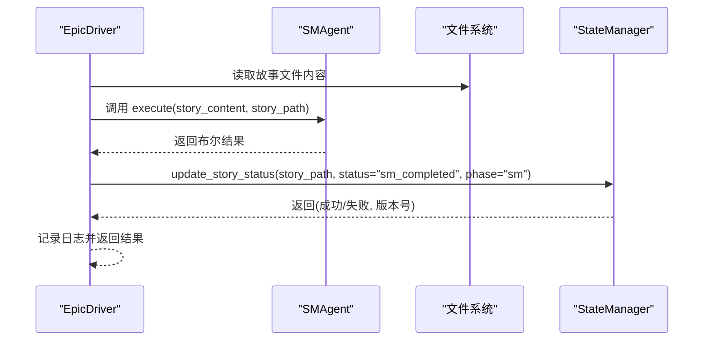
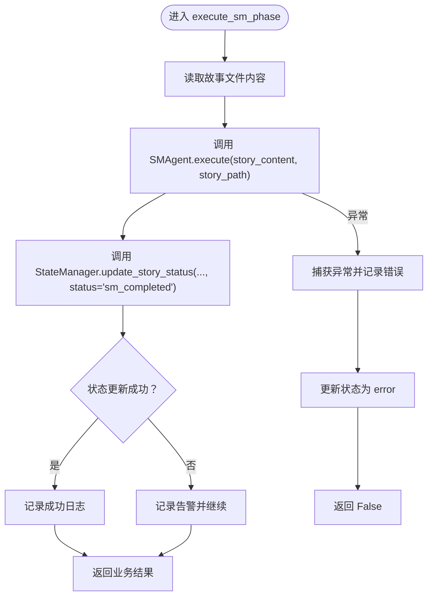
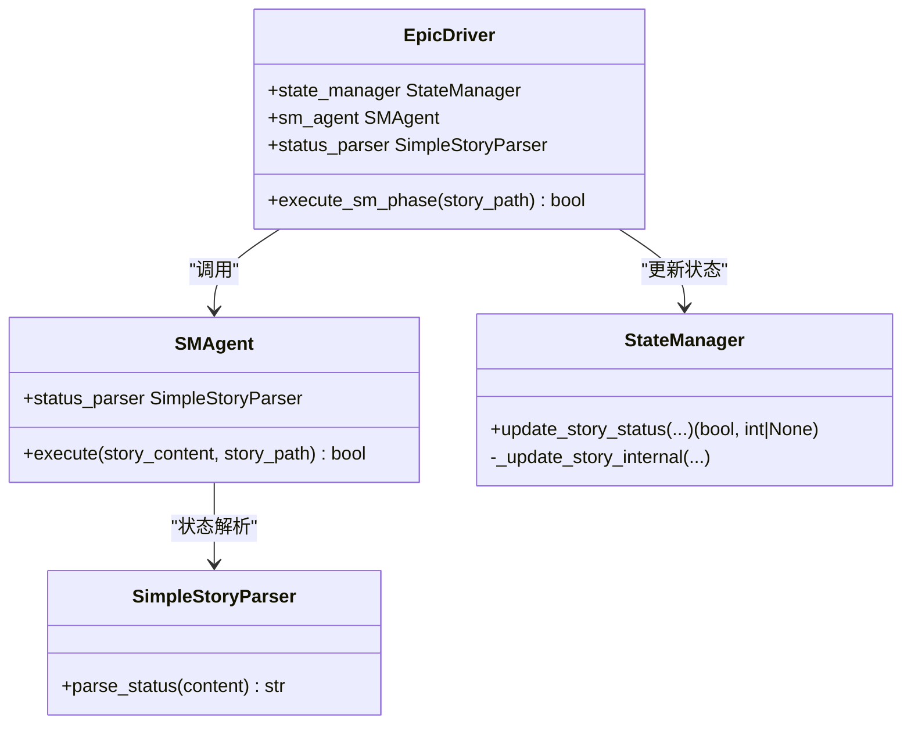

# SM阶段执行

<cite>
**本文引用的文件**
- [epic_driver.py](file://autoBMAD/epic_automation/epic_driver.py)
- [sm_agent.py](file://autoBMAD/epic_automation/sm_agent.py)
- [state_manager.py](file://autoBMAD/epic_automation/state_manager.py)
- [story_parser.py](file://autoBMAD/epic_automation/story_parser.py)
</cite>

## 目录
1. [简介](#简介)
2. [项目结构](#项目结构)
3. [核心组件](#核心组件)
4. [架构总览](#架构总览)
5. [详细组件分析](#详细组件分析)
6. [依赖关系分析](#依赖关系分析)
7. [性能考量](#性能考量)
8. [故障排查指南](#故障排查指南)
9. [结论](#结论)

## 简介
本文聚焦 EpicDriver 中 SM（Story Master）阶段的执行机制，围绕 execute_sm_phase 方法展开，详细说明其如何调用 SMAgent 的 execute 方法处理故事内容，如何通过 story_path 参数传递故事文件路径；阐述执行成功后如何调用 StateManager 更新故事状态为“sm_completed”，以及在状态更新失败时的容错策略；并结合状态解析器（StatusParser）与 SM-Dev-QA 循环的关系，给出前置条件与后续依赖说明。同时提供输入输出流程、异常处理与日志记录方式的示例路径，帮助读者快速定位实现细节。

## 项目结构
SM 阶段位于 EpicDriver 的执行链路中，负责在 Dev-QA 循环之前对故事文档进行必要的解析与校验。其核心参与者包括：
- EpicDriver：编排者，负责读取故事内容、调用 SMAgent、更新状态、记录日志
- SMAgent：故事解析与结构校验执行者，接收 story_content 与 story_path
- StateManager：状态持久化与并发控制，提供 update_story_status 接口
- StatusParser（SimpleStoryParser）：AI优先的状态解析器，用于从故事文档中抽取标准状态

图表来源
- [epic_driver.py](file://autoBMAD/epic_automation/epic_driver.py#L1112-L1151)
- [sm_agent.py](file://autoBMAD/epic_automation/sm_agent.py#L98-L133)
- [state_manager.py](file://autoBMAD/epic_automation/state_manager.py#L203-L261)
- [story_parser.py](file://autoBMAD/epic_automation/story_parser.py#L213-L362)

章节来源
- [epic_driver.py](file://autoBMAD/epic_automation/epic_driver.py#L1112-L1151)
- [sm_agent.py](file://autoBMAD/epic_automation/sm_agent.py#L98-L133)
- [state_manager.py](file://autoBMAD/epic_automation/state_manager.py#L203-L261)
- [story_parser.py](file://autoBMAD/epic_automation/story_parser.py#L213-L362)

## 核心组件
- EpicDriver.execute_sm_phase：SM 阶段入口，负责读取故事内容、调用 SMAgent.execute、更新状态为“sm_completed”，并在异常时设置“error”状态
- SMAgent.execute：解析故事元数据、结构校验，返回布尔结果
- StateManager.update_story_status：原子性地更新或插入故事状态，支持乐观锁与超时控制
- StatusParser（SimpleStoryParser）：AI优先的状态解析器，提供 parse_status 异步方法

章节来源
- [epic_driver.py](file://autoBMAD/epic_automation/epic_driver.py#L1112-L1151)
- [sm_agent.py](file://autoBMAD/epic_automation/sm_agent.py#L98-L133)
- [state_manager.py](file://autoBMAD/epic_automation/state_manager.py#L203-L261)
- [story_parser.py](file://autoBMAD/epic_automation/story_parser.py#L213-L362)

## 架构总览
SM 阶段在 EpicDriver 的 Dev-QA 循环中承担“前置准备”的角色。在 EpicDriver._execute_story_processing 中，SM 阶段已被移除，故事由 SM Agent 在 parse_epic 阶段创建并写入文件系统，因此 SM 阶段不再重复创建故事文件。SM 阶段的核心职责是：
- 读取故事文件内容
- 调用 SMAgent.execute 进行解析与校验
- 更新状态为“sm_completed”
- 异常时记录错误并设置“error”

图表来源
- [epic_driver.py](file://autoBMAD/epic_automation/epic_driver.py#L1112-L1151)
- [sm_agent.py](file://autoBMAD/epic_automation/sm_agent.py#L98-L133)
- [state_manager.py](file://autoBMAD/epic_automation/state_manager.py#L203-L261)

## 详细组件分析

### EpicDriver.execute_sm_phase 方法
- 输入
  - story_path：故事 Markdown 文件的绝对路径
- 处理流程
  - 读取文件内容为 story_content
  - 调用 self.sm_agent.execute(story_content, story_path)
  - 调用 self.state_manager.update_story_status(story_path, status="sm_completed", phase="sm")
  - 若状态更新失败，记录告警但继续返回业务结果
  - 捕获异常时，记录错误并调用 self.state_manager.update_story_status(story_path, status="error", error=...)
- 输出
  - 返回布尔结果，指示 SM 阶段是否成功

图表来源
- [epic_driver.py](file://autoBMAD/epic_automation/epic_driver.py#L1112-L1151)

章节来源
- [epic_driver.py](file://autoBMAD/epic_automation/epic_driver.py#L1112-L1151)

### SMAgent.execute 方法
- 输入
  - story_content：故事 Markdown 原始内容
  - story_path：故事文件路径（用于状态更新）
- 处理流程
  - 解析故事元数据（标题、状态、验收标准、任务等）
  - 结构校验（缺失字段、数量不足等），校验问题不会阻断 SM 阶段
  - 返回布尔结果
- 输出
  - True 表示解析与校验通过；False 表示失败

章节来源
- [sm_agent.py](file://autoBMAD/epic_automation/sm_agent.py#L98-L133)
- [sm_agent.py](file://autoBMAD/epic_automation/sm_agent.py#L134-L231)

### StateManager.update_story_status 方法
- 功能
  - 原子性更新或插入故事状态，支持乐观锁（version）与超时控制
  - 返回 (success, current_version) 元组
- 并发与容错
  - 使用 asyncio.Lock 保护数据库访问
  - 超时控制：wait_for(timeout=lock_timeout)
  - 取消处理：捕获 CancelledError 并返回 False
  - 异常兜底：捕获 Exception 并记录错误日志

章节来源
- [state_manager.py](file://autoBMAD/epic_automation/state_manager.py#L203-L261)
- [state_manager.py](file://autoBMAD/epic_automation/state_manager.py#L262-L349)

### StatusParser（SimpleStoryParser）与 SM 阶段的交互
- SM 阶段本身不直接依赖 StatusParser 更新故事状态，但在 EpicDriver 的其他流程中会使用 StatusParser 进行状态解析与规范化
- SMAgent 内部也持有 SimpleStoryParser 实例，用于状态解析与更新（在故事创建与状态变更场景）

章节来源
- [story_parser.py](file://autoBMAD/epic_automation/story_parser.py#L213-L362)
- [sm_agent.py](file://autoBMAD/epic_automation/sm_agent.py#L1-L70)

## 依赖关系分析
- EpicDriver 依赖 SMAgent 与 StateManager
- SMAgent 依赖 StatusParser（SimpleStoryParser）进行状态解析
- StateManager 依赖 SQLite 数据库存储与连接池、锁机制

图表来源
- [epic_driver.py](file://autoBMAD/epic_automation/epic_driver.py#L534-L659)
- [sm_agent.py](file://autoBMAD/epic_automation/sm_agent.py#L1-L70)
- [state_manager.py](file://autoBMAD/epic_automation/state_manager.py#L203-L261)
- [story_parser.py](file://autoBMAD/epic_automation/story_parser.py#L213-L362)

章节来源
- [epic_driver.py](file://autoBMAD/epic_automation/epic_driver.py#L534-L659)
- [sm_agent.py](file://autoBMAD/epic_automation/sm_agent.py#L1-L70)
- [state_manager.py](file://autoBMAD/epic_automation/state_manager.py#L203-L261)
- [story_parser.py](file://autoBMAD/epic_automation/story_parser.py#L213-L362)

## 性能考量
- SM 阶段主要执行文件读取与 SMAgent 的解析/校验，I/O 与 CPU 开销较低
- StateManager 的更新采用锁与超时控制，避免长时间阻塞；连接池提升并发性能
- 建议
  - 控制 SM 阶段并发度，避免过多文件同时读取造成磁盘压力
  - 对于大规模故事集，可在上层调度中分批执行 SM 阶段

[本节为通用指导，无需特定文件引用]

## 故障排查指南
- SM 阶段返回 False
  - 检查 SMAgent.execute 是否抛出异常或返回 False
  - 查看 EpicDriver.execute_sm_phase 的异常分支，确认是否设置了“error”状态
  - 参考路径：[epic_driver.py](file://autoBMAD/epic_automation/epic_driver.py#L1146-L1151)
- 状态未更新为“sm_completed”
  - StateManager.update_story_status 返回 False 或抛出异常
  - 检查锁超时、取消、数据库异常日志
  - 参考路径：[state_manager.py](file://autoBMAD/epic_automation/state_manager.py#L203-L261)
- 日志定位
  - SM 阶段开始/结束与异常日志均在 EpicDriver.execute_sm_phase 中记录
  - 参考路径：[epic_driver.py](file://autoBMAD/epic_automation/epic_driver.py#L1112-L1151)

章节来源
- [epic_driver.py](file://autoBMAD/epic_automation/epic_driver.py#L1112-L1151)
- [state_manager.py](file://autoBMAD/epic_automation/state_manager.py#L203-L261)

## 结论
SM 阶段在 EpicDriver 的 Dev-QA 循环中承担“前置准备”职责：读取故事内容、调用 SMAgent 进行解析与校验，并将状态更新为“sm_completed”。即使状态更新失败，SM 阶段也会继续返回业务结果，保证流程的韧性。StateManager 提供了可靠的并发控制与超时保护，确保状态一致性。在 SM 阶段之外，StatusParser 作为统一的状态解析器，贯穿于 EpicDriver 的状态判定与规范化流程中，为 SM-Dev-QA 循环提供一致的状态语义。