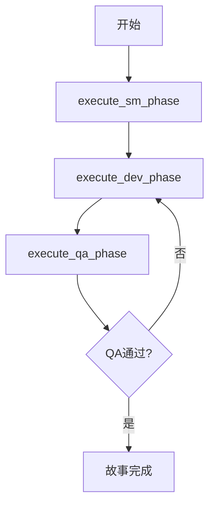
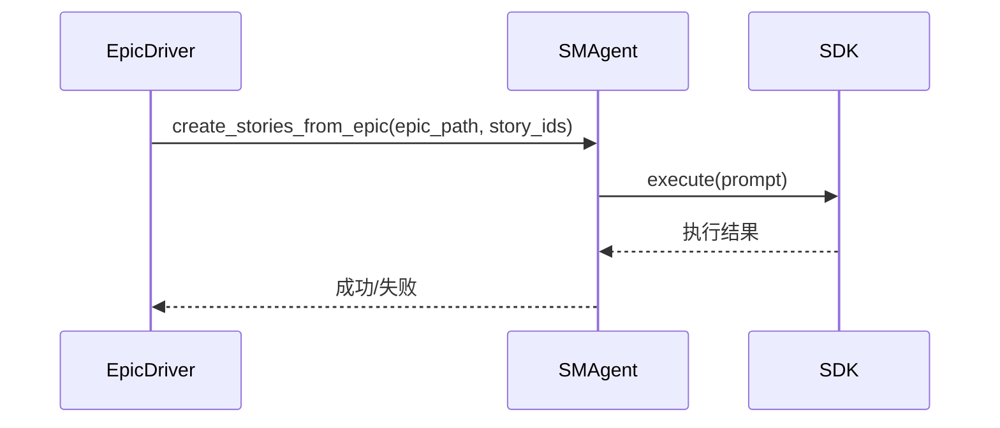

# 阶段执行机制

<cite>
**本文档引用的文件**
- [epic_driver.py](file://autoBMAD/epic_automation/epic_driver.py)
- [state_manager.py](file://autoBMAD/epic_automation/state_manager.py)
- [dev_agent.py](file://autoBMAD/epic_automation/dev_agent.py)
- [qa_agent.py](file://autoBMAD/epic_automation/qa_agent.py)
- [sm_agent.py](file://autoBMAD/epic_automation/sm_agent.py)
- [sdk_session_manager.py](file://autoBMAD/epic_automation/sdk_session_manager.py)
</cite>

## 目录
1. [引言](#引言)
2. [核心执行方法概述](#核心执行方法概述)
3. [SM阶段执行机制](#sm阶段执行机制)
4. [开发阶段执行机制](#开发阶段执行机制)
5. [QA阶段执行机制](#qa阶段执行机制)
6. [状态管理器交互](#状态管理器交互)
7. [并发执行模式](#并发执行模式)
8. [错误恢复与重试机制](#错误恢复与重试机制)
9. [日志记录与诊断](#日志记录与诊断)

## 引言
EpicDriver是BMAD自动化系统的主要协调器，负责驱动SM-Dev-QA循环。该系统通过解析史诗（epic）和故事（story）文档，协调SMAgent、DevAgent和QAAgent三个核心代理，实现自动化开发流程。本文档详细说明了EpicDriver的三个核心执行方法：`execute_sm_phase`、`execute_dev_phase`和`execute_qa_phase`的执行流程、参数传递、返回值处理以及与各代理的交互方式。

## 核心执行方法概述
EpicDriver通过三个核心方法管理故事的生命周期：`execute_sm_phase`、`execute_dev_phase`和`execute_qa_phase`。这些方法构成了一个迭代的开发-审查循环，每个阶段都与特定的代理进行交互，并通过StateManager记录状态。



**Diagram sources**
- [epic_driver.py](file://autoBMAD/epic_automation/epic_driver.py#L1335-L1352)

## SM阶段执行机制
`execute_sm_phase`方法负责故事管理阶段的执行，主要由SMAgent代理处理。该阶段的核心任务是根据史诗文档创建和管理故事文件。

### 执行流程
1.  **故事ID提取**：从史诗文档中提取故事ID。
2.  **故事文件创建**：使用SMAgent调用Claude SDK创建故事文件。
3.  **状态验证**：验证所有故事文件是否成功创建并包含必要内容。
4.  **状态更新**：将故事状态从"DRAFT"更新为"READY_FOR_DEVELOPMENT"。

### 与SMAgent的交互
EpicDriver通过`create_stories_from_epic`方法与SMAgent交互。SMAgent负责构建调用Claude SDK的提示（prompt），并执行创建故事的指令。交互数据格式为故事ID列表和史诗文件路径。



**Diagram sources**
- [epic_driver.py](file://autoBMAD/epic_automation/epic_driver.py#L1335)
- [sm_agent.py](file://autoBMAD/epic_automation/sm_agent.py#L264-L319)

## 开发阶段执行机制
`execute_dev_phase`方法负责开发阶段的执行，由DevAgent代理处理。该阶段的核心任务是根据故事要求实现功能。

### 执行流程
1.  **状态检查**：检查故事的当前状态，如果状态为"READY_FOR_DONE"或"DONE"，则跳过整个开发-审查循环。
2.  **开发任务执行**：调用DevAgent执行开发任务。
3.  **状态更新**：将故事状态更新为"REVIEW"，表示开发完成，等待审查。
4.  **通知QA**：通知QAAgent进行审查。

### 与DevAgent的交互
EpicDriver通过`implement_story`方法与DevAgent交互。传递的参数包括故事路径、任务列表和验收标准。DevAgent返回一个包含实现结果的字典。

**Section sources**
- [epic_driver.py](file://autoBMAD/epic_automation/epic_driver.py#L1344)
- [dev_agent.py](file://autoBMAD/epic_automation/dev_agent.py#L239-L304)

## QA阶段执行机制
`execute_qa_phase`方法负责质量保证阶段的执行，由QAAgent代理处理。该阶段的核心任务是验证开发成果是否符合要求。

### 执行流程
1.  **AI驱动审查**：执行AI驱动的QA审查。
2.  **状态检查**：审查后检查故事状态。
3.  **决策逻辑**：如果状态为"DONE"或"READY_FOR_DONE"，则认为QA通过；否则，需要返回开发阶段进行修复。
4.  **回退机制**：在SDK取消或错误时，执行回退的QA审查。

### 与QAAgent的交互
EpicDriver通过`validate_implementation`方法与QAAgent交互。传递的参数包括源代码文件列表和测试文件列表。QAAgent返回一个`QAResult`对象，包含审查结果。

```mermaid
flowchart TD
A[开始QA阶段] --> B{状态为"Ready for Review"?}
B --> |是| C[执行AI驱动QA审查]
B --> |否| D[跳过QA]
C --> E{审查成功?}
E --> |是| F[检查最终状态]
E --> |否| G[执行回退QA审查]
F --> H{状态为"Done"或"Ready for Done"?}
H --> |是| I[QA通过]
H --> |否| J[需要修复]
```

**Diagram sources**
- [epic_driver.py](file://autoBMAD/epic_automation/epic_driver.py#L1352)
- [qa_agent.py](file://autoBMAD/epic_automation/qa_agent.py#L330-L358)

## 状态管理器交互
StateManager是整个系统的核心，用于跟踪故事的进度和状态。所有代理和EpicDriver都通过它来读取和更新状态。

### 状态更新
每个阶段执行完毕后，都会调用`update_story_status`方法更新数据库中的状态。例如，开发阶段完成后，状态会被更新为"REVIEW"。

### 状态读取
在执行任何阶段前，系统会调用`get_story_status`方法读取当前状态，以决定是否跳过该阶段。

**Section sources**
- [epic_driver.py](file://autoBMAD/epic_automation/epic_driver.py#L1327-L1333)
- [state_manager.py](file://autoBMAD/epic_automation/state_manager.py#L203-L248)

## 并发执行模式
EpicDriver支持通过`concurrent`参数启用并发执行模式。当此模式启用时，多个故事可以并行处理，显著提高处理效率。

### 实现机制
并发执行通过`asyncio`库实现。每个故事的处理被封装在一个异步任务中，由事件循环调度执行。

**Section sources**
- [epic_driver.py](file://autoBMAD/epic_automation/epic_driver.py#L581)

## 错误恢复与重试机制
系统具备强大的错误恢复和重试能力，确保在遇到临时故障时能够自动恢复。

### 重试机制
-   **SDK调用重试**：在`_execute_claude_sdk`方法中，对SDK调用实现了重试逻辑。
-   **Dev-QA循环**：在主循环中，允许最多10次Dev-QA循环，以应对需要多次迭代才能通过QA的情况。

### 错误恢复
当某个阶段失败时，系统会记录错误并尝试继续执行后续阶段以进行诊断，而不是立即终止整个流程。

**Section sources**
- [epic_driver.py](file://autoBMAD/epic_automation/epic_driver.py#L1337-L1352)
- [sm_agent.py](file://autoBMAD/epic_automation/sm_agent.py#L426-L457)

## 日志记录与诊断
系统通过`LogManager`提供详细的日志记录功能，便于诊断问题和监控执行流程。

### 日志级别
支持`verbose`参数来启用详细日志输出，记录每个步骤的详细信息。

### 诊断信息
日志中包含关键的诊断信息，如SDK调用的持续时间、会话ID和错误消息，有助于快速定位问题。

**Section sources**
- [epic_driver.py](file://autoBMAD/epic_automation/epic_driver.py#L596-L678)
- [log_manager.py](file://autoBMAD/epic_automation/log_manager.py)