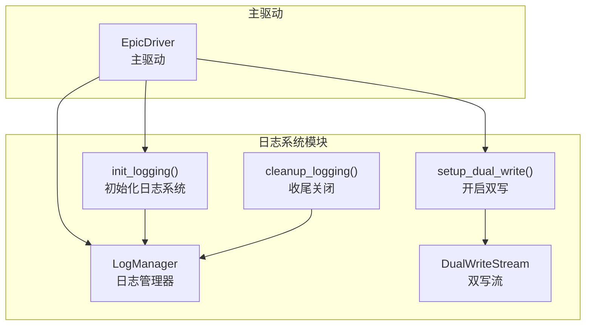
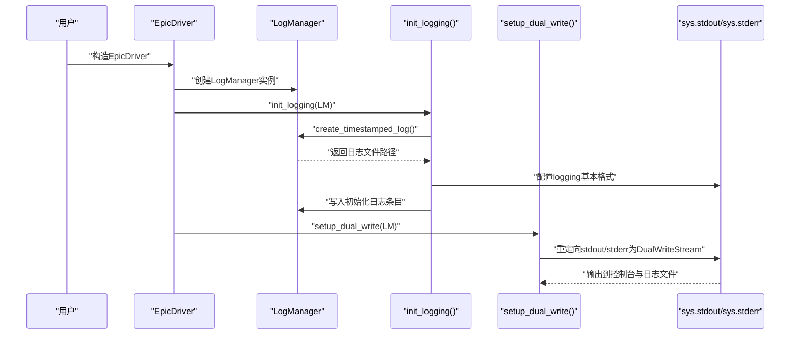
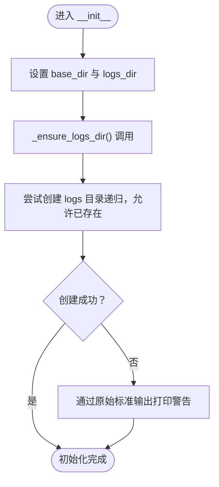
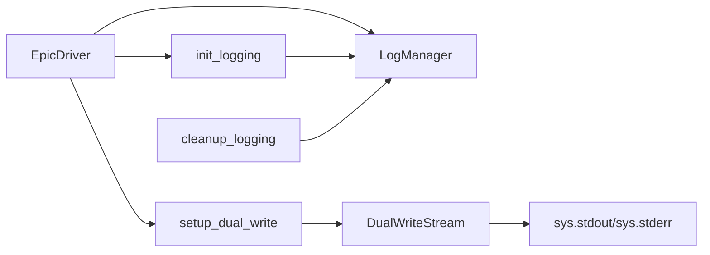

# 日志管理器初始化与日志文件创建

<cite>
**本文引用的文件**
- [log_manager.py](file://autoBMAD/epic_automation/log_manager.py)
- [epic_driver.py](file://autoBMAD/epic_automation/epic_driver.py)
- [LOGSYSTEM_README.md](file://autoBMAD/epic_automation/LOGSYSTEM_README.md)
</cite>

## 目录
1. [简介](#简介)
2. [项目结构](#项目结构)
3. [核心组件](#核心组件)
4. [架构总览](#架构总览)
5. [详细组件分析](#详细组件分析)
6. [依赖关系分析](#依赖关系分析)
7. [性能考量](#性能考量)
8. [故障排查指南](#故障排查指南)
9. [结论](#结论)
10. [附录](#附录)

## 简介
本文件聚焦于日志管理器的初始化与日志文件创建流程，围绕以下目标展开：
- 解释LogManager.__init__如何初始化日志系统，包括base_dir与logs_dir的路径设置，以及通过内部方法确保日志目录存在的机制。
- 详述create_timestamped_log如何生成带时间戳的日志文件名（epic_YYYYMMDD_HHMMSS.log），创建UTF-8编码的日志文件，并写入包含启动时间、文件名等信息的格式化头部。
- 提供实际代码示例路径，展示初始化流程与异常处理机制，以及日志目录自动创建功能的工作原理。

## 项目结构
日志系统位于autoBMAD/epic_automation子模块中，关键文件如下：
- autoBMAD/epic_automation/log_manager.py：日志管理器实现，包含LogManager类、初始化与日志写入逻辑、双写流等。
- autoBMAD/epic_automation/epic_driver.py：主驱动程序，负责实例化LogManager、初始化日志系统并开启双写模式。
- autoBMAD/epic_automation/LOGSYSTEM_README.md：日志系统使用说明与最佳实践文档。

图表来源
- [log_manager.py](file://autoBMAD/epic_automation/log_manager.py#L300-L426)
- [epic_driver.py](file://autoBMAD/epic_automation/epic_driver.py#L611-L615)

章节来源
- [log_manager.py](file://autoBMAD/epic_automation/log_manager.py#L300-L426)
- [epic_driver.py](file://autoBMAD/epic_automation/epic_driver.py#L611-L615)

## 核心组件
- 日志管理器LogManager：负责日志目录创建、时间戳日志文件生成、日志写入、异常记录、关闭与刷新等。
- 双写流DualWriteStream：同时向控制台与日志文件写入，保证用户体验与日志持久化。
- 初始化函数init_logging：全局设置LogManager实例、创建时间戳日志文件、配置logging基本格式。
- 双写设置函数setup_dual_write：重定向sys.stdout与sys.stderr至DualWriteStream。
- 收尾函数cleanup_logging：在程序结束时关闭当前日志文件并清理全局引用。

章节来源
- [log_manager.py](file://autoBMAD/epic_automation/log_manager.py#L300-L426)

## 架构总览
下图展示了EpicDriver如何在初始化阶段完成日志系统的装配与启动。

图表来源
- [epic_driver.py](file://autoBMAD/epic_automation/epic_driver.py#L611-L615)
- [log_manager.py](file://autoBMAD/epic_automation/log_manager.py#L377-L418)

## 详细组件分析

### 初始化流程与路径设置
- base_dir与logs_dir的设置
  - base_dir默认为“autoBMAD/epic_automation”，可通过构造参数覆盖。
  - logs_dir为base_dir下的“logs”子目录。
- 目录存在性保障
  - 在__init__中调用内部方法确保logs目录存在；若创建失败，会通过原始标准输出打印警告信息，避免中断主流程。
- 初始化日志文件创建
  - init_logging会调用LogManager.create_timestamped_log，生成形如“epic_YYYYMMDD_HHMMSS.log”的文件名，并以UTF-8编码打开。
  - 写入包含启动时间、文件名等信息的格式化头部，随后记录初始化完成与当前日志文件路径等信息。

章节来源
- [log_manager.py](file://autoBMAD/epic_automation/log_manager.py#L30-L52)
- [log_manager.py](file://autoBMAD/epic_automation/log_manager.py#L53-L88)
- [log_manager.py](file://autoBMAD/epic_automation/log_manager.py#L377-L404)

### create_timestamped_log：时间戳日志文件创建
- 文件命名规则
  - 使用当前时间生成“YYYYMMDD_HHMMSS”格式的时间戳，文件名为“epic_YYYYMMDD_HHMMSS.log”。
- 文件创建与编码
  - 以UTF-8编码打开文件，确保多语言字符正确写入。
- 头部信息写入
  - 写入包含启动时间、日志文件名等信息的格式化头部，便于快速识别本次运行的基本信息。
- 返回值与后续使用
  - 返回创建的日志文件路径，供init_logging记录日志文件位置。

章节来源
- [log_manager.py](file://autoBMAD/epic_automation/log_manager.py#L53-L88)

### 日志写入与异常处理
- 普通日志写入
  - 计算相对运行时间，格式化为“YYYY-MM-DD HH:MM:SS [级别] [相对时间] 消息”，并写入文件。
- SDK消息写入
  - 特殊格式记录SDK消息类型（如TOOL_USE、THINKING等），便于区分不同阶段的交互。
- 异常记录
  - 记录异常上下文、异常类型、异常消息与完整堆栈，便于定位问题。
- 关闭与刷新
  - 关闭时写入结束时间、总时长与文件名等信息；flush方法确保缓冲区数据落盘。

章节来源
- [log_manager.py](file://autoBMAD/epic_automation/log_manager.py#L89-L185)
- [log_manager.py](file://autoBMAD/epic_automation/log_manager.py#L285-L298)

### 双写模式与控制台输出
- 双写流
  - DualWriteStream在写入控制台的同时，将非空文本写入日志文件；对Unicode编码问题进行安全处理。
- 初始化与重定向
  - setup_dual_write将sys.stdout与sys.stderr替换为DualWriteStream，从而实现“既看到控制台输出，又持久化到日志文件”。

章节来源
- [log_manager.py](file://autoBMAD/epic_automation/log_manager.py#L300-L358)
- [log_manager.py](file://autoBMAD/epic_automation/log_manager.py#L406-L418)

### 实际代码示例路径（不含具体代码内容）
- 初始化流程（EpicDriver中）
  - [EpicDriver.__init__中初始化与设置日志](file://autoBMAD/epic_automation/epic_driver.py#L611-L615)
- 初始化函数（LogManager侧）
  - [init_logging：创建时间戳日志文件与基础日志配置](file://autoBMAD/epic_automation/log_manager.py#L377-L404)
  - [setup_dual_write：开启双写模式](file://autoBMAD/epic_automation/log_manager.py#L406-L418)
- 目录创建与异常处理
  - [LogManager.__init__与目录创建](file://autoBMAD/epic_automation/log_manager.py#L30-L52)
  - [create_timestamped_log：创建UTF-8日志文件并写入头部](file://autoBMAD/epic_automation/log_manager.py#L53-L88)
- 日志写入与关闭
  - [write_log：普通日志写入](file://autoBMAD/epic_automation/log_manager.py#L89-L115)
  - [write_sdk_message：SDK消息写入](file://autoBMAD/epic_automation/log_manager.py#L116-L146)
  - [write_exception：异常记录](file://autoBMAD/epic_automation/log_manager.py#L147-L185)
  - [close_log：关闭日志文件与尾部信息](file://autoBMAD/epic_automation/log_manager.py#L186-L215)
  - [flush：刷新缓冲区](file://autoBMAD/epic_automation/log_manager.py#L285-L298)

章节来源
- [epic_driver.py](file://autoBMAD/epic_automation/epic_driver.py#L611-L615)
- [log_manager.py](file://autoBMAD/epic_automation/log_manager.py#L377-L418)

### 目录自动创建机制流程图

图表来源
- [log_manager.py](file://autoBMAD/epic_automation/log_manager.py#L30-L52)

## 依赖关系分析
- EpicDriver依赖LogManager进行日志管理，并通过init_logging与setup_dual_write完成初始化与双写设置。
- init_logging依赖LogManager的create_timestamped_log与basicConfig配置。
- setup_dual_write依赖DualWriteStream，后者依赖sys.stdout与sys.stderr。
- cleanup_logging负责在程序结束时关闭当前日志文件并清理全局引用。

图表来源
- [epic_driver.py](file://autoBMAD/epic_automation/epic_driver.py#L611-L615)
- [log_manager.py](file://autoBMAD/epic_automation/log_manager.py#L377-L418)

章节来源
- [epic_driver.py](file://autoBMAD/epic_automation/epic_driver.py#L611-L615)
- [log_manager.py](file://autoBMAD/epic_automation/log_manager.py#L377-L418)

## 性能考量
- 写入策略：采用UTF-8编码与逐行写入，flush确保及时落盘，避免缓冲积压导致丢失。
- I/O开销：实时写入对CPU与内存影响较小，磁盘占用取决于运行时日志量与级别。
- 建议：在高负载场景下可适当降低日志级别或减少高频消息，以平衡性能与可观测性。

## 故障排查指南
- 编码错误
  - 现象：控制台出现编码相关错误。
  - 处理：确认日志文件以UTF-8编码创建；若控制台编码受限，可调整终端编码或在双写流中进行安全降级处理。
- 权限错误
  - 现象：无法创建日志目录或写入日志文件。
  - 处理：检查目标目录权限，确保具备创建与写入权限；必要时提升权限或更换目录。
- 磁盘空间
  - 现象：日志文件占用过多磁盘空间。
  - 处理：实施日志轮转与定期清理策略，保留最近N天的日志文件。
- 目录不存在
  - 现象：首次运行未生成日志文件。
  - 处理：确认LogManager.__init__已调用且目录创建逻辑正常；检查路径拼接与权限。

章节来源
- [LOGSYSTEM_README.md](file://autoBMAD/epic_automation/LOGSYSTEM_README.md#L275-L306)

## 结论
LogManager通过简洁而稳健的设计实现了自动化的日志初始化与文件创建：在__init__中设置base_dir与logs_dir，并确保目录存在；在init_logging中生成带时间戳的日志文件并写入头部信息；通过DualWriteStream实现双写模式，兼顾控制台体验与日志持久化。异常处理与刷新机制进一步提升了可靠性与可维护性。结合epic_driver中的集成方式，用户可在无需额外配置的情况下获得完整的运行时日志记录能力。

## 附录
- 使用说明与最佳实践可参考日志系统文档。
- 如需自定义日志目录，可在EpicDriver构造时传入自定义base_dir。

章节来源
- [LOGSYSTEM_README.md](file://autoBMAD/epic_automation/LOGSYSTEM_README.md#L206-L219)