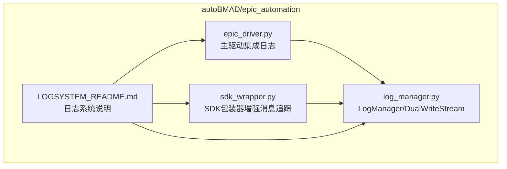
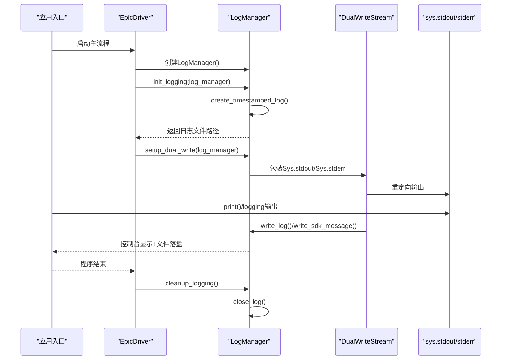
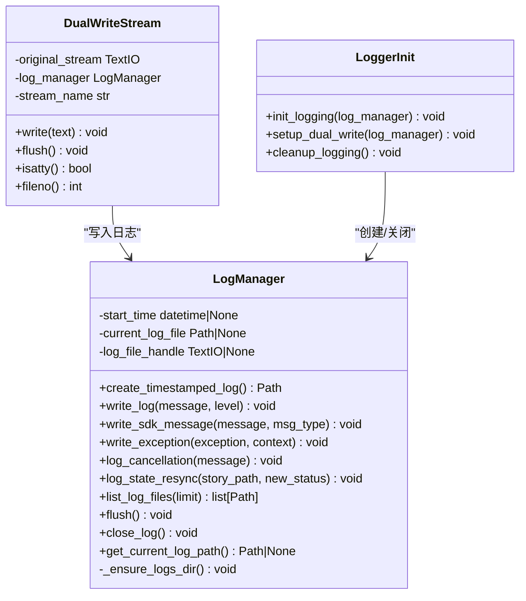
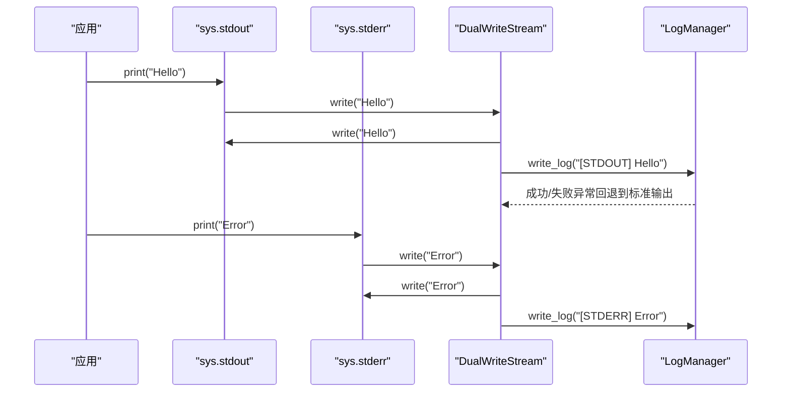
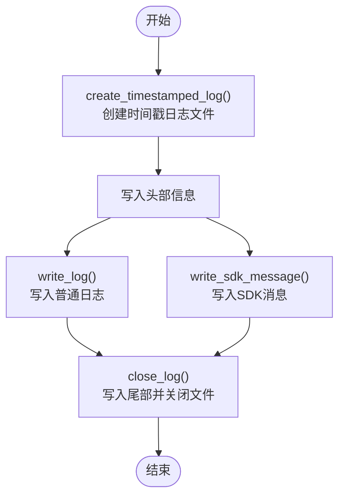
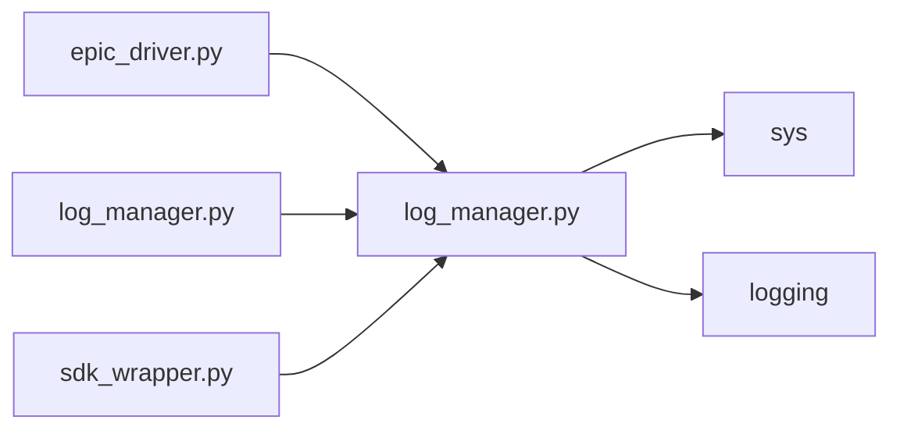

# LogManager跟踪系统

<cite>
**本文引用的文件**
- [log_manager.py](file://autoBMAD/epic_automation/log_manager.py)
- [LOGSYSTEM_README.md](file://autoBMAD/epic_automation/LOGSYSTEM_README.md)
- [epic_driver.py](file://autoBMAD/epic_automation/epic_driver.py)
- [sdk_wrapper.py](file://autoBMAD/epic_automation/sdk_wrapper.py)
</cite>

## 目录
1. [简介](#简介)
2. [项目结构](#项目结构)
3. [核心组件](#核心组件)
4. [架构总览](#架构总览)
5. [详细组件分析](#详细组件分析)
6. [依赖关系分析](#依赖关系分析)
7. [性能与可靠性](#性能与可靠性)
8. [故障排查指南](#故障排查指南)
9. [结论](#结论)
10. [附录](#附录)

## 简介
本文件系统性阐述LogManager统一日志管理功能，覆盖以下关键点：
- 如何通过create_timestamped_log方法创建带时间戳的日志文件
- 如何通过write_log与write_sdk_message写入不同类型的日志
- 如何通过close_log方法优雅关闭日志文件
- 双写模式（dual-write mode）如何同时将输出写入控制台与文件
- DualWriteStream类如何实现双写功能
- 实际使用示例路径与异常处理、资源清理机制

## 项目结构
LogManager位于autoBMAD/epic_automation模块中，配合epic_driver.py主流程集成使用；SDK消息由sdk_wrapper.py增强以支持文件持久化。

图表来源
- [log_manager.py](file://autoBMAD/epic_automation/log_manager.py#L1-L426)
- [epic_driver.py](file://autoBMAD/epic_automation/epic_driver.py#L600-L650)
- [sdk_wrapper.py](file://autoBMAD/epic_automation/sdk_wrapper.py#L1-L200)
- [LOGSYSTEM_README.md](file://autoBMAD/epic_automation/LOGSYSTEM_README.md#L1-L333)

章节来源
- [log_manager.py](file://autoBMAD/epic_automation/log_manager.py#L1-L426)
- [epic_driver.py](file://autoBMAD/epic_automation/epic_driver.py#L600-L650)
- [sdk_wrapper.py](file://autoBMAD/epic_automation/sdk_wrapper.py#L1-L200)
- [LOGSYSTEM_README.md](file://autoBMAD/epic_automation/LOGSYSTEM_README.md#L1-L333)

## 核心组件
- LogManager：统一日志管理器，负责创建时间戳日志文件、写入普通日志与SDK消息、异常记录、状态同步与取消事件记录、列出日志文件、刷新缓冲等。
- DualWriteStream：自定义流，将stdout/stderr同时写入控制台与日志文件，具备Unicode编码兼容处理。
- init_logging/setup_dual_write/cleanup_logging：日志系统初始化、双写模式启用与收尾清理的高层接口。
- EpicDriver集成：在主流程中创建LogManager、初始化日志系统并开启双写模式。
- SDKMessageTracker增强：在SDK消息追踪中增加文件写入能力，配合LogManager统一持久化。

章节来源
- [log_manager.py](file://autoBMAD/epic_automation/log_manager.py#L18-L298)
- [log_manager.py](file://autoBMAD/epic_automation/log_manager.py#L300-L358)
- [log_manager.py](file://autoBMAD/epic_automation/log_manager.py#L377-L426)
- [epic_driver.py](file://autoBMAD/epic_automation/epic_driver.py#L600-L650)
- [sdk_wrapper.py](file://autoBMAD/epic_automation/sdk_wrapper.py#L1-L200)
- [LOGSYSTEM_README.md](file://autoBMAD/epic_automation/LOGSYSTEM_README.md#L106-L150)

## 架构总览
LogManager通过init_logging创建时间戳日志文件并配置基础日志框架；通过setup_dual_write将sys.stdout/sys.stderr重定向为DualWriteStream，实现“控制台+文件”的双写模式；在程序结束时由cleanup_logging调用close_log进行资源清理。

图表来源
- [epic_driver.py](file://autoBMAD/epic_automation/epic_driver.py#L600-L650)
- [log_manager.py](file://autoBMAD/epic_automation/log_manager.py#L377-L426)

## 详细组件分析

### LogManager类
- 职责
  - 创建时间戳日志文件并写入头部信息
  - 写入普通日志、SDK消息、异常、取消事件、状态同步事件
  - 列出最近日志文件
  - 刷新缓冲、关闭日志文件并写入尾部信息
- 关键方法
  - create_timestamped_log：生成logs/epic_YYYYMMDD_HHMMSS.log，写入头部，记录起始时间
  - write_log：写入普通日志，包含绝对时间、日志级别、相对运行时间
  - write_sdk_message：写入SDK消息，包含消息类型与相对运行时间
  - write_exception：写入异常信息，包含上下文、异常类型、消息与完整堆栈
  - log_cancellation/log_state_resync：记录取消与状态同步事件
  - list_log_files：按修改时间倒序列出最近日志
  - flush/close_log：刷新缓冲并关闭文件，写入尾部统计信息
- 异常处理
  - 多处写入均使用try/except捕获异常，并回退到标准输出打印警告，避免中断主流程
- 资源清理
  - close_log在finally中确保句柄与当前文件路径清空
  - cleanup_logging在退出时调用close_log并重置全局实例

图表来源
- [log_manager.py](file://autoBMAD/epic_automation/log_manager.py#L18-L298)
- [log_manager.py](file://autoBMAD/epic_automation/log_manager.py#L300-L358)
- [log_manager.py](file://autoBMAD/epic_automation/log_manager.py#L377-L426)

章节来源
- [log_manager.py](file://autoBMAD/epic_automation/log_manager.py#L18-L298)
- [log_manager.py](file://autoBMAD/epic_automation/log_manager.py#L300-L358)
- [log_manager.py](file://autoBMAD/epic_automation/log_manager.py#L377-L426)

### 双写模式与DualWriteStream
- 设计目标
  - 在保持原有控制台输出体验的同时，将所有stdout/stderr写入日志文件
  - 对Unicode编码问题进行兼容处理，避免因终端编码限制导致输出失败
- 实现要点
  - 重定向sys.stdout/sys.stderr为DualWriteStream实例
  - write方法先写控制台，再写日志；对Unicode编码失败进行降级处理
  - 仅对非空文本进行日志写入，避免噪声
  - 提供flush/isatty/fileno等方法以兼容标准流行为

图表来源
- [log_manager.py](file://autoBMAD/epic_automation/log_manager.py#L300-L358)

章节来源
- [log_manager.py](file://autoBMAD/epic_automation/log_manager.py#L300-L358)

### 日志记录流程（create_timestamped_log → write_log → close_log）
- 创建时间戳日志文件
  - 记录起始时间，生成文件名，打开UTF-8编码文件，写入头部信息并刷新
- 写入普通日志
  - 计算相对运行时间，格式化包含绝对时间、级别、相对时间与消息
- 写入SDK消息
  - 与普通日志类似，但消息类型字段区分SDK类别
- 关闭日志文件
  - 计算结束时间与总时长，写入尾部统计信息，关闭文件句柄并清理状态

图表来源
- [log_manager.py](file://autoBMAD/epic_automation/log_manager.py#L53-L215)

章节来源
- [log_manager.py](file://autoBMAD/epic_automation/log_manager.py#L53-L215)

### SDK消息追踪与文件持久化
- SDKMessageTracker增强
  - 在SDK消息追踪中增加文件写入能力，结合LogManager统一持久化
- 与主流程集成
  - EpicDriver在初始化时传入LogManager，SDK调用链可携带日志管理器以记录消息

章节来源
- [sdk_wrapper.py](file://autoBMAD/epic_automation/sdk_wrapper.py#L1-L200)
- [LOGSYSTEM_README.md](file://autoBMAD/epic_automation/LOGSYSTEM_README.md#L123-L133)
- [LOGSYSTEM_README.md](file://autoBMAD/epic_automation/LOGSYSTEM_README.md#L146-L154)

## 依赖关系分析
- 组件耦合
  - EpicDriver依赖LogManager进行日志初始化与双写模式启用
  - DualWriteStream依赖LogManager进行日志写入
  - SDK包装器通过LogManager实现SDK消息持久化
- 外部依赖
  - Python标准库：datetime、pathlib、typing、sys、logging
- 循环依赖
  - 无直接循环依赖；各模块职责清晰，通过高层接口解耦

图表来源
- [epic_driver.py](file://autoBMAD/epic_automation/epic_driver.py#L600-L650)
- [log_manager.py](file://autoBMAD/epic_automation/log_manager.py#L18-L298)
- [sdk_wrapper.py](file://autoBMAD/epic_automation/sdk_wrapper.py#L1-L200)

章节来源
- [epic_driver.py](file://autoBMAD/epic_automation/epic_driver.py#L600-L650)
- [log_manager.py](file://autoBMAD/epic_automation/log_manager.py#L18-L298)
- [sdk_wrapper.py](file://autoBMAD/epic_automation/sdk_wrapper.py#L1-L200)

## 性能与可靠性
- 性能特征
  - 实时写入，行缓冲，I/O开销较小
  - flush方法用于确保退出前数据落盘
- 可靠性保障
  - 多处异常捕获并回退到标准输出，避免中断主流程
  - 双写模式下，即使控制台编码异常也能保证日志文件写入
  - 关闭流程在finally中确保资源释放

章节来源
- [log_manager.py](file://autoBMAD/epic_automation/log_manager.py#L285-L298)
- [log_manager.py](file://autoBMAD/epic_automation/log_manager.py#L186-L215)
- [log_manager.py](file://autoBMAD/epic_automation/log_manager.py#L300-L358)

## 故障排查指南
- 编码错误
  - 现象：UnicodeEncodeError
  - 处理：DualWriteStream对控制台与日志分别进行降级处理，确保输出可用
- 权限错误
  - 现象：无法创建/写入日志文件
  - 处理：确认日志目录权限，必要时手动创建目录
- 磁盘空间
  - 建议：实施日志轮转与定期清理策略，避免占用过多空间
- 日志查看
  - 使用list_log_files获取最新日志文件，或使用tail -f实时跟踪

章节来源
- [LOGSYSTEM_README.md](file://autoBMAD/epic_automation/LOGSYSTEM_README.md#L276-L300)
- [log_manager.py](file://autoBMAD/epic_automation/log_manager.py#L262-L284)

## 结论
LogManager提供了统一、可靠且易用的日志管理能力：
- 自动创建时间戳日志文件，支持普通日志、SDK消息与异常的结构化记录
- 通过DualWriteStream实现“控制台+文件”的双写模式，兼顾用户体验与持久化需求
- 完善的异常处理与资源清理机制，确保系统稳定运行
- 与EpicDriver和SDK包装器良好集成，形成端到端的日志体系

## 附录

### 实际使用示例（代码片段路径）
- 初始化日志系统与双写模式
  - [epic_driver.py](file://autoBMAD/epic_automation/epic_driver.py#L600-L650)
- 创建时间戳日志文件
  - [log_manager.py](file://autoBMAD/epic_automation/log_manager.py#L53-L88)
- 写入普通日志
  - [log_manager.py](file://autoBMAD/epic_automation/log_manager.py#L89-L116)
- 写入SDK消息
  - [log_manager.py](file://autoBMAD/epic_automation/log_manager.py#L116-L146)
- 写入异常
  - [log_manager.py](file://autoBMAD/epic_automation/log_manager.py#L147-L185)
- 关闭日志文件
  - [log_manager.py](file://autoBMAD/epic_automation/log_manager.py#L186-L215)
- 列出最近日志文件
  - [log_manager.py](file://autoBMAD/epic_automation/log_manager.py#L262-L284)
- 刷新缓冲
  - [log_manager.py](file://autoBMAD/epic_automation/log_manager.py#L285-L298)
- 双写模式启用
  - [log_manager.py](file://autoBMAD/epic_automation/log_manager.py#L406-L418)