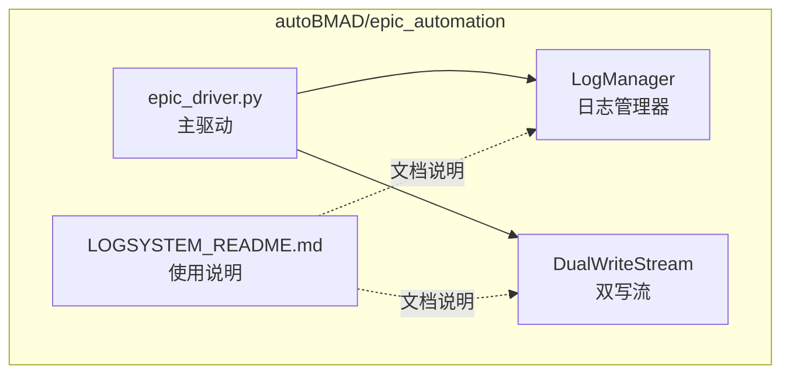
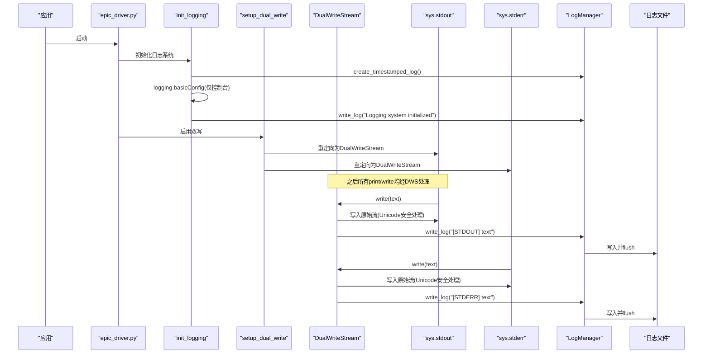
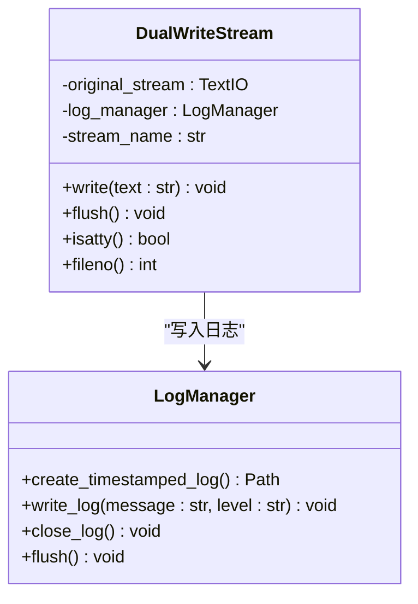
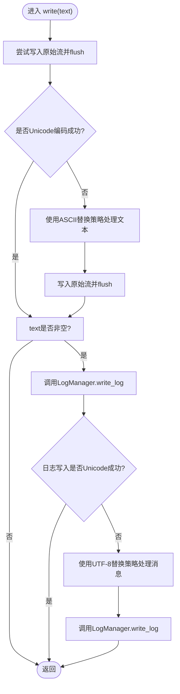
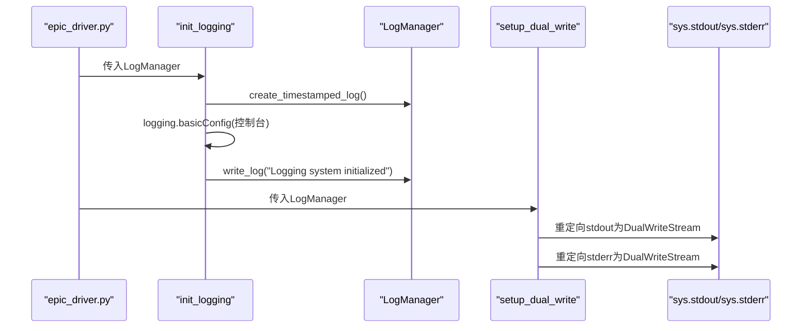
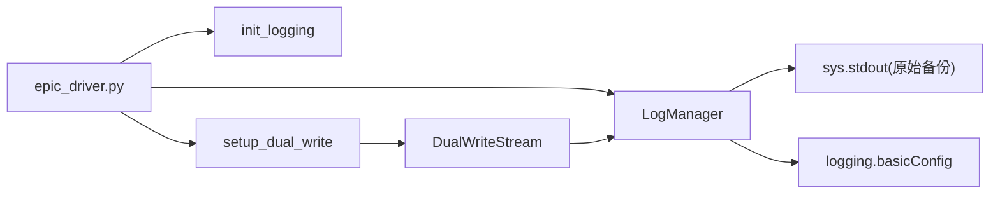

# 双写模式与DualWriteStream实现

<cite>
**本文引用的文件**
- [log_manager.py](file://autoBMAD/epic_automation/log_manager.py)
- [LOGSYSTEM_README.md](file://autoBMAD/epic_automation/LOGSYSTEM_README.md)
- [epic_driver.py](file://autoBMAD/epic_automation/epic_driver.py)
</cite>

## 目录
1. [简介](#简介)
2. [项目结构](#项目结构)
3. [核心组件](#核心组件)
4. [架构总览](#架构总览)
5. [详细组件分析](#详细组件分析)
6. [依赖关系分析](#依赖关系分析)
7. [性能考量](#性能考量)
8. [故障排查指南](#故障排查指南)
9. [结论](#结论)

## 简介
本文件聚焦于日志系统的双写模式（dual-write mode）实现，系统性解析DualWriteStream类如何同时将输出写入控制台与日志文件，并详细说明：
- DualWriteStream.write方法如何处理文本输出，包括对原始流（sys.stdout/sys.stderr）的写入、Unicode编码错误的处理（使用ASCII替换策略），以及如何通过write_log方法将内容同步到日志文件；
- flush、isatty、fileno等方法的代理行为；
- setup_dual_write函数如何重定向sys.stdout和sys.stderr以启用双写功能；
- 结合init_logging说明整体集成流程。

## 项目结构
日志系统位于autoBMAD/epic_automation模块内，关键文件如下：
- log_manager.py：定义LogManager、DualWriteStream，提供日志文件创建、写入、关闭等能力，以及双写模式的启用入口；
- LOGSYSTEM_README.md：日志系统使用说明与技术实现概览；
- epic_driver.py：主驱动程序，负责初始化日志系统并启用双写模式。

图表来源
- [log_manager.py](file://autoBMAD/epic_automation/log_manager.py#L18-L426)
- [LOGSYSTEM_README.md](file://autoBMAD/epic_automation/LOGSYSTEM_README.md#L1-L333)
- [epic_driver.py](file://autoBMAD/epic_automation/epic_driver.py#L600-L620)

章节来源
- [log_manager.py](file://autoBMAD/epic_automation/log_manager.py#L18-L426)
- [LOGSYSTEM_README.md](file://autoBMAD/epic_automation/LOGSYSTEM_README.md#L1-L333)
- [epic_driver.py](file://autoBMAD/epic_automation/epic_driver.py#L600-L620)

## 核心组件
- LogManager：负责日志文件的创建、写入、关闭、列出等；提供write_log、write_sdk_message、write_exception等接口，确保线程安全与实时增量写入。
- DualWriteStream：自定义流，将写入同时转发至原始stdout/stderr与日志文件；在Unicode编码失败时采用ASCII替换策略，保证控制台输出稳定。
- init_logging：初始化日志系统，创建时间戳日志文件并配置logging基本处理器（仅控制台输出，避免重复文件写入）。
- setup_dual_write：重定向sys.stdout与sys.stderr为DualWriteStream实例，启用双写模式。

章节来源
- [log_manager.py](file://autoBMAD/epic_automation/log_manager.py#L18-L426)
- [LOGSYSTEM_README.md](file://autoBMAD/epic_automation/LOGSYSTEM_README.md#L106-L145)

## 架构总览
双写模式的整体工作流如下：
- 应用启动时，epic_driver.py初始化LogManager并调用init_logging创建时间戳日志文件；
- 随后调用setup_dual_write，将sys.stdout与sys.stderr替换为DualWriteStream实例；
- 每当print或其他输出写入sys.stdout/sys.stderr时，DualWriteStream.write会：
  - 尝试直接写入原始流并刷新；
  - 若出现Unicode编码错误，则使用ASCII替换策略进行安全输出；
  - 同时调用LogManager.write_log将内容写入日志文件；
- 控制台仍可正常显示输出，日志文件同步持久化。

图表来源
- [log_manager.py](file://autoBMAD/epic_automation/log_manager.py#L377-L426)
- [epic_driver.py](file://autoBMAD/epic_automation/epic_driver.py#L600-L620)

## 详细组件分析

### DualWriteStream类
DualWriteStream是一个轻量级的流适配器，其职责是：
- 将写入同时转发到原始stdout或stderr；
- 在Unicode编码失败时，采用ASCII替换策略确保控制台输出稳定；
- 将非空文本同步写入日志文件，使用LogManager.write_log进行格式化与落盘。

图表来源
- [log_manager.py](file://autoBMAD/epic_automation/log_manager.py#L300-L358)

章节来源
- [log_manager.py](file://autoBMAD/epic_automation/log_manager.py#L300-L358)

#### write方法的处理逻辑
- 写入原始流：优先尝试直接写入original_stream并立即flush；
- Unicode编码错误处理：若抛出UnicodeEncodeError，则将文本以ASCII替换策略进行编码解码后再写入，并再次flush；
- 写入日志文件：仅对非空文本调用LogManager.write_log，消息前缀包含“[STDOUT]”或“[STDERR]”，并在内部进行UTF-8替换处理以防日志文件写入失败；
- 异常处理：对原始流与日志文件写入分别捕获异常并通过模块内原始stdout输出警告信息，避免中断程序。

图表来源
- [log_manager.py](file://autoBMAD/epic_automation/log_manager.py#L322-L345)

章节来源
- [log_manager.py](file://autoBMAD/epic_automation/log_manager.py#L322-L345)

#### flush/isatty/fileno方法的代理行为
- flush：直接代理到original_stream.flush，确保控制台输出及时可见；
- isatty：返回original_stream.isatty，用于判断是否为TTY；
- fileno：返回original_stream.fileno，供底层I/O操作使用。

章节来源
- [log_manager.py](file://autoBMAD/epic_automation/log_manager.py#L346-L357)

### setup_dual_write函数
- 作用：将sys.stdout与sys.stderr分别替换为DualWriteStream实例，从而启用双写模式；
- 参数：接收LogManager实例，以便在写入日志时使用；
- 注意：该函数会覆盖全局sys.stdout与sys.stderr，需在init_logging之后调用，以确保日志文件已创建且logging基本配置已生效。

章节来源
- [log_manager.py](file://autoBMAD/epic_automation/log_manager.py#L406-L418)
- [epic_driver.py](file://autoBMAD/epic_automation/epic_driver.py#L600-L620)

### init_logging函数与整体集成流程
- init_logging负责：
  - 设置全局_log_manager；
  - 调用LogManager.create_timestamped_log创建时间戳日志文件；
  - 配置logging.basicConfig，使用sys.stdout作为StreamHandler，仅输出到控制台，避免重复文件写入；
  - 记录“Logging system initialized”与“Log file”等关键信息到日志文件。
- epic_driver.py在构造函数中调用init_logging与setup_dual_write，形成完整的双写启用链路。

图表来源
- [log_manager.py](file://autoBMAD/epic_automation/log_manager.py#L377-L404)
- [log_manager.py](file://autoBMAD/epic_automation/log_manager.py#L406-L418)
- [epic_driver.py](file://autoBMAD/epic_automation/epic_driver.py#L600-L620)

章节来源
- [log_manager.py](file://autoBMAD/epic_automation/log_manager.py#L377-L404)
- [log_manager.py](file://autoBMAD/epic_automation/log_manager.py#L406-L418)
- [epic_driver.py](file://autoBMAD/epic_automation/epic_driver.py#L600-L620)

## 依赖关系分析
- epic_driver.py依赖log_manager.py中的LogManager、init_logging、setup_dual_write、cleanup_logging等；
- DualWriteStream依赖LogManager进行日志写入；
- LogManager依赖sys.stdout（模块内原始备份）与logging库进行控制台输出与文件写入；
- LOGSYSTEM_README.md提供使用说明与集成参考。

图表来源
- [log_manager.py](file://autoBMAD/epic_automation/log_manager.py#L360-L426)
- [epic_driver.py](file://autoBMAD/epic_automation/epic_driver.py#L600-L620)

章节来源
- [log_manager.py](file://autoBMAD/epic_automation/log_manager.py#L360-L426)
- [epic_driver.py](file://autoBMAD/epic_automation/epic_driver.py#L600-L620)

## 性能考量
- 双写模式在控制台输出路径上增加一次写入与flush，通常开销较小；
- 日志文件写入采用UTF-8编码并即时flush，确保实时性但可能带来轻微I/O压力；
- Unicode替换策略避免异常中断，提升稳定性，但在极端字符场景下会引入额外编码/解码成本；
- 建议在生产环境中根据日志级别与输出频率评估磁盘与I/O开销。

## 故障排查指南
- Unicode编码错误（控制台）：当控制台编码无法显示某些字符时，系统会自动使用ASCII替换策略进行输出，避免崩溃；如仍出现乱码，检查终端编码设置为UTF-8。
- Unicode编码错误（日志文件）：当日志文件写入遇到UTF-8不可编码字符时，系统会使用UTF-8替换策略处理消息，确保日志文件完整性。
- 权限错误：若创建日志目录或写入日志文件失败，系统会通过模块内原始stdout输出警告信息；请检查目标目录权限。
- 磁盘空间：日志文件随运行增长，建议实施轮转与清理策略。

章节来源
- [log_manager.py](file://autoBMAD/epic_automation/log_manager.py#L322-L345)
- [log_manager.py](file://autoBMAD/epic_automation/log_manager.py#L86-L115)
- [LOGSYSTEM_README.md](file://autoBMAD/epic_automation/LOGSYSTEM_README.md#L275-L306)

## 结论
DualWriteStream通过最小侵入的方式实现了“控制台输出+日志文件”的双写模式：在保证控制台输出稳定与可读的同时，确保所有输出被可靠地持久化到日志文件。配合init_logging与setup_dual_write，系统实现了从创建时间戳日志文件到启用双写模式的完整集成流程。该设计兼顾了易用性、稳定性与可观测性，适合在自动化流程与长期运行场景中使用。