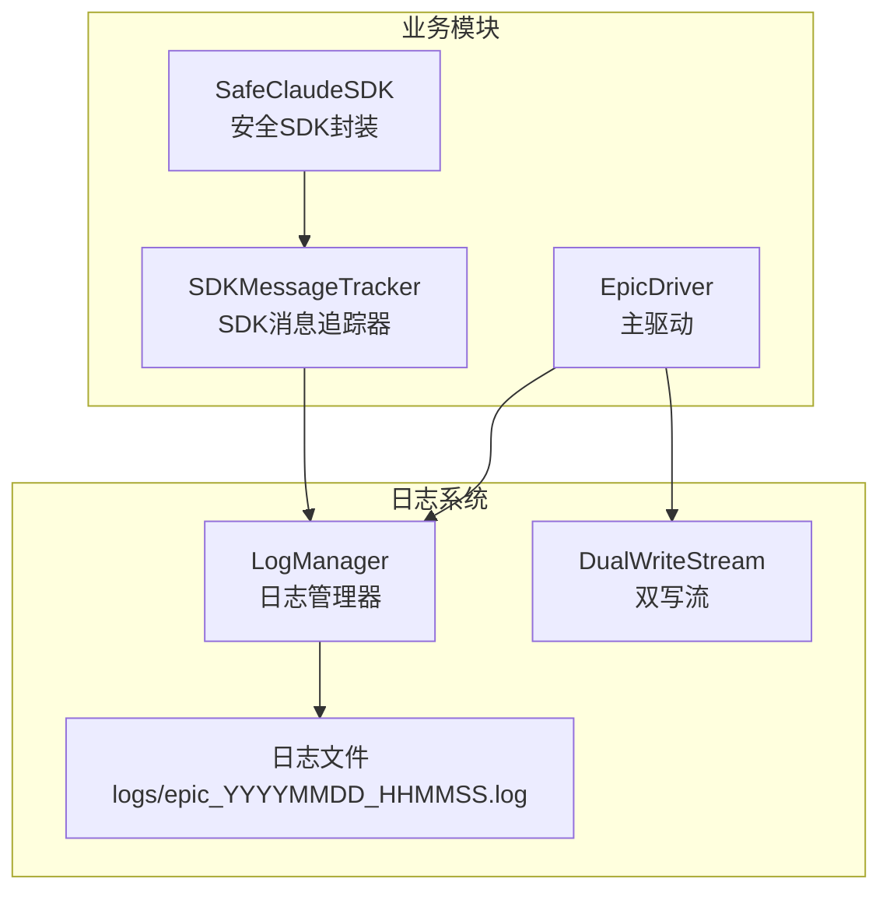
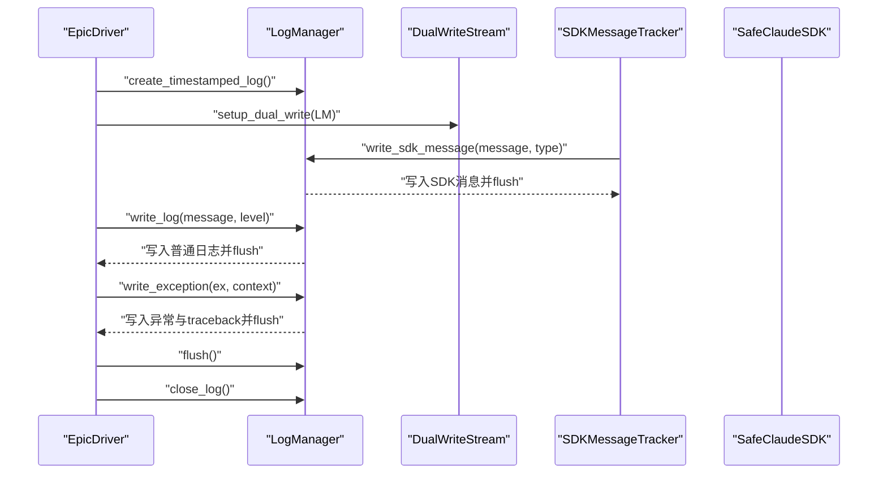
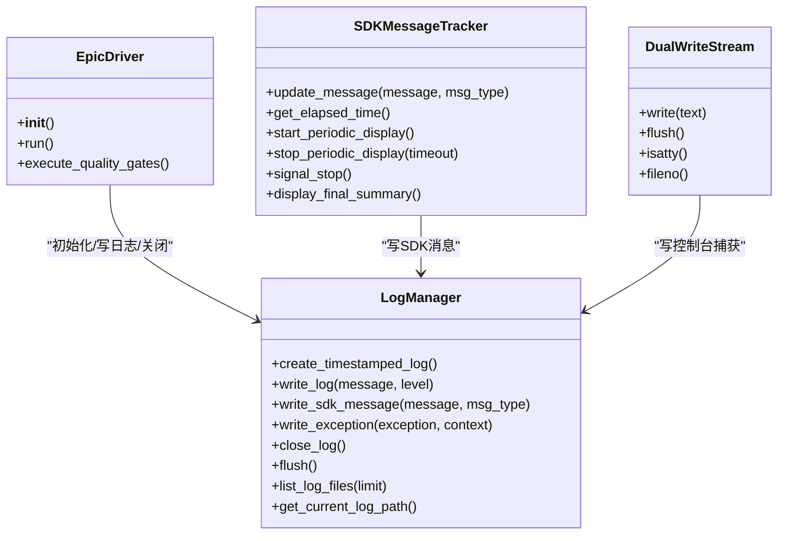

# 日志写入操作与消息类型

<cite>
**本文引用的文件**
- [log_manager.py](file://autoBMAD/epic_automation/log_manager.py)
- [LOGSYSTEM_README.md](file://autoBMAD/epic_automation/LOGSYSTEM_README.md)
- [epic_driver.py](file://autoBMAD/epic_automation/epic_driver.py)
- [sdk_wrapper.py](file://autoBMAD/epic_automation/sdk_wrapper.py)
- [sdk_wrapper_fixed.py](file://BUGFIX_20260107/fixed_modules/sdk_wrapper_fixed.py)
</cite>

## 目录
1. [简介](#简介)
2. [项目结构](#项目结构)
3. [核心组件](#核心组件)
4. [架构总览](#架构总览)
5. [详细组件分析](#详细组件分析)
6. [依赖关系分析](#依赖关系分析)
7. [性能考量](#性能考量)
8. [故障排查指南](#故障排查指南)
9. [结论](#结论)

## 简介
本文件聚焦于日志管理器LogManager的三类关键日志写入操作：write_log、write_sdk_message与write_exception。文档将解释每种方法的格式化规则、时间戳与相对时间的计算方式、SDK消息的特殊格式化策略、异常捕获与回溯生成流程，并给出使用示例与最佳实践，帮助读者快速掌握日志系统的使用与维护。

## 项目结构
日志系统位于autoBMAD/epic_automation模块内，核心文件为log_manager.py；epic_driver.py负责初始化日志系统并进行全局日志记录；sdk_wrapper.py与sdk_wrapper_fixed.py通过SDKMessageTracker向日志系统写入SDK相关消息。

图表来源
- [log_manager.py](file://autoBMAD/epic_automation/log_manager.py#L18-L215)
- [epic_driver.py](file://autoBMAD/epic_automation/epic_driver.py#L611-L615)
- [sdk_wrapper.py](file://autoBMAD/epic_automation/sdk_wrapper.py#L210-L230)

章节来源
- [log_manager.py](file://autoBMAD/epic_automation/log_manager.py#L18-L215)
- [epic_driver.py](file://autoBMAD/epic_automation/epic_driver.py#L611-L615)
- [sdk_wrapper.py](file://autoBMAD/epic_automation/sdk_wrapper.py#L210-L230)

## 核心组件
- 日志管理器LogManager：负责创建带时间戳的日志文件、写入普通日志、SDK消息与异常、关闭日志文件、列出日志文件、刷新缓冲区等。
- 双写流DualWriteStream：将stdout/stderr同时输出到控制台与日志文件，保证实时增量写入与编码兼容。
- SDK消息追踪器SDKMessageTracker：在SDK消息产生时调用LogManager.write_sdk_message进行格式化写入。
- EpicDriver：在程序启动时初始化日志系统，建立双写模式，并在异常时调用LogManager.write_exception。

章节来源
- [log_manager.py](file://autoBMAD/epic_automation/log_manager.py#L18-L215)
- [log_manager.py](file://autoBMAD/epic_automation/log_manager.py#L300-L358)
- [sdk_wrapper.py](file://autoBMAD/epic_automation/sdk_wrapper.py#L210-L230)
- [epic_driver.py](file://autoBMAD/epic_automation/epic_driver.py#L611-L615)

## 架构总览
下图展示了日志写入的关键流程：EpicDriver初始化日志系统并开启双写；SDK消息通过SDKMessageTracker触发LogManager.write_sdk_message；普通日志通过LogManager.write_log；异常通过LogManager.write_exception并附带traceback；最终由EpicDriver在退出时调用flush与close_log。

图表来源
- [epic_driver.py](file://autoBMAD/epic_automation/epic_driver.py#L611-L615)
- [log_manager.py](file://autoBMAD/epic_automation/log_manager.py#L377-L426)
- [sdk_wrapper.py](file://autoBMAD/epic_automation/sdk_wrapper.py#L210-L230)

## 详细组件分析

### write_log：标准日志条目的格式化与写入
- 功能要点
  - 计算相对时间：以当前时间减去启动时间，得到自日志开始以来的秒数，保留一位小数。
  - 格式化字段：包含绝对时间戳、日志级别、相对时间、消息正文。
  - 实时刷新：每次写入后立即flush，确保日志实时落盘。
  - 容错处理：若未创建日志文件或发生异常，记录警告信息但不中断流程。
- 使用场景
  - 普通业务日志、状态变更、进度提示等。
- 示例路径
  - 初始化日志系统时写入“日志系统初始化”与“日志文件路径”等信息。
  - 双写流捕获控制台输出后，统一以write_log写入文件。
- 复杂度与性能
  - 单次写入O(1)，flush带来少量I/O开销，整体对性能影响可忽略。

章节来源
- [log_manager.py](file://autoBMAD/epic_automation/log_manager.py#L89-L116)
- [log_manager.py](file://autoBMAD/epic_automation/log_manager.py#L377-L404)
- [log_manager.py](file://autoBMAD/epic_automation/log_manager.py#L322-L345)

### write_sdk_message：SDK消息的特殊格式化
- 功能要点
  - 特殊前缀：在日志级别位置使用“SDK + 消息类型”的组合，如“SDK THINKING”、“SDK TOOL_USE”等。
  - 消息类型：支持THINKING、TOOL_USE、TOOL_RESULT、USER、SYSTEM等常见类型，便于区分不同阶段的消息。
  - 相对时间：同样基于启动时间计算相对秒数，保留一位小数。
  - 实时刷新：写入后立即flush，保证SDK消息的及时记录。
- 使用场景
  - SDK交互过程中的思考、工具调用、结果返回、用户输入、系统初始化等。
- 示例路径
  - SDKMessageTracker.update_message中调用write_sdk_message，随后打印到控制台供实时显示。
- 复杂度与性能
  - 单次写入O(1)，flush带来少量I/O开销，整体对性能影响可忽略。

章节来源
- [log_manager.py](file://autoBMAD/epic_automation/log_manager.py#L116-L146)
- [sdk_wrapper.py](file://autoBMAD/epic_automation/sdk_wrapper.py#L210-L230)
- [sdk_wrapper_fixed.py](file://BUGFIX_20260107/fixed_modules/sdk_wrapper_fixed.py#L150-L163)

### write_exception：异常捕获、回溯生成与格式化写入
- 功能要点
  - 捕获异常：接收Exception对象与上下文字符串，用于定位异常发生的场景。
  - 回溯生成：使用traceback模块生成完整堆栈信息。
  - 结构化格式：包含分隔线、绝对时间、固定错误级别、相对时间、上下文、异常类型与消息、traceback等。
  - 实时刷新：写入后立即flush，确保异常信息被持久化。
- 使用场景
  - 主流程或质量门禁等环节出现异常时，统一记录异常与堆栈，便于后续分析。
- 示例路径
  - EpicDriver在run()中捕获异常后，调用write_exception并传入上下文描述。
- 复杂度与性能
  - 生成traceback有一定开销，但仅在异常发生时触发，对正常运行无显著影响。

章节来源
- [log_manager.py](file://autoBMAD/epic_automation/log_manager.py#L147-L185)
- [epic_driver.py](file://autoBMAD/epic_automation/epic_driver.py#L1929-L1934)

### 经过时间的计算与实时刷新
- 经过时间计算
  - 启动时间：在create_timestamped_log中记录，作为相对时间的基准。
  - 相对时间：每次写入时计算“当前时间 - 启动时间”，单位为秒，保留一位小数。
- 实时刷新
  - write_log、write_sdk_message、write_exception均在写入后调用flush，确保日志即时落盘。
  - cleanup阶段（finally）中显式调用flush，再关闭文件，避免数据丢失。

章节来源
- [log_manager.py](file://autoBMAD/epic_automation/log_manager.py#L53-L88)
- [log_manager.py](file://autoBMAD/epic_automation/log_manager.py#L89-L116)
- [log_manager.py](file://autoBMAD/epic_automation/log_manager.py#L116-L146)
- [log_manager.py](file://autoBMAD/epic_automation/log_manager.py#L147-L185)
- [epic_driver.py](file://autoBMAD/epic_automation/epic_driver.py#L1944-L1950)

### 双写模式与控制台输出
- 双写模式
  - 将sys.stdout与sys.stderr重定向至DualWriteStream，实现同时输出到控制台与日志文件。
  - 控制台输出保持原样，日志文件中以统一格式记录，便于后续检索。
- 编码兼容
  - 对控制台编码失败的情况进行降级处理，确保日志不中断。
  - 对日志文件写入时的编码问题也进行降级处理，避免异常传播。

章节来源
- [log_manager.py](file://autoBMAD/epic_automation/log_manager.py#L300-L358)
- [log_manager.py](file://autoBMAD/epic_automation/log_manager.py#L406-L418)

## 依赖关系分析
- EpicDriver依赖LogManager创建日志文件、初始化日志系统、设置双写模式，并在异常时写入异常日志。
- SDKMessageTracker依赖LogManager进行SDK消息的格式化写入。
- DualWriteStream依赖LogManager进行文件写入，同时保留原始控制台输出能力。

图表来源
- [log_manager.py](file://autoBMAD/epic_automation/log_manager.py#L18-L215)
- [log_manager.py](file://autoBMAD/epic_automation/log_manager.py#L300-L358)
- [sdk_wrapper.py](file://autoBMAD/epic_automation/sdk_wrapper.py#L210-L296)
- [epic_driver.py](file://autoBMAD/epic_automation/epic_driver.py#L611-L615)

章节来源
- [log_manager.py](file://autoBMAD/epic_automation/log_manager.py#L18-L215)
- [sdk_wrapper.py](file://autoBMAD/epic_automation/sdk_wrapper.py#L210-L296)
- [epic_driver.py](file://autoBMAD/epic_automation/epic_driver.py#L611-L615)

## 性能考量
- I/O开销
  - 每次写入后flush带来少量I/O成本，但在实时性要求较高的场景（如SDK消息、异常）是必要的。
- 日志级别
  - 建议在开发调试时使用DEBUG级别，在生产运行时使用INFO级别，以平衡可观测性与性能。
- 日志轮转
  - 系统按运行次数创建新文件，不自动删除旧文件。建议结合外部策略定期清理，避免磁盘占用过高。

章节来源
- [LOGSYSTEM_README.md](file://autoBMAD/epic_automation/LOGSYSTEM_README.md#L300-L312)

## 故障排查指南
- 编码错误
  - 现象：控制台或日志文件出现编码异常。
  - 解决：确认日志文件以UTF-8编码创建；对控制台输出进行降级处理。
- 权限错误
  - 现象：无法创建或写入日志文件。
  - 解决：检查日志目录权限，确保具备写入权限。
- 磁盘空间
  - 现象：日志文件占用大量磁盘空间。
  - 解决：实施日志轮转与清理策略，保留必要历史日志。
- 异常未记录
  - 现象：异常未出现在日志中。
  - 排查：确认EpicDriver在异常分支调用了write_exception，并检查flush/close是否被正确执行。

章节来源
- [LOGSYSTEM_README.md](file://autoBMAD/epic_automation/LOGSYSTEM_README.md#L276-L300)
- [epic_driver.py](file://autoBMAD/epic_automation/epic_driver.py#L1929-L1950)

## 结论
LogManager提供了统一、结构化且实时的日志写入能力，覆盖普通日志、SDK消息与异常三大场景。通过write_log、write_sdk_message与write_exception，开发者可以轻松获得包含绝对时间、相对时间、消息类型与回溯信息的高质量日志，从而提升可观测性与问题定位效率。配合双写模式与flush策略，系统在保证实时性的前提下兼顾稳定性与易用性。