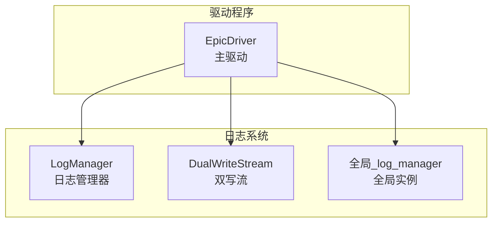
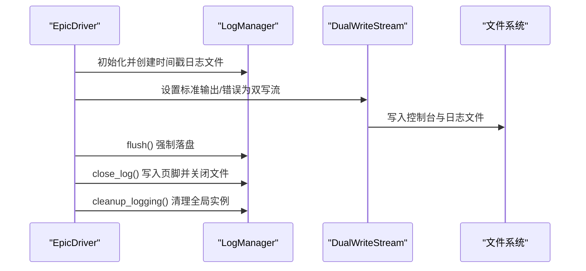
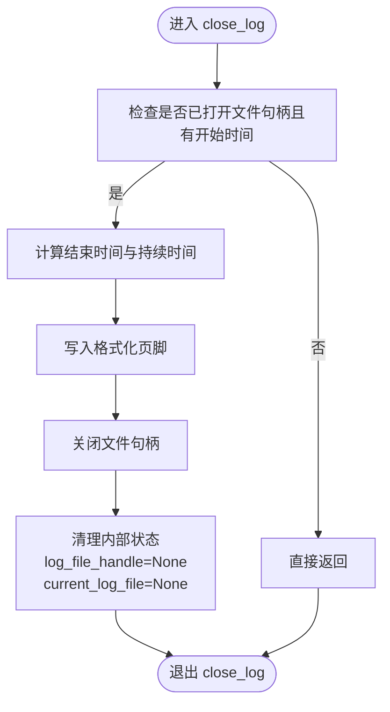
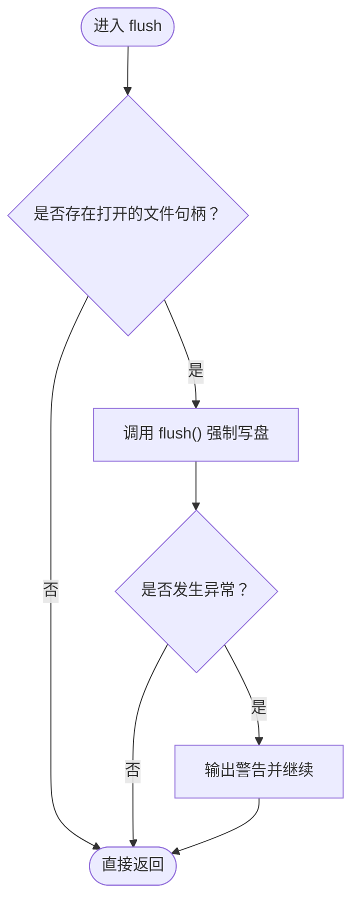
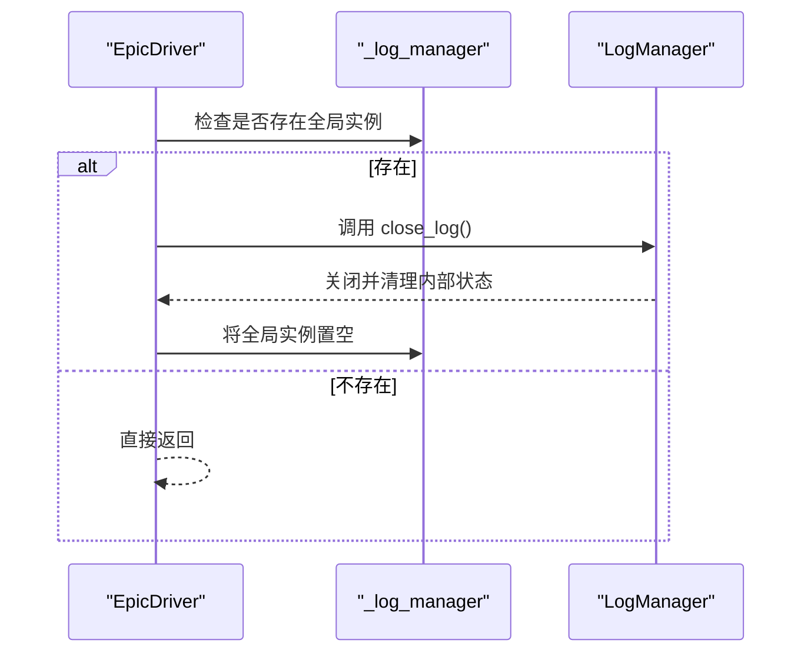
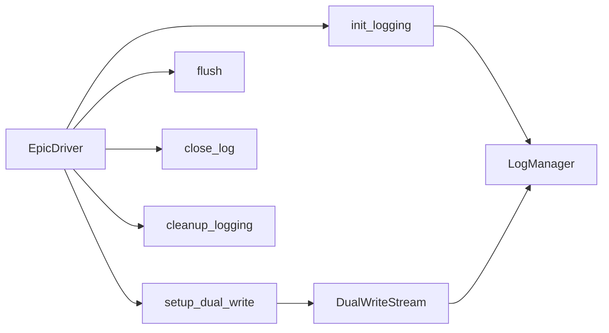

# 日志生命周期与资源管理

<cite>
**本文引用的文件**
- [log_manager.py](file://autoBMAD/epic_automation/log_manager.py)
- [epic_driver.py](file://autoBMAD/epic_automation/epic_driver.py)
- [LOGSYSTEM_README.md](file://autoBMAD/epic_automation/LOGSYSTEM_README.md)
</cite>

## 目录
1. [简介](#简介)
2. [项目结构](#项目结构)
3. [核心组件](#核心组件)
4. [架构总览](#架构总览)
5. [详细组件分析](#详细组件分析)
6. [依赖关系分析](#依赖关系分析)
7. [性能考量](#性能考量)
8. [故障排查指南](#故障排查指南)
9. [结论](#结论)

## 简介
本文件聚焦于日志管理器的生命周期管理功能，重点说明以下方面：
- close_log 方法如何优雅地终止日志会话：写入包含结束时间、持续时间和文件名的格式化页脚，随后关闭文件句柄并清理内部状态。
- flush 方法的作用：强制将缓冲区中的日志数据写入磁盘，确保数据持久性。
- cleanup_logging 全局函数如何调用 close_log 并重置全局_log_manager实例，保证退出路径的一致性。
- get_current_log_path 和 list_log_files 方法如何支持日志文件的查询与管理，为外部系统提供日志访问能力。

## 项目结构
日志系统位于 autoBMAD/epic_automation 子模块中，核心文件为 log_manager.py；epic_driver.py 在运行时初始化并使用日志系统，最终在退出流程中调用清理逻辑。

图表来源
- [log_manager.py](file://autoBMAD/epic_automation/log_manager.py#L1-L426)
- [epic_driver.py](file://autoBMAD/epic_automation/epic_driver.py#L600-L799)

章节来源
- [log_manager.py](file://autoBMAD/epic_automation/log_manager.py#L1-L426)
- [epic_driver.py](file://autoBMAD/epic_automation/epic_driver.py#L600-L799)

## 核心组件
- 日志管理器类：负责日志文件创建、写入、页脚写入、刷新与关闭等生命周期管理。
- 双写流：将标准输出/错误同时写入控制台与日志文件，保证一致性。
- 全局日志管理器：在初始化后持有当前实例，并在退出时被清理。

章节来源
- [log_manager.py](file://autoBMAD/epic_automation/log_manager.py#L1-L426)

## 架构总览
日志系统在 Epic 驱动启动时初始化，随后通过双写流将控制台输出同步到日志文件；在退出时，先刷新缓冲，再优雅关闭并清理全局实例。

图表来源
- [epic_driver.py](file://autoBMAD/epic_automation/epic_driver.py#L600-L799)
- [log_manager.py](file://autoBMAD/epic_automation/log_manager.py#L1-L426)

## 详细组件分析

### close_log：优雅终止日志会话
- 功能要点
  - 仅当存在打开的日志文件句柄且已记录开始时间时才执行。
  - 计算结束时间与会话持续时间，写入格式化的页脚块，包含结束时间、持续时间与文件名。
  - 关闭文件句柄，并将内部状态 current_log_file 与 log_file_handle 置空。
  - 即使出现异常也会尝试清理内部状态，避免悬挂资源。
- 退出路径
  - 成功：写入页脚并关闭文件，输出关闭提示。
  - 失败：捕获异常并输出警告，但最终仍会清理内部状态，确保后续安全。

图表来源
- [log_manager.py](file://autoBMAD/epic_automation/log_manager.py#L186-L215)

章节来源
- [log_manager.py](file://autoBMAD/epic_automation/log_manager.py#L186-L215)

### flush：强制缓冲落盘
- 功能要点
  - 若存在打开的文件句柄，则调用 flush 将缓冲区中的日志立即写入磁盘。
  - 发生异常时输出警告，但不中断流程，保证调用方可控。
- 使用场景
  - 在退出前主动调用，确保所有未落盘的日志被持久化。
  - 在长时间运行过程中定期调用，降低数据丢失风险。

图表来源
- [log_manager.py](file://autoBMAD/epic_automation/log_manager.py#L285-L298)

章节来源
- [log_manager.py](file://autoBMAD/epic_automation/log_manager.py#L285-L298)

### cleanup_logging：全局清理
- 功能要点
  - 若存在全局_log_manager实例，则调用其 close_log() 以优雅关闭当前日志会话。
  - 随后将全局实例置空，避免后续误用。
- 与退出流程的关系
  - EpicDriver 在异常处理分支中统一调用 flush、close_log、清理全局实例，形成一致的退出路径。

图表来源
- [log_manager.py](file://autoBMAD/epic_automation/log_manager.py#L420-L426)
- [epic_driver.py](file://autoBMAD/epic_automation/epic_driver.py#L1940-L1950)

章节来源
- [log_manager.py](file://autoBMAD/epic_automation/log_manager.py#L420-L426)
- [epic_driver.py](file://autoBMAD/epic_automation/epic_driver.py#L1940-L1950)

### get_current_log_path：查询当前日志路径
- 功能要点
  - 返回当前会话对应的日志文件路径；若尚未创建则返回空。
  - 供外部系统或日志展示使用，便于定位当前日志文件。
- 适用场景
  - 在日志初始化完成后，向用户或监控系统展示当前日志文件路径。

章节来源
- [log_manager.py](file://autoBMAD/epic_automation/log_manager.py#L216-L224)

### list_log_files：列出最近日志文件
- 功能要点
  - 列举 logs 目录下匹配 epic_*.log 的文件，并按修改时间倒序排序。
  - 支持限制返回数量，默认返回最近10个文件。
  - 出现异常时输出警告并返回空列表，保证健壮性。
- 适用场景
  - 为外部系统提供日志文件清单，便于日志归档、回溯与分析。

章节来源
- [log_manager.py](file://autoBMAD/epic_automation/log_manager.py#L262-L284)

### 双写流与初始化：一体化日志捕获
- 双写流
  - 将标准输出/错误同时写入控制台与日志文件，保证控制台体验与日志持久化并存。
  - 对编码问题进行容错处理，避免因字符集导致的写入失败。
- 初始化流程
  - EpicDriver 在构造阶段创建 LogManager 实例，调用 init_logging 完成日志文件创建与基础日志配置。
  - 调用 setup_dual_write 将 stdout/stderr 重定向至双写流，实现全量捕获。

章节来源
- [log_manager.py](file://autoBMAD/epic_automation/log_manager.py#L300-L358)
- [epic_driver.py](file://autoBMAD/epic_automation/epic_driver.py#L600-L799)

## 依赖关系分析
- 组件耦合
  - EpicDriver 依赖 LogManager 提供的生命周期管理能力；通过全局实例与双写流实现一体化日志捕获。
  - 双写流依赖 LogManager 的写入接口，确保文本既输出到控制台也写入文件。
- 退出路径
  - 退出前由 EpicDriver 显式调用 flush，再调用 cleanup_logging，确保资源有序释放。

图表来源
- [epic_driver.py](file://autoBMAD/epic_automation/epic_driver.py#L600-L799)
- [log_manager.py](file://autoBMAD/epic_automation/log_manager.py#L367-L426)

章节来源
- [epic_driver.py](file://autoBMAD/epic_automation/epic_driver.py#L600-L799)
- [log_manager.py](file://autoBMAD/epic_automation/log_manager.py#L367-L426)

## 性能考量
- 写入策略
  - 日志采用实时写入并在关键点调用 flush，兼顾及时性与持久性。
- 缓冲与落盘
  - flush 的存在可减少异常退出时的数据丢失风险；在高频写入场景下建议适度调用以平衡性能与可靠性。
- 文件句柄管理
  - close_log 在 finally 中清理内部状态，避免句柄泄漏；异常时也会尽力清理，保证后续安全。

## 故障排查指南
- 无法关闭日志文件
  - 现象：close_log 抛出异常或未完全关闭。
  - 排查：确认是否已创建日志文件且句柄有效；检查文件权限与磁盘空间；查看警告输出。
  - 参考位置：[close_log 异常处理与清理](file://autoBMAD/epic_automation/log_manager.py#L186-L215)
- 日志未落盘
  - 现象：进程崩溃或异常退出后日志缺失。
  - 排查：在退出前显式调用 flush；检查是否有异常吞掉 flush 的错误。
  - 参考位置：[flush 方法](file://autoBMAD/epic_automation/log_manager.py#L285-L298)
- 无法找到日志文件
  - 现象：list_log_files 返回空列表。
  - 排查：确认 logs 目录是否存在；检查文件命名规则是否符合 epic_*.log；查看警告输出。
  - 参考位置：[list_log_files](file://autoBMAD/epic_automation/log_manager.py#L262-L284)
- 控制台与日志不同步
  - 现象：控制台输出正常，但日志文件为空或延迟。
  - 排查：确认是否正确调用 setup_dual_write；检查双写流对编码问题的处理是否生效。
  - 参考位置：[DualWriteStream](file://autoBMAD/epic_automation/log_manager.py#L300-L358)

章节来源
- [log_manager.py](file://autoBMAD/epic_automation/log_manager.py#L186-L215)
- [log_manager.py](file://autoBMAD/epic_automation/log_manager.py#L262-L284)
- [log_manager.py](file://autoBMAD/epic_automation/log_manager.py#L285-L298)
- [log_manager.py](file://autoBMAD/epic_automation/log_manager.py#L300-L358)

## 结论
- close_log 提供了可靠的日志会话终止能力：写入结构化页脚、关闭文件句柄并清理内部状态，确保资源释放与可观测性。
- flush 保障了数据持久性，在退出与关键节点调用可显著降低数据丢失风险。
- cleanup_logging 作为全局清理入口，与退出流程协同工作，形成一致且健壮的生命周期管理。
- get_current_log_path 与 list_log_files 为外部系统提供了便捷的日志查询与管理能力，便于运维与审计。