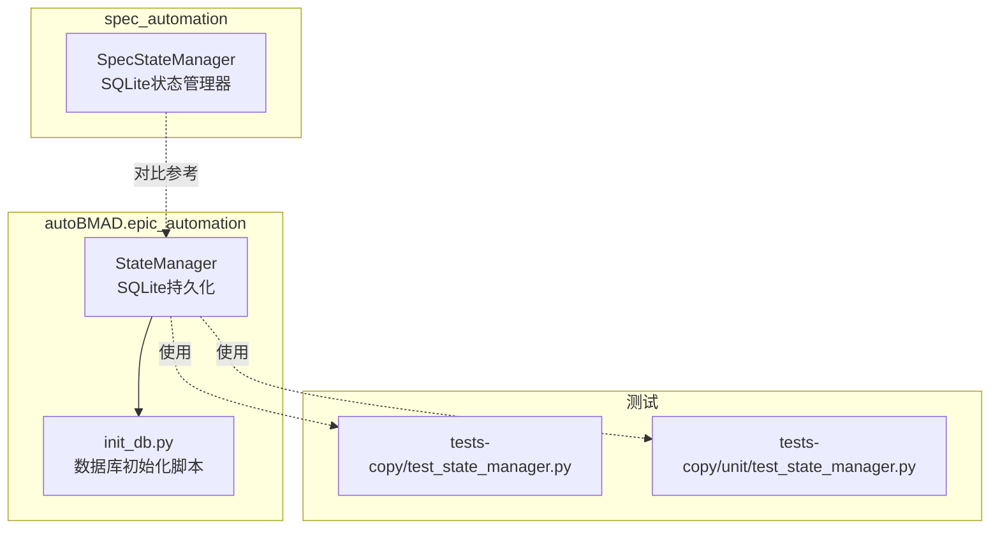
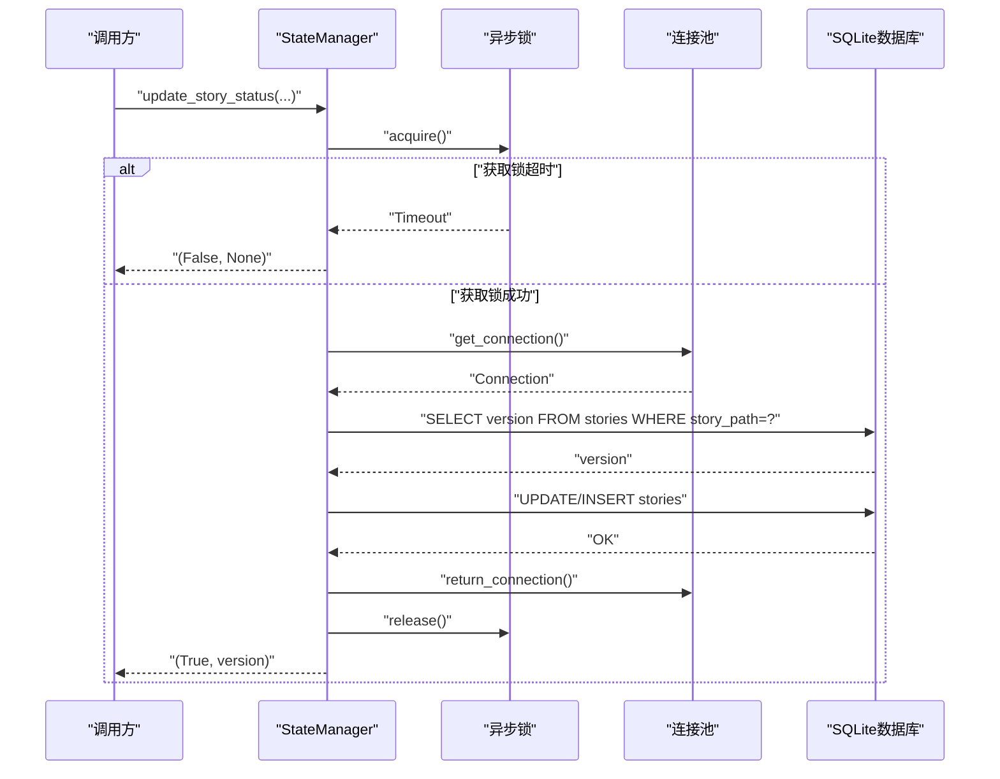
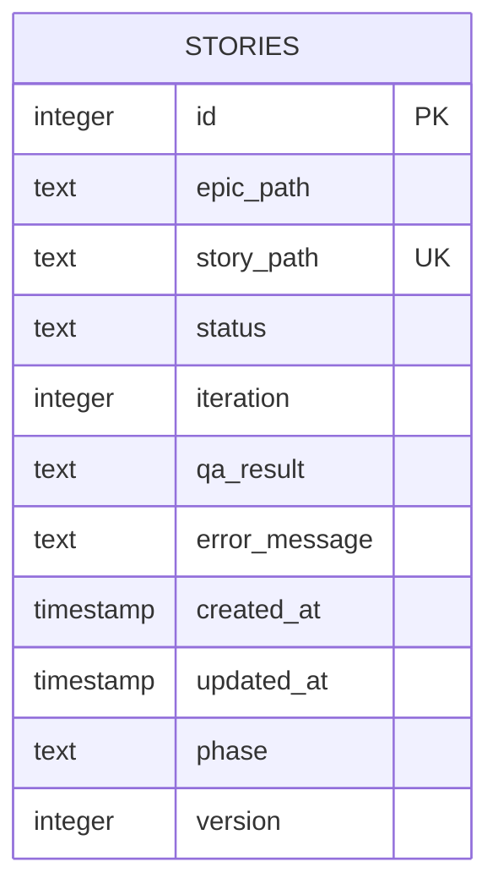
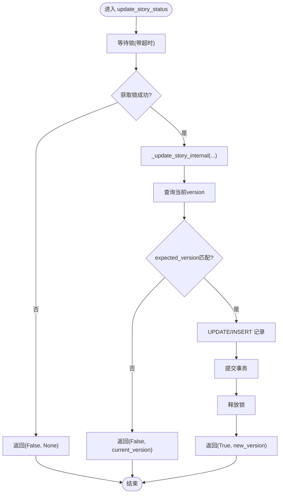
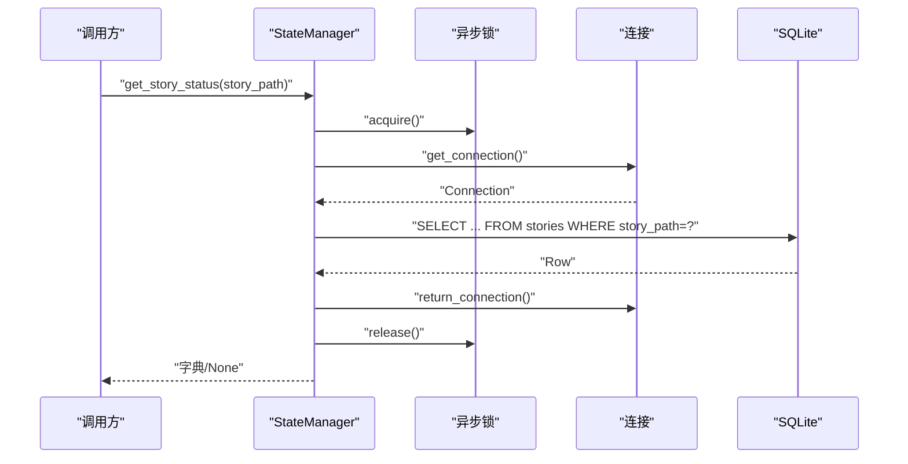
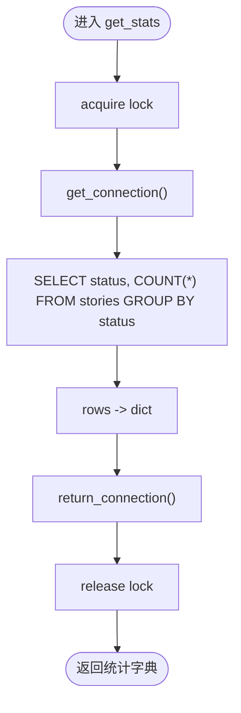
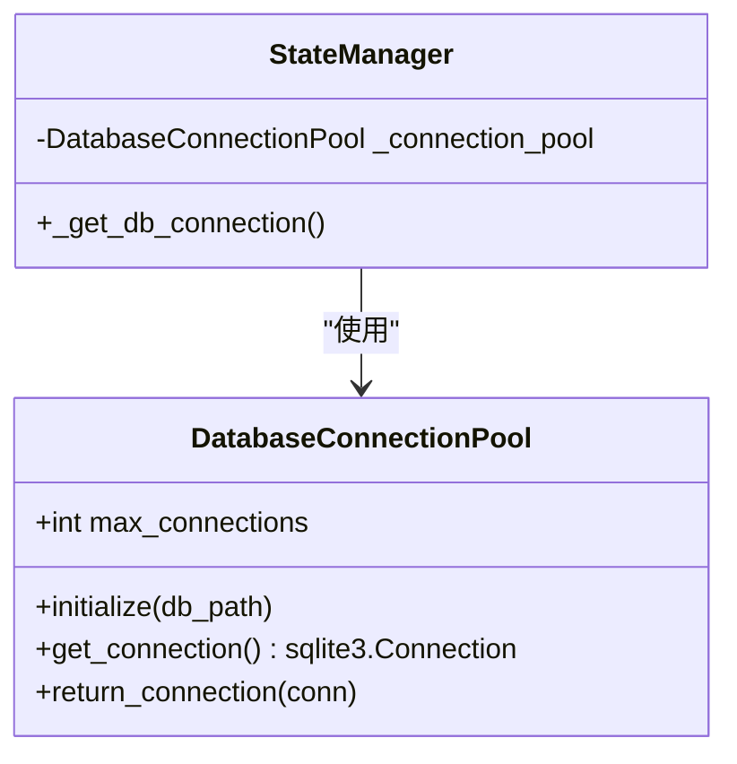
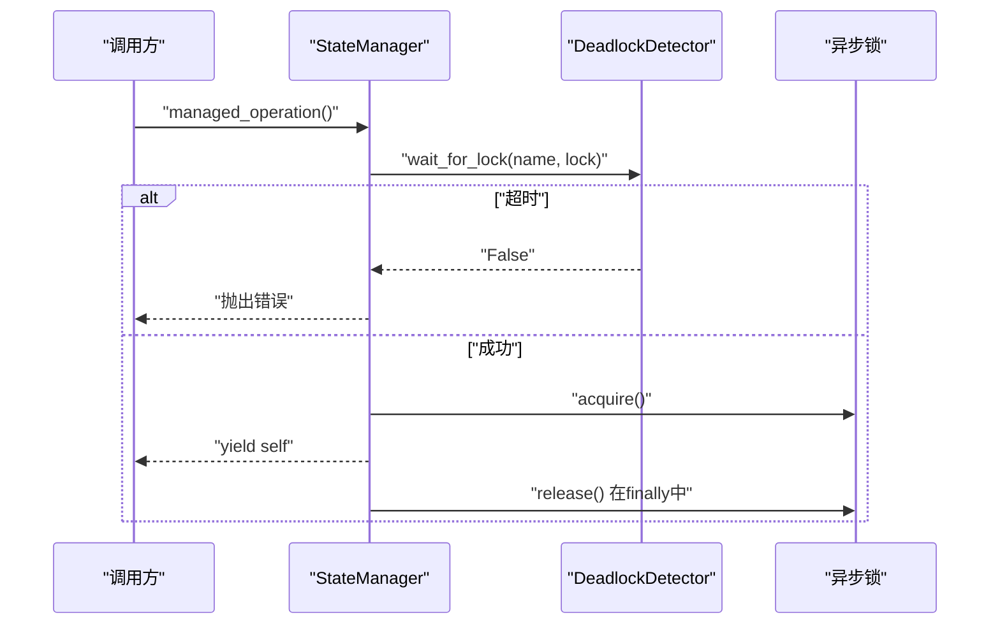
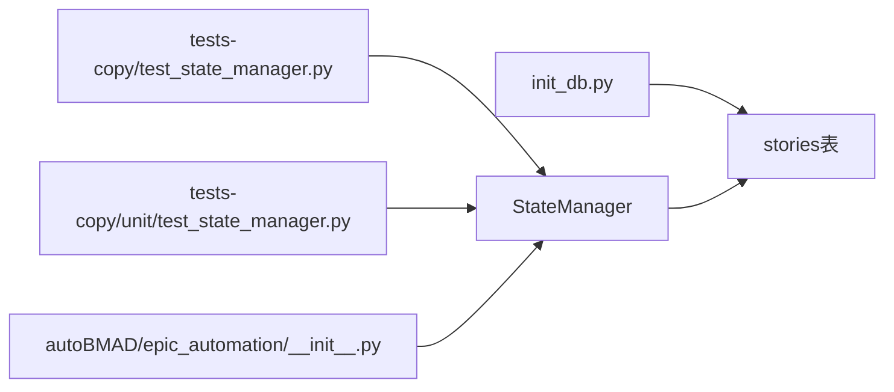

# StateManager持久化管理

<cite>
**本文引用的文件**
- [state_manager.py](file://autoBMAD/epic_automation/state_manager.py)
- [state_manager_fixed.py](file://BUGFIX_20260107/fixed_modules/state_manager_fixed.py)
- [spec_state_manager.py](file://spec_automation/spec_state_manager.py)
- [init_db.py](file://autoBMAD/epic_automation/init_db.py)
- [test_state_manager.py](file://tests-copy/test_state_manager.py)
- [test_state_manager.py](file://tests-copy/unit/test_state_manager.py)
- [__init__.py](file://autoBMAD/epic_automation/__init__.py)
</cite>

## 目录
1. [简介](#简介)
2. [项目结构](#项目结构)
3. [核心组件](#核心组件)
4. [架构总览](#架构总览)
5. [详细组件分析](#详细组件分析)
6. [依赖关系分析](#依赖关系分析)
7. [性能与并发特性](#性能与并发特性)
8. [故障排查指南](#故障排查指南)
9. [结论](#结论)
10. [附录](#附录)

## 简介
本文件聚焦于StateManager的SQLite持久化管理能力，系统性阐述其数据库模式设计、状态更新与查询流程、统计聚合方法、连接池与死锁检测机制，以及乐观锁版本控制策略。文档同时给出基于仓库内测试与实现的可视化图示，帮助读者快速理解StateManager在自动化流水线中的作用与最佳实践。

## 项目结构
StateManager位于autoBMAD模块中，作为故事进度跟踪的核心持久化组件；另有spec_automation模块提供另一套轻量级SQLite状态管理器，用于规范自动化场景下的故事状态与QA/评审结果记录。init_db脚本可独立初始化数据库表结构与索引，便于离线或手动部署。

图表来源
- [state_manager.py](file://autoBMAD/epic_automation/state_manager.py#L1-L120)
- [init_db.py](file://autoBMAD/epic_automation/init_db.py#L1-L120)
- [spec_state_manager.py](file://spec_automation/spec_state_manager.py#L1-L120)
- [test_state_manager.py](file://tests-copy/test_state_manager.py#L1-L120)
- [test_state_manager.py](file://tests-copy/unit/test_state_manager.py#L1-L120)

章节来源
- [state_manager.py](file://autoBMAD/epic_automation/state_manager.py#L1-L120)
- [init_db.py](file://autoBMAD/epic_automation/init_db.py#L1-L120)
- [spec_state_manager.py](file://spec_automation/spec_state_manager.py#L1-L120)
- [test_state_manager.py](file://tests-copy/test_state_manager.py#L1-L120)
- [test_state_manager.py](file://tests-copy/unit/test_state_manager.py#L1-L120)

## 核心组件
- StateManager（主实现）：基于SQLite的异步状态管理器，提供故事状态的增删改查、统计聚合、备份清理、健康检查等能力，并内置连接池与死锁检测。
- SpecStateManager（对比实现）：面向规范自动化的轻量级状态管理器，提供故事状态、QA结果、评审报告的记录与查询。
- init_db：独立数据库初始化脚本，创建stories及相关表与索引，便于离线部署与验证。

章节来源
- [state_manager.py](file://autoBMAD/epic_automation/state_manager.py#L96-L182)
- [spec_state_manager.py](file://spec_automation/spec_state_manager.py#L1-L120)
- [init_db.py](file://autoBMAD/epic_automation/init_db.py#L24-L120)

## 架构总览
StateManager采用“异步+锁+连接池”的组合架构，保证高并发下的数据一致性与性能。核心流程如下：
- 初始化：创建stories表、索引，迁移版本列，按需启用连接池。
- 更新：加锁保护，乐观锁校验，原子更新或插入，返回当前版本号。
- 查询：加锁保护，使用上下文管理器获取连接，支持按路径、状态、全量查询。
- 统计：按状态分组计数，返回字典。
- 连接池：队列式连接池，WAL模式、同步级别、缓存与内存临时表优化。
- 死锁检测：超时等待锁，检测到超时即标记死锁，避免无限阻塞。

图表来源
- [state_manager.py](file://autoBMAD/epic_automation/state_manager.py#L203-L364)
- [state_manager.py](file://autoBMAD/epic_automation/state_manager.py#L183-L202)

章节来源
- [state_manager.py](file://autoBMAD/epic_automation/state_manager.py#L183-L364)

## 详细组件分析

### 数据库模式设计（stories表）
- 表结构要点
  - 主键自增id
  - 唯一约束story_path，确保同一故事仅一条记录
  - 字段：epic_path、story_path、status、iteration、qa_result、error_message、created_at、updated_at、phase、version
  - version用于乐观锁，每次更新递增
- 索引
  - idx_story_path：加速按故事路径查询
  - idx_status：加速按状态过滤
- 迁移
  - 自动检测并添加version列，保证历史数据可用

图表来源
- [state_manager.py](file://autoBMAD/epic_automation/state_manager.py#L142-L179)
- [init_db.py](file://autoBMAD/epic_automation/init_db.py#L33-L60)

章节来源
- [state_manager.py](file://autoBMAD/epic_automation/state_manager.py#L142-L179)
- [init_db.py](file://autoBMAD/epic_automation/init_db.py#L33-L60)

### 状态更新：update_story_status
- 功能概述
  - 支持新增或更新故事状态
  - 参数包含：story_path、status、phase、iteration、qa_result、error、epic_path、lock_timeout、expected_version
  - 返回：(是否成功, 当前版本号)
- 乐观锁
  - 若传入expected_version，先查询当前version，不一致则拒绝更新并返回当前版本
- 锁与超时
  - 使用asyncio.Lock保护数据库操作
  - 外层调用支持lock_timeout，超时返回False
- 连接管理
  - 使用上下文管理器获取/归还连接，确保异常时连接正确回收

图表来源
- [state_manager.py](file://autoBMAD/epic_automation/state_manager.py#L203-L364)

章节来源
- [state_manager.py](file://autoBMAD/epic_automation/state_manager.py#L203-L364)

### 状态查询：get_story_status 与 get_all_stories
- get_story_status
  - 加锁保护
  - 按story_path查询，返回包含epic_path、story_path、status、iteration、qa_result、error_message、created_at、updated_at、phase、version的字典
  - 对qa_result进行JSON反序列化，若失败则保留原始字符串
- get_all_stories
  - 加锁保护
  - 查询全部记录，按created_at排序，返回字典列表，同样对qa_result做反序列化

图表来源
- [state_manager.py](file://autoBMAD/epic_automation/state_manager.py#L405-L512)

章节来源
- [state_manager.py](file://autoBMAD/epic_automation/state_manager.py#L405-L512)

### 统计查询：get_stats
- 功能概述
  - 按status分组统计数量，返回字典
  - 加锁保护，使用上下文管理器获取连接
- 使用场景
  - 仪表盘、报表、进度看板

图表来源
- [state_manager.py](file://autoBMAD/epic_automation/state_manager.py#L514-L542)

章节来源
- [state_manager.py](file://autoBMAD/epic_automation/state_manager.py#L514-L542)

### 连接池与WAL优化
- 连接池
  - 使用asyncio.Queue维护固定大小队列
  - 初始化时设置journal_mode=WAL、synchronous=NORMAL、cache_size、temp_store=memory
  - 提供get_connection/return_connection，超时抛错
- 无锁模式
  - 若未启用连接池，则直接使用sqlite3.connect，适合单线程或简单场景

图表来源
- [state_manager.py](file://autoBMAD/epic_automation/state_manager.py#L59-L104)
- [state_manager.py](file://autoBMAD/epic_automation/state_manager.py#L183-L202)

章节来源
- [state_manager.py](file://autoBMAD/epic_automation/state_manager.py#L59-L104)
- [state_manager.py](file://autoBMAD/epic_automation/state_manager.py#L183-L202)

### 死锁检测与健康状态
- 死锁检测
  - DeadlockDetector记录等待中的任务，超时则标记deadlock_detected
  - managed_operation提供统一的锁获取与释放流程，确保异常时释放锁
- 健康状态
  - get_health_status返回db_path存在性、锁状态、死锁检测状态、连接池启用与大小等

图表来源
- [state_manager.py](file://autoBMAD/epic_automation/state_manager.py#L31-L58)
- [state_manager.py](file://autoBMAD/epic_automation/state_manager.py#L370-L404)

章节来源
- [state_manager.py](file://autoBMAD/epic_automation/state_manager.py#L31-L58)
- [state_manager.py](file://autoBMAD/epic_automation/state_manager.py#L370-L404)

### 对比实现：SpecStateManager
- 表结构
  - story_status：记录故事路径、状态、阶段、时间戳
  - qa_results：记录需求、状态、发现、覆盖率
  - review_reports：记录评审报告JSON与总体状态
- 查询与更新
  - 提供get_story_status、update_story_status、save_qa_result、save_review_report、list_stories、get_all_stories、get_stories_by_status等方法
- 设计差异
  - 更轻量，专注规范自动化场景
  - 未实现乐观锁与连接池，但具备索引与外键约束

章节来源
- [spec_state_manager.py](file://spec_automation/spec_state_manager.py#L1-L342)

## 依赖关系分析
- 模块导出
  - autoBMAD/epic_automation/__init__.py导出StateManager，便于外部包引用
- 测试覆盖
  - tests-copy/test_state_manager.py与tests-copy/unit/test_state_manager.py覆盖初始化、schema、增删改查、统计、并发等场景
- 独立脚本
  - init_db.py可独立运行，创建表与索引，便于离线部署与验证

图表来源
- [init_db.py](file://autoBMAD/epic_automation/init_db.py#L24-L120)
- [test_state_manager.py](file://tests-copy/test_state_manager.py#L43-L120)
- [test_state_manager.py](file://tests-copy/unit/test_state_manager.py#L33-L120)
- [__init__.py](file://autoBMAD/epic_automation/__init__.py#L1-L63)

章节来源
- [__init__.py](file://autoBMAD/epic_automation/__init__.py#L1-L63)
- [test_state_manager.py](file://tests-copy/test_state_manager.py#L43-L120)
- [test_state_manager.py](file://tests-copy/unit/test_state_manager.py#L33-L120)
- [init_db.py](file://autoBMAD/epic_automation/init_db.py#L24-L120)

## 性能与并发特性
- WAL模式与同步级别
  - journal_mode=WAL提升并发读写性能
  - synchronous=NORMAL平衡性能与可靠性
- 缓存与临时表
  - cache_size与temp_store=memory减少磁盘IO
- 连接池
  - 固定队列大小，避免连接泄漏
  - 超时获取连接时抛错，防止阻塞
- 锁与超时
  - 外层update_story_status支持lock_timeout，避免长时间阻塞
  - managed_operation确保异常时释放锁

章节来源
- [state_manager.py](file://autoBMAD/epic_automation/state_manager.py#L59-L104)
- [state_manager.py](file://autoBMAD/epic_automation/state_manager.py#L183-L202)
- [state_manager.py](file://autoBMAD/epic_automation/state_manager.py#L203-L261)

## 故障排查指南
- 常见问题
  - 锁超时：检查lock_timeout参数与系统负载；必要时增大max_connections或优化业务逻辑
  - 死锁检测：当deadlock_detected为True时，检查是否存在长时间持有锁的操作
  - 连接池耗尽：确认连接池大小与使用模式；必要时禁用连接池或调整队列容量
  - 乐观锁冲突：expected_version与当前version不一致，需重试或合并策略
- 健康检查
  - 使用get_health_status获取数据库路径、锁状态、死锁检测状态、连接池启用与大小
- 数据库初始化
  - 使用init_db.py创建表与索引，或通过StateManager初始化自动创建

章节来源
- [state_manager.py](file://autoBMAD/epic_automation/state_manager.py#L605-L626)
- [state_manager.py](file://autoBMAD/epic_automation/state_manager.py#L132-L182)
- [init_db.py](file://autoBMAD/epic_automation/init_db.py#L24-L120)

## 结论
StateManager通过SQLite提供可靠的异步状态持久化能力，结合连接池、WAL优化、死锁检测与乐观锁版本控制，满足高并发与一致性要求。其清晰的API与完善的测试覆盖，使其易于集成到自动化流水线中。对于更轻量的规范自动化场景，SpecStateManager提供了简洁的替代方案。

## 附录

### API与使用示例（代码片段路径）
- 初始化与数据库创建
  - [StateManager.__init__与_init_db_sync](file://autoBMAD/epic_automation/state_manager.py#L105-L182)
  - [init_db.py.create_tables](file://autoBMAD/epic_automation/init_db.py#L24-L120)
- 更新状态
  - [update_story_status](file://autoBMAD/epic_automation/state_manager.py#L203-L261)
  - [内部更新逻辑 _update_story_internal](file://autoBMAD/epic_automation/state_manager.py#L262-L364)
- 查询状态
  - [get_story_status](file://autoBMAD/epic_automation/state_manager.py#L405-L461)
  - [get_all_stories](file://autoBMAD/epic_automation/state_manager.py#L462-L512)
- 统计
  - [get_stats](file://autoBMAD/epic_automation/state_manager.py#L514-L542)
- 连接池与上下文
  - [DatabaseConnectionPool](file://autoBMAD/epic_automation/state_manager.py#L59-L104)
  - [_get_db_connection](file://autoBMAD/epic_automation/state_manager.py#L183-L202)
- 死锁检测与健康状态
  - [DeadlockDetector](file://autoBMAD/epic_automation/state_manager.py#L31-L58)
  - [managed_operation](file://autoBMAD/epic_automation/state_manager.py#L370-L404)
  - [get_health_status](file://autoBMAD/epic_automation/state_manager.py#L605-L626)
- 对比实现
  - [SpecStateManager](file://spec_automation/spec_state_manager.py#L1-L342)