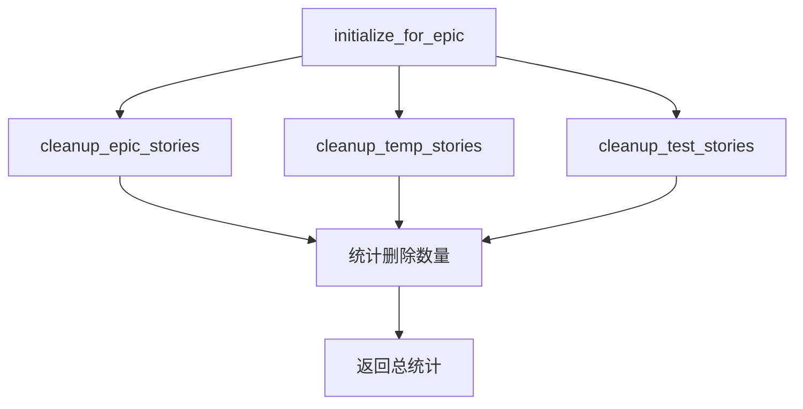

# StateManager持久化管理

<cite>
**本文档引用文件**
- [state_manager.py](file://autoBMAD/epic_automation/state_manager.py)
- [config.py](file://autoBMAD/epic_automation/agents/config.py)
- [test_state_manager.py](file://tests/unit/test_state_manager.py)
</cite>

## 更新摘要
**变更内容**
- 新增了`cleanup_epic_stories`、`cleanup_temp_stories`和`cleanup_test_stories`方法用于清理不同类型的记录
- 新增了`initialize_for_epic`方法用于在Epic运行前进行数据库初始化
- 更新了数据库模式设计，包括stories表的结构和索引
- 增强了连接池管理和死锁检测功能

## 目录
- [StateManager持久化管理](#statemanager持久化管理)
  - [更新摘要](#更新摘要)
  - [目录](#目录)
  - [基于SQLite的状态跟踪机制](#基于sqlite的状态跟踪机制)
    - [数据库模式设计](#数据库模式设计)
    - [连接池管理](#连接池管理)
    - [死锁检测](#死锁检测)
  - [状态管理操作](#状态管理操作)
    - [更新故事状态](#更新故事状态)
    - [查询故事状态](#查询故事状态)
    - [获取统计信息](#获取统计信息)
  - [清理与初始化功能](#清理与初始化功能)
    - [清理Epic相关记录](#清理epic相关记录)
    - [清理临时记录](#清理临时记录)
    - [清理测试记录](#清理测试记录)
    - [Epic运行前初始化](#epic运行前初始化)
  - [代码示例](#代码示例)

## 基于SQLite的状态跟踪机制

### 数据库模式设计
**Section sources**
- [state_manager.py](file://autoBMAD/epic_automation/state_manager.py#L185-L229)

StateManager使用SQLite数据库来持久化存储故事状态。数据库模式设计如下：

- **stories表结构**:
  - `id`: 主键，自增整数
  - `epic_path`: Epic文件路径，非空
  - `story_path`: 故事文件路径，非空且唯一
  - `status`: 当前状态，非空
  - `iteration`: 迭代次数，默认为0
  - `qa_result`: QA结果，JSON格式存储
  - `error_message`: 错误消息
  - `created_at`: 创建时间，默认为当前时间戳
  - `updated_at`: 更新时间，默认为当前时间戳
  - `phase`: 当前阶段
  - `version`: 版本号，默认为1，用于乐观锁

- **索引设计**:
  - `idx_story_path`: 在story_path字段上创建索引，提高按故事路径查询的性能
  - `idx_status`: 在status字段上创建索引，提高按状态查询的性能

数据库在初始化时会检查version列是否存在，如果不存在则自动添加，实现了数据库的版本迁移。

```mermaid
erDiagram
stories {
int id PK
string epic_path
string story_path UK
string status
int iteration
string qa_result
string error_message
datetime created_at
datetime updated_at
string phase
int version
}
index idx_story_path on stories(story_path)
index idx_status on stories(status)
```

**Diagram sources**
- [state_manager.py](file://autoBMAD/epic_automation/state_manager.py#L192-L226)

### 连接池管理
**Section sources**
- [state_manager.py](file://autoBMAD/epic_automation/state_manager.py#L92-L111)

StateManager实现了数据库连接池管理，以提高并发性能和资源利用率。连接池的主要特性包括：

- 最大连接数默认为5个
- 使用异步队列管理连接
- 启用WAL模式提高并发性能
- 设置PRAGMA synchronous=NORMAL平衡性能和安全性
- 设置缓存大小为10000页
- 临时表存储在内存中

连接池在第一次使用时才进行初始化，避免在同步上下文中创建异步任务。

### 死锁检测
**Section sources**
- [state_manager.py](file://autoBMAD/epic_automation/state_manager.py#L64-L90)

StateManager实现了死锁检测机制，防止在高并发场景下出现死锁问题。死锁检测器的主要特性包括：

- 30秒超时设置
- 跟踪等待锁的任务
- 在超时时记录死锁检测日志
- 提供死锁检测状态

死锁检测器与异步锁配合使用，确保即使在异常情况下也能正确释放资源。

## 状态管理操作

### 更新故事状态
**Section sources**
- [state_manager.py](file://autoBMAD/epic_automation/state_manager.py#L271-L329)

`update_story_status`方法用于更新或插入故事状态。该方法具有以下特性：

- 支持乐观锁机制，通过version字段实现
- 使用异步锁保护数据库操作
- 支持超时控制，防止长时间阻塞
- 自动处理取消操作
- 完善的错误处理和日志记录

当更新现有记录时，会检查期望的版本号是否匹配，如果不匹配则返回版本冲突错误。更新成功后，版本号会自动递增。

### 查询故事状态
**Section sources**
- [state_manager.py](file://autoBMAD/epic_automation/state_manager.py#L457-L513)

StateManager提供了多种查询故事状态的方法：

- `get_story_status`: 根据故事路径获取单个故事的状态
- `get_all_stories`: 获取所有故事的状态
- `get_stories_by_status`: 根据状态获取故事列表
- `get_stories_by_ids`: 根据Epic路径和故事ID列表获取故事状态

这些方法都使用异步锁保护，确保在并发环境下的数据一致性。QA结果存储为JSON字符串，在查询时会自动反序列化。

### 获取统计信息
**Section sources**
- [state_manager.py](file://autoBMAD/epic_automation/state_manager.py#L622-L651)

`get_stats`方法用于获取故事状态的统计信息。该方法返回一个字典，包含各种状态的故事数量。统计信息通过SQL的GROUP BY语句实现，性能高效。

## 清理与初始化功能

### 清理Epic相关记录
**Section sources**
- [state_manager.py](file://autoBMAD/epic_automation/state_manager.py#L743-L789)

`cleanup_epic_stories`方法用于清理指定Epic相关的旧故事记录。该方法接受Epic标识和故事ID列表作为参数，使用LIKE操作符匹配相关的记录并删除。

清理逻辑包括：
- 构建参数化查询，防止SQL注入
- 使用Epic路径模式匹配
- 使用故事ID模式匹配
- 返回删除的记录数

### 清理临时记录
**Section sources**
- [state_manager.py](file://autoBMAD/epic_automation/state_manager.py#L790-L821)

`cleanup_temp_stories`方法用于清理临时目录下的故事记录。该方法会删除路径中包含以下模式的记录：
- `%\\Temp\\%`
- `%\\AppData\\Local\\Temp\\%`
- `/tmp/%`
- `%TEMP%`
- `%Temp%`

此功能有助于清理测试过程中产生的临时数据。

### 清理测试记录
**Section sources**
- [state_manager.py](file://autoBMAD/epic_automation/state_manager.py#L823-L855)

`cleanup_test_stories`方法用于清理带有测试标记的故事记录。该方法会删除路径中包含以下模式的记录：
- `%test%`
- `%Test%`
- `%TEST%`
- `test_%`
- `Test_%`

此功能有助于清理测试专用的故事记录。

### Epic运行前初始化
**Section sources**
- [state_manager.py](file://autoBMAD/epic_automation/state_manager.py#L871-L917)

`initialize_for_epic`方法用于在Epic运行前进行数据库初始化。该方法会依次执行以下清理操作：

1. 清理当前Epic相关的故事旧记录
2. 清理临时目录下的记录
3. 清理带有测试标记的记录

该方法返回一个统计字典，包含各项清理操作的删除记录数和总数。初始化过程有助于确保Epic运行环境的干净，避免旧数据的干扰。



**Diagram sources**
- [state_manager.py](file://autoBMAD/epic_automation/state_manager.py#L871-L917)

## 代码示例
**Section sources**
- [state_manager.py](file://autoBMAD/epic_automation/state_manager.py)
- [test_state_manager.py](file://tests/unit/test_state_manager.py)

以下是一些使用StateManager的代码示例：

```python
# 初始化StateManager
state_manager = StateManager("progress.db")

# 在Epic运行前进行初始化
cleanup_stats = await state_manager.initialize_for_epic("epic-1", ["story-1", "story-2"])
print(f"清理统计: {cleanup_stats}")

# 更新故事状态
success, version = await state_manager.update_story_status(
    story_path="docs/stories/story-1.md",
    status="in_progress",
    epic_path="docs/epics/epic-1.md"
)

# 查询故事状态
story_status = await state_manager.get_story_status("docs/stories/story-1.md")
print(f"故事状态: {story_status}")

# 获取统计信息
stats = await state_manager.get_stats()
print(f"统计信息: {stats}")
```

这些示例展示了StateManager的核心功能，包括初始化、状态更新、状态查询和统计信息获取。