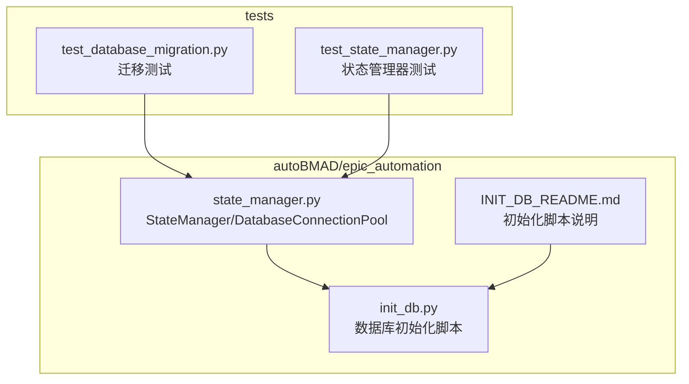
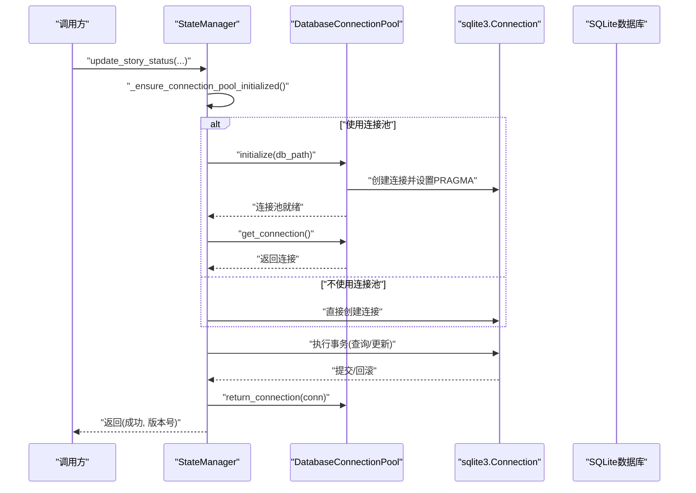
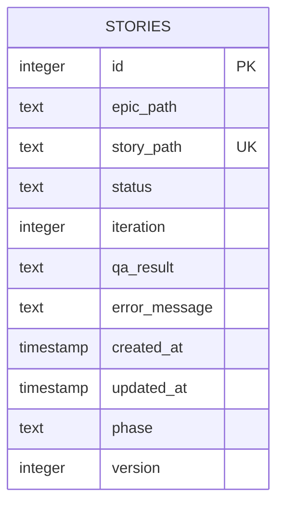
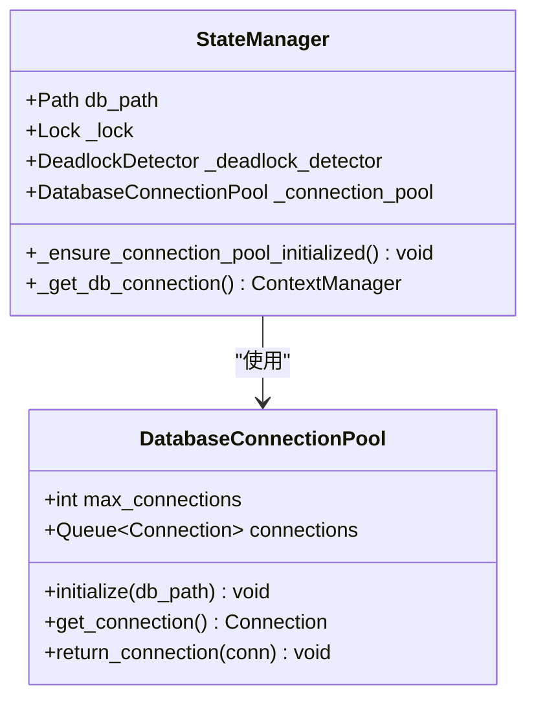
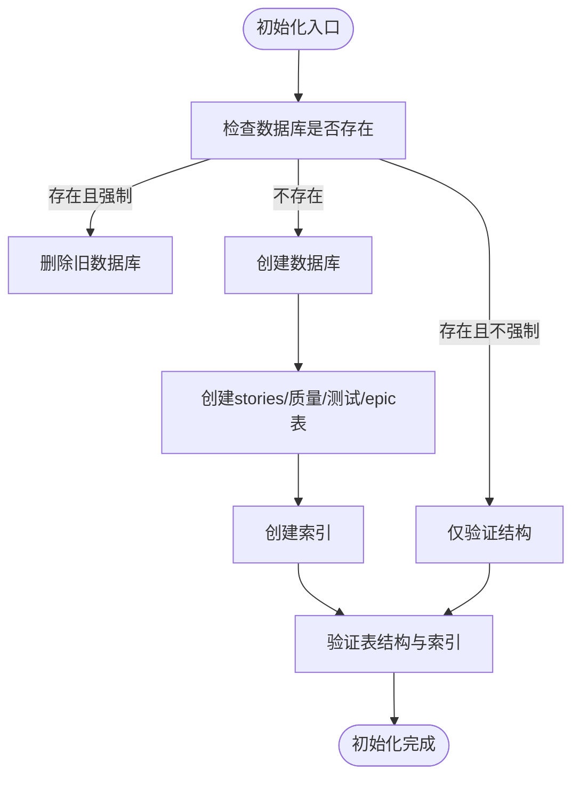
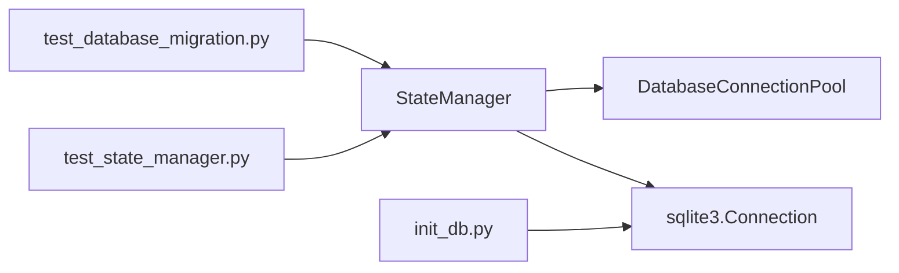

# 数据库管理

<cite>
**本文引用的文件**
- [state_manager.py](file://autoBMAD/epic_automation/state_manager.py)
- [init_db.py](file://autoBMAD/epic_automation/init_db.py)
- [INIT_DB_README.md](file://autoBMAD/epic_automation/INIT_DB_README.md)
- [test_database_migration.py](file://tests-copy/unit/test_database_migration.py)
- [test_state_manager.py](file://tests-copy/test_state_manager.py)
</cite>

## 目录
1. [简介](#简介)
2. [项目结构](#项目结构)
3. [核心组件](#核心组件)
4. [架构总览](#架构总览)
5. [详细组件分析](#详细组件分析)
6. [依赖关系分析](#依赖关系分析)
7. [性能考量](#性能考量)
8. [故障排查指南](#故障排查指南)
9. [结论](#结论)
10. [附录](#附录)

## 简介
本文件聚焦于StateManager数据库管理模块，围绕基于SQLite的数据库模式设计进行深入说明，涵盖以下主题：
- stories表的字段结构、索引设计与版本控制机制
- DatabaseConnectionPool连接池的实现原理与性能优化策略（WAL模式、缓存大小等PRAGMA配置）
- 数据库初始化流程与迁移策略
- 如何通过连接池管理提升并发性能

该文档旨在帮助开发者快速理解数据库层的设计思路，并提供可操作的优化建议与排障指引。

## 项目结构
与数据库管理相关的核心文件位于autoBMAD/epic_automation目录下，配合独立的数据库初始化脚本与单元测试验证。

图表来源
- [state_manager.py](file://autoBMAD/epic_automation/state_manager.py#L59-L120)
- [init_db.py](file://autoBMAD/epic_automation/init_db.py#L1-L120)
- [INIT_DB_README.md](file://autoBMAD/epic_automation/INIT_DB_README.md#L1-L134)
- [test_database_migration.py](file://tests-copy/unit/test_database_migration.py#L1-L120)
- [test_state_manager.py](file://tests-copy/test_state_manager.py#L43-L104)

章节来源
- [state_manager.py](file://autoBMAD/epic_automation/state_manager.py#L59-L120)
- [init_db.py](file://autoBMAD/epic_automation/init_db.py#L1-L120)
- [INIT_DB_README.md](file://autoBMAD/epic_automation/INIT_DB_README.md#L1-L134)

## 核心组件
- StateManager：负责故事状态的增删改查、统计、备份、清理等；内部集成数据库连接池与死锁检测。
- DatabaseConnectionPool：异步连接池，预置多个SQLite连接，统一执行PRAGMA优化配置。
- 初始化脚本init_db.py：独立创建数据库与表结构，包含索引与外键约束的校验能力。
- 迁移测试与状态管理器测试：覆盖schema变更、索引创建、回滚、兼容性等场景。

章节来源
- [state_manager.py](file://autoBMAD/epic_automation/state_manager.py#L59-L120)
- [init_db.py](file://autoBMAD/epic_automation/init_db.py#L1-L120)
- [test_database_migration.py](file://tests-copy/unit/test_database_migration.py#L1-L120)
- [test_state_manager.py](file://tests-copy/test_state_manager.py#L43-L104)

## 架构总览
StateManager通过异步上下文管理器获取数据库连接，优先使用连接池；连接池在首次使用时延迟初始化，每个连接均应用WAL、缓存大小、临时存储等PRAGMA优化。stories表作为核心实体承载故事生命周期状态与元数据，同时提供版本列用于乐观锁控制。

图表来源
- [state_manager.py](file://autoBMAD/epic_automation/state_manager.py#L183-L202)
- [state_manager.py](file://autoBMAD/epic_automation/state_manager.py#L59-L95)
- [state_manager.py](file://autoBMAD/epic_automation/state_manager.py#L203-L339)

## 详细组件分析

### stories表设计与版本控制
- 字段结构
  - 主键与自增：id
  - 关联与唯一性：story_path唯一
  - 状态与迭代：status、iteration
  - 结果与错误：qa_result、error_message
  - 时间戳：created_at、updated_at
  - 阶段与版本：phase、version（默认1）
  - 父级关联：epic_path（用于业务语义关联）
- 索引设计
  - idx_story_path：加速按故事路径查询
  - idx_status：加速按状态过滤
- 版本控制机制
  - 通过version列实现乐观锁：更新时比较期望版本与当前版本，冲突则拒绝并返回当前版本
  - 初始版本默认1，每次成功更新后递增

图表来源
- [state_manager.py](file://autoBMAD/epic_automation/state_manager.py#L142-L157)
- [state_manager.py](file://autoBMAD/epic_automation/state_manager.py#L160-L169)
- [state_manager.py](file://autoBMAD/epic_automation/state_manager.py#L294-L319)

章节来源
- [state_manager.py](file://autoBMAD/epic_automation/state_manager.py#L142-L169)
- [state_manager.py](file://autoBMAD/epic_automation/state_manager.py#L294-L319)

### DatabaseConnectionPool连接池实现与PRAGMA优化
- 连接池实现要点
  - 使用异步队列维护固定容量的连接
  - 首次使用时初始化，避免在同步上下文中创建任务
  - 提供获取/归还连接的异步接口，并对超时与满队列进行处理
- PRAGMA优化配置
  - journal_mode=WAL：启用WAL模式，显著提升并发读写性能
  - synchronous=NORMAL：平衡性能与可靠性
  - cache_size=10000：增大页缓存，减少磁盘IO
  - temp_store=memory：临时表存储在内存，降低磁盘压力

图表来源
- [state_manager.py](file://autoBMAD/epic_automation/state_manager.py#L59-L95)
- [state_manager.py](file://autoBMAD/epic_automation/state_manager.py#L183-L202)

章节来源
- [state_manager.py](file://autoBMAD/epic_automation/state_manager.py#L59-L95)
- [state_manager.py](file://autoBMAD/epic_automation/state_manager.py#L183-L202)

### 数据库初始化与迁移策略
- 初始化脚本init_db.py
  - 独立创建数据库与所需表（包含stories、code_quality_phase、test_automation_phase、epic_processing）
  - 自动创建索引（如idx_story_path、idx_status、idx_quality_epic、idx_test_epic）
  - 支持强制重建、结构验证、详细输出等选项
- 迁移测试覆盖
  - 验证迁移脚本创建新表与索引的幂等性
  - 验证备份与回滚流程
  - 验证外键约束与向前兼容性
- StateManager内建迁移
  - 在初始化时检测并添加version列，保证乐观锁可用

图表来源
- [init_db.py](file://autoBMAD/epic_automation/init_db.py#L197-L278)
- [init_db.py](file://autoBMAD/epic_automation/init_db.py#L122-L195)
- [state_manager.py](file://autoBMAD/epic_automation/state_manager.py#L170-L177)
- [test_database_migration.py](file://tests-copy/unit/test_database_migration.py#L113-L200)

章节来源
- [init_db.py](file://autoBMAD/epic_automation/init_db.py#L1-L120)
- [init_db.py](file://autoBMAD/epic_automation/init_db.py#L122-L195)
- [state_manager.py](file://autoBMAD/epic_automation/state_manager.py#L170-L177)
- [test_database_migration.py](file://tests-copy/unit/test_database_migration.py#L113-L200)

### 并发性能与连接池管理
- 并发模型
  - 使用异步锁保护数据库操作，避免竞态
  - 使用连接池复用连接，减少连接建立开销
  - 通过WAL模式与PRAGMA参数优化并发读写吞吐
- 性能优化建议
  - 根据工作负载调整max_connections
  - 评估cache_size与temp_store对内存占用的影响
  - 对高频查询使用idx_story_path与idx_status索引
  - 控制事务粒度，避免长时间持有锁

章节来源
- [state_manager.py](file://autoBMAD/epic_automation/state_manager.py#L59-L95)
- [state_manager.py](file://autoBMAD/epic_automation/state_manager.py#L183-L202)

## 依赖关系分析
- StateManager依赖DatabaseConnectionPool（可选）与sqlite3连接
- 初始化脚本init_db.py独立于运行时模块，提供数据库结构校验与重建能力
- 测试模块覆盖数据库初始化、迁移、备份/回滚与兼容性

图表来源
- [state_manager.py](file://autoBMAD/epic_automation/state_manager.py#L59-L120)
- [init_db.py](file://autoBMAD/epic_automation/init_db.py#L1-L120)
- [test_database_migration.py](file://tests-copy/unit/test_database_migration.py#L1-L120)
- [test_state_manager.py](file://tests-copy/test_state_manager.py#L43-L104)

章节来源
- [state_manager.py](file://autoBMAD/epic_automation/state_manager.py#L59-L120)
- [init_db.py](file://autoBMAD/epic_automation/init_db.py#L1-L120)
- [test_database_migration.py](file://tests-copy/unit/test_database_migration.py#L1-L120)
- [test_state_manager.py](file://tests-copy/test_state_manager.py#L43-L104)

## 性能考量
- WAL模式与PRAGMA配置
  - journal_mode=WAL：提升并发读写能力，适合多线程/异步场景
  - synchronous=NORMAL：在可靠性与性能间取得平衡
  - cache_size=10000：增大缓存，减少磁盘IO
  - temp_store=memory：临时表驻留内存，降低磁盘压力
- 索引策略
  - idx_story_path：按故事路径查询
  - idx_status：按状态过滤
- 事务与锁
  - 使用异步锁保护数据库操作，避免竞态
  - 乐观锁通过version列实现，减少写冲突带来的阻塞

章节来源
- [state_manager.py](file://autoBMAD/epic_automation/state_manager.py#L59-L95)
- [state_manager.py](file://autoBMAD/epic_automation/state_manager.py#L160-L169)

## 故障排查指南
- 数据库初始化失败
  - 使用init_db.py的--verify选项检查现有数据库结构
  - 使用--force强制重建数据库
- 连接池耗尽
  - 检查max_connections是否过小
  - 确认连接是否正确归还
  - 观察超时错误，必要时增加超时阈值
- 迁移与备份
  - 运行迁移测试验证备份/回滚流程
  - 确认外键约束与索引创建
- 版本冲突
  - 更新时传入expected_version，若返回False且返回当前版本，需重试或合并

章节来源
- [init_db.py](file://autoBMAD/epic_automation/init_db.py#L197-L278)
- [test_database_migration.py](file://tests-copy/unit/test_database_migration.py#L423-L484)
- [state_manager.py](file://autoBMAD/epic_automation/state_manager.py#L294-L319)

## 结论
StateManager的数据库层以SQLite为核心，结合连接池与PRAGMA优化，实现了高并发下的稳定与高效。stories表采用合理的字段与索引设计，并通过version列提供乐观锁保障。初始化脚本与测试用例共同确保了数据库结构的完整性与可维护性。建议在生产环境中根据实际负载调优连接池大小与PRAGMA参数，并持续监控数据库健康状态。

## 附录
- 初始化脚本使用说明与示例参见INIT_DB_README.md
- 数据库模式与索引的详细说明参见INIT_DB_README.md

章节来源
- [INIT_DB_README.md](file://autoBMAD/epic_automation/INIT_DB_README.md#L1-L134)