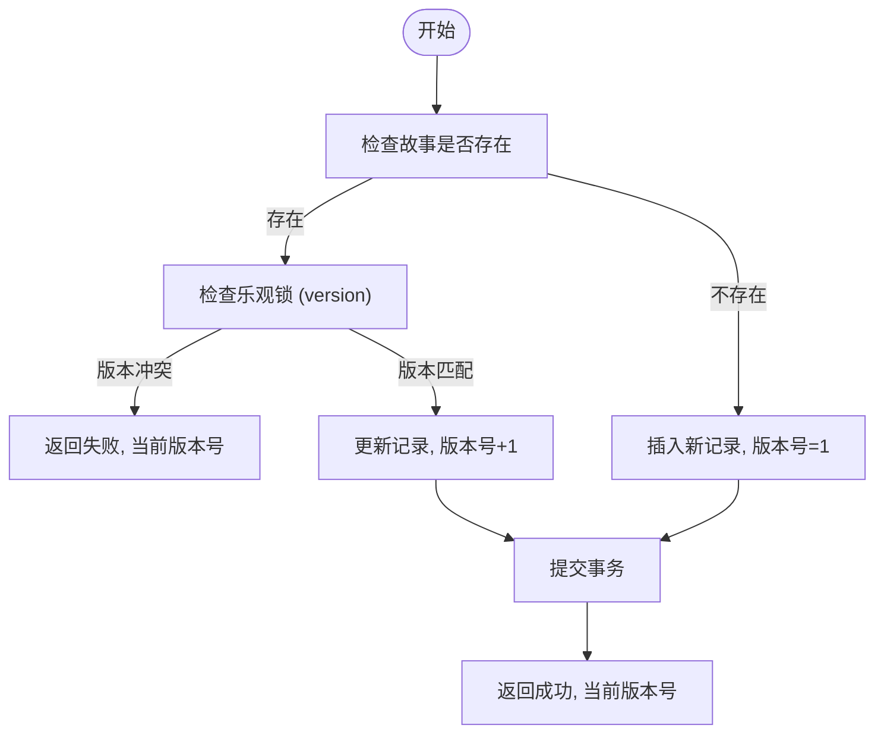
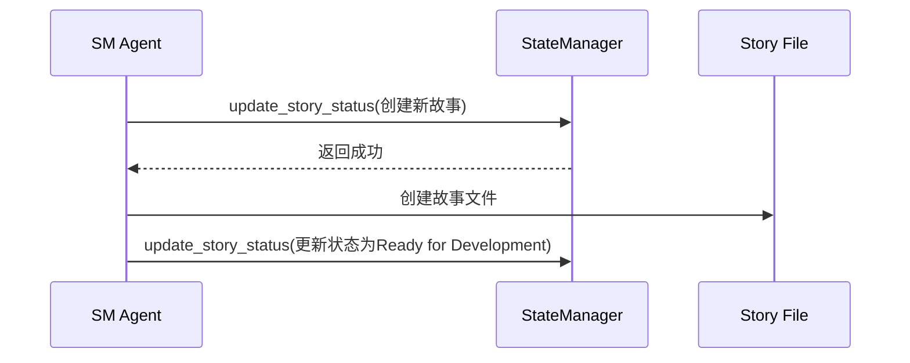
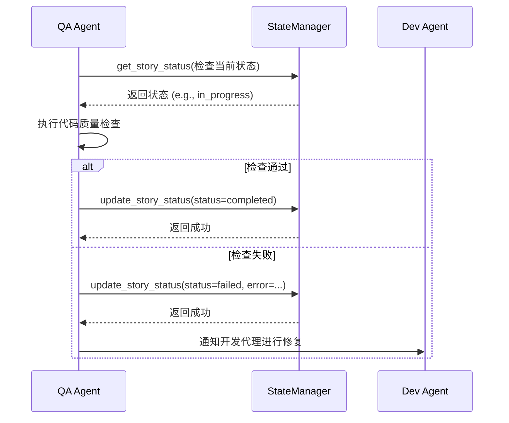

# 状态操作管理

<cite>
**本文档引用的文件**   
- [state_manager.py](file://autoBMAD/epic_automation/state_manager.py)
- [state_manager_fixed.py](file://BUGFIX_20260107/fixed_modules/state_manager_fixed.py)
- [spec_state_manager.py](file://spec_automation/spec_state_manager.py)
- [test_state_manager.py](file://tests-copy/test_state_manager.py)
- [test_spec_state_manager.py](file://spec_automation/tests/test_spec_state_manager.py)
- [sm_agent.py](file://autoBMAD/epic_automation/sm_agent.py)
- [qa_agent.py](file://autoBMAD/epic_automation/qa_agent.py)
</cite>

## 目录
1. [引言](#引言)
2. [核心状态操作方法](#核心状态操作方法)
3. [乐观锁与数据一致性](#乐观锁与数据一致性)
4. [版本控制与错误处理](#版本控制与错误处理)
5. [代码示例与操作流程](#代码示例与操作流程)
6. [在SM-Dev-QA工作流中的应用](#在sm-dev-qa工作流中的应用)
7. [结论](#结论)

## 引言
本文档详细描述了`StateManager`类中用于管理故事（Story）状态的核心方法，包括`update_story_status`、`get_story_status`和`get_all_stories`。这些方法构成了SM-Dev-QA自动化工作流的基础，用于跟踪开发任务的进度。文档将深入探讨这些方法如何通过乐观锁机制确保在并发环境下的数据一致性，以及它们在实际工作流中的具体应用场景。

**Section sources**
- [state_manager.py](file://autoBMAD/epic_automation/state_manager.py#L203-L231)
- [spec_state_manager.py](file://spec_automation/spec_state_manager.py#L102-L127)

## 核心状态操作方法

`StateManager`类提供了三个核心方法来管理故事的状态。

### update_story_status
此方法是状态管理的核心，用于创建新故事或更新现有故事的状态。它是一个异步方法，接收故事路径、状态、阶段、迭代次数、QA结果、错误信息、史诗路径、锁超时和期望版本号等参数。

该方法首先通过`_update_story_internal`方法进行内部逻辑处理。在内部，它会检查故事是否已存在于数据库中。如果存在，则进行乐观锁检查；如果不存在，则插入一条新记录。该方法返回一个元组，包含操作是否成功和当前的版本号。



**Diagram sources**
- [state_manager.py](file://autoBMAD/epic_automation/state_manager.py#L262-L344)

**Section sources**
- [state_manager.py](file://autoBMAD/epic_automation/state_manager.py#L203-L231)

### get_story_status
此方法用于根据故事文件路径查询单个故事的详细状态。它返回一个包含所有状态信息的字典，如果故事不存在则返回`None`。

该方法会从数据库中查询指定路径的故事记录，并将结果转换为一个包含`epic_path`、`story_path`、`status`、`iteration`、`created_at`、`updated_at`、`phase`和`version`等字段的字典。如果数据库中存储了`qa_result`或`error_message`，它们也会被包含在返回结果中。

**Section sources**
- [state_manager.py](file://autoBMAD/epic_automation/state_manager.py#L405-L455)

### get_all_stories
此方法用于获取数据库中所有故事的状态记录。它返回一个包含所有故事状态字典的列表。

该方法执行一个SQL查询，从`stories`表中获取所有记录，并按创建时间排序。与`get_story_status`类似，它会将每条记录转换为一个字典，并处理`qa_result`和`error_message`等JSON字段的反序列化。

**Section sources**
- [state_manager.py](file://autoBMAD/epic_automation/state_manager.py#L462-L507)

## 乐观锁与数据一致性

为了在高并发环境下确保数据一致性，`StateManager`实现了乐观锁机制。

### 乐观锁机制
乐观锁的核心在于`version`字段。当调用`update_story_status`方法时，可以传入一个`expected_version`参数。在`_update_story_internal`方法中，会先查询数据库中该故事的当前版本号。

```python
# 伪代码：乐观锁检查
cursor.execute("SELECT id, version FROM stories WHERE story_path = ?", (story_path,))
existing = cursor.fetchone()
_, current_version = existing

if expected_version is not None and current_version != expected_version:
    # 版本冲突，操作失败
    return False, current_version
```

如果传入的`expected_version`与数据库中的`current_version`不匹配，则说明在读取和更新之间，该记录已被其他进程修改。此时，`update_story_status`会返回`False`，并附带当前的版本号，提示调用者需要重新读取最新状态并重试。

### 并发更新处理
该机制有效地防止了“丢失更新”问题。例如，两个代理（Agent）同时读取了一个故事的状态（版本1），然后都尝试更新它。第一个代理的更新会成功，将版本号提升到2。当第二个代理尝试更新时，由于它期望的版本号是1，而数据库中的版本号已是2，因此更新会失败。这迫使第二个代理重新获取最新的状态（版本2），然后在其基础上进行更新。

**Section sources**
- [state_manager.py](file://autoBMAD/epic_automation/state_manager.py#L294-L303)

## 版本控制与错误处理

### 版本控制
每个故事记录都有一个`version`字段，其初始值为1。每当记录被成功更新时，该字段的值都会自动递增1。这个版本号是实现乐观锁的基础，也是客户端判断数据是否发生变化的关键依据。

### 错误处理策略
`StateManager`采用了全面的错误处理策略：

1.  **异常捕获**: 所有核心方法都使用`try-except`块来捕获潜在的异常，如数据库连接错误、SQL执行错误等。
2.  **日志记录**: 所有错误和警告都会被记录到日志中，便于调试和监控。
3.  **安全返回**: 在发生错误时，方法会返回一个安全的值（如`False`或`None`），而不是抛出异常，这使得调用者可以优雅地处理失败情况。
4.  **锁管理**: 使用`asyncio.Lock`和`DeadlockDetector`来防止死锁，并确保即使在操作被取消的情况下，锁也能被正确释放。
5.  **事务保证**: 数据库操作在`async with self._get_db_connection()`上下文中进行，确保了操作的原子性。

**Section sources**
- [state_manager.py](file://autoBMAD/epic_automation/state_manager.py#L232-L260)
- [state_manager.py](file://autoBMAD/epic_automation/state_manager.py#L457-L460)

## 代码示例与操作流程

以下是一个使用`StateManager`进行状态查询和更新的典型操作流程。

### 状态查询
```python
# 获取单个故事的状态
status = await state_manager.get_story_status("docs/stories/001.md")
if status:
    print(f"状态: {status['status']}")
    print(f"阶段: {status['phase']}")
    print(f"版本: {status['version']}")

# 获取所有故事的状态
all_stories = await state_manager.get_all_stories()
for story in all_stories:
    print(f"{story['story_path']}: {story['status']}")
```

### 状态更新（带乐观锁）
```python
# 1. 首先获取当前状态
current_status = await state_manager.get_story_status(story_path)
if not current_status:
    # 处理故事不存在的情况
    pass

# 2. 基于当前状态进行业务逻辑处理
# ...

# 3. 尝试更新状态，传入期望的版本号
success, current_version = await state_manager.update_story_status(
    story_path=story_path,
    status="in_progress",
    phase="dev",
    iteration=current_status['iteration'] + 1,
    expected_version=current_status['version'] # 乐观锁
)

if not success:
    # 更新失败，可能是因为版本冲突
    print(f"更新失败，当前版本已变为 {current_version}，需要重试")
    # 重新获取最新状态并重试
else:
    print("状态更新成功")
```

**Section sources**
- [docs-copy/api/README.md](file://docs-copy/api/README.md#L487-L505)
- [test_state_manager.py](file://tests-copy/test_state_manager.py#L50-L69)

## 在SM-Dev-QA工作流中的应用

`StateManager`是SM-Dev-QA工作流的中枢神经系统，被多个代理（Agent）协同使用。

### SM Agent (故事管理)
`SMAgent`负责创建和管理故事文档。当它创建一个新的故事时，会调用`update_story_status`方法来在数据库中创建一条初始记录，状态通常为`pending`或`in_progress`。



### Dev Agent (开发)
`DevAgent`在开发过程中会定期更新故事状态。例如，当它开始实现一个功能时，会将状态更新为`in_progress`；当它完成开发并运行测试时，会更新`iteration`和`qa_result`字段。

### QA Agent (质量保证)
`QAAgent`是状态更新的关键驱动者。在完成代码审查和质量检查后，它会调用`update_story_status`方法，根据检查结果将故事状态更新为`completed`（通过）、`failed`（失败）或`review`（需审查）。



通过这种方式，`StateManager`将分散的开发和审查活动串联起来，形成了一个闭环的自动化工作流。

**Diagram sources**
- [sm_agent.py](file://autoBMAD/epic_automation/sm_agent.py#L621-L719)
- [qa_agent.py](file://autoBMAD/epic_automation/qa_agent.py#L330-L358)

**Section sources**
- [sm_agent.py](file://autoBMAD/epic_automation/sm_agent.py#L621-L719)
- [qa_agent.py](file://autoBMAD/epic_automation/qa_agent.py#L330-L358)

## 结论
`StateManager`通过`update_story_status`、`get_story_status`和`get_all_stories`等核心方法，提供了一个强大且可靠的状态管理解决方案。其内置的乐观锁机制和完善的错误处理策略，确保了在并发环境下的数据一致性和系统稳定性。作为SM-Dev-QA工作流的基石，它有效地协调了不同代理之间的协作，实现了开发流程的自动化和可视化。