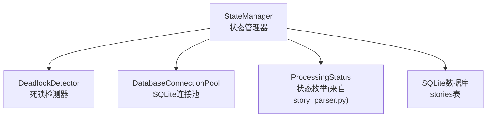
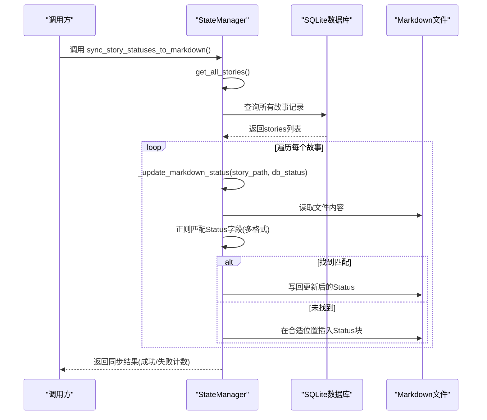
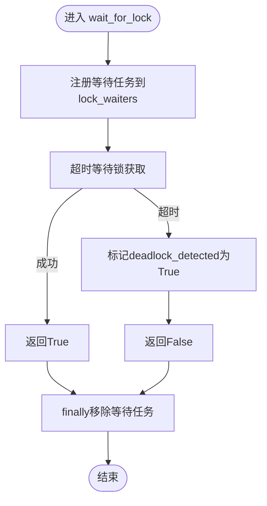
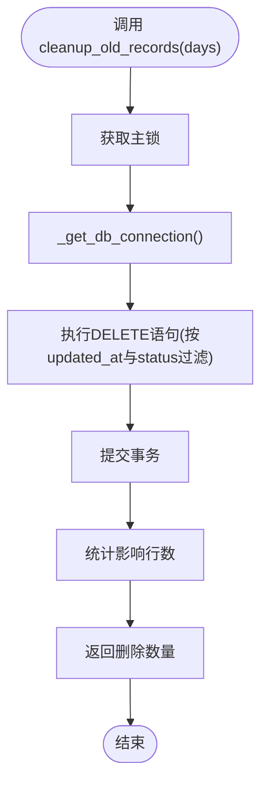
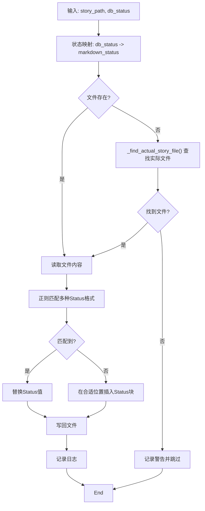
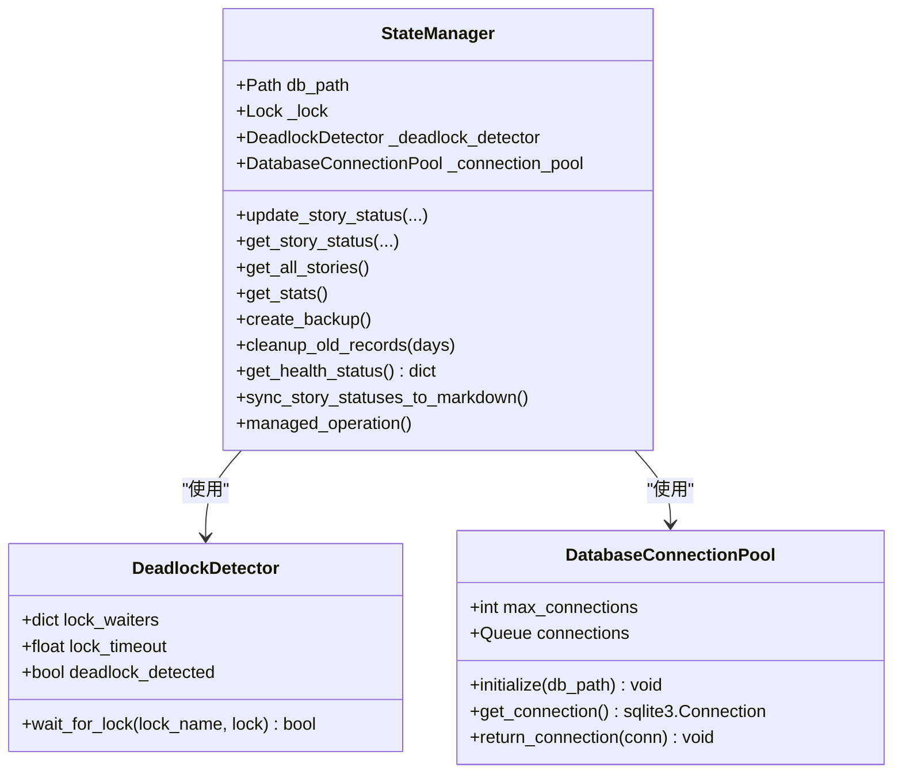

# 辅助功能

<cite>
**本文引用的文件**
- [state_manager.py](file://autoBMAD/epic_automation/state_manager.py)
- [story_parser.py](file://autoBMAD/epic_automation/story_parser.py)
- [test_resource_cleanup.py](file://BUGFIX_20260107/tests/test_resource_cleanup.py)
- [state_manager_fixed.py](file://BUGFIX_20260107/fixed_modules/state_manager_fixed.py)
</cite>

## 目录
1. [简介](#简介)
2. [项目结构](#项目结构)
3. [核心组件](#核心组件)
4. [架构总览](#架构总览)
5. [详细组件分析](#详细组件分析)
6. [依赖关系分析](#依赖关系分析)
7. [性能考量](#性能考量)
8. [故障排查指南](#故障排查指南)
9. [结论](#结论)

## 简介
本文件围绕StateManager辅助功能展开，聚焦以下能力：
- 死锁检测：通过DeadlockDetector监控锁等待，避免死锁并提供健康指标
- 健康检查：get_health_status提供数据库与运行时状态的关键指标
- 数据维护：create_backup创建数据库备份；cleanup_old_records清理旧记录
- 状态同步：sync_story_statuses_to_markdown将数据库状态同步至Markdown文件，支持多格式Status字段识别与更新

## 项目结构
StateManager位于autoBMAD/epic_automation目录下，采用“类+工具类”的组织方式：
- StateManager：核心状态管理器，负责数据库访问、锁管理、健康检查、数据维护与状态同步
- DeadlockDetector：轻量级死锁检测器，记录等待任务并在超时后标记死锁
- DatabaseConnectionPool：SQLite连接池，延迟初始化，支持WAL模式与参数调优
- 依赖：状态枚举ProcessingStatus来自story_parser.py

图表来源
- [state_manager.py](file://autoBMAD/epic_automation/state_manager.py#L31-L118)
- [story_parser.py](file://autoBMAD/epic_automation/story_parser.py#L80-L111)

章节来源
- [state_manager.py](file://autoBMAD/epic_automation/state_manager.py#L31-L118)
- [story_parser.py](file://autoBMAD/epic_automation/story_parser.py#L80-L111)

## 核心组件
- DeadlockDetector
  - 记录等待中的任务，设置锁获取超时，超时即标记死锁
  - 提供deadlock_detected布尔标志，供外部查询
- DatabaseConnectionPool
  - 最大连接数限制，延迟初始化，WAL模式与参数优化
  - 超时获取连接，连接池耗尽时抛出明确错误
- StateManager
  - 数据库初始化、连接获取、乐观锁更新、统计查询、备份、清理、健康检查、状态同步
  - 提供managed_operation上下文管理器，保障取消场景下的锁释放
  - 提供sync_story_statuses_to_markdown，将数据库状态映射并写回Markdown

章节来源
- [state_manager.py](file://autoBMAD/epic_automation/state_manager.py#L31-L118)
- [state_manager.py](file://autoBMAD/epic_automation/state_manager.py#L183-L201)
- [state_manager.py](file://autoBMAD/epic_automation/state_manager.py#L202-L348)
- [state_manager.py](file://autoBMAD/epic_automation/state_manager.py#L370-L404)
- [state_manager.py](file://autoBMAD/epic_automation/state_manager.py#L405-L512)
- [state_manager.py](file://autoBMAD/epic_automation/state_manager.py#L513-L542)
- [state_manager.py](file://autoBMAD/epic_automation/state_manager.py#L543-L603)
- [state_manager.py](file://autoBMAD/epic_automation/state_manager.py#L604-L625)
- [state_manager.py](file://autoBMAD/epic_automation/state_manager.py#L626-L866)

## 架构总览
StateManager通过asyncio.Lock保证数据库操作串行化，结合DeadlockDetector与连接池提升稳定性与性能。状态同步流程从数据库读取，映射到Markdown状态，再写回文件。

图表来源
- [state_manager.py](file://autoBMAD/epic_automation/state_manager.py#L626-L866)

章节来源
- [state_manager.py](file://autoBMAD/epic_automation/state_manager.py#L626-L866)

## 详细组件分析

### 死锁检测与锁管理
- DeadlockDetector
  - 维护lock_waiters字典，键为锁名称，值为等待该锁的任务
  - wait_for_lock使用超时等待acquire，超时则记录死锁并返回False
  - deadlock_detected用于外部查询死锁状态
- StateManager中的锁使用
  - update_story_status内部通过managed_operation或直接在_update_story_internal中使用async with self._lock
  - managed_operation在取消时确保释放锁，避免资源泄漏
- 测试验证
  - 资源清理测试覆盖了锁死锁检测、状态管理器恢复、压力场景下的资源清理等

图表来源
- [state_manager.py](file://autoBMAD/epic_automation/state_manager.py#L31-L58)

章节来源
- [state_manager.py](file://autoBMAD/epic_automation/state_manager.py#L31-L58)
- [state_manager.py](file://autoBMAD/epic_automation/state_manager.py#L370-L404)
- [test_resource_cleanup.py](file://BUGFIX_20260107/tests/test_resource_cleanup.py#L247-L274)

### 健康检查
- get_health_status返回关键指标：
  - db_path、db_exists：数据库路径与存在性
  - lock_locked：主锁是否被占用
  - deadlock_detected：是否检测到死锁
  - connection_pool_enabled/connection_pool_size：连接池启用状态与最大连接数
- 该方法在异常时返回包含错误信息的字典，便于上层监控告警

章节来源
- [state_manager.py](file://autoBMAD/epic_automation/state_manager.py#L604-L625)

### 数据备份与旧记录清理
- create_backup
  - 基于当前时间戳生成备份文件名，使用shutil.copy2进行文件级复制
  - 返回备份文件路径或None
- cleanup_old_records
  - 删除updated_at早于阈值且status为completed或failed的记录
  - 返回删除条数，异常时返回0

图表来源
- [state_manager.py](file://autoBMAD/epic_automation/state_manager.py#L543-L603)

章节来源
- [state_manager.py](file://autoBMAD/epic_automation/state_manager.py#L543-L603)

### 数据库状态与Markdown文件双向同步
- sync_story_statuses_to_markdown
  - 读取所有故事记录，逐条调用_update_markdown_status
  - 返回成功/失败计数与错误列表
- _update_markdown_status
  - 状态映射：数据库状态到Markdown状态（单向映射）
  - 文件定位：若路径不存在，尝试根据数据库路径推断实际文件
  - 正则匹配：支持多种Status字段格式，优先替换已有值
  - 默认插入：若未找到Status字段，则在合适位置插入Status块
  - 写回：更新后写回文件

图表来源
- [state_manager.py](file://autoBMAD/epic_automation/state_manager.py#L626-L866)

章节来源
- [state_manager.py](file://autoBMAD/epic_automation/state_manager.py#L626-L866)
- [state_manager.py](file://autoBMAD/epic_automation/state_manager.py#L796-L866)

### 乐观锁与连接池
- 乐观锁
  - _update_story_internal在更新前读取version，若传入expected_version不一致则拒绝更新并返回当前version
- 连接池
  - DatabaseConnectionPool延迟初始化，首次使用时建立max_connections个连接
  - WAL模式与参数优化提升并发与可靠性
  - 超时获取连接，池满时归还连接或关闭多余连接

章节来源
- [state_manager.py](file://autoBMAD/epic_automation/state_manager.py#L261-L348)
- [state_manager.py](file://autoBMAD/epic_automation/state_manager.py#L59-L95)
- [state_manager.py](file://autoBMAD/epic_automation/state_manager.py#L125-L131)
- [state_manager.py](file://autoBMAD/epic_automation/state_manager.py#L183-L201)

## 依赖关系分析
- StateManager依赖
  - DeadlockDetector：用于锁等待监控与死锁检测
  - DatabaseConnectionPool：用于数据库连接复用与并发控制
  - ProcessingStatus：状态枚举，用于统一状态值
- 状态映射
  - 数据库状态到Markdown状态的映射在_update_markdown_status中定义，遵循单向映射原则

图表来源
- [state_manager.py](file://autoBMAD/epic_automation/state_manager.py#L31-L118)
- [state_manager.py](file://autoBMAD/epic_automation/state_manager.py#L183-L201)

章节来源
- [state_manager.py](file://autoBMAD/epic_automation/state_manager.py#L31-L118)
- [state_manager.py](file://autoBMAD/epic_automation/state_manager.py#L183-L201)

## 性能考量
- 连接池与WAL
  - 连接池延迟初始化，避免阻塞同步上下文
  - WAL模式与参数调优提升并发读写性能
- 锁粒度
  - 主锁保护数据库操作，减少竞争冲突
  - managed_operation在取消时释放锁，避免长时间占用
- I/O与正则
  - Markdown状态更新采用正则匹配与最小范围替换，降低I/O成本
  - 若未找到Status字段，仅在必要时插入，避免无谓写入

[本节为通用建议，不直接分析具体文件]

## 故障排查指南
- 死锁与锁超时
  - 若get_health_status显示lock_locked为True且持续不变，可能存在长时间持有锁的操作
  - DeadlockDetector.deadlock_detected为True时，需检查锁等待链路与超时配置
- 连接池耗尽
  - DatabaseConnectionPool在获取连接超时时抛出明确错误，检查max_connections与并发负载
- 状态同步失败
  - 检查Markdown文件是否存在或路径是否正确，必要时使用_find_actual_story_file进行自动定位
  - 确认正则匹配模式是否覆盖目标文档格式
- 备份与清理
  - 备份失败通常为权限或磁盘空间问题；清理失败多为SQL语法或约束冲突，检查status与updated_at条件

章节来源
- [state_manager.py](file://autoBMAD/epic_automation/state_manager.py#L604-L625)
- [state_manager.py](file://autoBMAD/epic_automation/state_manager.py#L543-L603)
- [state_manager.py](file://autoBMAD/epic_automation/state_manager.py#L626-L866)
- [test_resource_cleanup.py](file://BUGFIX_20260107/tests/test_resource_cleanup.py#L247-L274)

## 结论
StateManager通过死锁检测、健康检查、连接池与乐观锁等机制，提供了稳健的状态管理能力。数据维护方面，备份与旧记录清理保障了数据库健康；状态同步功能实现了数据库与Markdown文档的可靠联动。建议在高并发场景下合理配置连接池与锁超时，并持续监控健康指标以预防潜在问题。