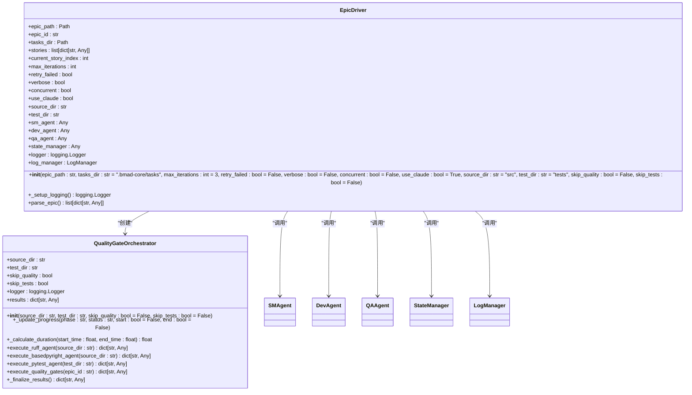
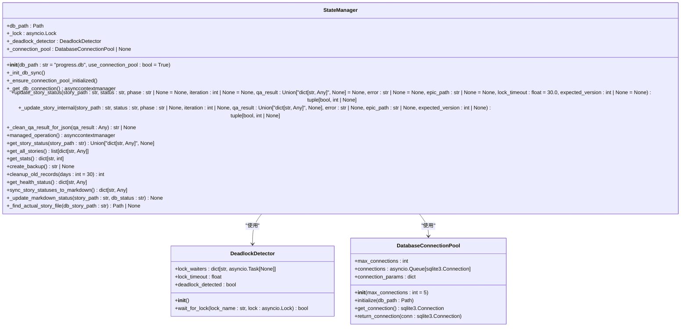
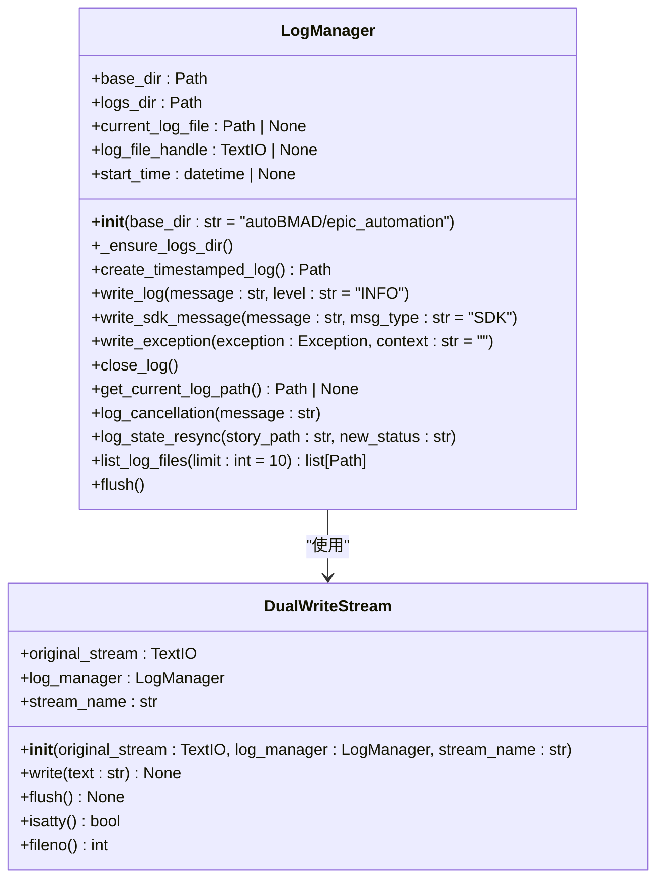
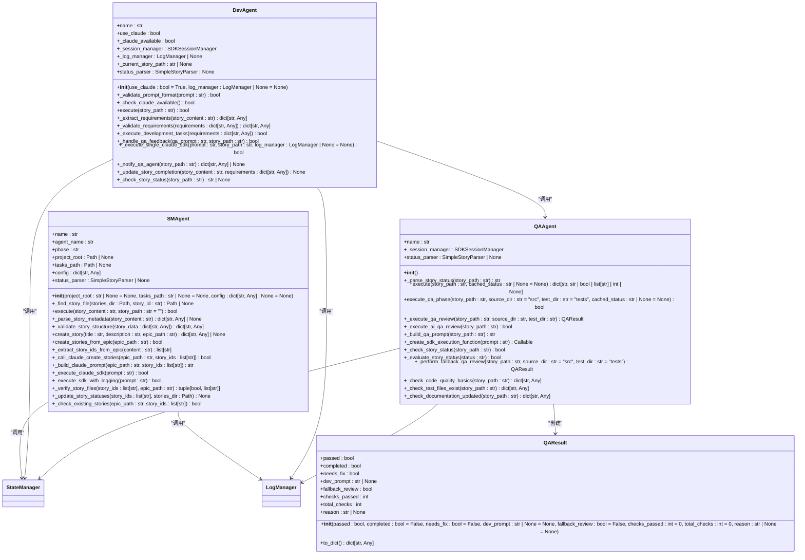

# 组件关系

<cite>
**本文档引用的文件**   
- [epic_driver.py](file://autoBMAD/epic_automation/epic_driver.py)
- [state_manager.py](file://autoBMAD/epic_automation/state_manager.py)
- [log_manager.py](file://autoBMAD/epic_automation/log_manager.py)
- [dev_agent.py](file://autoBMAD/epic_automation/dev_agent.py)
- [qa_agent.py](file://autoBMAD/epic_automation/qa_agent.py)
- [sm_agent.py](file://autoBMAD/epic_automation/sm_agent.py)
- [story_parser.py](file://autoBMAD/epic_automation/story_parser.py)
- [sdk_session_manager.py](file://autoBMAD/epic_automation/sdk_session_manager.py)
</cite>

## 目录
1. [组件交互概述](#组件交互概述)
2. [EpicDriver协调器](#epicdriver协调器)
3. [StateManager状态管理](#statemanager状态管理)
4. [LogManager日志系统](#logmanager日志系统)
5. [Agent组件协作](#agent组件协作)
6. [组件依赖关系图](#组件依赖关系图)
7. [接口调用与数据传递](#接口调用与数据传递)
8. [生命周期与依赖注入](#生命周期与依赖注入)
9. [系统扩展性](#系统扩展性)

## 组件交互概述

本系统由EpicDriver、StateManager、LogManager、SMAgent、DevAgent和QAAgent等核心组件构成，形成一个完整的自动化工作流。EpicDriver作为主协调器，驱动SM-Dev-QA循环，StateManager负责跟踪故事状态，LogManager提供统一的日志记录。这些组件通过清晰的接口和数据传递机制协同工作，确保系统稳定运行。

**Section sources**
- [epic_driver.py](file://autoBMAD/epic_automation/epic_driver.py#L1-L2172)
- [state_manager.py](file://autoBMAD/epic_automation/state_manager.py#L1-L866)
- [log_manager.py](file://autoBMAD/epic_automation/log_manager.py#L1-L426)

## EpicDriver协调器

EpicDriver是系统的核心协调器，负责驱动SM-Dev-QA循环。它通过解析Epic文档，提取故事信息，并依次调用SMAgent、DevAgent和QAAgent来执行各个阶段的任务。EpicDriver在初始化时创建所有Agent实例，并通过StateManager跟踪故事状态，确保工作流的正确执行。

**Diagram sources **
- [epic_driver.py](file://autoBMAD/epic_automation/epic_driver.py#L535-L800)

**Section sources**
- [epic_driver.py](file://autoBMAD/epic_automation/epic_driver.py#L535-L800)

## StateManager状态管理

StateManager是系统的核心状态管理组件，负责跟踪故事的进度和状态。它使用SQLite数据库存储故事状态，包括状态、迭代次数、QA结果等信息。StateManager提供了一套完整的API来更新和查询故事状态，确保状态的一致性和可靠性。

**Diagram sources **
- [state_manager.py](file://autoBMAD/epic_automation/state_manager.py#L97-L866)

**Section sources**
- [state_manager.py](file://autoBMAD/epic_automation/state_manager.py#L97-L866)

## LogManager日志系统

LogManager是系统的统一日志管理组件，负责创建和管理日志文件，提供实时的日志记录功能。它支持双写模式，将日志同时输出到控制台和文件，确保日志的完整性和可追溯性。LogManager还提供了SDK消息跟踪和异常记录功能，便于问题排查和系统监控。

**Diagram sources **
- [log_manager.py](file://autoBMAD/epic_automation/log_manager.py#L18-L426)

**Section sources**
- [log_manager.py](file://autoBMAD/epic_automation/log_manager.py#L18-L426)

## Agent组件协作

SMAgent、DevAgent和QAAgent是系统的核心Agent组件，分别负责故事管理、开发和质量保证。这些Agent通过EpicDriver的协调，形成一个完整的SM-Dev-QA循环。每个Agent都通过StateManager跟踪故事状态，并通过LogManager记录日志，确保工作流的透明性和可追溯性。

**Diagram sources **
- [sm_agent.py](file://autoBMAD/epic_automation/sm_agent.py#L35-L760)
- [dev_agent.py](file://autoBMAD/epic_automation/dev_agent.py#L57-L931)
- [qa_agent.py](file://autoBMAD/epic_automation/qa_agent.py#L109-L989)

**Section sources**
- [sm_agent.py](file://autoBMAD/epic_automation/sm_agent.py#L35-L760)
- [dev_agent.py](file://autoBMAD/epic_automation/dev_agent.py#L57-L931)
- [qa_agent.py](file://autoBMAD/epic_automation/qa_agent.py#L109-L989)

## 组件依赖关系图

以下Mermaid类图展示了系统中各组件之间的依赖关系。EpicDriver作为主协调器，依赖于所有其他组件，包括StateManager、LogManager和各个Agent。StateManager和LogManager作为基础设施组件，被所有Agent共享使用。这种设计确保了组件之间的松耦合和高内聚。

```mermaid
classDiagram
class EpicDriver {
+epic_path : Path
+epic_id : str
+tasks_dir : Path
+stories : list[dict[str, Any]]
+current_story_index : int
+max_iterations : int
+retry_failed : bool
+verbose : bool
+concurrent : bool
+use_claude : bool
+source_dir : str
+test_dir : str
+sm_agent : Any
+dev_agent : Any
+qa_agent : Any
+state_manager : Any
+logger : logging.Logger
+log_manager : LogManager
+__init__(epic_path : str, tasks_dir : str = ".bmad-core/tasks", max_iterations : int = 3, retry_failed : bool = False, verbose : bool = False, concurrent : bool = False, use_claude : bool = True, source_dir : str = "src", test_dir : str = "tests", skip_quality : bool = False, skip_tests : bool = False)
+_setup_logging() logging.Logger
+parse_epic() list[dict[str, Any]]
}
class StateManager {
+db_path : Path
+_lock : asyncio.Lock
+_deadlock_detector : DeadlockDetector
+_connection_pool : DatabaseConnectionPool | None
+__init__(db_path : str = "progress.db", use_connection_pool : bool = True)
+_init_db_sync()
+_ensure_connection_pool_initialized()
+_get_db_connection() asynccontextmanager
+update_story_status(story_path : str, status : str, phase : str | None = None, iteration : int | None = None, qa_result : Union["dict[str, Any]", None] = None, error : str | None = None, epic_path : str | None = None, lock_timeout : float = 30.0, expected_version : int | None = None) tuple[bool, int | None]
+_update_story_internal(story_path : str, status : str, phase : str | None, iteration : int | None, qa_result : Union["dict[str, Any]", None], error : str | None, epic_path : str | None, expected_version : int | None) tuple[bool, int | None]
+_clean_qa_result_for_json(qa_result : Any) str | None
+managed_operation() asynccontextmanager
+get_story_status(story_path : str) Union["dict[str, Any]", None]
+get_all_stories() list[dict[str, Any]]
+get_stats() dict[str, int]
+create_backup() str | None
+cleanup_old_records(days : int = 30) int
+get_health_status() dict[str, Any]
+sync_story_statuses_to_markdown() dict[str, Any]
+_update_markdown_status(story_path : str, db_status : str) None
+_find_actual_story_file(db_story_path : str) Path | None
}
class LogManager {
+base_dir : Path
+logs_dir : Path
+current_log_file : Path | None
+log_file_handle : TextIO | None
+start_time : datetime | None
+__init__(base_dir : str = "autoBMAD/epic_automation")
+_ensure_logs_dir()
+create_timestamped_log() Path
+write_log(message : str, level : str = "INFO")
+write_sdk_message(message : str, msg_type : str = "SDK")
+write_exception(exception : Exception, context : str = "")
+close_log()
+get_current_log_path() Path | None
+log_cancellation(message : str)
+log_state_resync(story_path : str, new_status : str)
+list_log_files(limit : int = 10) list[Path]
+flush()
}
class SMAgent {
+name : str
+agent_name : str
+phase : str
+project_root : Path | None
+tasks_path : Path | None
+config : dict[str, Any]
+status_parser : SimpleStoryParser | None
+__init__(project_root : str | None = None, tasks_path : str | None = None, config : dict[str, Any] | None = None)
+_find_story_file(stories_dir : Path, story_id : str) Path | None
+execute(story_content : str, story_path : str = "") bool
+_parse_story_metadata(story_content : str) dict[str, Any] | None
+_validate_story_structure(story_data : dict[str, Any]) dict[str, Any]
+create_story(title : str, description : str, epic_path : str) dict[str, Any] | None
+create_stories_from_epic(epic_path : str) bool
+_extract_story_ids_from_epic(content : str) list[str]
+_call_claude_create_stories(epic_path : str, story_ids : list[str]) bool
+_build_claude_prompt(epic_path : str, story_ids : list[str]) str
+_execute_claude_sdk(prompt : str) bool
+_execute_sdk_with_logging(prompt : str) bool
+_verify_story_files(story_ids : list[str], epic_path : str) tuple[bool, list[str]]
+_update_story_statuses(story_ids : list[str], stories_dir : Path) None
+_check_existing_stories(epic_path : str, story_ids : list[str]) bool
}
class DevAgent {
+name : str
+use_claude : bool
+_claude_available : bool
+_session_manager : SDKSessionManager
+_log_manager : LogManager | None
+_current_story_path : str | None
+status_parser : SimpleStoryParser | None
+__init__(use_claude : bool = True, log_manager : LogManager | None = None)
+_validate_prompt_format(prompt : str) bool
+_check_claude_available() bool
+execute(story_path : str) bool
+_extract_requirements(story_content : str) dict[str, Any]
+_validate_requirements(requirements : dict[str, Any]) dict[str, Any]
+_execute_development_tasks(requirements : dict[str, Any]) bool
+_handle_qa_feedback(qa_prompt : str, story_path : str) bool
+_execute_single_claude_sdk(prompt : str, story_path : str, log_manager : LogManager | None = None) bool
+_notify_qa_agent(story_path : str) dict[str, Any] | None
+_update_story_completion(story_content : str, requirements : dict[str, Any]) None
+_check_story_status(story_path : str) str | None
}
class QAAgent {
+name : str
+_session_manager : SDKSessionManager
+status_parser : SimpleStoryParser | None
+__init__()
+_parse_story_status(story_path : str) str
+execute(story_path : str, cached_status : str | None = None) dict[str, str | bool | list[str] | int | None]
+execute_qa_phase(story_path : str, source_dir : str = "src", test_dir : str = "tests", cached_status : str | None = None) bool
+_execute_qa_review(story_path : str, source_dir : str, test_dir : str) QAResult
+_execute_ai_qa_review(story_path : str) bool
+_build_qa_prompt(story_path : str) str
+_create_sdk_execution_function(prompt : str) Callable
+_check_story_status(story_path : str) bool
+_evaluate_story_status(status : str) bool
+_perform_fallback_qa_review(story_path : str, source_dir : str = "src", test_dir : str = "tests") QAResult
+_check_code_quality_basics(story_path : str) dict[str, Any]
+_check_test_files_exist(story_path : str) dict[str, Any]
+_check_documentation_updated(story_path : str) dict[str, Any]
}
class QAResult {
+passed : bool
+completed : bool
+needs_fix : bool
+dev_prompt : str | None
+fallback_review : bool
+checks_passed : int
+total_checks : int
+reason : str | None
+__init__(passed : bool, completed : bool = False, needs_fix : bool = False, dev_prompt : str | None = None, fallback_review : bool = False, checks_passed : int = 0, total_checks : int = 0, reason : str | None = None)
+to_dict() dict[str, Any]
}
class StoryParser {
+sdk_wrapper : SafeClaudeSDK | None
+__init__(sdk_wrapper : SafeClaudeSDK | None)
+parse_status(content : str) str
+_regex_fallback_parse_status(content : str) str
+_clean_response_string(response : str) str
+_extract_status_from_response(response : str) str
+_simple_fallback_match(cleaned : str) str
+parse_story(content : str) StoryData
+_ai_parse_story(content : str) StoryData
+_parse_story_json(response : str, original_content : str) StoryData
+_regex_parse_story(content : str) StoryData
+parse_epic(content : str) EpicData
+_ai_parse_epic(content : str) EpicData
+_parse_epic_json(response : str, original_content : str) EpicData
+_regex_parse_epic(content : str) EpicData
}
class SDKSessionManager {
+_active_sessions : dict[str, IsolatedSDKContext]
+_lock : asyncio.Lock
+_total_sessions : int
+_successful_sessions : int
+_failed_sessions : int
+_retry_config : dict[str, Any]
+__init__()
+create_session(agent_name : str) asynccontextmanager
+execute_isolated(agent_name : str, sdk_func : Callable[[], Any], timeout : float | None = None, max_retries : int | None = None) SDKExecutionResult
+_calculate_retry_delay(retry_count : int) float
+get_active_sessions() list[str]
+get_session_count() int
+get_statistics() dict[str, Any]
+cancel_all_sessions() int
+get_session_health_summary() dict[str, Any]
}
EpicDriver --> StateManager : "使用"
EpicDriver --> LogManager : "使用"
EpicDriver --> SMAgent : "使用"
EpicDriver --> DevAgent : "使用"
EpicDriver --> QAAgent : "使用"
SMAgent --> StateManager : "使用"
SMAgent --> LogManager : "使用"
SMAgent --> StoryParser : "使用"
SMAgent --> SDKSessionManager : "使用"
DevAgent --> StateManager : "使用"
DevAgent --> LogManager : "使用"
DevAgent --> QAAgent : "使用"
DevAgent --> StoryParser : "使用"
DevAgent --> SDKSessionManager : "使用"
QAAgent --> StateManager : "使用"
QAAgent --> LogManager : "使用"
QAAgent --> StoryParser : "使用"
QAAgent --> SDKSessionManager : "使用"
QAAgent --> QAResult : "创建"
```

**Diagram sources **
- [epic_driver.py](file://autoBMAD/epic_automation/epic_driver.py#L535-L800)
- [state_manager.py](file://autoBMAD/epic_automation/state_manager.py#L97-L866)
- [log_manager.py](file://autoBMAD/epic_automation/log_manager.py#L18-L426)
- [sm_agent.py](file://autoBMAD/epic_automation/sm_agent.py#L35-L760)
- [dev_agent.py](file://autoBMAD/epic_automation/dev_agent.py#L57-L931)
- [qa_agent.py](file://autoBMAD/epic_automation/qa_agent.py#L109-L989)
- [story_parser.py](file://autoBMAD/epic_automation/story_parser.py#L213-L800)
- [sdk_session_manager.py](file://autoBMAD/epic_automation/sdk_session_manager.py#L193-L440)

## 接口调用与数据传递

组件之间的接口调用和数据传递是系统正常运行的关键。EpicDriver通过调用各个Agent的`execute`方法来驱动工作流，Agent通过StateManager的`update_story_status`和`get_story_status`方法来读写故事状态，通过LogManager的`write_log`和`write_sdk_message`方法来记录日志。这些接口设计简洁明了，确保了组件之间的松耦合。

**Section sources**
- [epic_driver.py](file://autoBMAD/epic_automation/epic_driver.py#L535-L800)
- [state_manager.py](file://autoBMAD/epic_automation/state_manager.py#L97-L866)
- [log_manager.py](file://autoBMAD/epic_automation/log_manager.py#L18-L426)

## 生命周期与依赖注入

系统的组件生命周期由EpicDriver管理。在EpicDriver初始化时，它创建所有Agent实例，并将StateManager和LogManager注入到这些Agent中。这种依赖注入模式确保了组件之间的依赖关系清晰明确，便于测试和维护。每个Agent的生命周期与其所属的EpicDriver实例绑定，确保资源的正确释放。

**Section sources**
- [epic_driver.py](file://autoBMAD/epic_automation/epic_driver.py#L535-L800)

## 系统扩展性

系统设计具有良好的扩展性。通过添加新的Agent类并实现相应的`execute`方法，可以轻松扩展系统功能。例如，可以添加一个`TestAgent`来执行自动化测试，或添加一个`DeployAgent`来执行部署任务。这些新Agent可以复用现有的StateManager和LogManager，确保与现有系统的无缝集成。

**Section sources**
- [epic_driver.py](file://autoBMAD/epic_automation/epic_driver.py#L535-L800)
- [sm_agent.py](file://autoBMAD/epic_automation/sm_agent.py#L35-L760)
- [dev_agent.py](file://autoBMAD/epic_automation/dev_agent.py#L57-L931)
- [qa_agent.py](file://autoBMAD/epic_automation/qa_agent.py#L109-L989)