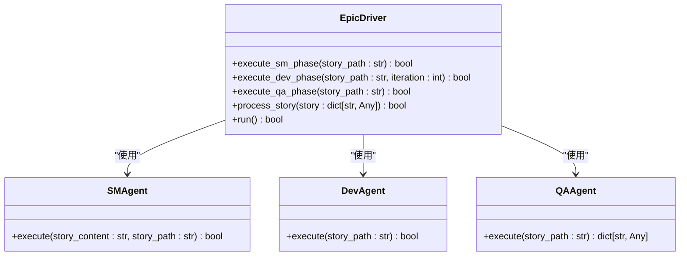
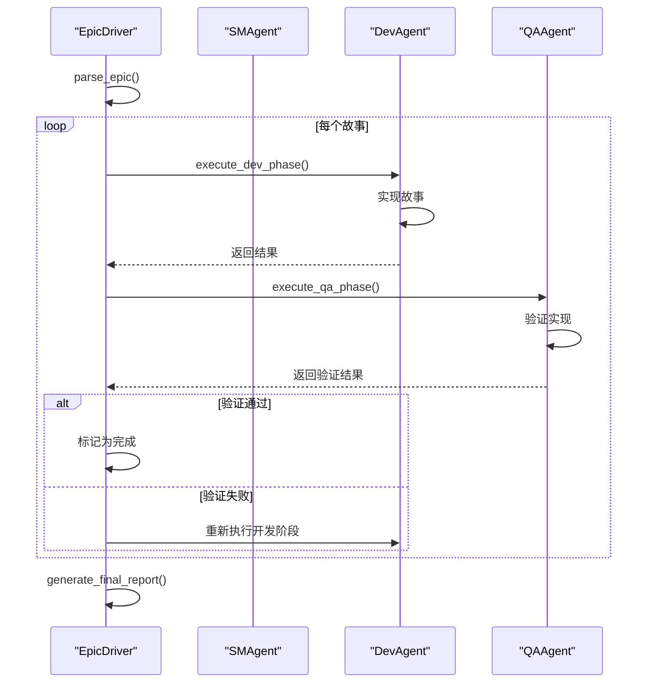

# 命令模式

<cite>
**本文档引用的文件**   
- [epic_driver.py](file://autoBMAD/epic_automation/epic_driver.py)
- [dev_agent.py](file://autoBMAD/epic_automation/dev_agent.py)
- [qa_agent.py](file://autoBMAD/epic_automation/qa_agent.py)
- [sm_agent.py](file://autoBMAD/epic_automation/sm_agent.py)
- [agents.py](file://autoBMAD/epic_automation/agents.py)
</cite>

## 目录
1. [引言](#引言)
2. [EpicDriver作为调用者](#epicdriver作为调用者)
3. [命令模式的实现](#命令模式的实现)
4. [工作流执行逻辑](#工作流执行逻辑)
5. [与代理的交互关系](#与代理的交互关系)
6. [可配置性与可扩展性](#可配置性与可扩展性)
7. [结论](#结论)

## 引言

命令模式是一种行为设计模式，它将请求封装为对象，从而使您可以用不同的请求、队列或者日志来参数化其他对象。在本系统中，EpicDriver类作为调用者（Invoker），协调SM-Dev-QA循环的执行逻辑，将复杂的自动化流程封装为可调用的命令。这种设计模式不仅提高了代码的可维护性和可测试性，还支持工作流的可配置性和可扩展性。

## EpicDriver作为调用者

EpicDriver类是整个自动化流程的核心协调者，负责解析史诗文档、执行开发-质量保证（Dev-QA）循环，并最终生成报告。作为调用者，EpicDriver通过封装具体的执行逻辑，将复杂的自动化任务分解为一系列可管理的命令。这种设计使得系统能够灵活地应对不同的需求变化，同时保持核心逻辑的稳定性。

**Section sources**
- [epic_driver.py](file://autoBMAD/epic_automation/epic_driver.py#L535-L557)

## 命令模式的实现

在本系统中，命令模式主要通过EpicDriver类中的`execute_sm_phase`、`execute_dev_phase`和`execute_qa_phase`方法实现。这些方法分别对应于故事管理（SM）、开发（Dev）和质量保证（QA）三个阶段的执行逻辑。每个方法都封装了特定的业务逻辑，通过调用相应的代理（Agent）来完成具体任务。

**Diagram sources **
- [epic_driver.py](file://autoBMAD/epic_automation/epic_driver.py#L1113-L1263)
- [sm_agent.py](file://autoBMAD/epic_automation/sm_agent.py#L98-L133)
- [dev_agent.py](file://autoBMAD/epic_automation/dev_agent.py#L239-L304)
- [qa_agent.py](file://autoBMAD/epic_automation/qa_agent.py#L222-L359)

## 工作流执行逻辑

EpicDriver通过`run`方法启动整个工作流，该方法首先解析史诗文档以获取所有故事，然后依次执行每个故事的Dev-QA循环。在每个循环中，EpicDriver会调用`execute_dev_phase`和`execute_qa_phase`方法，分别执行开发和质量保证阶段的任务。如果QA阶段未通过，EpicDriver会自动重试，直到达到最大重试次数或任务成功完成。

**Diagram sources **
- [epic_driver.py](file://autoBMAD/epic_automation/epic_driver.py#L1864-L1934)
- [dev_agent.py](file://autoBMAD/epic_automation/dev_agent.py#L239-L304)
- [qa_agent.py](file://autoBMAD/epic_automation/qa_agent.py#L222-L359)

## 与代理的交互关系

EpicDriver与SM、Dev和QA代理之间的交互是通过方法调用来实现的。每个代理都有一个`execute`方法，用于执行特定的任务。EpicDriver通过调用这些方法来协调整个工作流。例如，在执行开发阶段时，EpicDriver会调用`DevAgent.execute`方法，传入故事路径作为参数。同样，在执行质量保证阶段时，EpicDriver会调用`QAAgent.execute`方法，获取验证结果。

**Section sources**
- [epic_driver.py](file://autoBMAD/epic_automation/epic_driver.py#L1113-L1263)
- [dev_agent.py](file://autoBMAD/epic_automation/dev_agent.py#L239-L304)
- [qa_agent.py](file://autoBMAD/epic_automation/qa_agent.py#L222-L359)

## 可配置性与可扩展性

命令模式的设计使得系统具有高度的可配置性和可扩展性。通过EpicDriver的构造函数，用户可以配置最大重试次数、是否启用详细日志输出等选项。此外，由于每个阶段的执行逻辑都被封装在独立的方法中，因此可以轻松地添加新的阶段或修改现有阶段的行为，而不会影响其他部分的代码。

**Section sources**
- [epic_driver.py](file://autoBMAD/epic_automation/epic_driver.py#L558-L615)

## 结论

通过使用命令模式，EpicDriver成功地将复杂的自动化流程封装为一系列可调用的命令，从而提高了系统的可维护性和可扩展性。这种设计不仅简化了工作流的协调，还使得系统能够灵活地应对不同的需求变化。未来，可以通过进一步优化代理之间的交互和增加更多的配置选项，来进一步提升系统的性能和灵活性。