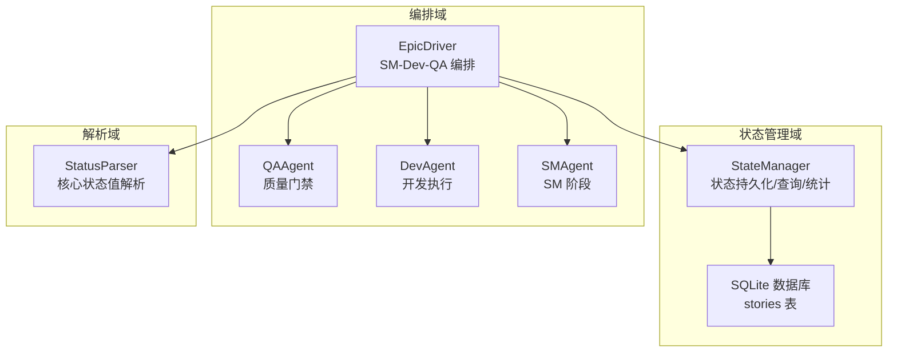
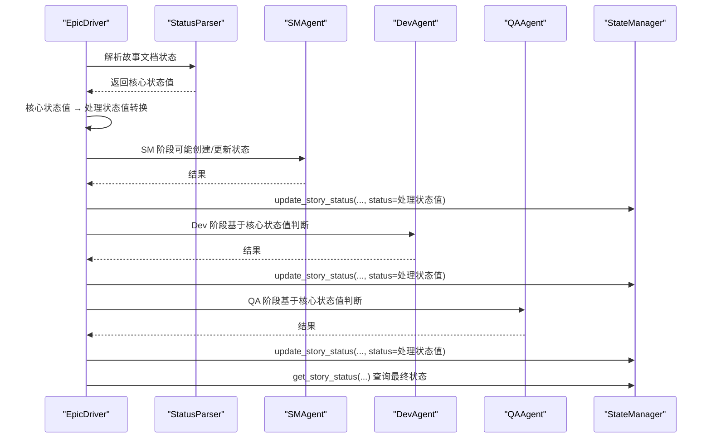
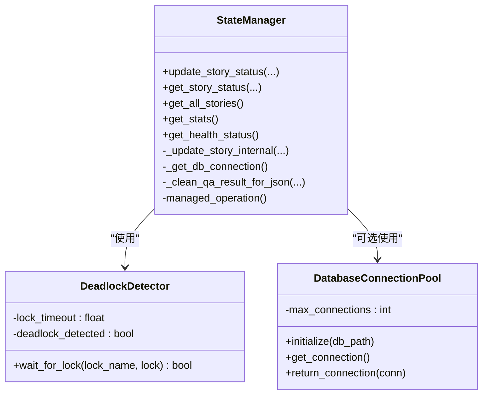
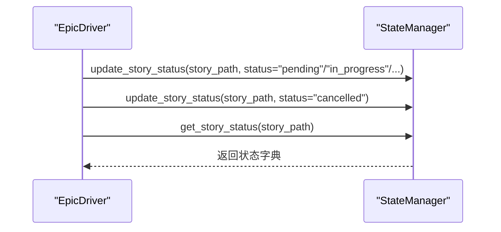
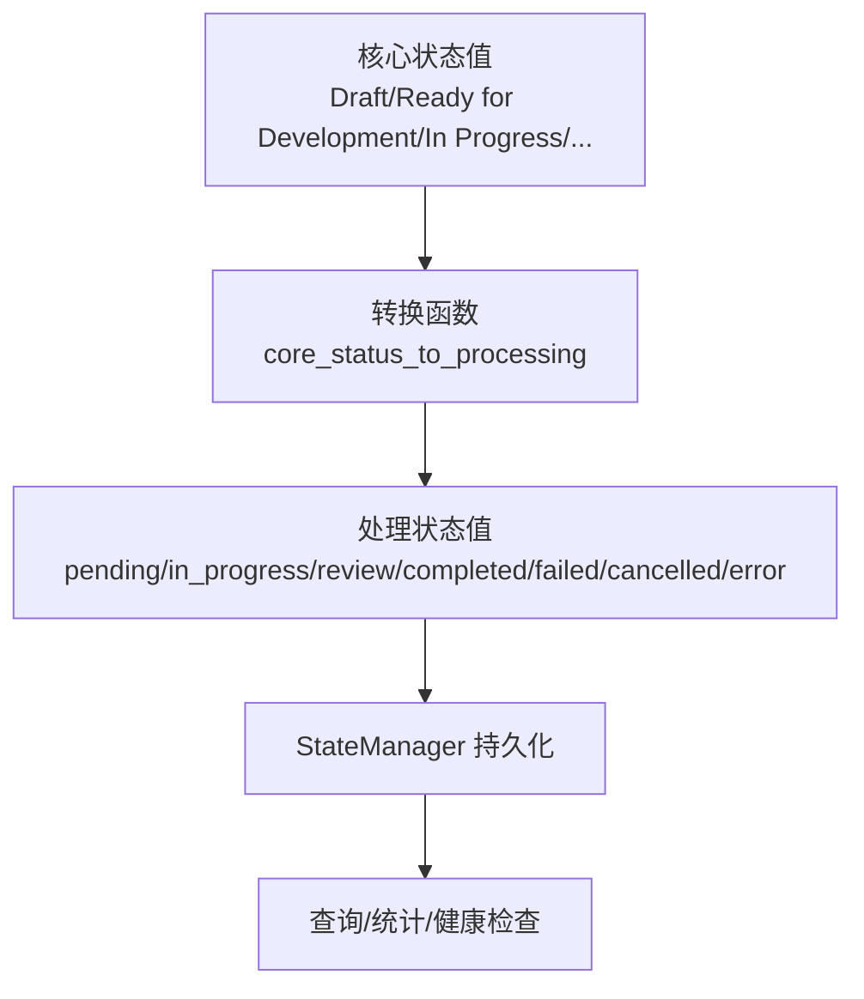
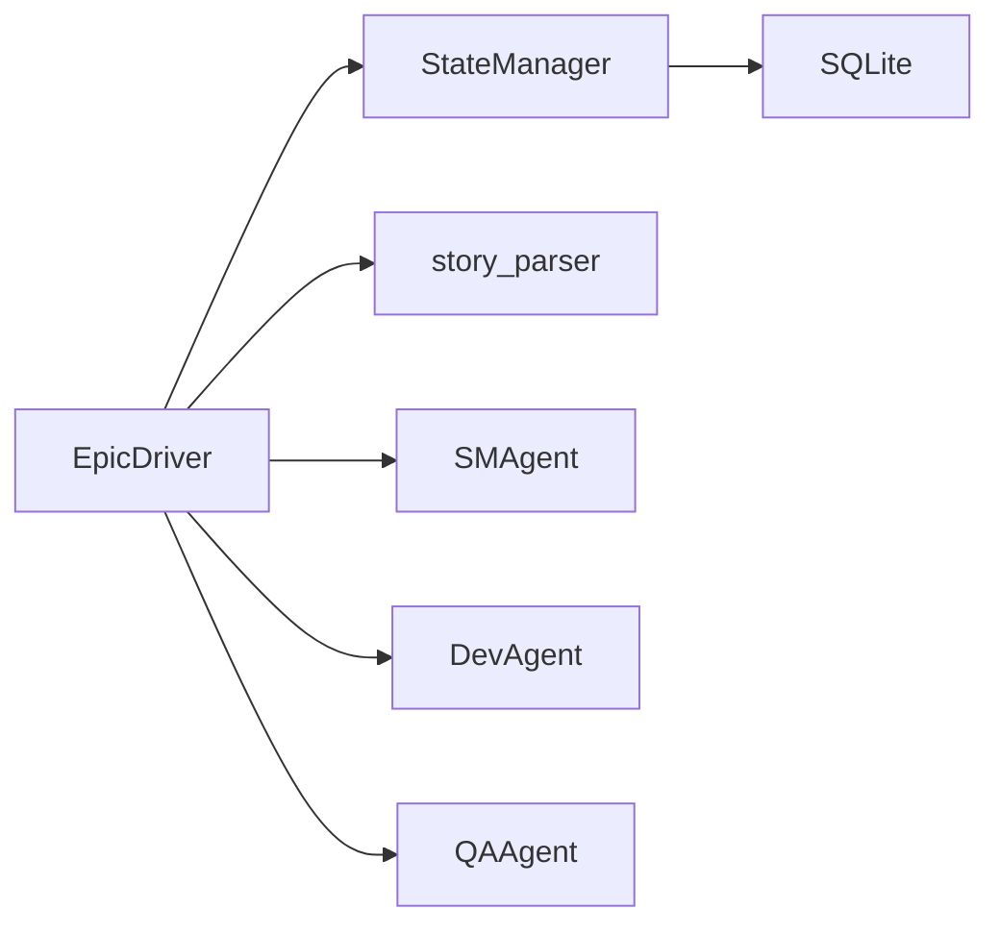

# 状态模式

<cite>
**本文引用的文件**
- [state_manager.py](file://autoBMAD/epic_automation/state_manager.py)
- [epic_driver.py](file://autoBMAD/epic_automation/epic_driver.py)
- [STANDARD_STATUS.md](file://autoBMAD/epic_automation/STANDARD_STATUS.md)
- [STATUS_IMPLEMENTATION.md](file://autoBMAD/epic_automation/STATUS_IMPLEMENTATION.md)
- [story_parser.py](file://autoBMAD/epic_automation/story_parser.py)
- [test_state_manager.py](file://tests-copy/epic_automation/test_state_manager.py)
- [test_epic_automation.py](file://tests-copy/test_epic_automation.py)
</cite>

## 目录
1. [简介](#简介)
2. [项目结构](#项目结构)
3. [核心组件](#核心组件)
4. [架构总览](#架构总览)
5. [详细组件分析](#详细组件分析)
6. [依赖关系分析](#依赖关系分析)
7. [性能考量](#性能考量)
8. [故障排查指南](#故障排查指南)
9. [结论](#结论)
10. [附录](#附录)

## 简介
本文件围绕“状态模式”在系统中的应用展开，聚焦于故事（Story）生命周期状态管理。文档详细说明 StateManager 如何统一管理故事状态（如 pending、in_progress、completed、failed、cancelled、error 等），以及如何通过状态转换与 EpicDriver 的协作，确保状态更新与查询的正确性、一致性与可靠性。同时给出状态转换触发条件、执行逻辑、错误处理与性能优化建议，并通过测试用例路径展示关键行为。

## 项目结构
本项目采用“按功能域划分”的组织方式，状态管理相关的核心代码集中在 autoBMAD/epic_automation 目录下：
- 状态管理器：StateManager（负责故事状态的持久化、查询、统计与健康检查）
- 驱动器：EpicDriver（负责编排 SM-Dev-QA 循环，与 StateManager 交互更新/查询状态）
- 状态规范：STANDARD_STATUS.md 与 STATUS_IMPLEMENTATION.md（定义统一状态值与转换映射）
- 状态解析：story_parser.py（提供核心状态值与处理状态值的转换函数）

图表来源
- [state_manager.py](file://autoBMAD/epic_automation/state_manager.py#L97-L120)
- [epic_driver.py](file://autoBMAD/epic_automation/epic_driver.py#L535-L660)
- [story_parser.py](file://autoBMAD/epic_automation/story_parser.py#L80-L124)

章节来源
- [state_manager.py](file://autoBMAD/epic_automation/state_manager.py#L97-L120)
- [epic_driver.py](file://autoBMAD/epic_automation/epic_driver.py#L535-L660)
- [STANDARD_STATUS.md](file://autoBMAD/epic_automation/STANDARD_STATUS.md#L1-L120)
- [STATUS_IMPLEMENTATION.md](file://autoBMAD/epic_automation/STATUS_IMPLEMENTATION.md#L1-L120)

## 核心组件
- StateManager：提供异步线程安全的状态更新、查询、统计与健康检查能力；内置乐观锁、连接池、死锁检测与超时保护，保证并发与可靠性。
- EpicDriver：作为主编排器，负责解析 Epic、发现故事、执行 SM-Dev-QA 循环，并在各阶段调用 StateManager 更新状态。
- story_parser：提供核心状态值与处理状态值之间的转换函数，确保跨组件状态一致性。
- 规范文档：STANDARD_STATUS.md 与 STATUS_IMPLEMENTATION.md 明确状态值、映射与流转，指导实现与测试。

章节来源
- [state_manager.py](file://autoBMAD/epic_automation/state_manager.py#L203-L349)
- [epic_driver.py](file://autoBMAD/epic_automation/epic_driver.py#L535-L660)
- [story_parser.py](file://autoBMAD/epic_automation/story_parser.py#L113-L137)
- [STANDARD_STATUS.md](file://autoBMAD/epic_automation/STANDARD_STATUS.md#L1-L120)
- [STATUS_IMPLEMENTATION.md](file://autoBMAD/epic_automation/STATUS_IMPLEMENTATION.md#L1-L120)

## 架构总览
状态模式在此系统中的体现：
- 将“故事生命周期状态”抽象为统一的处理状态值（pending、in_progress、review、completed、failed、cancelled、error），由 StateManager 负责持久化与查询。
- EpicDriver 在不同阶段（SM、Dev、QA）依据解析到的核心状态值进行业务判断，并将处理状态值写入 StateManager。
- story_parser 提供稳定的转换函数，确保状态在“人类可读核心状态值”与“数据库处理状态值”之间可靠映射。

图表来源
- [epic_driver.py](file://autoBMAD/epic_automation/epic_driver.py#L535-L660)
- [story_parser.py](file://autoBMAD/epic_automation/story_parser.py#L113-L137)
- [state_manager.py](file://autoBMAD/epic_automation/state_manager.py#L203-L349)

## 详细组件分析

### StateManager：状态持久化与一致性保障
- 数据模型：stories 表包含 story_path、status、phase、iteration、qa_result、error_message、version 等字段；通过 version 字段实现乐观锁，避免并发覆盖。
- 并发与可靠性：
  - 使用 asyncio.Lock 保护数据库操作，防止竞态。
  - 提供 managed_operation 上下文管理器，确保取消时也能正确释放锁。
  - DeadlockDetector 带超时的锁等待，检测潜在死锁。
  - DatabaseConnectionPool 限制最大连接数，启用 WAL 模式与参数优化，提升并发与性能。
- 主要接口：
  - update_story_status(..., expected_version=...)：更新或插入故事状态，支持超时与取消保护。
  - get_story_status(story_path)：查询单个故事状态。
  - get_all_stories()、get_stats()：批量查询与统计。
  - get_health_status()：返回数据库与锁健康状态。
- 错误处理：捕获超时、取消与异常，记录日志并返回失败标记，避免崩溃传播。

图表来源
- [state_manager.py](file://autoBMAD/epic_automation/state_manager.py#L97-L120)
- [state_manager.py](file://autoBMAD/epic_automation/state_manager.py#L203-L349)
- [state_manager.py](file://autoBMAD/epic_automation/state_manager.py#L370-L404)

章节来源
- [state_manager.py](file://autoBMAD/epic_automation/state_manager.py#L203-L349)
- [state_manager.py](file://autoBMAD/epic_automation/state_manager.py#L370-L404)
- [state_manager.py](file://autoBMAD/epic_automation/state_manager.py#L605-L626)

### EpicDriver：状态更新与查询的编排者
- 初始化：构造函数中导入并实例化 SMAgent、DevAgent、QAAgent 与 StateManager，建立状态管理通道。
- 状态更新触发点：
  - _resync_story_state：当外部期望状态与数据库不一致时，调用 StateManager 更新。
  - _handle_graceful_cancellation：处理取消，将状态置为 cancelled。
  - execute_dev_qa_cycle：在各阶段结束后调用 StateManager 更新状态。
- 状态查询：在测试与流程控制中多次通过 driver.state_manager.get_story_status(...) 获取最新状态，用于断言与决策。

图表来源
- [epic_driver.py](file://autoBMAD/epic_automation/epic_driver.py#L1706-L1758)
- [epic_driver.py](file://autoBMAD/epic_automation/epic_driver.py#L1766-L1807)
- [state_manager.py](file://autoBMAD/epic_automation/state_manager.py#L203-L349)

章节来源
- [epic_driver.py](file://autoBMAD/epic_automation/epic_driver.py#L1706-L1758)
- [epic_driver.py](file://autoBMAD/epic_automation/epic_driver.py#L1766-L1807)
- [test_epic_automation.py](file://tests-copy/test_epic_automation.py#L648-L660)

### 状态规范与转换：统一标准
- 核心状态值（人类可读）：Draft、Ready for Development、In Progress、Ready for Review、Ready for Done、Done、Failed。
- 处理状态值（数据库存储）：pending、in_progress、review、completed、failed、cancelled、error。
- 转换映射：核心状态值 → 处理状态值（单向），特殊状态值（cancelled、error）直接使用。
- 实现指南：提供解析、转换、存储、读取的标准流程，确保跨组件一致性。

图表来源
- [STANDARD_STATUS.md](file://autoBMAD/epic_automation/STANDARD_STATUS.md#L1-L120)
- [STATUS_IMPLEMENTATION.md](file://autoBMAD/epic_automation/STATUS_IMPLEMENTATION.md#L1-L120)
- [story_parser.py](file://autoBMAD/epic_automation/story_parser.py#L113-L137)

章节来源
- [STANDARD_STATUS.md](file://autoBMAD/epic_automation/STANDARD_STATUS.md#L1-L120)
- [STATUS_IMPLEMENTATION.md](file://autoBMAD/epic_automation/STATUS_IMPLEMENTATION.md#L1-L120)
- [story_parser.py](file://autoBMAD/epic_automation/story_parser.py#L113-L137)

### 状态转换触发条件与执行逻辑
- 正常流程：Draft/Ready for Development → pending；In Progress → in_progress；Ready for Review/Ready for Done → review；Done → completed；Failed → failed。
- 异常流程：任意状态 → failed 或 cancelled。
- 执行逻辑：
  - EpicDriver 在 SM 阶段将状态置为 pending（或根据核心状态值转换为处理状态值）。
  - Dev 阶段完成后，将状态置为 review；若 QA 通过，则置为 completed。
  - 若出现错误或取消，分别置为 error 或 cancelled。
  - 状态更新通过 update_story_status(...) 完成，内部使用乐观锁与锁保护，确保一致性。

章节来源
- [STANDARD_STATUS.md](file://autoBMAD/epic_automation/STANDARD_STATUS.md#L53-L99)
- [epic_driver.py](file://autoBMAD/epic_automation/epic_driver.py#L535-L660)
- [state_manager.py](file://autoBMAD/epic_automation/state_manager.py#L203-L349)

### 代码示例路径（状态更新与查询）
- 更新状态（SM/Dev/QA 阶段）：参见 [epic_driver.py](file://autoBMAD/epic_automation/epic_driver.py#L1706-L1758)
- 查询状态（断言与流程控制）：参见 [test_epic_automation.py](file://tests-copy/test_epic_automation.py#L648-L660)
- 状态持久化与乐观锁：参见 [state_manager.py](file://autoBMAD/epic_automation/state_manager.py#L203-L349)
- 数据库初始化与索引：参见 [state_manager.py](file://autoBMAD/epic_automation/state_manager.py#L132-L179)

章节来源
- [epic_driver.py](file://autoBMAD/epic_automation/epic_driver.py#L1706-L1758)
- [test_epic_automation.py](file://tests-copy/test_epic_automation.py#L648-L660)
- [state_manager.py](file://autoBMAD/epic_automation/state_manager.py#L203-L349)
- [state_manager.py](file://autoBMAD/epic_automation/state_manager.py#L132-L179)

## 依赖关系分析
- EpicDriver 依赖 StateManager 进行状态持久化；依赖 story_parser 进行状态值转换；依赖 SMAgent/DevAgent/QAAgent 执行各阶段任务。
- StateManager 依赖 SQLite 与连接池，内部通过 asyncio.Lock 与 DeadlockDetector 保障并发安全。
- 规范文档为组件间状态一致性提供契约，避免“三套状态值系统”带来的不一致。

图表来源
- [epic_driver.py](file://autoBMAD/epic_automation/epic_driver.py#L535-L660)
- [state_manager.py](file://autoBMAD/epic_automation/state_manager.py#L97-L120)

章节来源
- [epic_driver.py](file://autoBMAD/epic_automation/epic_driver.py#L535-L660)
- [state_manager.py](file://autoBMAD/epic_automation/state_manager.py#L97-L120)

## 性能考量
- 连接池与 WAL：启用 SQLite WAL 模式与连接池，限制最大连接数，减少锁竞争，提升并发吞吐。
- 乐观锁：通过 version 字段避免覆盖冲突，降低重试成本。
- 超时与取消：update_story_status 与 managed_operation 提供超时与取消保护，避免长时间阻塞。
- 索引：对 story_path 与 status 建立索引，加速查询与统计。

章节来源
- [state_manager.py](file://autoBMAD/epic_automation/state_manager.py#L60-L95)
- [state_manager.py](file://autoBMAD/epic_automation/state_manager.py#L132-L179)
- [state_manager.py](file://autoBMAD/epic_automation/state_manager.py#L203-L349)

## 故障排查指南
- 死锁与超时：DeadlockDetector 会在锁等待超时后记录错误；managed_operation 在取消时会释放锁并记录告警。
- 数据库异常：get_story_status/get_all_stories/get_stats 捕获异常并返回空结果或空字典，避免崩溃。
- 状态不一致：通过 expected_version 参数与乐观锁检测版本冲突，必要时返回当前版本以提示上层重试。
- 日志定位：EpicDriver 的 resync 与 cancellation 分支均记录详细日志，便于定位问题。

章节来源
- [state_manager.py](file://autoBMAD/epic_automation/state_manager.py#L31-L57)
- [state_manager.py](file://autoBMAD/epic_automation/state_manager.py#L370-L404)
- [state_manager.py](file://autoBMAD/epic_automation/state_manager.py#L405-L512)
- [epic_driver.py](file://autoBMAD/epic_automation/epic_driver.py#L1706-L1758)

## 结论
通过引入统一的状态规范与状态模式，系统实现了：
- 一致的状态值体系：核心状态值用于文档与显示，处理状态值用于数据库与内部跟踪。
- 可靠的状态管理：StateManager 提供锁保护、乐观锁、连接池与健康检查，确保并发安全与数据一致性。
- 清晰的编排流程：EpicDriver 在各阶段依据解析状态值进行业务判断，并通过 StateManager 持久化状态。
- 可验证的行为：测试用例覆盖状态更新、查询、统计与异常处理，保障系统稳定性。

[无需来源：本节为总结性内容]

## 附录
- 状态值对照与转换：参见 [STANDARD_STATUS.md](file://autoBMAD/epic_automation/STANDARD_STATUS.md#L1-L120) 与 [STATUS_IMPLEMENTATION.md](file://autoBMAD/epic_automation/STATUS_IMPLEMENTATION.md#L1-L120)
- 状态解析与转换函数：参见 [story_parser.py](file://autoBMAD/epic_automation/story_parser.py#L113-L137)
- 状态持久化与查询测试：参见 [test_state_manager.py](file://tests-copy/epic_automation/test_state_manager.py#L1-L200)