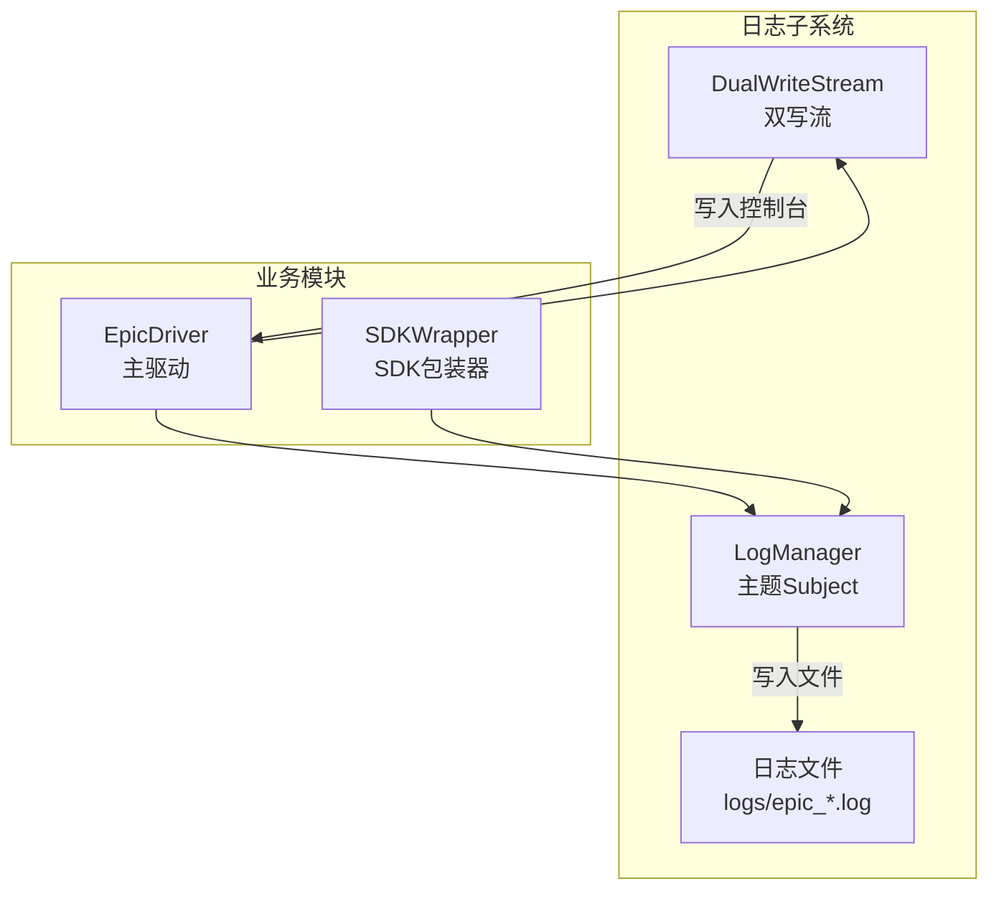
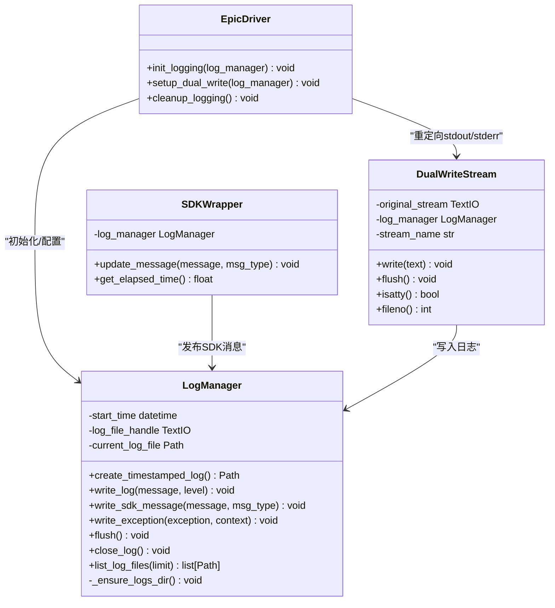
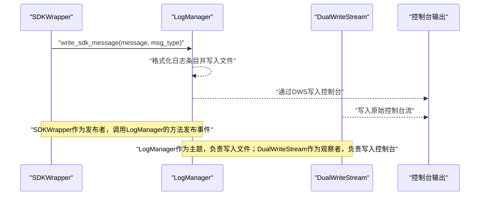
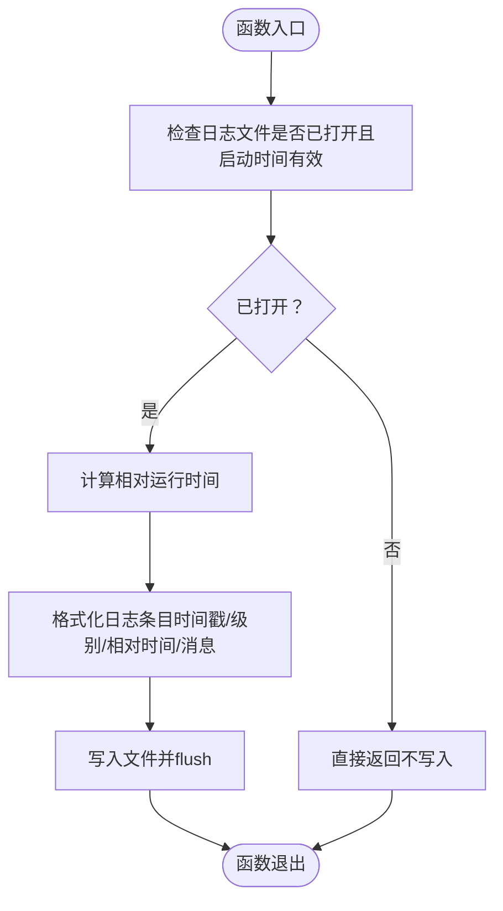
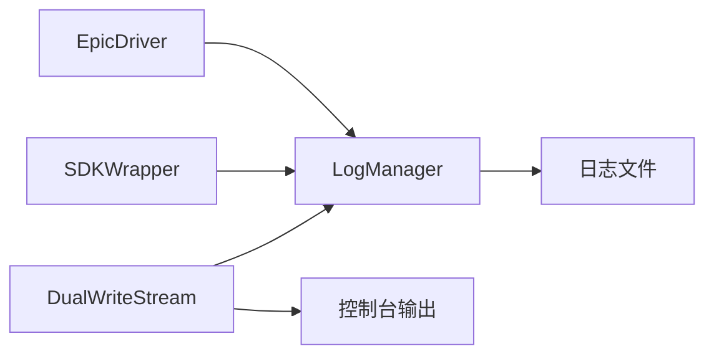

# 观察者模式

<cite>
**本文引用的文件**
- [log_manager.py](file://autoBMAD/epic_automation/log_manager.py)
- [epic_driver.py](file://autoBMAD/epic_automation/epic_driver.py)
- [sdk_wrapper.py](file://autoBMAD/epic_automation/sdk_wrapper.py)
- [LOGSYSTEM_README.md](file://autoBMAD/epic_automation/LOGSYSTEM_README.md)
</cite>

## 目录
1. [简介](#简介)
2. [项目结构](#项目结构)
3. [核心组件](#核心组件)
4. [架构总览](#架构总览)
5. [详细组件分析](#详细组件分析)
6. [依赖关系分析](#依赖关系分析)
7. [性能考量](#性能考量)
8. [故障排查指南](#故障排查指南)
9. [结论](#结论)
10. [附录](#附录)

## 简介
本文件聚焦于系统中“观察者模式”的应用，特别是日志系统如何通过该模式实现“发布-订阅”式的日志事件广播。在本系统中，LogManager扮演“主题（Subject）”，负责创建日志文件、格式化日志条目，并将日志事件写入文件；而“观察者（Observers）”则由多种输出目标构成，包括：
- 控制台输出：通过标准输出流实时显示
- 日志文件：持久化存储
- SDK消息追踪：将SDK交互消息以特定格式写入日志文件

当业务模块（如SDK包装器）产生日志事件时，它们通过调用LogManager的方法（例如write_log、write_sdk_message）进行“发布”。LogManager内部负责将消息写入文件，同时通过DualWriteStream将消息同步输出到控制台，从而实现多目的地广播与可扩展的输出策略。

## 项目结构
围绕日志系统的相关文件组织如下：
- autoBMAD/epic_automation/log_manager.py：日志管理器与双写流实现
- autoBMAD/epic_automation/epic_driver.py：主驱动，负责初始化日志系统并设置双写模式
- autoBMAD/epic_automation/sdk_wrapper.py：SDK包装器，向LogManager发布SDK消息
- autoBMAD/epic_automation/LOGSYSTEM_README.md：日志系统说明文档

图表来源
- [log_manager.py](file://autoBMAD/epic_automation/log_manager.py#L1-L120)
- [epic_driver.py](file://autoBMAD/epic_automation/epic_driver.py#L1-L60)
- [sdk_wrapper.py](file://autoBMAD/epic_automation/sdk_wrapper.py#L200-L240)

章节来源
- [log_manager.py](file://autoBMAD/epic_automation/log_manager.py#L1-L120)
- [epic_driver.py](file://autoBMAD/epic_automation/epic_driver.py#L1-L60)
- [LOGSYSTEM_README.md](file://autoBMAD/epic_automation/LOGSYSTEM_README.md#L1-L60)

## 核心组件
- LogManager：统一的日志管理器，负责创建带时间戳的日志文件、格式化日志条目、写入文件、关闭文件、列出最近日志文件、刷新缓冲区等。它充当“主题（Subject）”，对外暴露write_log、write_sdk_message、write_exception等方法，供业务模块发布日志事件。
- DualWriteStream：自定义流，实现“双写”能力，将文本同时写入原始流（控制台）和LogManager，从而实现控制台与文件的同步输出。
- EpicDriver：主驱动，负责初始化日志系统（创建时间戳日志文件、配置logging基本配置），并启用双写模式，使所有标准输出/错误输出既显示在控制台又写入日志文件。
- SDKWrapper：SDK包装器，负责与外部SDK交互，并在每次消息更新时调用LogManager.write_sdk_message，将SDK消息以结构化格式写入日志文件。

章节来源
- [log_manager.py](file://autoBMAD/epic_automation/log_manager.py#L18-L120)
- [log_manager.py](file://autoBMAD/epic_automation/log_manager.py#L300-L360)
- [epic_driver.py](file://autoBMAD/epic_automation/epic_driver.py#L1-L60)
- [sdk_wrapper.py](file://autoBMAD/epic_automation/sdk_wrapper.py#L200-L240)

## 架构总览
下面的类图展示了日志系统中各组件之间的关系与职责分工。LogManager作为主题，持有当前日志文件句柄与起始时间；DualWriteStream作为观察者之一，负责将内容同时写入控制台与文件；业务模块（EpicDriver、SDKWrapper）通过调用LogManager的方法发布日志事件。

图表来源
- [log_manager.py](file://autoBMAD/epic_automation/log_manager.py#L18-L120)
- [log_manager.py](file://autoBMAD/epic_automation/log_manager.py#L300-L360)
- [epic_driver.py](file://autoBMAD/epic_automation/epic_driver.py#L1-L60)
- [sdk_wrapper.py](file://autoBMAD/epic_automation/sdk_wrapper.py#L200-L240)

## 详细组件分析

### 组件A：LogManager（主题）
- 职责
  - 创建带时间戳的日志文件，写入头部信息
  - 提供write_log、write_sdk_message、write_exception等方法，用于发布不同类型的日志事件
  - 列出最近日志文件、刷新缓冲区、关闭日志文件并写入尾部信息
- 设计要点
  - 采用“发布-订阅”思想：业务模块直接调用LogManager的方法发布事件，LogManager负责将事件写入文件，形成“主题-观察者”关系
  - 双写模式：通过DualWriteStream将同一内容同时输出到控制台与文件，实现多目的地广播
- 复杂度与性能
  - 写入操作为O(1)，文件I/O受磁盘性能限制
  - flush()用于强制落盘，适合关键节点（如异常、退出）确保数据持久化

章节来源
- [log_manager.py](file://autoBMAD/epic_automation/log_manager.py#L18-L120)
- [log_manager.py](file://autoBMAD/epic_automation/log_manager.py#L120-L220)
- [log_manager.py](file://autoBMAD/epic_automation/log_manager.py#L220-L300)

### 组件B：DualWriteStream（观察者之一）
- 职责
  - 在write()中将文本同时写入原始流（控制台）与LogManager，实现“双写”
  - 处理Unicode编码问题，保证控制台与文件输出的稳定性
- 设计要点
  - 作为“观察者”，接收来自业务模块的标准输出/错误输出，将其转发至LogManager
  - 通过替换sys.stdout/sys.stderr实现全局拦截，确保所有控制台输出都被捕获

章节来源
- [log_manager.py](file://autoBMAD/epic_automation/log_manager.py#L300-L360)

### 组件C：EpicDriver（日志系统集成点）
- 职责
  - 初始化日志系统：创建时间戳日志文件、配置logging基本配置
  - 设置双写模式：将stdout/stderr重定向到DualWriteStream
  - 清理日志：在程序结束时关闭日志文件
- 设计要点
  - 通过init_logging与setup_dual_write，将LogManager与控制台输出绑定，形成“主题-观察者”生态

章节来源
- [epic_driver.py](file://autoBMAD/epic_automation/epic_driver.py#L1-L60)

### 组件D：SDKWrapper（日志事件发布者）
- 职责
  - 在SDK消息更新时调用LogManager.write_sdk_message，发布SDK消息事件
  - 同时将消息打印到控制台，以便实时显示
- 设计要点
  - 通过LogManager.write_sdk_message实现SDK消息的结构化记录，便于后续分析与回放

章节来源
- [sdk_wrapper.py](file://autoBMAD/epic_automation/sdk_wrapper.py#L200-L240)

### 日志事件发布-订阅流程（序列图）
以下序列图展示了从SDK消息更新到最终写入文件与控制台的完整流程，体现了“发布-订阅”机制：

图表来源
- [sdk_wrapper.py](file://autoBMAD/epic_automation/sdk_wrapper.py#L200-L240)
- [log_manager.py](file://autoBMAD/epic_automation/log_manager.py#L116-L146)
- [log_manager.py](file://autoBMAD/epic_automation/log_manager.py#L300-L360)

### 日志写入算法流程（流程图）
以下流程图展示了write_log与write_sdk_message的核心逻辑，体现“主题（LogManager）”如何处理不同类型的日志事件：

图表来源
- [log_manager.py](file://autoBMAD/epic_automation/log_manager.py#L90-L120)
- [log_manager.py](file://autoBMAD/epic_automation/log_manager.py#L116-L146)

## 依赖关系分析
- 组件耦合
  - EpicDriver与LogManager：通过init_logging与setup_dual_write建立依赖，确保日志系统在应用启动时即可用
  - SDKWrapper与LogManager：通过update_message间接依赖LogManager，用于发布SDK消息
  - DualWriteStream与LogManager：通过write()方法将内容写入LogManager，形成“观察者-主题”关系
- 可能的循环依赖
  - 当前结构未发现循环依赖：EpicDriver与SDKWrapper分别依赖LogManager，LogManager不依赖二者
- 外部依赖
  - logging、sys、datetime、pathlib等标准库用于日志配置、流重定向与时间戳生成

图表来源
- [epic_driver.py](file://autoBMAD/epic_automation/epic_driver.py#L1-L60)
- [sdk_wrapper.py](file://autoBMAD/epic_automation/sdk_wrapper.py#L200-L240)
- [log_manager.py](file://autoBMAD/epic_automation/log_manager.py#L300-L360)

章节来源
- [epic_driver.py](file://autoBMAD/epic_automation/epic_driver.py#L1-L60)
- [sdk_wrapper.py](file://autoBMAD/epic_automation/sdk_wrapper.py#L200-L240)
- [log_manager.py](file://autoBMAD/epic_automation/log_manager.py#L300-L360)

## 性能考量
- I/O开销
  - 文件写入与flush操作会带来I/O开销，建议在高频日志场景中合理使用flush，避免频繁刷盘
- 编码与兼容性
  - DualWriteStream对Unicode编码进行了处理，避免因终端编码差异导致的写入失败
- 可扩展性
  - 通过在LogManager中增加新的写入方法或引入新的“观察者”，可以轻松扩展日志输出目的地（如网络日志、数据库、远程服务）

## 故障排查指南
- 日志文件无法创建
  - 检查日志目录权限与路径有效性
  - 查看创建日志文件时的异常处理与警告输出
- 控制台输出乱码
  - DualWriteStream对Unicode编码做了降级处理，若仍出现乱码，检查终端编码设置
- SDK消息未写入
  - 确认SDKWrapper已正确注入LogManager，并在update_message中调用了write_sdk_message
- 日志未实时显示
  - 确认已启用双写模式（setup_dual_write），并检查sys.stdout/sys.stderr是否已被重定向

章节来源
- [log_manager.py](file://autoBMAD/epic_automation/log_manager.py#L46-L88)
- [log_manager.py](file://autoBMAD/epic_automation/log_manager.py#L300-L360)
- [sdk_wrapper.py](file://autoBMAD/epic_automation/sdk_wrapper.py#L200-L240)

## 结论
本系统通过LogManager作为“主题（Subject）”，结合DualWriteStream等“观察者”，实现了日志事件的发布-订阅机制。业务模块（如SDKWrapper）只需调用LogManager的公开方法即可将日志事件广播到文件与控制台，从而实现多目的地输出与良好的可扩展性。该设计简化了日志集成成本，提升了系统的可观测性与可维护性。

## 附录
- 日志系统文件结构与使用说明可参考日志系统说明文档
- SDK消息格式与普通日志格式示例可在说明文档中查阅

章节来源
- [LOGSYSTEM_README.md](file://autoBMAD/epic_automation/LOGSYSTEM_README.md#L1-L182)