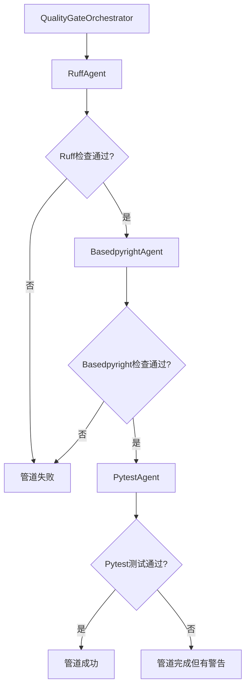
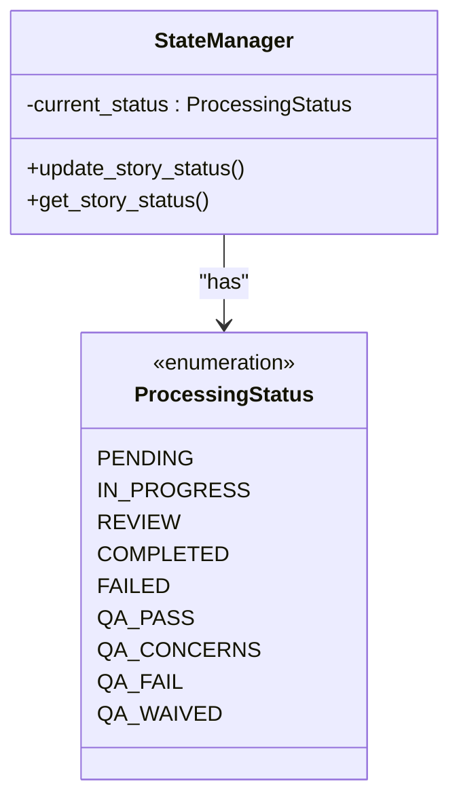
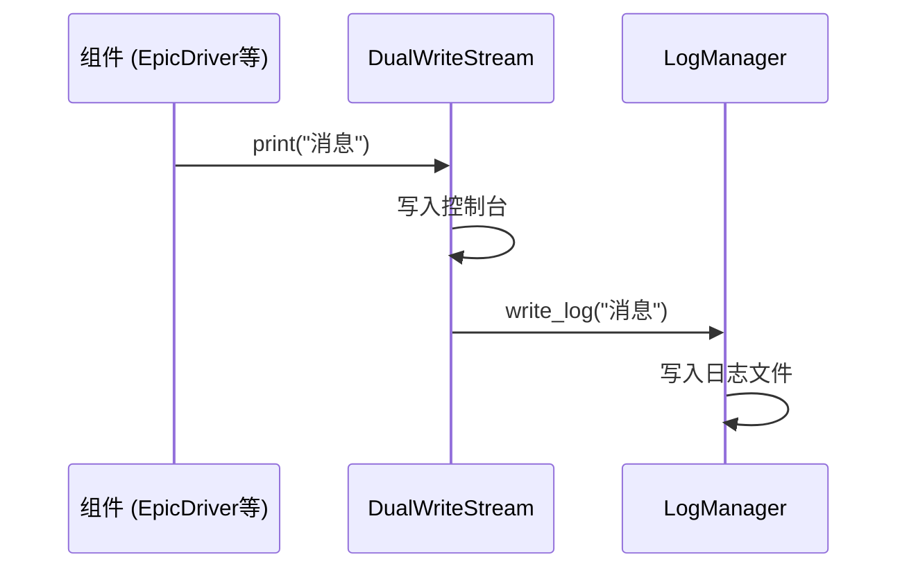

# 设计模式

<cite>
**本文档引用的文件**   
- [epic_driver.py](file://autoBMAD/epic_automation/epic_driver.py)
- [state_manager.py](file://autoBMAD/epic_automation/state_manager.py)
- [log_manager.py](file://autoBMAD/epic_automation/log_manager.py)
- [quality_agents.py](file://autoBMAD/epic_automation/quality_agents.py)
- [story_parser.py](file://autoBMAD/epic_automation/story_parser.py)
- [sdk_wrapper.py](file://autoBMAD/epic_automation/sdk_wrapper.py)
</cite>

## 目录
1. [命令模式](#命令模式)
2. [责任链模式](#责任链模式)
3. [状态模式](#状态模式)
4. [观察者模式](#观察者模式)
5. [模式协同与系统可维护性](#模式协同与系统可维护性)

## 命令模式

在本系统中，命令模式（Command Pattern）被用来封装和解耦工作流中的各个操作。`EpicDriver` 类作为命令模式的调用者（Invoker），负责协调整个自动化工作流的执行。它不直接实现具体的功能，而是通过持有对不同命令对象的引用（如 `sm_agent`, `dev_agent`, `qa_agent`）来触发相应的操作。

`EpicDriver` 的核心方法 `process_story` 封装了处理一个用户故事的完整命令序列。这个序列包括：由 `sm_agent` 创建故事、由 `dev_agent` 实现开发任务、由 `qa_agent` 进行质量审查，以及最后由 `QualityGateOrchestrator` 执行质量门控管道。通过将这些操作封装为命令，`EpicDriver` 可以以统一的方式调用它们，而无需了解每个代理（Agent）内部的具体实现细节。这种设计极大地提高了系统的灵活性和可扩展性，因为可以轻松地添加新的代理或修改现有代理，而不会影响 `EpicDriver` 的核心逻辑。

此外，`EpicDriver` 还支持重试机制，当一个故事处理失败时，它可以重新执行整个命令序列，这体现了命令模式在支持撤销、重试等操作上的优势。

**Section sources**
- [epic_driver.py](file://autoBMAD/epic_automation/epic_driver.py#L535-L800)
- [epic_driver.py](file://autoBMAD/epic_automation/epic_driver.py#L680-L800)

## 责任链模式

质量门控管道（Quality Gates Pipeline）是责任链模式（Chain of Responsibility Pattern）的一个典型应用。该模式通过将请求沿着一条链传递，直到有一个处理者（Handler）能够处理它为止，从而实现请求发送者与处理者之间的解耦。

在本系统中，`QualityGateOrchestrator` 类作为责任链的协调者，它将代码质量检查的请求依次传递给三个具体的处理者：`RuffAgent`（负责代码风格检查）、`BasedpyrightAgent`（负责类型检查）和 `PytestAgent`（负责单元测试执行）。每个处理者都实现了相同的接口（`execute_*_agent` 方法），并负责处理请求链中的一个特定环节。

责任链的执行流程是线性的且具有短路特性：如果 `RuffAgent` 的检查失败，整个管道会立即停止，并将失败结果返回给 `EpicDriver`，后续的 `BasedpyrightAgent` 和 `PytestAgent` 将不会被执行。这种设计确保了只有当所有前置检查都通过时，才会进行更耗时的测试执行，从而优化了资源利用并快速反馈问题。

**Diagram sources **
- [epic_driver.py](file://autoBMAD/epic_automation/epic_driver.py#L94-L533)
- [quality_agents.py](file://autoBMAD/epic_automation/quality_agents.py#L466-L563)

**Section sources**
- [epic_driver.py](file://autoBMAD/epic_automation/epic_driver.py#L94-L533)
- [quality_agents.py](file://autoBMAD/epic_automation/quality_agents.py#L466-L563)

## 状态模式

故事状态管理是状态模式（State Pattern）的直接应用。该模式允许一个对象在其内部状态改变时改变其行为，对象看起来似乎修改了它的类。

系统定义了一个 `ProcessingStatus` 枚举，它包含了故事可能处于的所有状态，如 `PENDING`（待处理）、`IN_PROGRESS`（进行中）、`REVIEW`（审查中）、`COMPLETED`（已完成）等。`StateManager` 类是状态模式的上下文（Context），它持有一个对当前状态的引用，并将与状态相关的行为委托给当前状态对象。

当故事的状态发生变化时（例如，从 `IN_PROGRESS` 变为 `REVIEW`），`StateManager` 会更新其内部状态。虽然在当前实现中，状态的转换逻辑是内联在 `StateManager` 中的，但其设计思想完全符合状态模式。例如，`update_story_status` 方法会根据新的状态值来决定如何更新数据库记录。这种设计将状态相关的复杂条件逻辑（if-else 或 switch-case）分散到各个状态类中，使得代码更加清晰、易于维护和扩展。如果未来需要为每个状态添加复杂的行为（如状态进入/退出时的钩子函数），只需为每个状态创建一个独立的类即可。

**Diagram sources **
- [state_manager.py](file://autoBMAD/epic_automation/state_manager.py#L100-L200)
- [story_parser.py](file://autoBMAD/epic_automation/story_parser.py#L80-L110)

**Section sources**
- [state_manager.py](file://autoBMAD/epic_automation/state_manager.py#L100-L200)
- [story_parser.py](file://autoBMAD/epic_automation/story_parser.py#L80-L110)

## 观察者模式

日志系统是观察者模式（Observer Pattern）的完美体现。该模式定义了对象之间的一对多依赖关系，当一个对象的状态发生改变时，所有依赖于它的对象都会得到通知并自动更新。

在本系统中，`LogManager` 是被观察的主题（Subject）。它负责管理日志文件的创建、写入和关闭。`DualWriteStream` 类是观察者（Observer），它被设计为一个自定义的流（stream），可以同时写入控制台和日志文件。当 `EpicDriver` 或其他组件通过 `print` 或 `logging` 模块输出信息时，这些信息首先被 `DualWriteStream` 捕获。

`DualWriteStream` 会将接收到的信息同时写入原始的 `sys.stdout`（控制台）和 `LogManager` 的日志文件中。这实现了日志的“双写”功能。`LogManager` 提供了 `write_log` 和 `write_sdk_message` 等方法，作为其被观察的接口。每当有新的日志条目需要写入时，`DualWriteStream` 就会调用这些方法，从而触发日志文件的更新。这种设计将日志的收集（观察者）与日志的存储和管理（主题）完全解耦，使得可以轻松地添加新的日志输出方式（如发送到远程服务器）而不影响现有代码。

**Diagram sources **
- [log_manager.py](file://autoBMAD/epic_automation/log_manager.py#L18-L298)
- [log_manager.py](file://autoBMAD/epic_automation/log_manager.py#L300-L357)

**Section sources**
- [log_manager.py](file://autoBMAD/epic_automation/log_manager.py#L18-L298)
- [log_manager.py](file://autoBMAD/epic_automation/log_manager.py#L300-L357)

## 模式协同与系统可维护性

这四种设计模式在系统中协同工作，共同构建了一个高度模块化、可扩展且易于维护的架构。

`EpicDriver` 作为命令模式的调用者，启动了整个工作流。它首先通过状态模式来管理每个故事的生命周期，确保故事在正确的状态下执行相应的操作。当开发和审查阶段完成后，`EpicDriver` 会触发责任链模式，启动质量门控管道。在这个过程中，日志系统（观察者模式）会实时记录所有操作和SDK的交互，为调试和审计提供了完整的追踪信息。

这种模式的组合带来了显著的优势。首先，**可维护性**得到极大提升。每个模式都清晰地划分了职责：命令模式负责流程编排，状态模式负责状态管理，责任链模式负责流程校验，观察者模式负责信息记录。这种高内聚、低耦合的设计使得修改一个模块不会轻易影响到其他模块。其次，**可扩展性**非常强。要添加一个新的质量检查工具，只需创建一个新的 `CodeQualityAgent` 子类，并将其添加到 `QualityGateOrchestrator` 的责任链中即可，无需修改 `EpicDriver` 的核心逻辑。同样，要改变日志的输出方式，只需实现一个新的观察者。

尽管这些模式带来了诸多好处，但也引入了一定的**复杂性**。代码的间接性增加，对于新开发者来说，理解整个工作流需要跟踪多个类和模式的交互。然而，这种复杂性是合理的，因为它将系统的核心复杂性（如状态转换、流程控制）从混乱的条件语句中解放出来，并将其封装在成熟的设计模式中，从而降低了长期维护的认知负担。