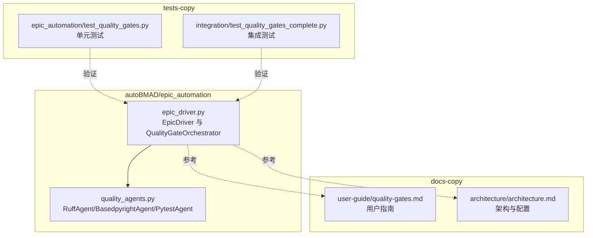
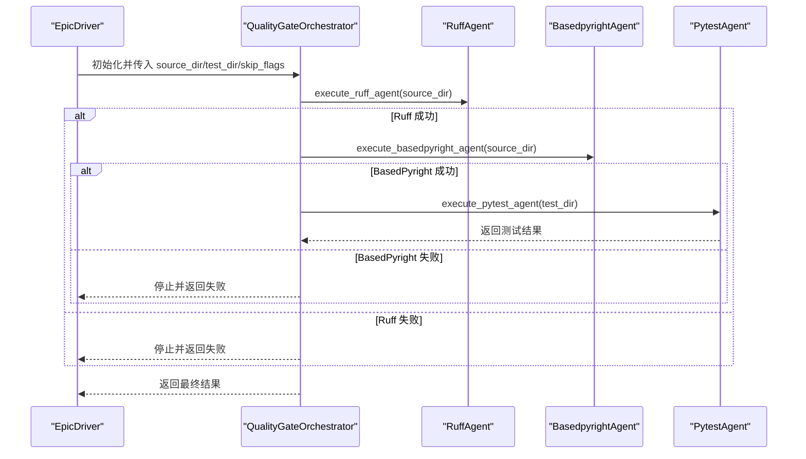
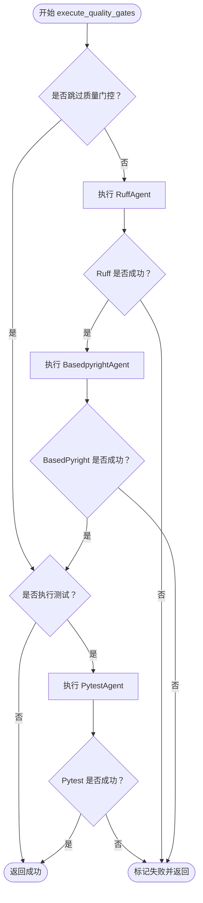
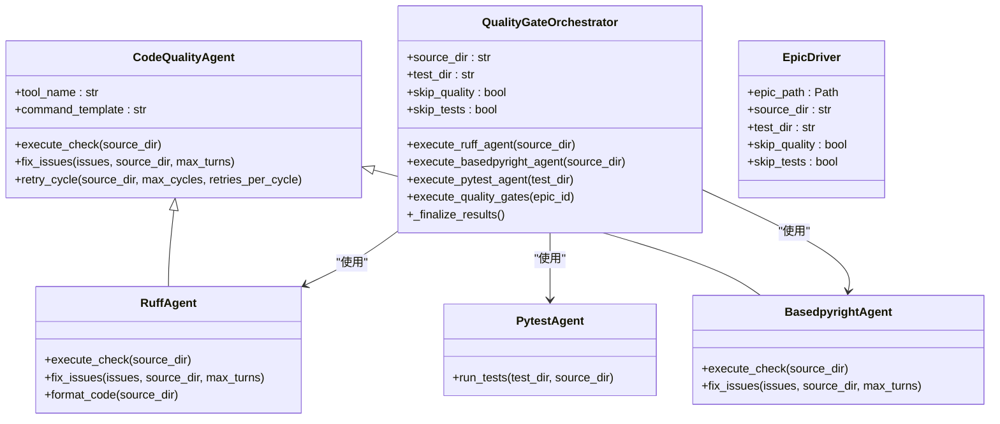
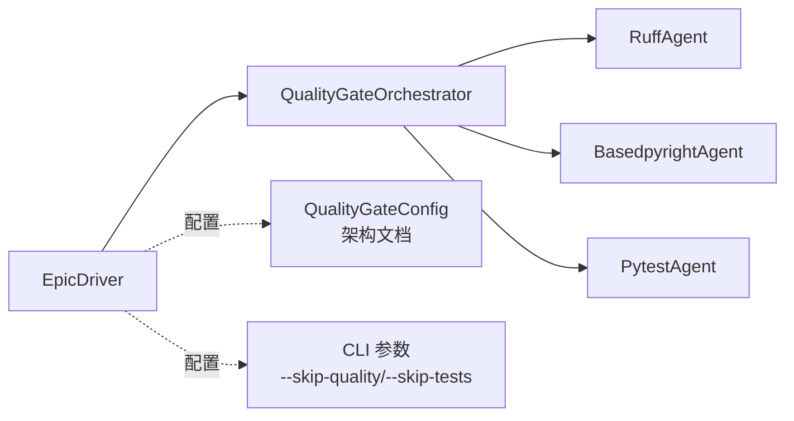

# 责任链模式

<cite>
**本文引用的文件**
- [epic_driver.py](file://autoBMAD/epic_automation/epic_driver.py)
- [quality_agents.py](file://autoBMAD/epic_automation/quality_agents.py)
- [quality-gates.md](file://docs-copy/user-guide/quality-gates.md)
- [architecture.md](file://docs-copy/architecture/architecture.md)
- [test_quality_gates.py](file://tests-copy/epic_automation/test_quality_gates.py)
- [test_quality_gates_complete.py](file://tests-copy/integration/test_quality_gates_complete.py)
</cite>

## 目录
1. [引言](#引言)
2. [项目结构](#项目结构)
3. [核心组件](#核心组件)
4. [架构总览](#架构总览)
5. [详细组件分析](#详细组件分析)
6. [依赖关系分析](#依赖关系分析)
7. [性能考量](#性能考量)
8. [故障排查指南](#故障排查指南)
9. [结论](#结论)
10. [附录](#附录)

## 引言
本文件围绕“责任链模式”在系统中的应用展开，重点阐述质量门控管道如何体现该模式：Ruff、BasedPyright 和 Pytest 三类质量检查如何依次组成一条责任链，每个检查作为链上的一个处理器，按顺序执行并决定是否将请求传递给下一个处理器；同时说明 EpicDriver 如何协调这条责任链，以及每个质量检查工具的职责划分。文档还提供代码级流程图与示例路径，帮助读者理解质量门控的执行流程，并说明该模式如何支持质量检查的灵活配置与扩展。

## 项目结构
质量门控相关的核心代码位于 autoBMAD/epic_automation 目录，用户指南与架构文档位于 docs-copy 目录，配套测试覆盖单元与集成场景。

图表来源
- [epic_driver.py](file://autoBMAD/epic_automation/epic_driver.py#L94-L533)
- [quality_agents.py](file://autoBMAD/epic_automation/quality_agents.py#L1-L1012)
- [quality-gates.md](file://docs-copy/user-guide/quality-gates.md#L1-L120)
- [architecture.md](file://docs-copy/architecture/architecture.md#L790-L812)
- [test_quality_gates.py](file://tests-copy/epic_automation/test_quality_gates.py#L1-L200)
- [test_quality_gates_complete.py](file://tests-copy/integration/test_quality_gates_complete.py#L170-L209)

章节来源
- [epic_driver.py](file://autoBMAD/epic_automation/epic_driver.py#L94-L533)
- [quality_agents.py](file://autoBMAD/epic_automation/quality_agents.py#L1-L1012)
- [quality-gates.md](file://docs-copy/user-guide/quality-gates.md#L1-L120)
- [architecture.md](file://docs-copy/architecture/architecture.md#L790-L812)

## 核心组件
- 质量门控编排器（QualityGateOrchestrator）
  - 负责顺序执行 Ruff、BasedPyright、Pytest 三个阶段，每个阶段可独立跳过或失败即短路。
  - 提供进度跟踪、错误收集与最终结果汇总。
- 质量检查代理（CodeQualityAgent 及其子类）
  - CodeQualityAgent：抽象基类，封装工具执行、JSON 输出解析、重试循环、自动修复提示生成等通用逻辑。
  - RuffAgent：面向 Ruff 的具体实现，负责执行检查、自动修复、格式化。
  - BasedpyrightAgent：面向 BasedPyright 的具体实现，负责类型检查与修复。
  - PytestAgent：面向 Pytest 的执行器，负责在虚拟环境中运行测试并返回结果。
- EpicDriver
  - 主驱动器，负责 SM-Dev-QA 循环后触发质量门控，接收 CLI 参数控制是否跳过质量门控与测试。

章节来源
- [epic_driver.py](file://autoBMAD/epic_automation/epic_driver.py#L94-L533)
- [quality_agents.py](file://autoBMAD/epic_automation/quality_agents.py#L1-L1012)

## 架构总览
质量门控以“责任链模式”组织：每个质量检查工具是一个处理器，链路顺序为 Ruff → BasedPyright → Pytest。当上游处理器失败时，后续处理器被短路；当上游处理器成功时，才进入下一个处理器。EpicDriver 在 QA 完成后调用 QualityGateOrchestrator，后者按顺序执行各阶段并汇总结果。

图表来源
- [epic_driver.py](file://autoBMAD/epic_automation/epic_driver.py#L450-L506)
- [quality_agents.py](file://autoBMAD/epic_automation/quality_agents.py#L908-L1012)

## 详细组件分析

### 责任链处理器：Ruff、BasedPyright、Pytest
- Ruff（风格与静态问题）
  - 职责：执行 Ruff 检查与自动修复，必要时执行格式化。
  - 行为：通过 CodeQualityAgent 的 retry_cycle 进行多轮检查与修复；若某轮无问题则提前结束；每轮结束后尝试格式化。
- BasedPyright（类型检查）
  - 职责：执行基于 JSON 输出的类型检查，提取诊断信息并交给修复流程。
  - 行为：解析诊断数据为统一问题列表，交由 Claude SDK 生成修复建议。
- Pytest（测试执行）
  - 职责：在虚拟环境中运行测试，返回通过/失败/跳过等统计。
  - 行为：检测测试目录与文件，定位 pytest 可执行路径，执行并解析返回码与输出；对“无测试可收集”的特殊返回码进行兼容处理。

章节来源
- [quality_agents.py](file://autoBMAD/epic_automation/quality_agents.py#L1-L1012)

### 编排器：QualityGateOrchestrator
- 职责
  - 维护质量门控的顺序执行与短路策略。
  - 收集各阶段结果、错误信息与进度状态，最终汇总成功/失败。
- 关键行为
  - execute_ruff_agent / execute_basedpyright_agent / execute_pytest_agent：分别执行对应阶段，支持跳过标志与异常捕获。
  - execute_quality_gates：按顺序串行执行三阶段，遇到失败立即返回；支持跳过质量门控或测试。
  - _finalize_results：计算总耗时、汇总错误、设置最终状态。

图表来源
- [epic_driver.py](file://autoBMAD/epic_automation/epic_driver.py#L450-L506)

章节来源
- [epic_driver.py](file://autoBMAD/epic_automation/epic_driver.py#L94-L533)

### 主驱动器：EpicDriver
- 职责
  - 解析 Epic 文档，驱动 SM-Dev-QA 循环。
  - 在 QA 完成后，根据 skip_quality 与 skip_tests 参数，调用 QualityGateOrchestrator 执行质量门控。
- 关键行为
  - 初始化参数（source_dir/test_dir/skip_flags），解析 CLI。
  - 在 QA 阶段完成后，调用质量门控编排器，汇总结果并推进后续流程。

章节来源
- [epic_driver.py](file://autoBMAD/epic_automation/epic_driver.py#L535-L700)

### 类关系图（代码级）

图表来源
- [epic_driver.py](file://autoBMAD/epic_automation/epic_driver.py#L94-L533)
- [quality_agents.py](file://autoBMAD/epic_automation/quality_agents.py#L1-L1012)

## 依赖关系分析
- 质量门控编排器依赖于质量检查代理（Ruff、BasedPyright、Pytest）的具体实现。
- EpicDriver 依赖 QualityGateOrchestrator，并通过 CLI 参数控制质量门控与测试的执行与否。
- 用户指南与架构文档提供了配置项与最佳实践，测试用例覆盖了跳过标志、失败短路、顺序执行等关键行为。

图表来源
- [epic_driver.py](file://autoBMAD/epic_automation/epic_driver.py#L535-L700)
- [quality_agents.py](file://autoBMAD/epic_automation/quality_agents.py#L908-L1012)
- [architecture.md](file://docs-copy/architecture/architecture.md#L790-L812)

章节来源
- [architecture.md](file://docs-copy/architecture/architecture.md#L790-L812)
- [test_quality_gates.py](file://tests-copy/epic_automation/test_quality_gates.py#L1-L200)
- [test_quality_gates_complete.py](file://tests-copy/integration/test_quality_gates_complete.py#L170-L209)

## 性能考量
- 并发与延迟：架构文档建议在并发模式下使用并发处理与连接池优化，但质量门控默认采用顺序执行以保证一致性与可追踪性。
- 资源管理：对外部命令设置超时、隔离子进程、避免取消传播导致的阻塞。
- 重试策略：每个工具内置重试循环，减少一次性失败带来的波动。

章节来源
- [architecture.md](file://docs-copy/architecture/architecture.md#L813-L842)

## 故障排查指南
- 跳过质量门控与测试
  - 当 --skip-quality 或 --skip-tests 设置时，相应阶段会被跳过，测试用例覆盖了该行为。
- 失败短路
  - 若 Ruff 或 BasedPyright 失败，后续阶段不会执行；测试阶段失败仅影响最终成功标志但不中断流程。
- 日志与进度
  - 编排器记录阶段开始/结束时间、当前阶段、错误列表，便于定位问题。
- 配置与规则
  - 用户指南提供了基于 pyproject.toml 的配置示例，包括 BasedPyright 严格模式与 Ruff 规则选择。

章节来源
- [test_quality_gates_complete.py](file://tests-copy/integration/test_quality_gates_complete.py#L170-L209)
- [quality-gates.md](file://docs-copy/user-guide/quality-gates.md#L1-L120)
- [epic_driver.py](file://autoBMAD/epic_automation/epic_driver.py#L94-L533)

## 结论
本系统通过“责任链模式”将 Ruff、BasedPyright、Pytest 串联为质量门控流水线：上游失败即短路，下游仅在上游成功时执行。EpicDriver 在 QA 完成后触发编排器，结合 CLI 跳过标志与内部重试机制，实现了稳定、可控且可扩展的质量检查流程。该设计既满足日常开发的快速迭代需求，又能在关键节点强制执行质量把关，确保交付质量。

## 附录
- 示例路径（代码片段路径）
  - 质量门控顺序执行与短路逻辑：[execute_quality_gates](file://autoBMAD/epic_automation/epic_driver.py#L450-L506)
  - Ruff 执行与格式化：[RuffAgent.retry_cycle/format_code](file://autoBMAD/epic_automation/quality_agents.py#L279-L530)
  - BasedPyright 执行与修复：[BasedpyrightAgent.execute_check/fix_issues](file://autoBMAD/epic_automation/quality_agents.py#L566-L760)
  - Pytest 执行与返回码处理：[PytestAgent.run_tests](file://autoBMAD/epic_automation/quality_agents.py#L762-L883)
  - 质量门控流水线（新式 Pipeline 类）：[QualityGatePipeline.execute_pipeline](file://autoBMAD/epic_automation/quality_agents.py#L908-L1012)
  - 跳过质量门控与测试的行为验证：[test_skip_quality_flag/test_skip_tests_flag](file://tests-copy/integration/test_quality_gates_complete.py#L170-L209)
  - 质量门控顺序与失败短路的单元测试：[test_execute_quality_gates_ruff_failure](file://tests-copy/epic_automation/test_quality_gates.py#L204-L223)