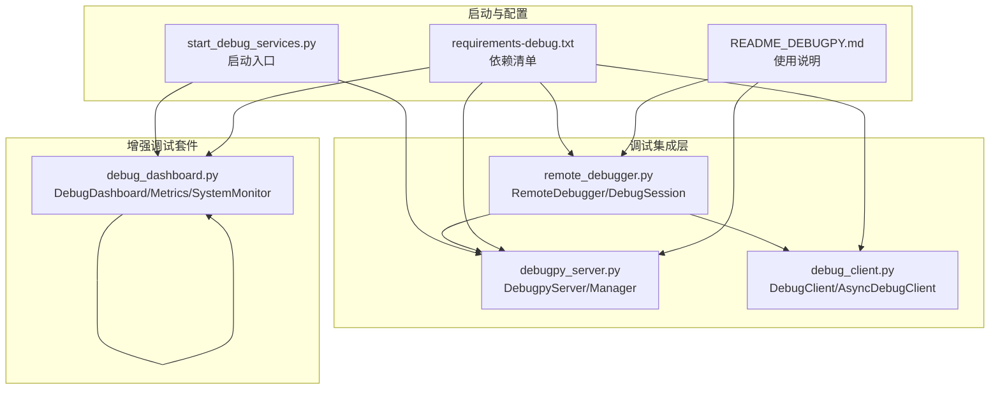
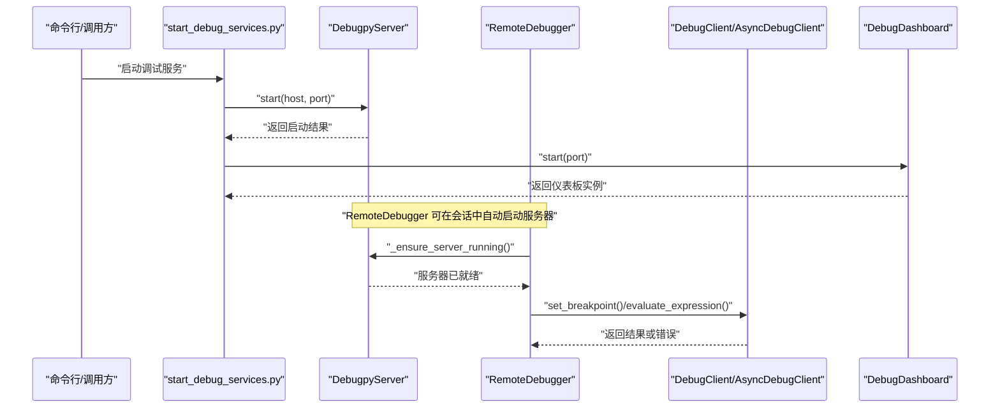
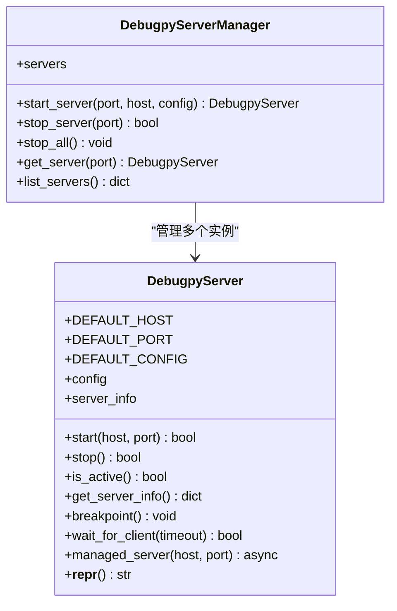
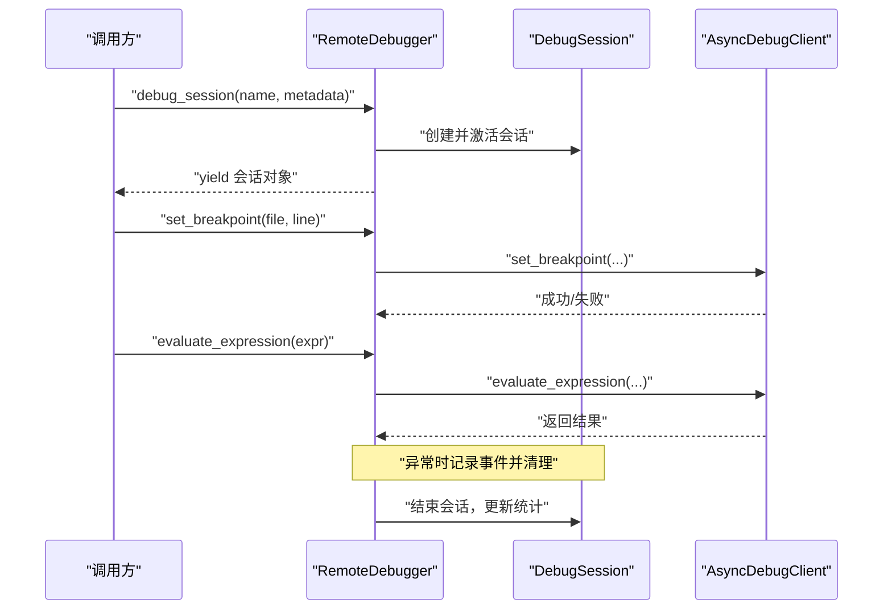
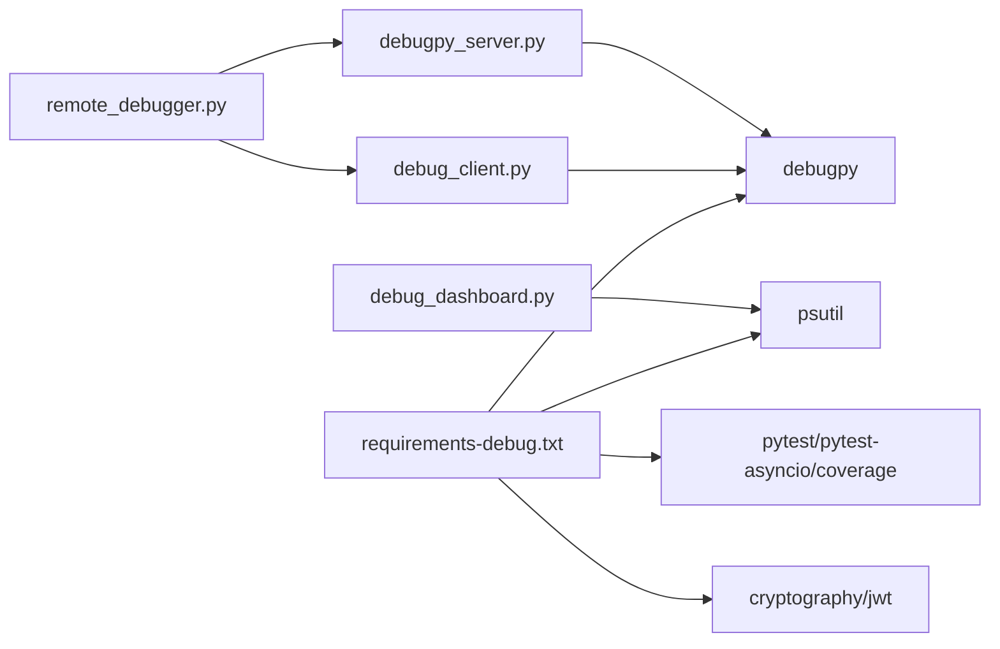

# Debugpy服务器集成

<cite>
**本文引用的文件**
- [start_debug_services.py](file://BUGFIX_20260107/start_debug_services.py)
- [debugpy_server.py](file://BUGFIX_20260107/debugpy_integration/debugpy_server.py)
- [README_DEBUGPY.md](file://BUGFIX_20260107/README_DEBUGPY.md)
- [debug_client.py](file://BUGFIX_20260107/debugpy_integration/debug_client.py)
- [remote_debugger.py](file://BUGFIX_20260107/debugpy_integration/remote_debugger.py)
- [debug_dashboard.py](file://BUGFIX_20260107/enhanced_debug_suite/debug_dashboard.py)
- [requirements-debug.txt](file://BUGFIX_20260107/requirements-debug.txt)
</cite>

## 目录
1. [简介](#简介)
2. [项目结构](#项目结构)
3. [核心组件](#核心组件)
4. [架构总览](#架构总览)
5. [详细组件分析](#详细组件分析)
6. [依赖关系分析](#依赖关系分析)
7. [性能与并发特性](#性能与并发特性)
8. [故障排查指南](#故障排查指南)
9. [结论](#结论)
10. [附录](#附录)

## 简介
本文件围绕 Debugpy 服务器集成进行深入说明，重点聚焦于 debugpy_server.py 的实现机制，并结合 start_debug_services.py 的启动流程，阐述端口配置、主机绑定、等待客户端连接、生命周期管理、会话初始化与最佳实践。同时给出安全配置建议、常见连接问题排查方法、多环境部署注意事项，并对照 README_DEBUGPY.md 中的开发/生产差异说明，帮助读者在不同环境下正确启用与维护远程调试能力。

## 项目结构
与 Debugpy 集成相关的关键目录与文件：
- debugpy_integration：Debugpy 服务器、客户端与远程调试器实现
- enhanced_debug_suite：增强调试套件（包含调试仪表板）
- configs：调试配置文件（JSON/YAML）
- requirements-debug.txt：调试相关依赖清单
- start_debug_services.py：统一启动入口，支持同时启动 Debugpy 服务器与仪表板

图表来源
- [start_debug_services.py](file://BUGFIX_20260107/start_debug_services.py#L1-L151)
- [debugpy_server.py](file://BUGFIX_20260107/debugpy_integration/debugpy_server.py#L1-L408)
- [debug_client.py](file://BUGFIX_20260107/debugpy_integration/debug_client.py#L1-L650)
- [remote_debugger.py](file://BUGFIX_20260107/debugpy_integration/remote_debugger.py#L1-L683)
- [debug_dashboard.py](file://BUGFIX_20260107/enhanced_debug_suite/debug_dashboard.py#L1-L469)
- [requirements-debug.txt](file://BUGFIX_20260107/requirements-debug.txt#L1-L58)
- [README_DEBUGPY.md](file://BUGFIX_20260107/README_DEBUGPY.md#L1-L194)

章节来源
- [start_debug_services.py](file://BUGFIX_20260107/start_debug_services.py#L1-L151)
- [README_DEBUGPY.md](file://BUGFIX_20260107/README_DEBUGPY.md#L1-L194)

## 核心组件
- DebugpyServer：封装 debugpy 服务器的启动、停止、等待客户端连接、断点触发、生命周期管理与上下文管理器接口。
- DebugpyServerManager：多端口多实例管理器，支持按端口启动/停止与查询。
- DebugClient/AsyncDebugClient：调试客户端，提供连接、断点、表达式求值、栈追踪、线程/协程信息等能力。
- RemoteDebugger：高层远程调试器，负责会话管理、事件处理、统计、自动启动服务器等。
- DebugDashboard：实时仪表板，采集操作指标、错误、系统资源，提供统计数据与报告导出。

章节来源
- [debugpy_server.py](file://BUGFIX_20260107/debugpy_integration/debugpy_server.py#L1-L408)
- [debug_client.py](file://BUGFIX_20260107/debugpy_integration/debug_client.py#L1-L650)
- [remote_debugger.py](file://BUGFIX_20260107/debugpy_integration/remote_debugger.py#L1-L683)
- [debug_dashboard.py](file://BUGFIX_20260107/enhanced_debug_suite/debug_dashboard.py#L1-L469)

## 架构总览
Debugpy 服务器集成采用“服务器管理器 + 客户端 + 远程调试器 + 仪表板”的分层设计。启动入口通过 asyncio 并发启动服务器与仪表板；远程调试器在需要时自动确保服务器处于活动状态，并通过会话上下文管理调试生命周期。

图表来源
- [start_debug_services.py](file://BUGFIX_20260107/start_debug_services.py#L1-L151)
- [debugpy_server.py](file://BUGFIX_20260107/debugpy_integration/debugpy_server.py#L99-L183)
- [remote_debugger.py](file://BUGFIX_20260107/debugpy_integration/remote_debugger.py#L112-L121)
- [debug_client.py](file://BUGFIX_20260107/debugpy_integration/debug_client.py#L95-L163)

## 详细组件分析

### DebugpyServer：服务器生命周期与连接监听
- 默认主机与端口：默认绑定到本地回环地址，便于开发环境安全使用。
- 启动流程：调用底层监听接口后记录 server_info（含主机、端口、启动时间、进程ID），可选择等待调试器客户端连接。
- 停止流程：当前实现通过进程退出实现服务器停止，内部标记为非活跃状态并记录运行时长。
- 上下文管理器：managed_server 提供自动启动/停止的异步上下文，适合在会话中使用。
- 等待客户端：支持带超时的等待，避免长时间阻塞。
- 断点触发：在服务器处于活动状态且已连接时，可在代码中触发断点。
- 日志：支持控制台与文件双通道输出，级别可配置。

图表来源
- [debugpy_server.py](file://BUGFIX_20260107/debugpy_integration/debugpy_server.py#L21-L408)

章节来源
- [debugpy_server.py](file://BUGFIX_20260107/debugpy_integration/debugpy_server.py#L29-L183)
- [debugpy_server.py](file://BUGFIX_20260107/debugpy_integration/debugpy_server.py#L263-L287)

### RemoteDebugger：会话初始化与事件处理
- 会话模型：DebugSession 记录会话标识、名称、起始时间、断点列表、事件列表与元数据。
- 会话管理：debug_session 上下文管理器负责创建、激活、统计与清理；异常时记录事件并重新抛出。
- 断点与表达式：委托给 AsyncDebugClient 完成断点设置/移除与表达式求值。
- 事件系统：注册处理器，记录事件并更新统计；支持异常、暂停、继续等事件类型。
- 自动启动：可配置自动启动服务器，确保调试器可用。
- 统计与查询：提供会话统计、会话列表与会话详情查询。

图表来源
- [remote_debugger.py](file://BUGFIX_20260107/debugpy_integration/remote_debugger.py#L123-L194)
- [remote_debugger.py](file://BUGFIX_20260107/debugpy_integration/remote_debugger.py#L198-L303)
- [remote_debugger.py](file://BUGFIX_20260107/debugpy_integration/remote_debugger.py#L304-L433)

章节来源
- [remote_debugger.py](file://BUGFIX_20260107/debugpy_integration/remote_debugger.py#L23-L111)
- [remote_debugger.py](file://BUGFIX_20260107/debugpy_integration/remote_debugger.py#L123-L194)
- [remote_debugger.py](file://BUGFIX_20260107/debugpy_integration/remote_debugger.py#L198-L433)

### DebugClient/AsyncDebugClient：客户端能力与上下文管理
- 连接与断开：提供连接/断开方法，记录连接信息。
- 断点管理：支持设置/移除断点，可带条件与命中次数。
- 表达式求值：在指定作用域内求值表达式，返回结果摘要。
- 栈追踪与变量：获取同步/异步栈追踪、线程列表、协程信息与变量列表。
- 上下文管理：connected_client 提供自动连接/断开的异步上下文。
- 全局实例：提供全局 AsyncDebugClient 获取方法，便于跨模块使用。

章节来源
- [debug_client.py](file://BUGFIX_20260107/debugpy_integration/debug_client.py#L17-L487)
- [debug_client.py](file://BUGFIX_20260107/debugpy_integration/debug_client.py#L489-L650)

### DebugDashboard：指标采集与系统监控
- 指标采集：MetricsCollector 记录操作、错误、取消范围错误，维护历史长度。
- 统计计算：计算成功率、平均耗时、错误率、最近一分钟指标等。
- 系统监控：SystemMonitor 在可用时采集 CPU、内存、线程数等指标。
- 数据聚合：get_dashboard_data 汇总状态、指标、系统、错误与取消范围错误统计。
- 报告导出：save_report 将当前数据保存为 JSON 文件；print_summary 控制台摘要输出。

章节来源
- [debug_dashboard.py](file://BUGFIX_20260107/enhanced_debug_suite/debug_dashboard.py#L1-L469)

### 启动入口：start_debug_services.py
- 单独启动：支持仅启动 Debugpy 服务器或仅启动仪表板。
- 并发启动：支持同时启动服务器与仪表板，使用 asyncio.gather 管理任务。
- 参数解析：支持自定义服务器端口与仪表板端口，默认端口分别为 5678 与 8080。
- 优雅关闭：捕获中断信号，取消任务并等待完成，最后输出停止提示。

章节来源
- [start_debug_services.py](file://BUGFIX_20260107/start_debug_services.py#L1-L151)

## 依赖关系分析
- debugpy：远程调试核心，用于服务器监听与客户端交互。
- psutil：系统资源监控，仪表板使用。
- aiohttp/websockets/asyncio-mqtt：可选的网络与分布式能力，用于扩展通信方式。
- pytest/pytest-asyncio/coverage：测试与覆盖率工具链，保障质量。
- cryptography/jwt：安全相关依赖，可用于令牌与加密场景（与调试集成可配合使用）。

图表来源
- [requirements-debug.txt](file://BUGFIX_20260107/requirements-debug.txt#L1-L58)
- [debugpy_server.py](file://BUGFIX_20260107/debugpy_integration/debugpy_server.py#L1-L48)
- [debug_client.py](file://BUGFIX_20260107/debugpy_integration/debug_client.py#L1-L20)
- [debug_dashboard.py](file://BUGFIX_20260107/enhanced_debug_suite/debug_dashboard.py#L1-L23)
- [remote_debugger.py](file://BUGFIX_20260107/debugpy_integration/remote_debugger.py#L1-L20)

章节来源
- [requirements-debug.txt](file://BUGFIX_20260107/requirements-debug.txt#L1-L58)

## 性能与并发特性
- 异步等待客户端：wait_for_client 使用 asyncio.wait_for 包裹底层等待，避免无限阻塞。
- 并发启动：启动入口使用 asyncio.create_task 与 asyncio.gather 并发启动服务器与仪表板，提高启动效率。
- 事件循环与资源清理：RemoteDebugger 在异常时记录事件并清理会话，避免资源泄漏。
- 仪表板轮询：DebugDashboard 主循环以固定间隔更新，避免高负载；可通过 update_interval 调整。

章节来源
- [debugpy_server.py](file://BUGFIX_20260107/debugpy_integration/debugpy_server.py#L216-L249)
- [start_debug_services.py](file://BUGFIX_20260107/start_debug_services.py#L57-L80)
- [remote_debugger.py](file://BUGFIX_20260107/debugpy_integration/remote_debugger.py#L165-L194)
- [debug_dashboard.py](file://BUGFIX_20260107/enhanced_debug_suite/debug_dashboard.py#L197-L226)

## 故障排查指南
- 端口占用
  - 现象：启动失败或报错提示端口不可用。
  - 排查：确认 5678（默认）与 8080（仪表板默认）未被其他进程占用；必要时修改启动参数。
  - 参考：启动入口支持自定义端口。
  
  章节来源
  - [start_debug_services.py](file://BUGFIX_20260107/start_debug_services.py#L109-L121)

- 防火墙拦截
  - 现象：IDE 无法连接到 localhost:5678。
  - 排查：检查本地防火墙规则；确保仅监听 127.0.0.1（见默认主机配置）。
  - 参考：服务器默认绑定到本地回环地址，减少外部访问风险。

  章节来源
  - [debugpy_server.py](file://BUGFIX_20260107/debugpy_integration/debugpy_server.py#L29-L38)

- 超时等待客户端
  - 现象：等待客户端连接超时。
  - 处理：在调用 wait_for_client 时传入合理超时；或在 IDE 中尽快发起连接。
  - 参考：DebugpyServer.wait_for_client 支持超时参数。

  章节来源
  - [debugpy_server.py](file://BUGFIX_20260107/debugpy_integration/debugpy_server.py#L216-L249)

- 依赖缺失
  - 现象：无法导入 debugpy 或功能受限。
  - 处理：安装 requirements-debug.txt 中的依赖；确认 debugpy 版本满足要求。
  - 参考：依赖清单包含 debugpy、psutil、pytest 等。

  章节来源
  - [requirements-debug.txt](file://BUGFIX_20260107/requirements-debug.txt#L1-L20)

- 仪表板无法显示系统指标
  - 现象：系统指标字段为空或报错。
  - 处理：安装 psutil；若不可用，仪表板会返回占位信息。

  章节来源
  - [debug_dashboard.py](file://BUGFIX_20260107/enhanced_debug_suite/debug_dashboard.py#L126-L165)

## 结论
该 Debugpy 服务器集成提供了从启动、连接、会话管理到可视化监控的完整链路。DebugpyServer 负责底层服务器生命周期与连接等待；RemoteDebugger 提供高层会话与事件管理；DebugClient/AsyncDebugClient 提供调试能力；DebugDashboard 则提供运行时指标与系统监控。通过启动入口与配置文件，开发者可以在不同环境中灵活启用与维护远程调试能力。

## 附录

### 最佳实践：服务启动与关闭
- 启动服务器
  - 使用启动入口指定端口，或直接调用 DebugpyServer.start(host, port)。
  - 若需要等待客户端再继续执行，使用 wait_for_client 或保持默认等待行为。
  - 参考路径：[start_debug_services.py](file://BUGFIX_20260107/start_debug_services.py#L20-L37)，[debugpy_server.py](file://BUGFIX_20260107/debugpy_integration/debugpy_server.py#L99-L148)

- 关闭服务器
  - 通过进程退出实现服务器停止；也可使用 DebugpyServer.stop() 标记为非活跃并记录运行时长。
  - 参考路径：[debugpy_server.py](file://BUGFIX_20260107/debugpy_integration/debugpy_server.py#L154-L183)

- 会话初始化
  - 使用 RemoteDebugger.debug_session 上下文管理器创建会话，自动统计与清理。
  - 参考路径：[remote_debugger.py](file://BUGFIX_20260107/debugpy_integration/remote_debugger.py#L123-L194)

- 仪表板使用
  - 启动仪表板并定期更新指标；必要时导出报告。
  - 参考路径：[debug_dashboard.py](file://BUGFIX_20260107/enhanced_debug_suite/debug_dashboard.py#L197-L226)

### 安全配置建议
- 仅本地连接
  - 默认绑定到 127.0.0.1，避免外部网络暴露。
  - 参考路径：[debugpy_server.py](file://BUGFIX_20260107/debugpy_integration/debugpy_server.py#L29-L38)

- 生产与开发差异
  - 开发环境：默认等待客户端、开启详细日志、允许本地连接。
  - 生产环境：建议禁用远程调试或仅在受控网络内启用；严格限制主机绑定与端口暴露。
  - 参考路径：[README_DEBUGPY.md](file://BUGFIX_20260107/README_DEBUGPY.md#L1-L194)

### 多环境部署注意事项
- Docker/Kubernetes
  - 仅映射必要端口（如 5678），并在容器内绑定到 127.0.0.1 或通过反向代理转发。
- CI/CD
  - 在流水线中按需安装 requirements-debug.txt；仅在调试阶段启用远程调试。
- 网络策略
  - 限制入站流量至可信 IP 段；使用防火墙规则阻止外部访问。

章节来源
- [debugpy_server.py](file://BUGFIX_20260107/debugpy_integration/debugpy_server.py#L29-L48)
- [README_DEBUGPY.md](file://BUGFIX_20260107/README_DEBUGPY.md#L1-L194)