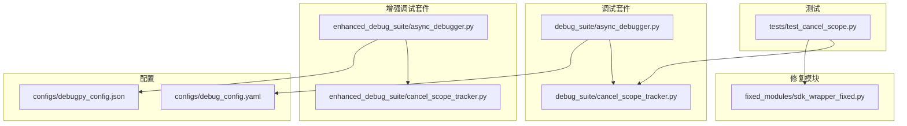
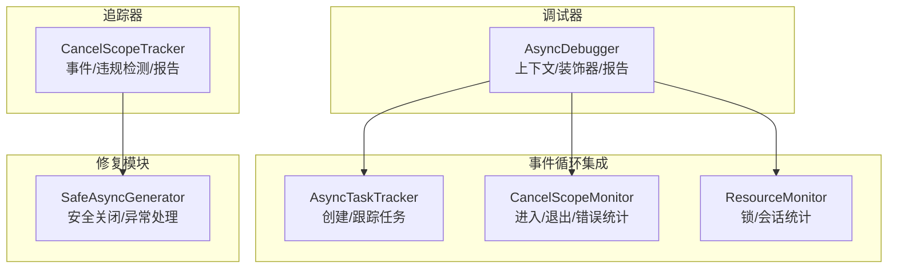
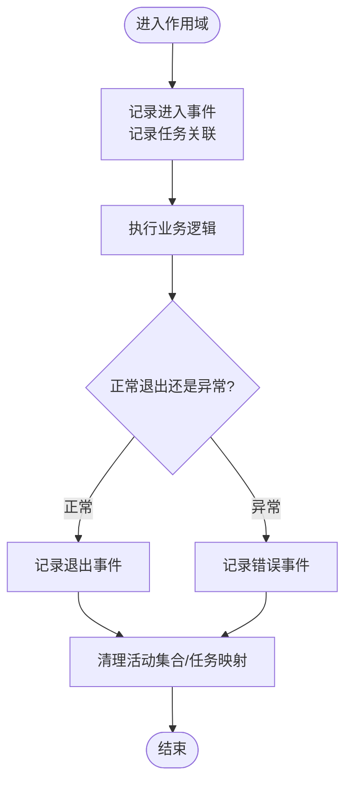
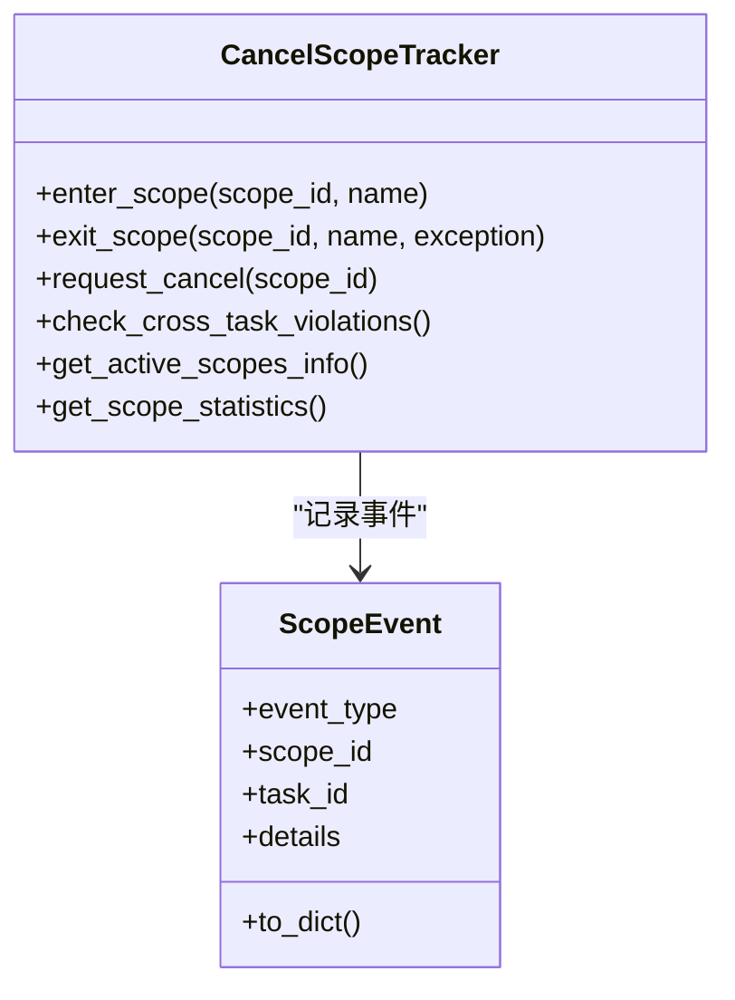
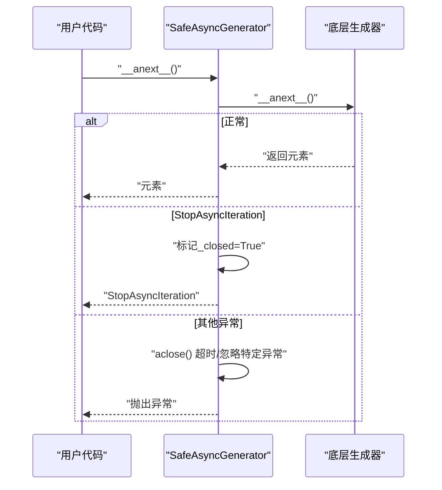
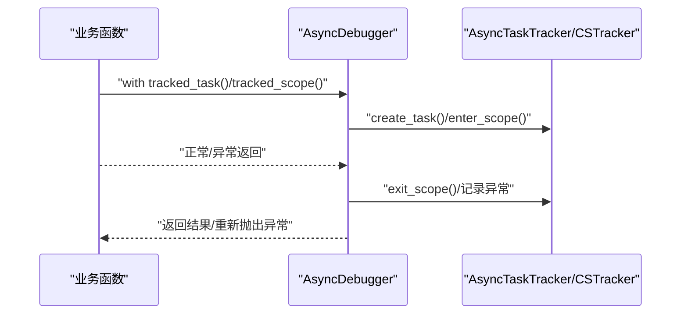
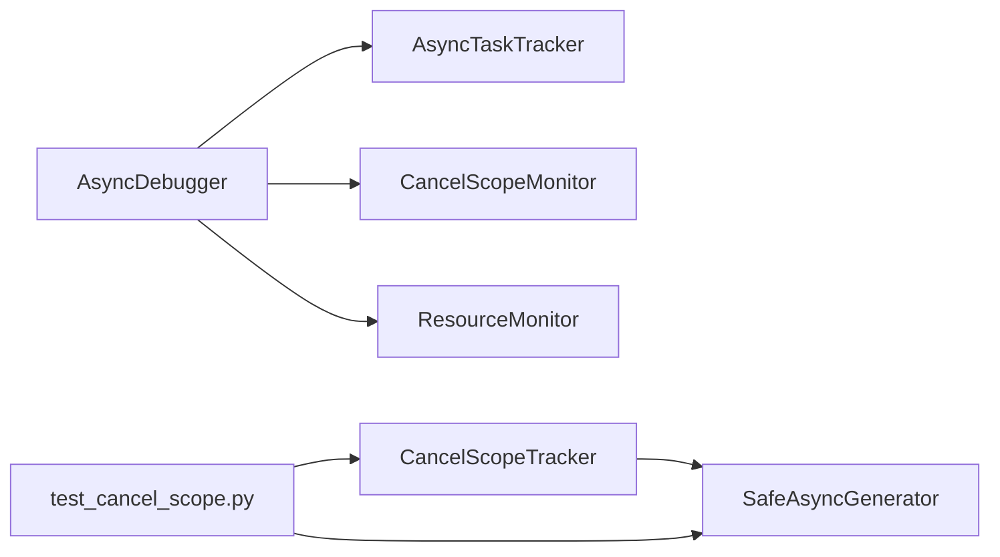

# 异步调试工具套件

<cite>
**本文引用的文件**
- [async_debugger.py](file://BUGFIX_20260107/debug_suite/async_debugger.py)
- [cancel_scope_tracker.py](file://BUGFIX_20260107/debug_suite/cancel_scope_tracker.py)
- [test_cancel_scope.py](file://BUGFIX_20260107/tests/test_cancel_scope.py)
- [async_debugger.py（增强版）](file://BUGFIX_20260107/enhanced_debug_suite/async_debugger.py)
- [cancel_scope_tracker.py（增强版）](file://BUGFIX_20260107/enhanced_debug_suite/cancel_scope_tracker.py)
- [sdk_wrapper_fixed.py](file://BUGFIX_20260107/fixed_modules/sdk_wrapper_fixed.py)
- [debug_config.yaml](file://BUGFIX_20260107/configs/debug_config.yaml)
- [debugpy_config.json](file://BUGFIX_20260107/configs/debugpy_config.json)
</cite>

## 目录
1. [简介](#简介)
2. [项目结构](#项目结构)
3. [核心组件](#核心组件)
4. [架构总览](#架构总览)
5. [详细组件分析](#详细组件分析)
6. [依赖关系分析](#依赖关系分析)
7. [性能考量](#性能考量)
8. [故障排查指南](#故障排查指南)
9. [结论](#结论)
10. [附录](#附录)

## 简介
本文件围绕异步调试工具套件，聚焦以下目标：
- 深入解析 async_debugger.py 对 asyncio 事件循环的深度集成机制
- 详解 cancel_scope_tracker.py 如何监控和追踪取消作用域状态变化，防止资源泄漏
- 阐述取消作用域与任务生命周期的关联关系
- 提供在复杂异步工作流中定位取消异常的实战案例
- 结合 test_cancel_scope.py 中的测试用例，展示典型使用场景与边界条件处理
- 给出性能开销评估、调试信息过滤与日志级别控制的最佳实践建议

## 项目结构
该套件位于仓库的“BUGFIX_20260107”分支下，包含两套实现：
- debug_suite：基础版调试工具
- enhanced_debug_suite：增强版调试工具（集成 debugpy 远程调试）
- fixed_modules：修复模块（如 SDK 包装器，解决跨任务取消作用域问题）
- tests：测试用例（验证取消作用域追踪与边界行为）
- configs：调试配置（YAML/JSON）



图表来源
- [async_debugger.py](file://BUGFIX_20260107/debug_suite/async_debugger.py#L1-L420)
- [cancel_scope_tracker.py](file://BUGFIX_20260107/debug_suite/cancel_scope_tracker.py#L1-L368)
- [async_debugger.py（增强版）](file://BUGFIX_20260107/enhanced_debug_suite/async_debugger.py#L1-L559)
- [cancel_scope_tracker.py（增强版）](file://BUGFIX_20260107/enhanced_debug_suite/cancel_scope_tracker.py#L1-L368)
- [sdk_wrapper_fixed.py](file://BUGFIX_20260107/fixed_modules/sdk_wrapper_fixed.py#L1-L592)
- [test_cancel_scope.py](file://BUGFIX_20260107/tests/test_cancel_scope.py#L1-L337)
- [debug_config.yaml](file://BUGFIX_20260107/configs/debug_config.yaml#L1-L334)
- [debugpy_config.json](file://BUGFIX_20260107/configs/debugpy_config.json#L1-L96)

章节来源
- [async_debugger.py](file://BUGFIX_20260107/debug_suite/async_debugger.py#L1-L420)
- [cancel_scope_tracker.py](file://BUGFIX_20260107/debug_suite/cancel_scope_tracker.py#L1-L368)
- [async_debugger.py（增强版）](file://BUGFIX_20260107/enhanced_debug_suite/async_debugger.py#L1-L559)
- [cancel_scope_tracker.py（增强版）](file://BUGFIX_20260107/enhanced_debug_suite/cancel_scope_tracker.py#L1-L368)
- [sdk_wrapper_fixed.py](file://BUGFIX_20260107/fixed_modules/sdk_wrapper_fixed.py#L1-L592)
- [test_cancel_scope.py](file://BUGFIX_20260107/tests/test_cancel_scope.py#L1-L337)
- [debug_config.yaml](file://BUGFIX_20260107/configs/debug_config.yaml#L1-L334)
- [debugpy_config.json](file://BUGFIX_20260107/configs/debugpy_config.json#L1-L96)

## 核心组件
- 任务跟踪器 AsyncTaskTracker：创建并跟踪 asyncio 任务，记录完成/失败状态，便于定位失败任务与资源泄漏。
- 取消作用域监控器 CancelScopeMonitor：记录进入/退出取消作用域事件，统计错误率与活动数量，辅助定位取消异常。
- 资源监控器 ResourceMonitor：跟踪锁获取/释放与 SDK 会话生命周期，输出统计信息，辅助排查资源泄漏。
- 异步调试器 AsyncDebugger：整合任务、取消作用域与资源监控，提供上下文管理器与装饰器，生成调试报告与摘要。
- 取消作用域追踪器 CancelScopeTracker（独立版）：记录进入/退出/取消/错误事件，检测跨任务访问违规，生成报告与事件日志。
- 安全异步生成器 SafeAsyncGenerator：封装 SDK 生成器，确保在取消或异常时安全关闭，避免跨任务取消作用域错误。
- 测试用例 test_cancel_scope.py：覆盖嵌套、并发、异常、取消交互、大体量数据等边界场景。

章节来源
- [async_debugger.py](file://BUGFIX_20260107/debug_suite/async_debugger.py#L19-L135)
- [async_debugger.py](file://BUGFIX_20260107/debug_suite/async_debugger.py#L137-L210)
- [async_debugger.py](file://BUGFIX_20260107/debug_suite/async_debugger.py#L211-L361)
- [cancel_scope_tracker.py](file://BUGFIX_20260107/debug_suite/cancel_scope_tracker.py#L19-L174)
- [sdk_wrapper_fixed.py](file://BUGFIX_20260107/fixed_modules/sdk_wrapper_fixed.py#L82-L135)
- [test_cancel_scope.py](file://BUGFIX_20260107/tests/test_cancel_scope.py#L1-L337)

## 架构总览
异步调试工具通过上下文管理器与装饰器无缝集成到业务代码中，自动记录关键事件并生成报告。增强版还引入 debugpy 远程调试能力，支持断点与会话统计。



图表来源
- [async_debugger.py](file://BUGFIX_20260107/debug_suite/async_debugger.py#L19-L135)
- [async_debugger.py](file://BUGFIX_20260107/debug_suite/async_debugger.py#L211-L361)
- [cancel_scope_tracker.py](file://BUGFIX_20260107/debug_suite/cancel_scope_tracker.py#L19-L174)
- [sdk_wrapper_fixed.py](file://BUGFIX_20260107/fixed_modules/sdk_wrapper_fixed.py#L82-L135)

## 详细组件分析

### 任务生命周期与事件循环集成
- 任务创建与回调：AsyncTaskTracker 使用 asyncio.create_task 创建任务，并注册完成回调以更新状态与异常信息。
- 任务状态汇总：提供活动任务、完成/失败计数与总数统计，便于快速定位异常任务。
- 事件循环集成要点：
  - 通过 done_callback 在事件循环中回调，确保与事件循环线程一致
  - 使用 datetime 记录创建/完成时间，便于分析耗时与泄漏

```mermaid
sequenceDiagram
participant Caller as "调用方"
participant Tracker as "AsyncTaskTracker"
participant Loop as "事件循环"
participant Task as "任务"
Caller->>Tracker : "create_task(coro, name)"
Tracker->>Loop : "create_task(coro, name)"
Loop-->>Task : "运行coro"
Task-->>Tracker : "done_callback(任务对象)"
Tracker->>Tracker : "更新状态/异常/计数"
```

图表来源
- [async_debugger.py](file://BUGFIX_20260107/debug_suite/async_debugger.py#L28-L66)

章节来源
- [async_debugger.py](file://BUGFIX_20260107/debug_suite/async_debugger.py#L28-L66)

### 取消作用域状态监控与跨任务违规检测
- 进入/退出：CancelScopeMonitor 记录进入/退出事件，统计活动数量与错误数量；CancelScopeTracker 记录更详细的事件类型（enter/exit/cancel/error）。
- 跨任务违规：当退出取消作用域的任务与进入任务不一致时，记录错误事件并标记为跨任务访问违规。
- 请求取消：支持在活跃作用域上请求取消，记录触发来源任务。
- 报告与摘要：输出统计信息、最近事件与违规详情，便于定位问题。



图表来源
- [cancel_scope_tracker.py](file://BUGFIX_20260107/debug_suite/cancel_scope_tracker.py#L78-L174)
- [cancel_scope_tracker.py](file://BUGFIX_20260107/debug_suite/cancel_scope_tracker.py#L175-L191)

章节来源
- [cancel_scope_tracker.py](file://BUGFIX_20260107/debug_suite/cancel_scope_tracker.py#L78-L174)
- [cancel_scope_tracker.py](file://BUGFIX_20260107/debug_suite/cancel_scope_tracker.py#L175-L191)

### 取消作用域与任务生命周期的关联
- 关联关系：CancelScopeTracker 维护 scope_to_tasks 映射，记录每个作用域关联的任务集合，便于在退出时判断是否跨任务访问。
- 生命周期：作用域从 enter 到 exit 或 error，期间可记录取消请求与持续时间，最终清理映射。
- 资源泄漏防护：通过记录锁获取/释放与 SDK 会话状态，结合取消作用域事件，定位未释放资源。



图表来源
- [cancel_scope_tracker.py](file://BUGFIX_20260107/debug_suite/cancel_scope_tracker.py#L19-L174)
- [cancel_scope_tracker.py](file://BUGFIX_20260107/debug_suite/cancel_scope_tracker.py#L192-L236)

章节来源
- [cancel_scope_tracker.py](file://BUGFIX_20260107/debug_suite/cancel_scope_tracker.py#L19-L174)
- [cancel_scope_tracker.py](file://BUGFIX_20260107/debug_suite/cancel_scope_tracker.py#L192-L236)

### 安全异步生成器与取消异常防护
- SafeAsyncGenerator：在 __anext__ 捕获异常并调用 aclose，确保生成器被安全关闭；在 aclose 中使用超时与忽略特定异常（如取消作用域/事件循环关闭），避免二次异常导致资源泄漏。
- 与 SDK 的集成：SafeClaudeSDK 将生成器隔离在独立任务中执行，进一步降低跨任务取消作用域风险。



图表来源
- [sdk_wrapper_fixed.py](file://BUGFIX_20260107/fixed_modules/sdk_wrapper_fixed.py#L82-L135)
- [sdk_wrapper_fixed.py](file://BUGFIX_20260107/fixed_modules/sdk_wrapper_fixed.py#L433-L569)

章节来源
- [sdk_wrapper_fixed.py](file://BUGFIX_20260107/fixed_modules/sdk_wrapper_fixed.py#L82-L135)
- [sdk_wrapper_fixed.py](file://BUGFIX_20260107/fixed_modules/sdk_wrapper_fixed.py#L433-L569)

### 上下文管理器与装饰器的使用
- AsyncDebugger.tracked_task/tracked_scope/track_lock/track_sdk_session 提供上下文管理器，自动记录进入/退出与异常，便于统一调试。
- debug_task/debug_scope 装饰器简化函数级调试，自动包裹 tracked_task/tracked_scope。



图表来源
- [async_debugger.py](file://BUGFIX_20260107/debug_suite/async_debugger.py#L237-L298)
- [async_debugger.py](file://BUGFIX_20260107/debug_suite/async_debugger.py#L374-L393)

章节来源
- [async_debugger.py](file://BUGFIX_20260107/debug_suite/async_debugger.py#L237-L298)
- [async_debugger.py](file://BUGFIX_20260107/debug_suite/async_debugger.py#L374-L393)

### 增强版调试器与 debugpy 集成
- 增强版 AsyncDebugger 支持远程调试（debugpy），提供 debug_async_operation 与断点设置接口，统计远程会话与断点数量。
- 配置文件 debugpy_config.json 控制服务器参数、特性开关、日志级别与性能监控。

章节来源
- [async_debugger.py（增强版）](file://BUGFIX_20260107/enhanced_debug_suite/async_debugger.py#L231-L341)
- [async_debugger.py（增强版）](file://BUGFIX_20260107/enhanced_debug_suite/async_debugger.py#L342-L367)
- [debugpy_config.json](file://BUGFIX_20260107/configs/debugpy_config.json#L1-L96)

## 依赖关系分析
- 组件耦合
  - AsyncDebugger 依赖 AsyncTaskTracker、CancelScopeMonitor、ResourceMonitor
  - CancelScopeTracker 与 SafeAsyncGenerator 协作，减少跨任务取消作用域问题
  - 测试用例 test_cancel_scope.py 直接依赖 CancelScopeTracker 与 SafeAsyncGenerator
- 外部依赖
  - asyncio、logging、json、uuid、traceback、weakref
  - debugpy（增强版）



图表来源
- [async_debugger.py](file://BUGFIX_20260107/debug_suite/async_debugger.py#L211-L361)
- [cancel_scope_tracker.py](file://BUGFIX_20260107/debug_suite/cancel_scope_tracker.py#L19-L174)
- [sdk_wrapper_fixed.py](file://BUGFIX_20260107/fixed_modules/sdk_wrapper_fixed.py#L82-L135)
- [test_cancel_scope.py](file://BUGFIX_20260107/tests/test_cancel_scope.py#L1-L337)

章节来源
- [async_debugger.py](file://BUGFIX_20260107/debug_suite/async_debugger.py#L211-L361)
- [cancel_scope_tracker.py](file://BUGFIX_20260107/debug_suite/cancel_scope_tracker.py#L19-L174)
- [sdk_wrapper_fixed.py](file://BUGFIX_20260107/fixed_modules/sdk_wrapper_fixed.py#L82-L135)
- [test_cancel_scope.py](file://BUGFIX_20260107/tests/test_cancel_scope.py#L1-L337)

## 性能考量
- 日志与事件开销
  - 事件记录与 JSON 序列化会产生额外开销；建议在生产环境降低日志级别或按需开启详细记录。
  - 增量式事件保留（如最近 N 条）可减少内存占用。
- 任务与作用域统计
  - 统计计算为 O(n)，在高并发场景下应关注事件数量上限与清理策略。
- 远程调试
  - 启用 debugpy 会增加网络与序列化开销；仅在需要时开启，或限制断点数量与会话数。

最佳实践建议
- 开发阶段：开启详细日志与事件记录，便于定位问题
- 生产阶段：降低日志级别，限制事件保留数量，必要时关闭非关键统计
- 资源监控：定期检查锁与 SDK 会话统计，发现异常及时告警

[本节为通用指导，无需具体文件分析]

## 故障排查指南
- 定位取消异常
  - 使用 CancelScopeTracker 的 check_cross_task_violations 与 get_scope_statistics 快速识别跨任务违规与错误率
  - 通过 tracked_scope 上下文管理器捕获异常并记录，结合 report 与 events.json 分析
- 定位失败任务
  - 使用 AsyncTaskTracker 的 failed_tasks 与 get_summary，查看失败原因与时间
- 资源泄漏排查
  - 使用 ResourceMonitor 的锁统计与 SDK 会话统计，确认未释放资源
- 测试用例参考
  - test_cancel_scope.py 覆盖嵌套、并发、异常、取消交互、大体量数据等场景，可作为回归与边界验证的依据

章节来源
- [cancel_scope_tracker.py](file://BUGFIX_20260107/debug_suite/cancel_scope_tracker.py#L192-L236)
- [async_debugger.py](file://BUGFIX_20260107/debug_suite/async_debugger.py#L71-L135)
- [test_cancel_scope.py](file://BUGFIX_20260107/tests/test_cancel_scope.py#L1-L337)

## 结论
该异步调试工具套件通过任务、取消作用域与资源三维度监控，结合上下文管理器与装饰器，实现了对 asyncio 事件循环的深度集成与问题定位。增强版进一步引入 debugpy 远程调试能力，配合配置文件实现灵活的日志与性能控制。配合 SafeAsyncGenerator 的安全关闭机制，有效防止跨任务取消作用域错误与资源泄漏，适用于复杂异步工作流的调试与稳定性保障。

[本节为总结性内容，无需具体文件分析]

## 附录

### 实战案例：复杂异步工作流中的取消异常定位
- 场景描述：多任务并发执行，内部使用取消作用域进行资源管理，偶发出现跨任务访问取消作用域的异常。
- 定位步骤：
  1) 使用 tracked_scope 包裹关键流程，记录进入/退出与异常
  2) 通过 CancelScopeTracker 的 check_cross_task_violations 与 get_active_scopes_info，确认是否存在跨任务违规
  3) 使用 AsyncTaskTracker 的 failed_tasks 与 get_summary，定位失败任务
  4) 使用 ResourceMonitor 的锁统计与 SDK 会话统计，确认资源是否正确释放
  5) 生成 report 与 events.json，结合日志进行根因分析
- 修复建议：
  - 避免跨任务访问取消作用域；若必须共享，采用隔离任务或信号通道
  - 使用 SafeAsyncGenerator 确保生成器安全关闭
  - 在异常路径中显式清理资源并记录错误

章节来源
- [cancel_scope_tracker.py](file://BUGFIX_20260107/debug_suite/cancel_scope_tracker.py#L126-L174)
- [sdk_wrapper_fixed.py](file://BUGFIX_20260107/fixed_modules/sdk_wrapper_fixed.py#L82-L135)
- [async_debugger.py](file://BUGFIX_20260107/debug_suite/async_debugger.py#L237-L298)

### 配置与日志级别控制
- debug_config.yaml：提供全局调试开关、远程调试、仪表盘、日志级别、异步调试开关、资源监控、性能追踪、错误恢复、会话管理、断点管理、通知与告警、框架集成等配置项
- debugpy_config.json：提供 debugpy 服务器参数、客户端连接、特性开关、安全策略、日志格式、性能监控、断点与异常处理、异步跟踪、兼容性与实验特性等

章节来源
- [debug_config.yaml](file://BUGFIX_20260107/configs/debug_config.yaml#L1-L334)
- [debugpy_config.json](file://BUGFIX_20260107/configs/debugpy_config.json#L1-L96)