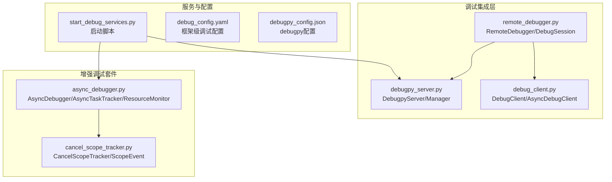
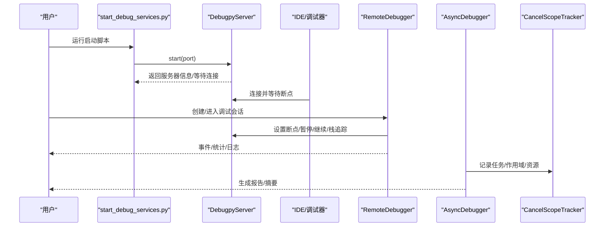
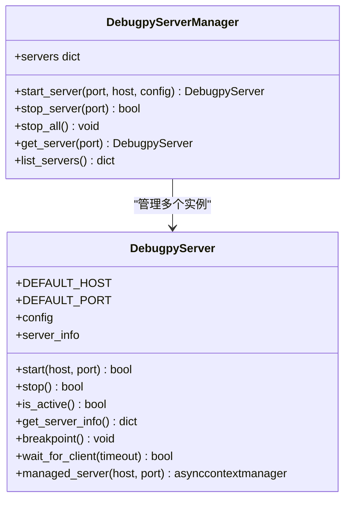
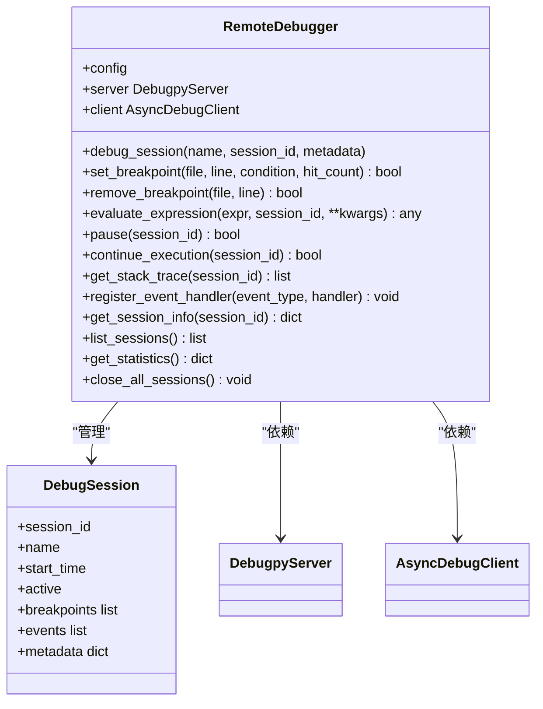
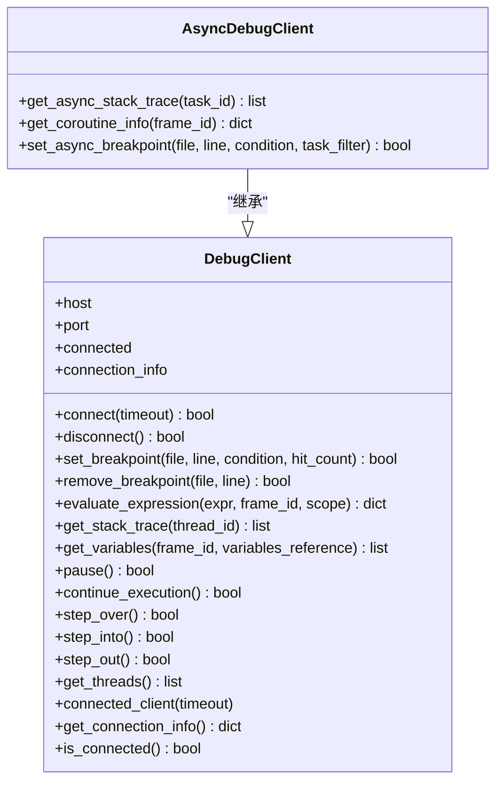
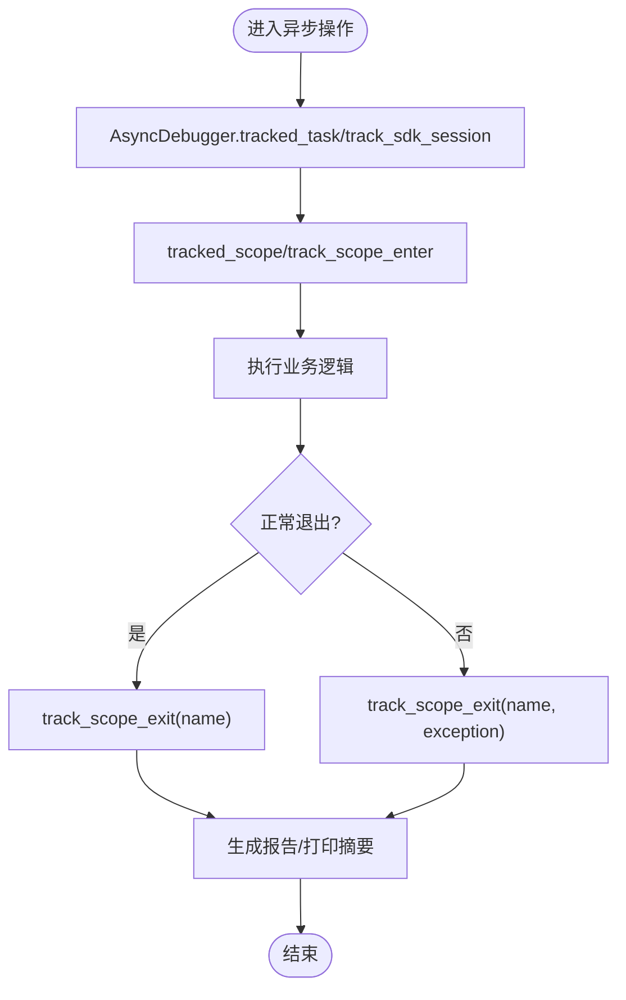
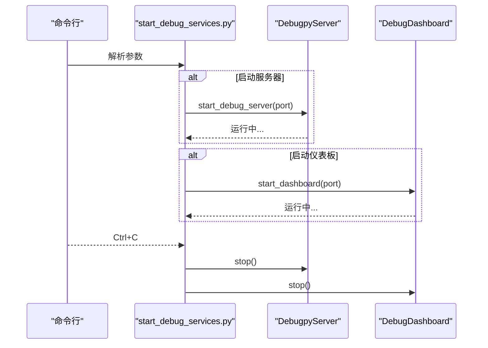
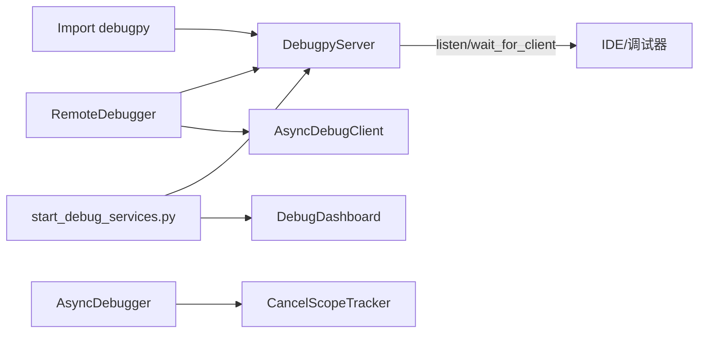

# 调试与集成

<cite>
**本文引用的文件**
- [start_debug_services.py](file://BUGFIX_20260107/start_debug_services.py)
- [debugpy_server.py](file://BUGFIX_20260107/debugpy_integration/debugpy_server.py)
- [remote_debugger.py](file://BUGFIX_20260107/debugpy_integration/remote_debugger.py)
- [debug_client.py](file://BUGFIX_20260107/debugpy_integration/debug_client.py)
- [async_debugger.py](file://BUGFIX_20260107/debug_suite/async_debugger.py)
- [cancel_scope_tracker.py](file://BUGFIX_20260107/debug_suite/cancel_scope_tracker.py)
- [debug_config.yaml](file://BUGFIX_20260107/configs/debug_config.yaml)
- [debugpy_config.json](file://BUGFIX_20260107/configs/debugpy_config.json)
- [demo_debugpy.py](file://BUGFIX_20260107/demo_debugpy.py)
- [README_DEBUGPY.md](file://BUGFIX_20260107/README_DEBUGPY.md)
- [quick_verify.py](file://BUGFIX_20260107/quick_verify.py)
- [debugpy_integration_verification_report.json](file://BUGFIX_20260107/debugpy_integration_verification_report.json)
</cite>

## 目录
1. [简介](#简介)
2. [项目结构](#项目结构)
3. [核心组件](#核心组件)
4. [架构总览](#架构总览)
5. [详细组件分析](#详细组件分析)
6. [依赖关系分析](#依赖关系分析)
7. [性能考量](#性能考量)
8. [故障排查指南](#故障排查指南)
9. [结论](#结论)
10. [附录](#附录)

## 简介
本文件聚焦于调试集成，围绕 debugpy 服务器的启动与远程调试流程展开，系统性阐述以下主题：
- Debugpy 服务器如何启动、等待调试器连接、以及生命周期管理；
- RemoteDebugger 如何建立与服务器的会话、设置断点、评估表达式、暂停/继续执行、获取栈追踪；
- 异步调试子系统（AsyncDebugger、CancelScopeTracker）在异步任务与取消作用域中的观测与诊断能力；
- start_debug_services.py 的使用方法与配置项说明；
- 常见问题定位与性能优化建议。

## 项目结构
调试相关的核心模块位于两个子目录：
- debugpy_integration：debugpy 服务器、客户端与远程调试器；
- debug_suite：异步调试与取消作用域追踪工具集。

图表来源
- [start_debug_services.py](file://BUGFIX_20260107/start_debug_services.py#L1-L151)
- [debugpy_server.py](file://BUGFIX_20260107/debugpy_integration/debugpy_server.py#L1-L408)
- [debug_client.py](file://BUGFIX_20260107/debugpy_integration/debug_client.py#L1-L650)
- [remote_debugger.py](file://BUGFIX_20260107/debugpy_integration/remote_debugger.py#L1-L683)
- [async_debugger.py](file://BUGFIX_20260107/debug_suite/async_debugger.py#L1-L420)
- [cancel_scope_tracker.py](file://BUGFIX_20260107/debug_suite/cancel_scope_tracker.py#L1-L368)
- [debug_config.yaml](file://BUGFIX_20260107/configs/debug_config.yaml#L1-L334)
- [debugpy_config.json](file://BUGFIX_20260107/configs/debugpy_config.json#L1-L96)

章节来源
- [README_DEBUGPY.md](file://BUGFIX_20260107/README_DEBUGPY.md#L1-L194)

## 核心组件
- DebugpyServer：负责 debugpy 服务器的启动、停止、等待调试器连接、断点触发、上下文管理等；支持多端口管理（DebugpyServerManager）。
- DebugClient/AsyncDebugClient：提供连接、断点设置/移除、表达式求值、栈追踪、线程/协程信息查询等客户端能力。
- RemoteDebugger：高层远程调试器，封装会话管理、事件记录、断点设置、暂停/继续、栈追踪、统计信息等。
- AsyncDebugger：异步任务跟踪、取消作用域监控、资源监控与报告生成。
- CancelScopeTracker：专门追踪取消作用域事件，检测跨任务访问等违规行为。
- start_debug_services.py：一键启动 debugpy 服务器与调试仪表板，支持端口自定义与并发启动。

章节来源
- [debugpy_server.py](file://BUGFIX_20260107/debugpy_integration/debugpy_server.py#L1-L408)
- [debug_client.py](file://BUGFIX_20260107/debugpy_integration/debug_client.py#L1-L650)
- [remote_debugger.py](file://BUGFIX_20260107/debugpy_integration/remote_debugger.py#L1-L683)
- [async_debugger.py](file://BUGFIX_20260107/debug_suite/async_debugger.py#L1-L420)
- [cancel_scope_tracker.py](file://BUGFIX_20260107/debug_suite/cancel_scope_tracker.py#L1-L368)
- [start_debug_services.py](file://BUGFIX_20260107/start_debug_services.py#L1-L151)

## 架构总览
下图展示了从启动脚本到服务器、客户端与远程调试器之间的交互关系，以及异步调试工具的辅助角色。

图表来源
- [start_debug_services.py](file://BUGFIX_20260107/start_debug_services.py#L1-L151)
- [debugpy_server.py](file://BUGFIX_20260107/debugpy_integration/debugpy_server.py#L1-L408)
- [remote_debugger.py](file://BUGFIX_20260107/debugpy_integration/remote_debugger.py#L1-L683)
- [async_debugger.py](file://BUGFIX_20260107/debug_suite/async_debugger.py#L1-L420)
- [cancel_scope_tracker.py](file://BUGFIX_20260107/debug_suite/cancel_scope_tracker.py#L1-L368)

## 详细组件分析

### DebugpyServer：服务器启动与生命周期
- 启动流程：监听指定主机与端口，记录启动信息，按配置决定是否等待调试器连接；支持超时等待与异常处理。
- 生命周期：提供 is_active、get_server_info、stop 等方法；支持上下文管理器自动启停。
- 多实例管理：DebugpyServerManager 支持多端口服务器实例的创建、停止与列表查询。
- 断点触发：在启用且活跃状态下调用断点触发接口。

图表来源
- [debugpy_server.py](file://BUGFIX_20260107/debugpy_integration/debugpy_server.py#L1-L408)

章节来源
- [debugpy_server.py](file://BUGFIX_20260107/debugpy_integration/debugpy_server.py#L1-L408)

### RemoteDebugger：远程调试器与会话管理
- 会话管理：DebugSession 记录会话元数据、断点集合、事件列表；RemoteDebugger 提供 debug_session 上下文管理器，自动统计与事件记录。
- 断点与表达式：通过 AsyncDebugClient 设置/移除断点、评估表达式、获取栈追踪。
- 控制命令：支持手动暂停、继续执行；事件处理器注册与回调。
- 统计与汇总：维护会话总数、活动会话、断点总数、事件总数等统计信息。

图表来源
- [remote_debugger.py](file://BUGFIX_20260107/debugpy_integration/remote_debugger.py#L1-L683)

章节来源
- [remote_debugger.py](file://BUGFIX_20260107/debugpy_integration/remote_debugger.py#L1-L683)

### DebugClient/AsyncDebugClient：客户端能力
- 连接与断开：connect/disconnect，支持连接信息记录与断开清理。
- 断点与表达式：set_breakpoint/remove_breakpoint、evaluate_expression。
- 栈追踪与变量：get_stack_trace/get_variables；AsyncDebugClient 提供 get_async_stack_trace/get_coroutine_info。
- 步进控制：step_over/step_into/step_out。
- 线程与协程：get_threads；异步专用断点 set_async_breakpoint。
- 上下文管理：connected_client 自动连接/断开。

图表来源
- [debug_client.py](file://BUGFIX_20260107/debugpy_integration/debug_client.py#L1-L650)

章节来源
- [debug_client.py](file://BUGFIX_20260107/debugpy_integration/debug_client.py#L1-L650)

### 异步调试与取消作用域追踪
- AsyncDebugger：提供任务跟踪（AsyncTaskTracker）、取消作用域监控（CancelScopeMonitor）、资源监控（ResourceMonitor），并生成报告与摘要。
- CancelScopeTracker：记录进入/退出/取消/错误事件，检测跨任务访问违规，生成统计与报告，支持事件日志导出。

图表来源
- [async_debugger.py](file://BUGFIX_20260107/debug_suite/async_debugger.py#L1-L420)
- [cancel_scope_tracker.py](file://BUGFIX_20260107/debug_suite/cancel_scope_tracker.py#L1-L368)

章节来源
- [async_debugger.py](file://BUGFIX_20260107/debug_suite/async_debugger.py#L1-L420)
- [cancel_scope_tracker.py](file://BUGFIX_20260107/debug_suite/cancel_scope_tracker.py#L1-L368)

### start_debug_services.py：启动脚本与配置
- 功能：启动 debugpy 服务器与调试仪表板，支持仅启动服务器、仅启动仪表板、自定义端口、并发启动与优雅退出。
- 参数：--server/--dashboard/--port/--dashboard-port，支持帮助与示例。
- 生命周期：创建任务并并发运行，捕获 KeyboardInterrupt，取消任务并等待完成，最后统一停止。

图表来源
- [start_debug_services.py](file://BUGFIX_20260107/start_debug_services.py#L1-L151)

章节来源
- [start_debug_services.py](file://BUGFIX_20260107/start_debug_services.py#L1-L151)

## 依赖关系分析
- DebugpyServer 依赖 debugpy 库；若未安装，会记录警告并禁用远程调试能力。
- RemoteDebugger 依赖 DebugpyServer 与 AsyncDebugClient；通过会话管理与事件记录增强调试体验。
- AsyncDebugger 与 CancelScopeTracker 独立存在，但可与 RemoteDebugger 协同工作，提供异步可观测性与诊断。
- 启动脚本依赖 DebugpyServer 与 DebugDashboard（来自增强套件）。

图表来源
- [debugpy_server.py](file://BUGFIX_20260107/debugpy_integration/debugpy_server.py#L1-L408)
- [remote_debugger.py](file://BUGFIX_20260107/debugpy_integration/remote_debugger.py#L1-L683)
- [debug_client.py](file://BUGFIX_20260107/debugpy_integration/debug_client.py#L1-L650)
- [async_debugger.py](file://BUGFIX_20260107/debug_suite/async_debugger.py#L1-L420)
- [cancel_scope_tracker.py](file://BUGFIX_20260107/debug_suite/cancel_scope_tracker.py#L1-L368)
- [start_debug_services.py](file://BUGFIX_20260107/start_debug_services.py#L1-L151)

章节来源
- [debugpy_server.py](file://BUGFIX_20260107/debugpy_integration/debugpy_server.py#L1-L408)
- [remote_debugger.py](file://BUGFIX_20260107/debugpy_integration/remote_debugger.py#L1-L683)
- [debug_client.py](file://BUGFIX_20260107/debugpy_integration/debug_client.py#L1-L650)
- [async_debugger.py](file://BUGFIX_20260107/debug_suite/async_debugger.py#L1-L420)
- [cancel_scope_tracker.py](file://BUGFIX_20260107/debug_suite/cancel_scope_tracker.py#L1-L368)
- [start_debug_services.py](file://BUGFIX_20260107/start_debug_services.py#L1-L151)

## 性能考量
- 服务器监听与等待连接：避免在高并发场景下频繁重启；合理设置等待超时与日志级别。
- 客户端操作：断点设置/表达式求值/栈追踪为同步阻塞模拟，实际使用中应避免在热路径上频繁调用。
- 异步可观测性：AsyncDebugger 与 CancelScopeTracker 会产生额外日志与对象开销，建议在生产环境按需开启或降低采样频率。
- 资源监控：注意日志轮转与文件大小限制，避免磁盘压力过大。

[本节为通用指导，无需特定文件引用]

## 故障排查指南
- 连接失败
  - 确认 debugpy 是否安装；未安装时服务器启动会记录警告并禁用远程调试。
  - 检查主机与端口配置，确保 IDE 连接地址与服务器监听一致。
  - 若使用 wait_for_client，确认 IDE 已在连接后等待断点。
- 断点不触发
  - 确认断点设置成功（返回值与日志）；检查条件断点与命中次数断点的表达式。
  - 确保服务器处于活跃状态且已等待调试器连接。
- 会话与事件
  - 使用 RemoteDebugger 的事件处理器注册与统计接口，定位异常事件与会话生命周期问题。
- 异步问题
  - 使用 AsyncDebugger 与 CancelScopeTracker 生成报告，查看任务失败、作用域错误与锁持有情况。
- 启动与停止
  - 使用 start_debug_services.py 的 Ctrl+C 优雅停止；若出现任务未完全停止，检查任务取消与等待逻辑。

章节来源
- [debugpy_server.py](file://BUGFIX_20260107/debugpy_integration/debugpy_server.py#L1-L408)
- [remote_debugger.py](file://BUGFIX_20260107/debugpy_integration/remote_debugger.py#L1-L683)
- [async_debugger.py](file://BUGFIX_20260107/debug_suite/async_debugger.py#L1-L420)
- [cancel_scope_tracker.py](file://BUGFIX_20260107/debug_suite/cancel_scope_tracker.py#L1-L368)
- [start_debug_services.py](file://BUGFIX_20260107/start_debug_services.py#L1-L151)

## 结论
该调试集成体系以 DebugpyServer 为核心，配合 RemoteDebugger 与 AsyncDebugClient 实现远程调试与异步可观测性；AsyncDebugger 与 CancelScopeTracker 则专注于异步任务与取消作用域的诊断。start_debug_services.py 提供便捷的一键启动能力。通过合理的配置与日志策略，可在复杂异步场景中快速定位问题并优化性能。

[本节为总结性内容，无需特定文件引用]

## 附录

### 使用说明与配置要点
- 启动脚本
  - 用法概览与示例参见脚本帮助信息与示例段落。
  - 支持仅启动服务器、仅启动仪表板、自定义端口与并发启动。
- 配置文件
  - debug_config.yaml：框架级调试开关、远程调试、仪表板、异步调试、监控与恢复策略等。
  - debugpy_config.json：debugpy 服务器/客户端特性、安全、日志、性能、断点与异常、异步跟踪、兼容性等。
- 示例脚本
  - demo_debugpy.py 展示如何创建与使用 AsyncDebugger、DebugDashboard、DebugpyServer、RemoteDebugger，并给出连接 IDE 的步骤提示。

章节来源
- [start_debug_services.py](file://BUGFIX_20260107/start_debug_services.py#L1-L151)
- [debug_config.yaml](file://BUGFIX_20260107/configs/debug_config.yaml#L1-L334)
- [debugpy_config.json](file://BUGFIX_20260107/configs/debugpy_config.json#L1-L96)
- [demo_debugpy.py](file://BUGFIX_20260107/demo_debugpy.py#L1-L138)

### 验证与测试
- quick_verify.py：对 debugpy 服务器等模块进行导入与方法可用性验证。
- debugpy_integration_verification_report.json：模块导入与方法可用性测试结果。

章节来源
- [quick_verify.py](file://BUGFIX_20260107/quick_verify.py#L168-L211)
- [debugpy_integration_verification_report.json](file://BUGFIX_20260107/debugpy_integration_verification_report.json#L48-L87)