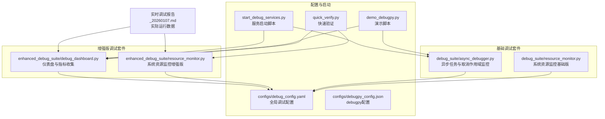
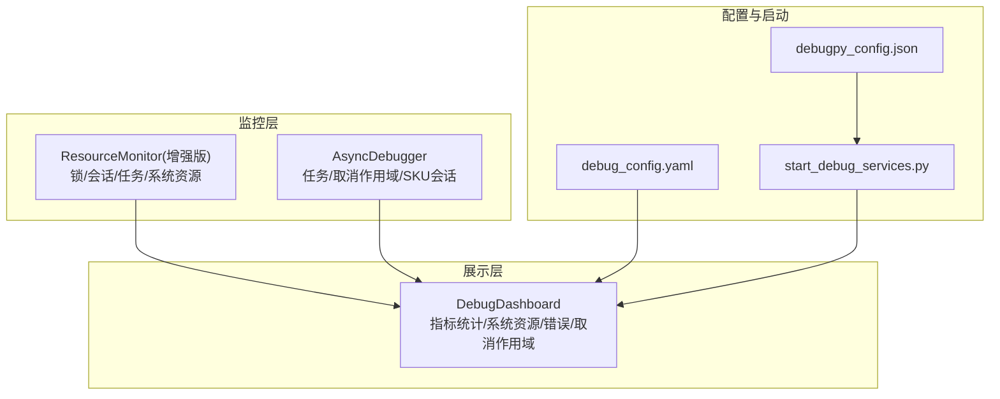
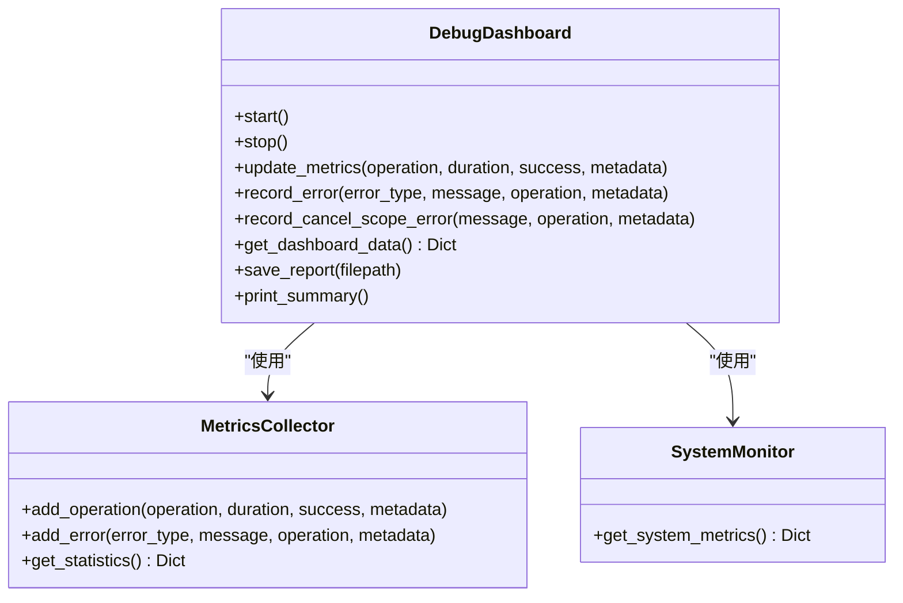
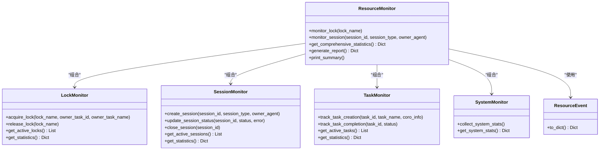
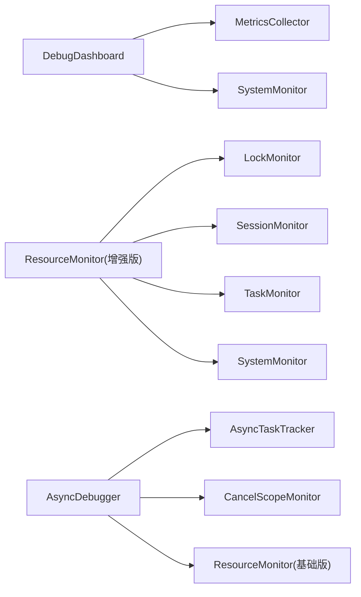

# 调试监控与仪表盘

<cite>
**本文引用的文件**
- [debug_dashboard.py](file://BUGFIX_20260107/enhanced_debug_suite/debug_dashboard.py)
- [resource_monitor.py（增强版）](file://BUGFIX_20260107/enhanced_debug_suite/resource_monitor.py)
- [resource_monitor.py（基础版）](file://BUGFIX_20260107/debug_suite/resource_monitor.py)
- [async_debugger.py](file://BUGFIX_20260107/debug_suite/async_debugger.py)
- [debug_config.yaml](file://BUGFIX_20260107/configs/debug_config.yaml)
- [debugpy_config.json](file://BUGFIX_20260107/configs/debugpy_config.json)
- [start_debug_services.py](file://BUGFIX_20260107/start_debug_services.py)
- [demo_debugpy.py](file://BUGFIX_20260107/demo_debugpy.py)
- [quick_verify.py](file://BUGFIX_20260107/quick_verify.py)
- [实时调试报告_20260107.md](file://BUGFIX_20260107/实时调试报告_20260107.md)
</cite>

## 目录
1. [简介](#简介)
2. [项目结构](#项目结构)
3. [核心组件](#核心组件)
4. [架构总览](#架构总览)
5. [组件详解](#组件详解)
6. [依赖关系分析](#依赖关系分析)
7. [性能与容量规划](#性能与容量规划)
8. [故障排查指南](#故障排查指南)
9. [结论](#结论)
10. [附录](#附录)

## 简介
本文件围绕调试监控系统展开，重点说明增强版调试仪表盘（Debug Dashboard）的可视化监控能力，以及资源监控器（Resource Monitor）如何实时采集CPU、内存、异步任务队列等关键指标并与调试会话关联。文档还涵盖仪表盘的数据更新机制、告警阈值配置、历史数据回溯能力，以及与Web UI或命令行界面的集成使用示例。最后结合“实时调试报告_20260107.md”中的实际数据，展示如何通过监控信息诊断性能瓶颈与资源泄漏问题，并给出监控数据的安全传输与存储建议。

## 项目结构
该仓库包含两套资源监控实现：
- 增强版（enhanced_debug_suite）：提供更丰富的系统资源监控与仪表盘能力
- 基础版（debug_suite）：提供锁、会话、任务与系统资源的基础监控

同时，配置文件与启动脚本为仪表盘与调试服务器的集成提供了统一入口。

图表来源
- [debug_dashboard.py](file://BUGFIX_20260107/enhanced_debug_suite/debug_dashboard.py#L1-L469)
- [resource_monitor.py（增强版）](file://BUGFIX_20260107/enhanced_debug_suite/resource_monitor.py#L1-L537)
- [resource_monitor.py（基础版）](file://BUGFIX_20260107/debug_suite/resource_monitor.py#L1-L537)
- [async_debugger.py](file://BUGFIX_20260107/debug_suite/async_debugger.py#L1-L420)
- [debug_config.yaml](file://BUGFIX_20260107/configs/debug_config.yaml#L1-L334)
- [debugpy_config.json](file://BUGFIX_20260107/configs/debugpy_config.json#L1-L96)
- [start_debug_services.py](file://BUGFIX_20260107/start_debug_services.py#L1-L151)
- [demo_debugpy.py](file://BUGFIX_20260107/demo_debugpy.py#L52-L123)
- [quick_verify.py](file://BUGFIX_20260107/quick_verify.py#L287-L324)
- [实时调试报告_20260107.md](file://BUGFIX_20260107/实时调试报告_20260107.md#L1-L283)

章节来源
- [debug_dashboard.py](file://BUGFIX_20260107/enhanced_debug_suite/debug_dashboard.py#L1-L469)
- [resource_monitor.py（增强版）](file://BUGFIX_20260107/enhanced_debug_suite/resource_monitor.py#L1-L537)
- [resource_monitor.py（基础版）](file://BUGFIX_20260107/debug_suite/resource_monitor.py#L1-L537)
- [async_debugger.py](file://BUGFIX_20260107/debug_suite/async_debugger.py#L1-L420)
- [debug_config.yaml](file://BUGFIX_20260107/configs/debug_config.yaml#L1-L334)
- [debugpy_config.json](file://BUGFIX_20260107/configs/debugpy_config.json#L1-L96)
- [start_debug_services.py](file://BUGFIX_20260107/start_debug_services.py#L1-L151)
- [demo_debugpy.py](file://BUGFIX_20260107/demo_debugpy.py#L52-L123)
- [quick_verify.py](file://BUGFIX_20260107/quick_verify.py#L287-L324)
- [实时调试报告_20260107.md](file://BUGFIX_20260107/实时调试报告_20260107.md#L1-L283)

## 核心组件
- 增强版仪表盘（Debug Dashboard）
  - 提供操作指标、错误指标、取消作用域错误、系统资源（CPU/内存/线程）的统计与可视化
  - 支持定期更新、摘要输出、报告保存与历史数据回溯
- 增强版资源监控器（Resource Monitor）
  - 监控锁、会话、任务与系统资源（CPU/内存），提供统计与报告
  - 通过上下文管理器自动记录生命周期事件，便于与调试会话关联
- 基础版资源监控器（Resource Monitor）
  - 提供锁、会话、任务与系统资源的基础监控能力
- 异步调试器（AsyncDebugger）
  - 提供异步任务跟踪、取消作用域监控与SDK会话跟踪，便于定位并发与取消相关问题
- 配置与启动
  - debug_config.yaml：全局调试开关、仪表盘端口、刷新间隔、通知与告警阈值等
  - debugpy_config.json：debugpy服务器参数、安全与性能配置
  - start_debug_services.py：一键启动调试服务器与仪表盘
  - demo_debugpy.py、quick_verify.py：演示与验证仪表盘与监控能力

章节来源
- [debug_dashboard.py](file://BUGFIX_20260107/enhanced_debug_suite/debug_dashboard.py#L1-L469)
- [resource_monitor.py（增强版）](file://BUGFIX_20260107/enhanced_debug_suite/resource_monitor.py#L1-L537)
- [resource_monitor.py（基础版）](file://BUGFIX_20260107/debug_suite/resource_monitor.py#L1-L537)
- [async_debugger.py](file://BUGFIX_20260107/debug_suite/async_debugger.py#L1-L420)
- [debug_config.yaml](file://BUGFIX_20260107/configs/debug_config.yaml#L1-L334)
- [debugpy_config.json](file://BUGFIX_20260107/configs/debugpy_config.json#L1-L96)
- [start_debug_services.py](file://BUGFIX_20260107/start_debug_services.py#L1-L151)
- [demo_debugpy.py](file://BUGFIX_20260107/demo_debugpy.py#L52-L123)
- [quick_verify.py](file://BUGFIX_20260107/quick_verify.py#L287-L324)

## 架构总览
增强版仪表盘与资源监控器协同工作，前者负责指标聚合与可视化，后者负责底层资源与生命周期事件的采集。两者均可与异步调试器配合，形成从“操作/任务/取消作用域”到“系统资源”的闭环监控。

图表来源
- [debug_dashboard.py](file://BUGFIX_20260107/enhanced_debug_suite/debug_dashboard.py#L1-L469)
- [resource_monitor.py（增强版）](file://BUGFIX_20260107/enhanced_debug_suite/resource_monitor.py#L1-L537)
- [async_debugger.py](file://BUGFIX_20260107/debug_suite/async_debugger.py#L1-L420)
- [debug_config.yaml](file://BUGFIX_20260107/configs/debug_config.yaml#L1-L334)
- [debugpy_config.json](file://BUGFIX_20260107/configs/debugpy_config.json#L1-L96)
- [start_debug_services.py](file://BUGFIX_20260107/start_debug_services.py#L1-L151)

## 组件详解

### 增强版仪表盘（Debug Dashboard）
- 指标收集器（MetricsCollector）
  - 记录操作（名称、耗时、成功/失败、元数据）
  - 记录错误（类型、消息、所属操作、元数据），并自动归类为取消作用域错误
  - 统计总操作数、成功/失败率、平均耗时、错误率、最近一分钟指标等
- 系统监控器（SystemMonitor）
  - 通过psutil采集CPU使用率、内存百分比、内存MB、线程数等
  - 在psutil不可用时返回占位状态
- 仪表盘主类（DebugDashboard）
  - 启动/停止主循环，按配置的刷新间隔更新状态
  - 提供update_metrics、record_error、record_cancel_scope_error接口
  - 生成仪表盘数据：包含状态、指标、系统资源、最近/最慢/最频繁操作、错误分布、取消作用域统计
  - 支持保存报告到文件与控制台摘要输出
- 全局实例与启动
  - 提供get_dashboard与start_dashboard便捷入口，支持自定义端口与刷新间隔

图表来源
- [debug_dashboard.py](file://BUGFIX_20260107/enhanced_debug_suite/debug_dashboard.py#L1-L469)

章节来源
- [debug_dashboard.py](file://BUGFIX_20260107/enhanced_debug_suite/debug_dashboard.py#L1-L469)

### 增强版资源监控器（Resource Monitor）
- 资源事件（ResourceEvent）
  - 记录事件类型（acquire/release/timeout/error）、资源类型（lock/session/task/memory）、资源ID、时间戳、详情与堆栈
- 锁监控器（LockMonitor）
  - 记录锁获取/释放/超时，统计总数、平均/最大持续时间、超时次数、泄漏数量
- 会话监控器（SessionMonitor）
  - 记录会话创建/更新/关闭，统计总数、活跃数、成功/失败率、错误数
- 任务监控器（TaskMonitor）
  - 记录任务创建/完成/长时间任务，统计总数、活跃数、完成率、长任务数
- 系统监控器（SystemMonitor）
  - 采样CPU/内存，计算当前值与平均值，提供进程内存与CPU使用
- 主监控器（ResourceMonitor）
  - 通过上下文管理器自动记录锁/会话生命周期事件
  - 生成综合统计与报告，支持摘要打印

图表来源
- [resource_monitor.py（增强版）](file://BUGFIX_20260107/enhanced_debug_suite/resource_monitor.py#L1-L537)

章节来源
- [resource_monitor.py（增强版）](file://BUGFIX_20260107/enhanced_debug_suite/resource_monitor.py#L1-L537)

### 基础版资源监控器（Resource Monitor）
- 与增强版类似，但统计维度与上下文管理器细节略有差异，适合基础场景使用
- 仍提供锁、会话、任务与系统资源的统计与报告能力

章节来源
- [resource_monitor.py（基础版）](file://BUGFIX_20260107/debug_suite/resource_monitor.py#L1-L537)

### 异步调试器（AsyncDebugger）
- 任务跟踪器（AsyncTaskTracker）
  - 记录任务创建、完成与失败，统计活跃/完成/失败任务数
- 取消作用域监控器（CancelScopeMonitor）
  - 记录进入/退出取消作用域事件，统计错误数与错误率
- 资源监控器（ResourceMonitor）
  - 记录锁与SDK会话的生命周期与统计
- 调试器（AsyncDebugger）
  - 提供上下文管理器与装饰器，自动记录任务与作用域事件
  - 生成调试报告与摘要输出

章节来源
- [async_debugger.py](file://BUGFIX_20260107/debug_suite/async_debugger.py#L1-L420)

### 数据更新机制与历史回溯
- 仪表盘更新机制
  - 通过主循环以配置的刷新间隔轮询更新状态与系统指标
  - 指标与错误列表采用固定上限的历史记录，避免无限增长
- 历史回溯
  - 仪表盘数据包含最近若干条操作、错误与取消作用域错误
  - 可通过保存报告文件实现离线回溯与对比分析

章节来源
- [debug_dashboard.py](file://BUGFIX_20260107/enhanced_debug_suite/debug_dashboard.py#L1-L469)

### 告警阈值配置
- 仪表盘层面
  - 可通过仪表盘统计数据（如取消作用域错误率、错误率）作为阈值参考
- 配置文件层面
  - debug_config.yaml提供通知与告警阈值配置项，可用于控制告警触发条件
  - 示例阈值字段包括取消作用域错误、会话失败、恢复尝试次数、超时阈值等

章节来源
- [debug_config.yaml](file://BUGFIX_20260107/configs/debug_config.yaml#L160-L186)

### 与调试会话关联
- 通过ResourceMonitor的上下文管理器自动记录会话生命周期事件（创建/更新/关闭），便于将监控指标与具体会话关联
- 仪表盘可基于最近会话与错误进行聚合展示，辅助定位问题

章节来源
- [resource_monitor.py（增强版）](file://BUGFIX_20260107/enhanced_debug_suite/resource_monitor.py#L1-L537)
- [resource_monitor.py（基础版）](file://BUGFIX_20260107/debug_suite/resource_monitor.py#L1-L537)

### Web UI与命令行集成
- Web UI
  - 仪表盘提供HTTP端口（默认8080），可通过浏览器访问
  - 通过start_debug_services.py一键启动仪表盘服务
- 命令行
  - 使用start_debug_services.py启动服务或单独启动仪表盘
  - 使用demo_debugpy.py与quick_verify.py进行演示与验证

章节来源
- [start_debug_services.py](file://BUGFIX_20260107/start_debug_services.py#L1-L151)
- [demo_debugpy.py](file://BUGFIX_20260107/demo_debugpy.py#L52-L123)
- [quick_verify.py](file://BUGFIX_20260107/quick_verify.py#L287-L324)

## 依赖关系分析
- 组件耦合
  - DebugDashboard依赖MetricsCollector与SystemMonitor进行指标与系统资源聚合
  - ResourceMonitor内部组合多个子监控器，形成职责清晰的监控体系
  - AsyncDebugger与ResourceMonitor互补，分别关注任务/取消作用域与资源生命周期
- 外部依赖
  - psutil用于系统资源采集；若不可用，系统将以占位状态继续运行
- 配置依赖
  - debug_config.yaml与debugpy_config.json为服务启动与行为提供参数

图表来源
- [debug_dashboard.py](file://BUGFIX_20260107/enhanced_debug_suite/debug_dashboard.py#L1-L469)
- [resource_monitor.py（增强版）](file://BUGFIX_20260107/enhanced_debug_suite/resource_monitor.py#L1-L537)
- [resource_monitor.py（基础版）](file://BUGFIX_20260107/debug_suite/resource_monitor.py#L1-L537)
- [async_debugger.py](file://BUGFIX_20260107/debug_suite/async_debugger.py#L1-L420)

## 性能与容量规划
- 指标与历史记录
  - 仪表盘与资源监控器均对历史记录设置上限，避免内存膨胀
  - 建议根据业务规模调整刷新间隔与保留条目数
- 系统资源采集
  - SystemMonitor使用滑动窗口采样CPU/内存，注意采样频率与系统开销平衡
- 并发与异步
  - 通过AsyncDebugger与ResourceMonitor的上下文管理器降低手工埋点成本，提升可观测性

[本节为通用指导，无需列出章节来源]

## 故障排查指南
- 仪表盘无法启动或端口占用
  - 使用start_debug_services.py指定不同端口启动
  - 确认端口未被其他进程占用
- psutil不可用
  - 仪表盘会降级为占位状态；可在目标平台安装psutil以启用系统资源监控
- 指标异常
  - 通过仪表盘摘要与报告文件定位异常时段与错误类型
  - 对照实时调试报告中的系统健康度与性能指标进行交叉验证
- 调试会话问题
  - 使用ResourceMonitor的会话统计与错误分布，结合AsyncDebugger的取消作用域统计定位并发与取消相关问题

章节来源
- [start_debug_services.py](file://BUGFIX_20260107/start_debug_services.py#L1-L151)
- [debug_dashboard.py](file://BUGFIX_20260107/enhanced_debug_suite/debug_dashboard.py#L1-L469)
- [resource_monitor.py（增强版）](file://BUGFIX_20260107/enhanced_debug_suite/resource_monitor.py#L1-L537)
- [async_debugger.py](file://BUGFIX_20260107/debug_suite/async_debugger.py#L1-L420)
- [实时调试报告_20260107.md](file://BUGFIX_20260107/实时调试报告_20260107.md#L1-L283)

## 结论
增强版调试仪表盘与资源监控器共同构建了从“操作/任务/取消作用域”到“系统资源”的全链路监控体系。通过配置化的刷新间隔、告警阈值与报告保存，既能满足日常运维观察，也能支撑问题定位与性能优化。结合实时调试报告中的系统健康度与性能指标，可有效识别性能瓶颈与潜在资源泄漏问题。

[本节为总结性内容，无需列出章节来源]

## 附录

### 使用示例（命令行）
- 启动调试服务器与仪表盘
  - 启动全部服务：python start_debug_services.py
  - 仅启动仪表盘：python start_debug_services.py --dashboard
  - 指定端口：python start_debug_services.py --dashboard-port 8081
- 演示与验证
  - 运行演示脚本：python demo_debugpy.py
  - 快速验证：python quick_verify.py

章节来源
- [start_debug_services.py](file://BUGFIX_20260107/start_debug_services.py#L1-L151)
- [demo_debugpy.py](file://BUGFIX_20260107/demo_debugpy.py#L52-L123)
- [quick_verify.py](file://BUGFIX_20260107/quick_verify.py#L287-L324)

### 结合“实时调试报告_20260107.md”的实践
- 报告要点
  - 系统健康度：CPU 31.0%，内存 32.4%，可用内存充足
  - 仪表盘状态：就绪，端口8080，指标收集与错误记录正常
  - debugpy集成：19/20测试通过，远程调试功能受外部服务器影响
- 诊断思路
  - 若仪表盘显示错误率上升或取消作用域错误增多，结合报告中的系统健康度与进程内存使用，判断是否存在资源紧张或异常阻塞
  - 利用报告中的“运行指标”（进程ID、内存使用、打开文件数、网络连接数）进行横向对比，定位异常时段

章节来源
- [实时调试报告_20260107.md](file://BUGFIX_20260107/实时调试报告_20260107.md#L1-L283)
- [debug_dashboard.py](file://BUGFIX_20260107/enhanced_debug_suite/debug_dashboard.py#L1-L469)

### 监控数据的安全传输与存储建议
- 传输安全
  - 仪表盘默认监听本地端口，建议在生产环境中通过反向代理或VPN访问
  - 如需远程访问，建议启用TLS与访问控制（参考debugpy_config.json中的安全配置）
- 存储与隐私
  - 报告文件包含时间戳与堆栈信息，建议对敏感信息进行脱敏处理
  - 控制日志文件大小与轮转，避免磁盘压力
- 告警与审计
  - 基于配置文件中的告警阈值建立自动化告警
  - 定期审计报告与日志，留存合规所需证据链

章节来源
- [debugpy_config.json](file://BUGFIX_20260107/configs/debugpy_config.json#L1-L96)
- [debug_config.yaml](file://BUGFIX_20260107/configs/debug_config.yaml#L160-L186)
- [debug_dashboard.py](file://BUGFIX_20260107/enhanced_debug_suite/debug_dashboard.py#L1-L469)