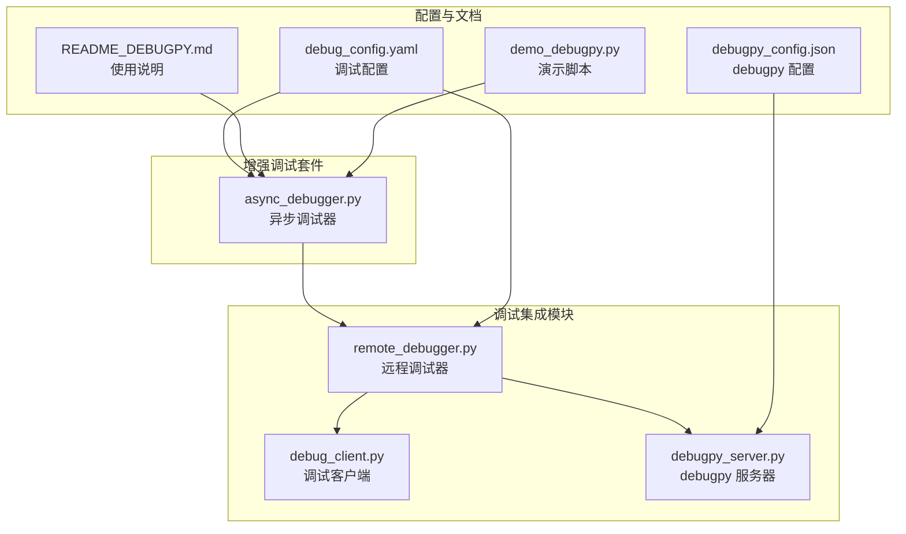
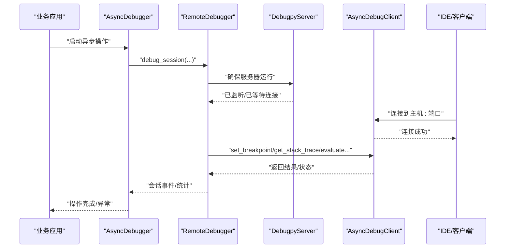
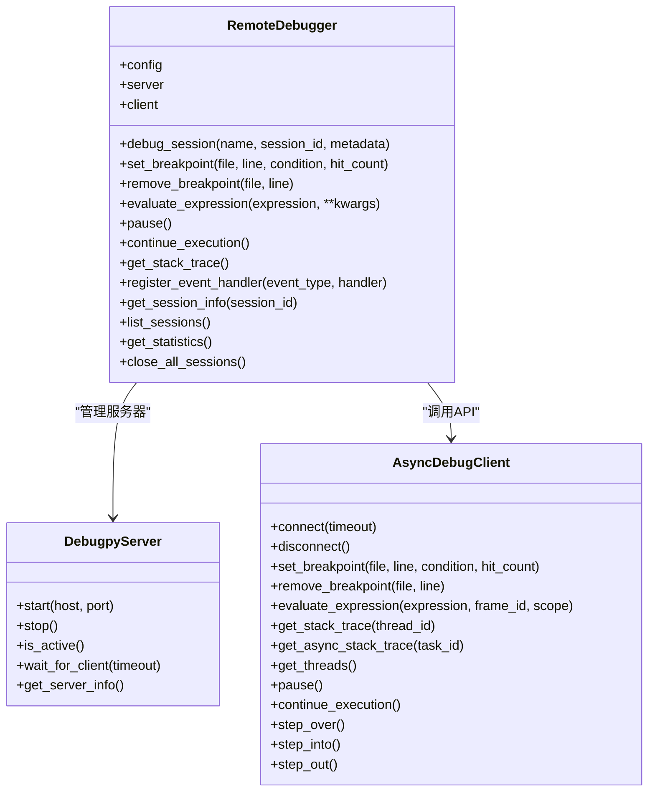
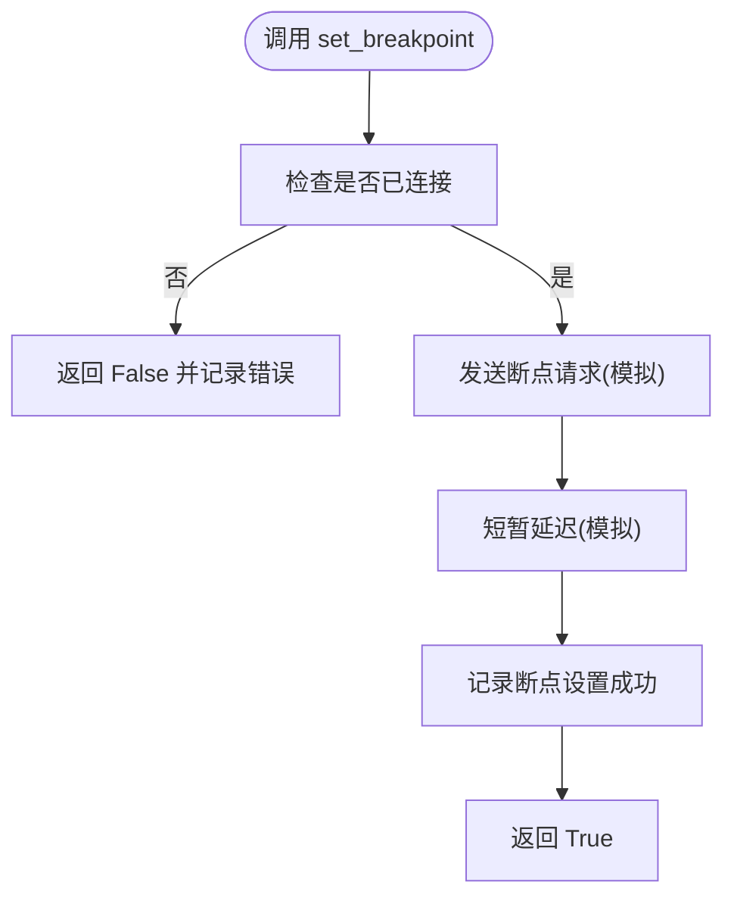
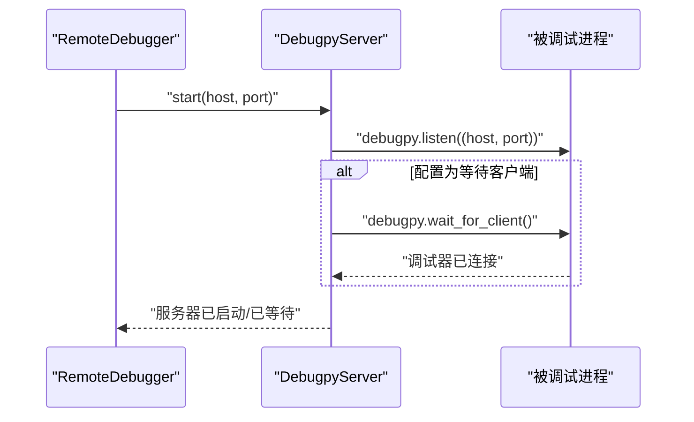
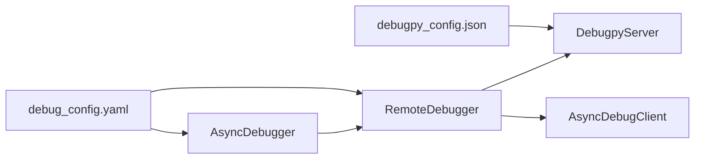

# 远程调试客户端

<cite>
**本文引用的文件**
- [remote_debugger.py](file://BUGFIX_20260107/debugpy_integration/remote_debugger.py)
- [debug_client.py](file://BUGFIX_20260107/debugpy_integration/debug_client.py)
- [debugpy_server.py](file://BUGFIX_20260107/debugpy_integration/debugpy_server.py)
- [async_debugger.py](file://BUGFIX_20260107/enhanced_debug_suite/async_debugger.py)
- [debug_config.yaml](file://BUGFIX_20260107/configs/debug_config.yaml)
- [debugpy_config.json](file://BUGFIX_20260107/configs/debugpy_config.json)
- [README_DEBUGPY.md](file://BUGFIX_20260107/README_DEBUGPY.md)
- [demo_debugpy.py](file://BUGFIX_20260107/demo_debugpy.py)
</cite>

## 目录
1. [简介](#简介)
2. [项目结构](#项目结构)
3. [核心组件](#核心组件)
4. [架构总览](#架构总览)
5. [详细组件分析](#详细组件分析)
6. [依赖关系分析](#依赖关系分析)
7. [性能考量](#性能考量)
8. [故障排查指南](#故障排查指南)
9. [结论](#结论)
10. [附录](#附录)

## 简介
本文件围绕远程调试客户端展开，重点说明 remote_debugger.py 如何通过 debugpy 与被调试进程建立安全连接，以及 debug_client.py 提供的 API 接口（断点设置、变量检查、堆栈跟踪、代码执行控制）。文档还覆盖客户端初始化、会话认证与错误重连机制的实现细节，并给出在不同网络环境下的远程调试实践建议，以及与 VS Code、PyCharm 等主流 IDE 的集成方式与跨平台连接测试指南。最后总结连接超时、认证失败等异常情况的处理策略。

## 项目结构
与远程调试相关的核心模块位于 debugpy_integration 子目录，配合 enhanced_debug_suite 的 AsyncDebugger 提供统一的异步调试入口；configs 目录提供调试配置与 debugpy 配置；README 和 demo 脚本提供使用示例与快速验证。

图表来源
- [remote_debugger.py](file://BUGFIX_20260107/debugpy_integration/remote_debugger.py#L1-L120)
- [debug_client.py](file://BUGFIX_20260107/debugpy_integration/debug_client.py#L1-L120)
- [debugpy_server.py](file://BUGFIX_20260107/debugpy_integration/debugpy_server.py#L1-L120)
- [async_debugger.py](file://BUGFIX_20260107/enhanced_debug_suite/async_debugger.py#L1-L120)
- [debug_config.yaml](file://BUGFIX_20260107/configs/debug_config.yaml#L1-L120)
- [debugpy_config.json](file://BUGFIX_20260107/configs/debugpy_config.json#L1-L60)
- [README_DEBUGPY.md](file://BUGFIX_20260107/README_DEBUGPY.md#L1-L80)
- [demo_debugpy.py](file://BUGFIX_20260107/demo_debugpy.py#L1-L60)

章节来源
- [README_DEBUGPY.md](file://BUGFIX_20260107/README_DEBUGPY.md#L1-L80)

## 核心组件
- RemoteDebugger：高层远程调试器，负责会话管理、事件系统、统计信息与与 DebugpyServer、AsyncDebugClient 的协作。
- AsyncDebugClient：面向 debugpy 的异步客户端，提供断点、表达式求值、栈追踪、线程/协程信息、执行控制等 API。
- DebugpyServer：debugpy 服务器管理器，负责启动/停止监听、等待调试器连接、状态查询与生命周期管理。
- AsyncDebugger：增强的异步调试器，封装远程调试器并提供统一的异步操作调试入口，便于在业务代码中透明启用远程调试。

章节来源
- [remote_debugger.py](file://BUGFIX_20260107/debugpy_integration/remote_debugger.py#L67-L120)
- [debug_client.py](file://BUGFIX_20260107/debugpy_integration/debug_client.py#L17-L120)
- [debugpy_server.py](file://BUGFIX_20260107/debugpy_integration/debugpy_server.py#L21-L120)
- [async_debugger.py](file://BUGFIX_20260107/enhanced_debug_suite/async_debugger.py#L225-L340)

## 架构总览
远程调试的整体流程如下：被调试进程启动 DebugpyServer 并监听指定地址与端口；IDE 或客户端通过 AsyncDebugClient 连接到该地址；RemoteDebugger 负责会话生命周期与事件分发；AsyncDebugger 将远程调试能力集成到业务异步操作中。

图表来源
- [async_debugger.py](file://BUGFIX_20260107/enhanced_debug_suite/async_debugger.py#L296-L341)
- [remote_debugger.py](file://BUGFIX_20260107/debugpy_integration/remote_debugger.py#L116-L194)
- [debugpy_server.py](file://BUGFIX_20260107/debugpy_integration/debugpy_server.py#L99-L148)
- [debug_client.py](file://BUGFIX_20260107/debugpy_integration/debug_client.py#L39-L120)

## 详细组件分析

### RemoteDebugger：会话管理与事件系统
- 会话管理
  - debug_session 上下文管理器：创建/激活/清理调试会话，记录断点与事件，维护统计信息。
  - 会话状态：包含 session_id、name、start_time、active、breakpoints、events、metadata。
- 断点管理
  - set_breakpoint/remove_breakpoint：委托给 AsyncDebugClient，并在会话内登记断点信息。
- 执行控制与诊断
  - evaluate_expression：在调试上下文中求值表达式。
  - pause/continue_execution：暂停/继续程序执行。
  - get_stack_trace：获取栈追踪（异步版本由 AsyncDebugClient 提供）。
- 事件系统
  - register_event_handler：注册事件处理器；_log_event：记录事件并触发处理器。
- 统计与清理
  - get_session_info/list_sessions/get_statistics/close_all_sessions：会话查询与统计；__aenter__/__aexit__：自动启动与关闭。

图表来源
- [remote_debugger.py](file://BUGFIX_20260107/debugpy_integration/remote_debugger.py#L67-L475)
- [debugpy_server.py](file://BUGFIX_20260107/debugpy_integration/debugpy_server.py#L99-L249)
- [debug_client.py](file://BUGFIX_20260107/debugpy_integration/debug_client.py#L39-L441)

章节来源
- [remote_debugger.py](file://BUGFIX_20260107/debugpy_integration/remote_debugger.py#L123-L194)
- [remote_debugger.py](file://BUGFIX_20260107/debugpy_integration/remote_debugger.py#L198-L303)
- [remote_debugger.py](file://BUGFIX_20260107/debugpy_integration/remote_debugger.py#L304-L433)
- [remote_debugger.py](file://BUGFIX_20260107/debugpy_integration/remote_debugger.py#L434-L475)

### AsyncDebugClient：调试 API 接口
- 连接管理
  - connect/disconnect：连接/断开 debugpy 服务器；connected 属性表示连接状态。
  - connected_client 上下文管理器：自动连接与断开。
- 断点与执行控制
  - set_breakpoint/remove_breakpoint：设置/移除断点。
  - pause/continue_execution/step_over/step_into/step_out：执行控制。
- 诊断能力
  - evaluate_expression：在指定帧与作用域内求值表达式。
  - get_stack_trace/get_threads：获取栈追踪与线程列表。
  - get_async_stack_trace/get_coroutine_info：异步栈与协程信息。
- 异常处理
  - 所有方法在未连接或异常时返回失败/空值，并记录日志。

图表来源
- [debug_client.py](file://BUGFIX_20260107/debugpy_integration/debug_client.py#L95-L138)

章节来源
- [debug_client.py](file://BUGFIX_20260107/debugpy_integration/debug_client.py#L39-L120)
- [debug_client.py](file://BUGFIX_20260107/debugpy_integration/debug_client.py#L139-L211)
- [debug_client.py](file://BUGFIX_20260107/debugpy_integration/debug_client.py#L212-L299)
- [debug_client.py](file://BUGFIX_20260107/debugpy_integration/debug_client.py#L304-L405)
- [debug_client.py](file://BUGFIX_20260107/debugpy_integration/debug_client.py#L406-L441)
- [debug_client.py](file://BUGFIX_20260107/debugpy_integration/debug_client.py#L442-L487)
- [debug_client.py](file://BUGFIX_20260107/debugpy_integration/debug_client.py#L489-L650)

### DebugpyServer：服务器生命周期与等待连接
- 启动/停止
  - start：配置监听地址与端口，调用 debugpy.listen 并可选择等待调试器连接。
  - stop：标记服务器非活跃（实际进程退出时停止）。
- 等待连接
  - wait_for_client：支持超时等待，避免无限阻塞。
- 状态与信息
  - is_active/get_server_info：查询服务器状态与启动信息。
- 多服务器管理
  - DebugpyServerManager：按端口管理多个服务器实例。

图表来源
- [debugpy_server.py](file://BUGFIX_20260107/debugpy_integration/debugpy_server.py#L99-L148)
- [debugpy_server.py](file://BUGFIX_20260107/debugpy_integration/debugpy_server.py#L216-L249)

章节来源
- [debugpy_server.py](file://BUGFIX_20260107/debugpy_integration/debugpy_server.py#L99-L184)
- [debugpy_server.py](file://BUGFIX_20260107/debugpy_integration/debugpy_server.py#L185-L249)
- [debugpy_server.py](file://BUGFIX_20260107/debugpy_integration/debugpy_server.py#L296-L408)

### AsyncDebugger：远程调试集成入口
- 初始化与可用性检测
  - 检测 debugpy 是否可用，决定是否启用远程调试。
- 调试会话
  - debug_async_operation：在异步上下文中创建 RemoteDebugger 会话，设置断点并执行协程。
- 统计与日志
  - 维护远程调试统计信息，输出调试摘要与报告。

章节来源
- [async_debugger.py](file://BUGFIX_20260107/enhanced_debug_suite/async_debugger.py#L225-L341)
- [async_debugger.py](file://BUGFIX_20260107/enhanced_debug_suite/async_debugger.py#L437-L461)

## 依赖关系分析
- RemoteDebugger 依赖 DebugpyServer 与 AsyncDebugClient，用于服务器生命周期管理和与 debugpy 的交互。
- AsyncDebugger 依赖 RemoteDebugger，作为业务侧的统一入口，简化远程调试的使用。
- 配置文件 debug_config.yaml 与 debugpy_config.json 分别提供框架级与 debugpy 服务器级的参数，影响连接行为、功能开关与安全策略。

图表来源
- [async_debugger.py](file://BUGFIX_20260107/enhanced_debug_suite/async_debugger.py#L225-L341)
- [remote_debugger.py](file://BUGFIX_20260107/debugpy_integration/remote_debugger.py#L67-L120)
- [debugpy_server.py](file://BUGFIX_20260107/debugpy_integration/debugpy_server.py#L21-L89)
- [debug_config.yaml](file://BUGFIX_20260107/configs/debug_config.yaml#L9-L31)
- [debugpy_config.json](file://BUGFIX_20260107/configs/debugpy_config.json#L8-L20)

章节来源
- [debug_config.yaml](file://BUGFIX_20260107/configs/debug_config.yaml#L9-L31)
- [debugpy_config.json](file://BUGFIX_20260107/configs/debugpy_config.json#L8-L20)

## 性能考量
- 异步与非阻塞：所有关键操作采用异步实现，避免阻塞事件循环。
- 模拟延迟：当前客户端实现使用短暂延迟模拟网络与服务器响应，实际集成 debugpy 时应移除模拟延迟以获得真实性能。
- 日志级别：debugpy_config.json 提供日志级别与文件轮转配置，建议在生产环境中降低日志级别以减少 I/O 影响。
- 超时与重试：wait_for_client 支持超时，避免长时间阻塞；建议在上层业务中结合指数退避策略进行重试。

章节来源
- [debug_client.py](file://BUGFIX_20260107/debugpy_integration/debug_client.py#L39-L120)
- [debugpy_server.py](file://BUGFIX_20260107/debugpy_integration/debugpy_server.py#L216-L249)
- [debugpy_config.json](file://BUGFIX_20260107/configs/debugpy_config.json#L42-L60)

## 故障排查指南
- 连接失败
  - 检查 DebugpyServer 是否已启动且监听正确地址与端口。
  - 确认 AsyncDebugClient 的 host/port 与服务器一致。
  - 使用 connected_client 上下文管理器确保连接成功后才执行调试操作。
- 超时等待
  - wait_for_client 支持超时，若超时返回 False；可在上层业务中增加重试逻辑。
- 认证与访问控制
  - debugpy_config.json 中允许的主机列表与 require_authentication 默认关闭；如需限制访问，可开启 require_authentication 并配置 allowed_hosts。
- 断点无效
  - 确保已连接且断点设置成功；检查断点条件与命中次数参数。
- 异常处理
  - 所有 API 方法在异常时返回失败/空值并记录日志；根据日志定位问题。

章节来源
- [debugpy_server.py](file://BUGFIX_20260107/debugpy_integration/debugpy_server.py#L216-L249)
- [debug_client.py](file://BUGFIX_20260107/debugpy_integration/debug_client.py#L442-L487)
- [debugpy_config.json](file://BUGFIX_20260107/configs/debugpy_config.json#L33-L40)

## 结论
本远程调试客户端通过 RemoteDebugger、AsyncDebugClient 与 DebugpyServer 的协同，提供了完善的会话管理、断点控制、表达式求值与执行控制能力。结合 AsyncDebugger，可在业务异步代码中无缝启用远程调试。配置文件为不同网络环境与安全需求提供了灵活选项。建议在生产环境中谨慎调整日志级别与访问控制，并在上层业务中实现超时与重试策略以提升鲁棒性。

## 附录

### 客户端初始化与会话认证
- 初始化
  - 通过 get_remote_debugger 获取全局 RemoteDebugger 实例，或直接构造。
  - RemoteDebugger 会在 auto_start_server 配置下自动启动 DebugpyServer。
- 会话认证
  - 当前实现未内置认证流程；如需安全连接，可在网络层（如防火墙/代理）或 debugpy_config.json 中配置 require_authentication 与 allowed_hosts。

章节来源
- [remote_debugger.py](file://BUGFIX_20260107/debugpy_integration/remote_debugger.py#L67-L120)
- [debugpy_config.json](file://BUGFIX_20260107/configs/debugpy_config.json#L33-L40)

### API 接口清单（断点/变量/栈/执行）
- 断点
  - set_breakpoint(file, line, condition=None, hit_count=None)
  - remove_breakpoint(file, line)
- 变量检查
  - evaluate_expression(expression, frame_id=None, scope="locals")
  - get_variables(frame_id, variables_reference=None)（基础客户端）
  - get_coroutine_info(frame_id)（异步客户端）
- 堆栈跟踪
  - get_stack_trace(thread_id=None)
  - get_async_stack_trace(task_id=None)
- 执行控制
  - pause()/continue_execution()/step_over()/step_into()/step_out()

章节来源
- [debug_client.py](file://BUGFIX_20260107/debugpy_integration/debug_client.py#L95-L211)
- [debug_client.py](file://BUGFIX_20260107/debugpy_integration/debug_client.py#L258-L405)
- [debug_client.py](file://BUGFIX_20260107/debugpy_integration/debug_client.py#L502-L626)

### 不同网络环境下的远程调试实践
- 本地回环
  - host: 127.0.0.1，port: 5678（默认）。
- 容器/虚拟机
  - 将 DebugpyServer 监听 0.0.0.0 并映射端口；IDE 连接宿主机 IP:映射端口。
- 云服务
  - 配置安全组/防火墙放行端口；必要时启用 TLS（证书文件与私钥在 debugpy_config.json 中配置）。

章节来源
- [debugpy_config.json](file://BUGFIX_20260107/configs/debugpy_config.json#L78-L84)
- [README_DEBUGPY.md](file://BUGFIX_20260107/README_DEBUGPY.md#L61-L64)

### 与主流 IDE 的集成
- VS Code
  - 连接到 localhost:5678；在 launch.json 中配置相应端口与断点策略。
- PyCharm
  - 通过 Python 远程调试配置连接到 localhost:5678；设置断点并启动调试。
- 其他工具
  - 任何支持 debugpy 的 IDE 均可连接到同一端口。

章节来源
- [README_DEBUGPY.md](file://BUGFIX_20260107/README_DEBUGPY.md#L61-L64)

### 跨平台连接测试指南
- Windows/Linux/macOS
  - 在各平台分别启动 DebugpyServer 并连接 IDE；验证断点命中、栈追踪与变量检查。
- 网络隔离
  - 在 Docker/Kubernetes 环境中暴露端口并从宿主机连接；验证 TLS 与认证配置。

章节来源
- [demo_debugpy.py](file://BUGFIX_20260107/demo_debugpy.py#L118-L126)

### 异常情况处理策略
- 连接超时
  - 使用 wait_for_client(timeout) 并在上层实现指数退避重试。
- 认证失败
  - 若启用 require_authentication，确保客户端满足访问控制策略；否则关闭认证或添加允许主机。
- 断点设置失败
  - 检查连接状态与断点参数；确认服务器已启动并等待客户端。

章节来源
- [debugpy_server.py](file://BUGFIX_20260107/debugpy_integration/debugpy_server.py#L216-L249)
- [debugpy_config.json](file://BUGFIX_20260107/configs/debugpy_config.json#L33-L40)