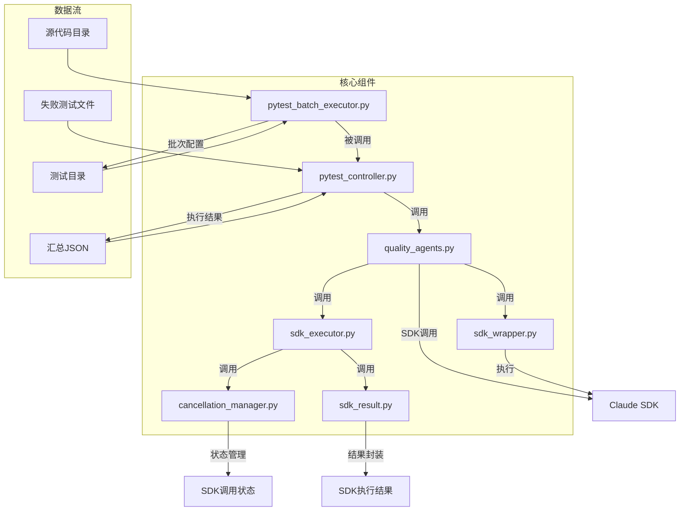
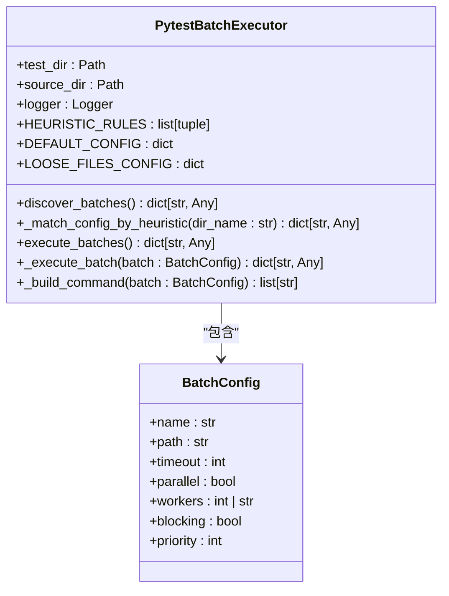
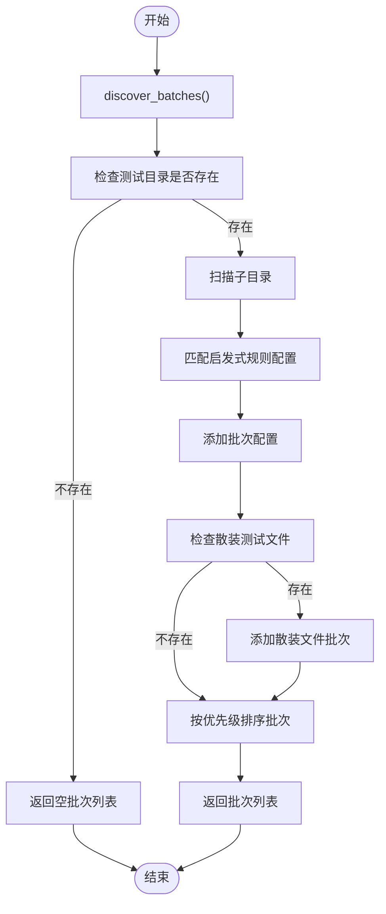
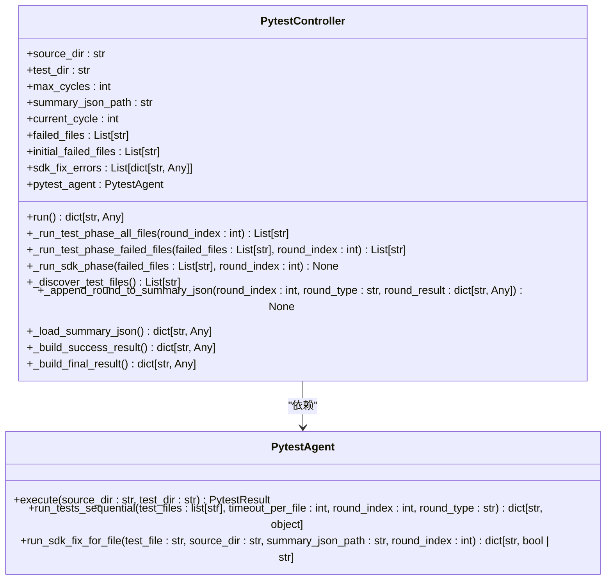
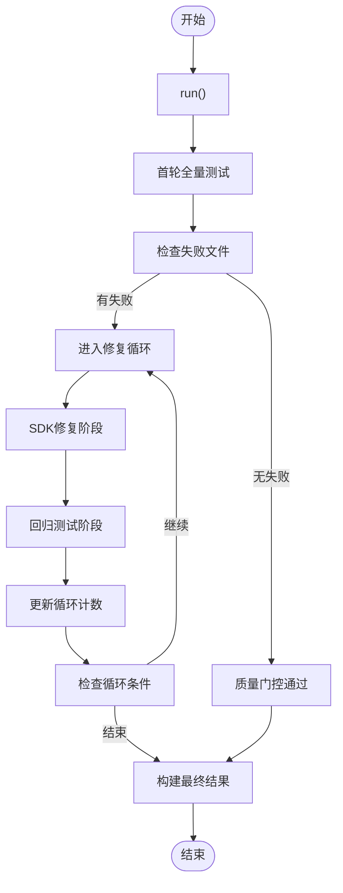
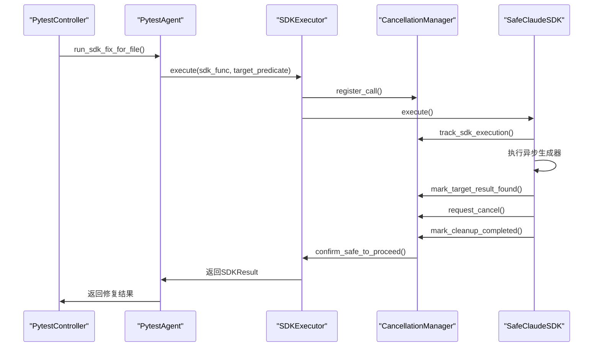
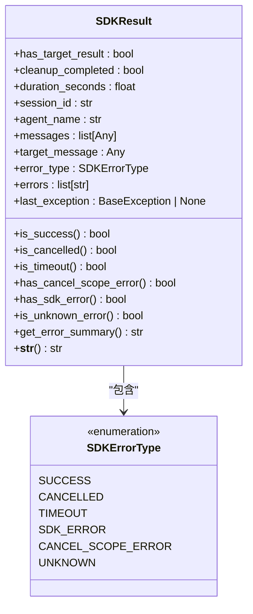
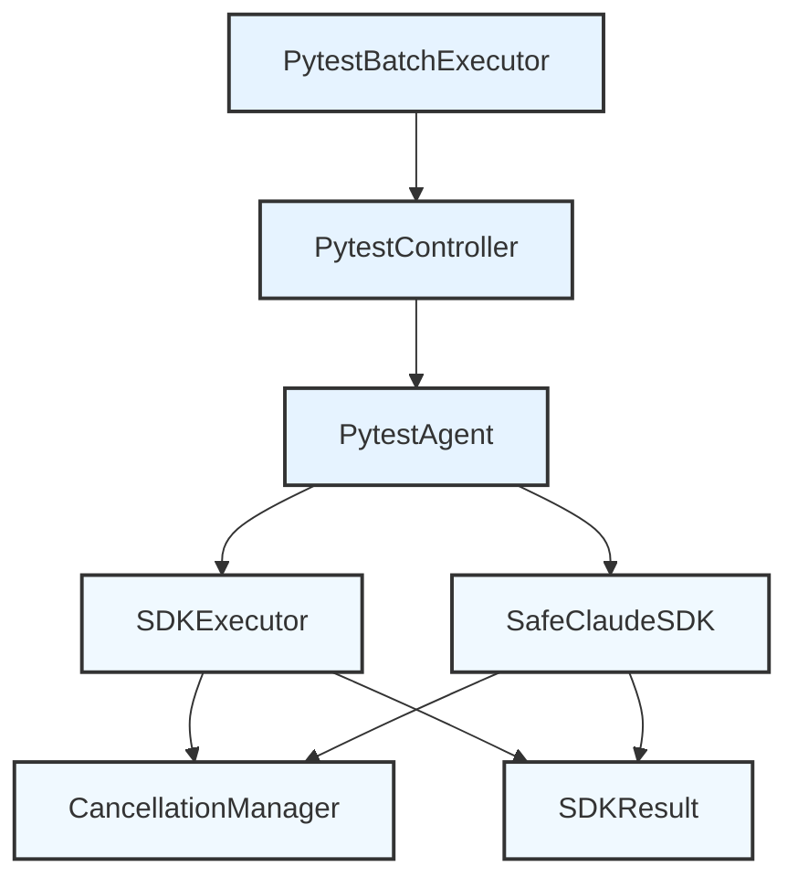

# Pytest批次执行器

<cite>
**本文档引用文件**   
- [pytest_batch_executor.py](file://autoBMAD/epic_automation/agents/pytest_batch_executor.py)
- [pytest_controller.py](file://autoBMAD/epic_automation/controllers/pytest_controller.py)
- [quality_agents.py](file://autoBMAD/epic_automation/agents/quality_agents.py)
- [sdk_executor.py](file://autoBMAD/epic_automation/core/sdk_executor.py)
- [cancellation_manager.py](file://autoBMAD/epic_automation/core/cancellation_manager.py)
- [sdk_result.py](file://autoBMAD/epic_automation/core/sdk_result.py)
- [sdk_wrapper.py](file://autoBMAD/epic_automation/sdK_wrapper.py)
</cite>

## 目录
1. [项目结构](#项目结构)
2. [核心组件](#核心组件)
3. [架构概述](#架构概述)
4. [详细组件分析](#详细组件分析)
5. [依赖关系分析](#依赖关系分析)

## 项目结构

项目中的Pytest相关组件主要位于`autoBMAD/epic_automation`目录下，形成了一个完整的质量门控和自动化测试修复系统。



**图源**
- [pytest_batch_executor.py](file://autoBMAD/epic_automation/agents/pytest_batch_executor.py)
- [pytest_controller.py](file://autoBMAD/epic_automation/controllers/pytest_controller.py)
- [quality_agents.py](file://autoBMAD/epic_automation/agents/quality_agents.py)

**节源**
- [pytest_batch_executor.py](file://autoBMAD/epic_automation/agents/pytest_batch_executor.py)
- [pytest_controller.py](file://autoBMAD/epic_automation/controllers/pytest_controller.py)

## 核心组件

Pytest批次执行器系统由多个核心组件构成，形成了一个完整的测试、失败分析和自动修复的闭环。系统以`PytestBatchExecutor`为核心，通过`PytestController`进行质量门控管理，利用`PytestAgent`协调SDK调用，并通过`SDKExecutor`和`CancellationManager`确保异步执行的安全性。

该系统的主要功能包括：
- 动态扫描测试目录并按优先级分批执行
- 实现多轮次的测试-修复-回归循环
- 管理SDK调用的生命周期和取消操作
- 封装执行结果并提供详细的错误信息

**节源**
- [pytest_batch_executor.py](file://autoBMAD/epic_automation/agents/pytest_batch_executor.py#L1-L311)
- [pytest_controller.py](file://autoBMAD/epic_automation/controllers/pytest_controller.py#L1-L399)

## 架构概述

Pytest批次执行器采用分层架构设计，各组件职责明确，通过清晰的接口进行通信。系统架构分为四个主要层次：执行层、控制层、代理层和核心工具层。

```mermaid
graph TD
subgraph "执行层"
A[PytestBatchExecutor]:::class
end
subgraph "控制层"
B[PytestController]:::class
end
subgraph "代理层"
C[PytestAgent]:::class
end
subgraph "核心工具层"
D[SDKExecutor]:::class
E[CancellationManager]:::class
F[SDKResult]:::class
G[SafeClaudeSDK]:::class
end
A --> |执行| B
B --> |调用| C
C --> |执行| D
D --> |管理| E
D --> |返回| F
C --> |调用| G
G --> |与| E
G --> |返回| F
classDef class fill:#f9f,stroke:#333,stroke-width:1px;
```

**图源**
- [pytest_batch_executor.py](file://autoBMAD/epic_automation/agents/pytest_batch_executor.py)
- [pytest_controller.py](file://autoBMAD/epic_automation/controllers/pytest_controller.py)
- [quality_agents.py](file://autoBMAD/epic_automation/agents/quality_agents.py)
- [sdk_executor.py](file://autoBMAD/epic_automation/core/sdk_executor.py)

## 详细组件分析

### PytestBatchExecutor分析

`PytestBatchExecutor`是系统的核心执行组件，负责动态发现测试目录并按优先级分批执行。

#### 类图


**图源**
- [pytest_batch_executor.py](file://autoBMAD/epic_automation/agents/pytest_batch_executor.py#L28-L311)

#### 执行流程图


**图源**
- [pytest_batch_executor.py](file://autoBMAD/epic_automation/agents/pytest_batch_executor.py#L60-L124)

**节源**
- [pytest_batch_executor.py](file://autoBMAD/epic_automation/agents/pytest_batch_executor.py#L28-L124)

### PytestController分析

`PytestController`是系统的质量门控控制器，负责管理pytest与SDK修复的多轮循环。

#### 类图


**图源**
- [pytest_controller.py](file://autoBMAD/epic_automation/controllers/pytest_controller.py#L21-L399)
- [quality_agents.py](file://autoBMAD/epic_automation/agents/quality_agents.py#L497-L890)

#### 执行流程图


**图源**
- [pytest_controller.py](file://autoBMAD/epic_automation/controllers/pytest_controller.py#L64-L112)

**节源**
- [pytest_controller.py](file://autoBMAD/epic_automation/controllers/pytest_controller.py#L21-L112)

### 核心工具组件分析

系统依赖多个核心工具组件来确保异步执行的安全性和结果的可靠性。

#### SDK执行与取消管理


**图源**
- [sdk_executor.py](file://autoBMAD/epic_automation/core/sdk_executor.py#L48-L291)
- [cancellation_manager.py](file://autoBMAD/epic_automation/core/cancellation_manager.py#L58-L181)
- [sdk_wrapper.py](file://autoBMAD/epic_automation/sdK_wrapper.py#L280-L954)

#### SDKResult数据结构


**图源**
- [sdk_result.py](file://autoBMAD/epic_automation/core/sdk_result.py#L13-L161)

**节源**
- [sdk_executor.py](file://autoBMAD/epic_automation/core/sdk_executor.py#L48-L291)
- [cancellation_manager.py](file://autoBMAD/epic_automation/core/cancellation_manager.py#L58-L181)
- [sdk_result.py](file://autoBMAD/epic_automation/core/sdk_result.py#L13-L161)
- [sdk_wrapper.py](file://autoBMAD/epic_automation/sdK_wrapper.py#L280-L954)

## 依赖关系分析

系统各组件之间存在清晰的依赖关系，形成了一个稳定的调用链。通过分析依赖关系，可以更好地理解系统的整体架构和数据流动。



**图源**
- [pytest_batch_executor.py](file://autoBMAD/epic_automation/agents/pytest_batch_executor.py)
- [pytest_controller.py](file://autoBMAD/epic_automation/controllers/pytest_controller.py)
- [quality_agents.py](file://autoBMAD/epic_automation/agents/quality_agents.py)
- [sdk_executor.py](file://autoBMAD/epic_automation/core/sdk_executor.py)
- [cancellation_manager.py](file://autoBMAD/epic_automation/core/cancellation_manager.py)
- [sdk_result.py](file://autoBMAD/epic_automation/core/sdk_result.py)
- [sdk_wrapper.py](file://autoBMAD/epic_automation/sdK_wrapper.py)

**节源**
- [pytest_batch_executor.py](file://autoBMAD/epic_automation/agents/pytest_batch_executor.py)
- [pytest_controller.py](file://autoBMAD/epic_automation/controllers/pytest_controller.py)
- [quality_agents.py](file://autoBMAD/epic_automation/agents/quality_agents.py)
- [sdk_executor.py](file://autoBMAD/epic_automation/core/sdk_executor.py)
- [cancellation_manager.py](file://autoBMAD/epic_automation/core/cancellation_manager.py)
- [sdk_result.py](file://autoBMAD/epic_automation/core/sdk_result.py)
- [sdk_wrapper.py](file://autoBMAD/epic_automation/sdK_wrapper.py)