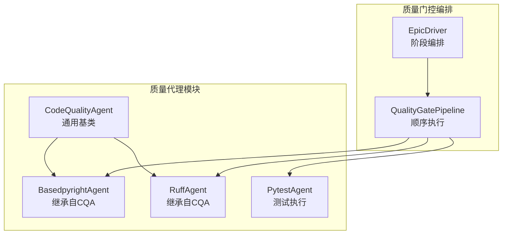
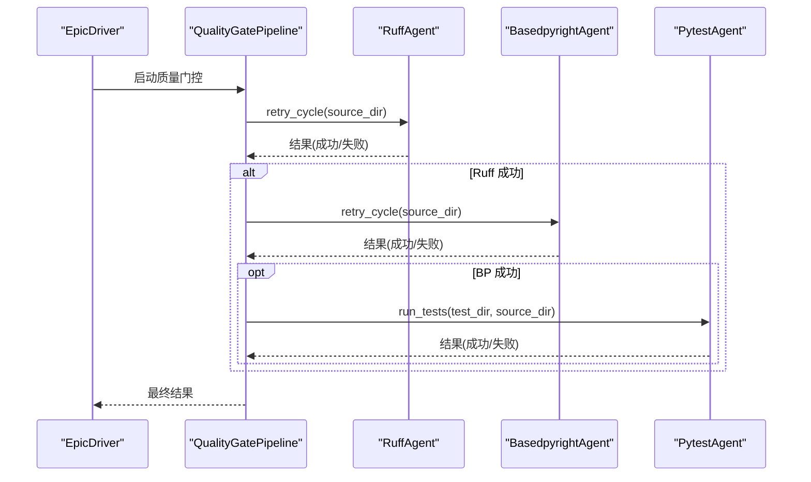
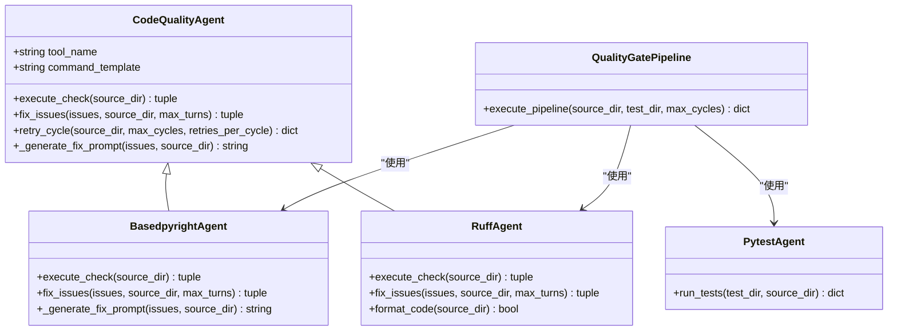
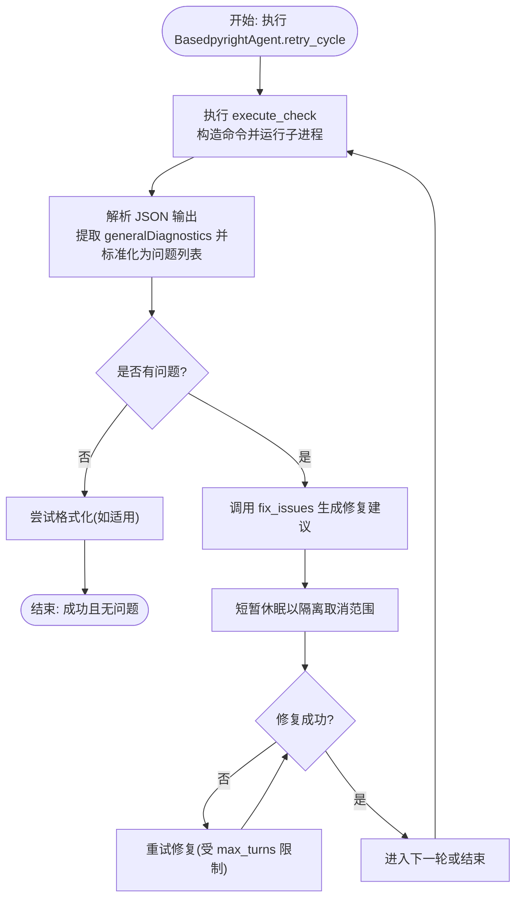
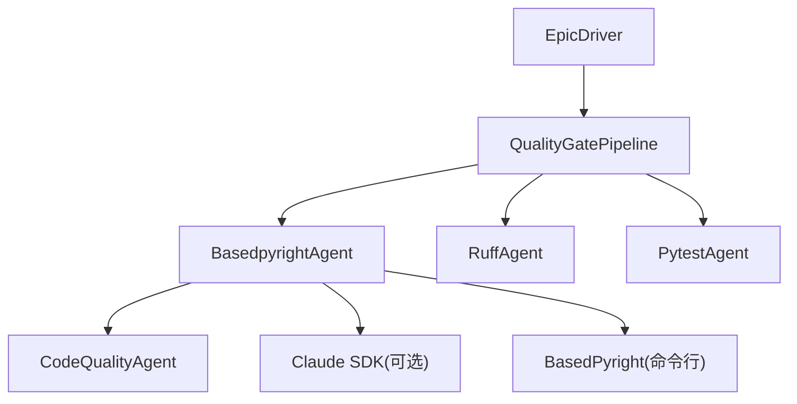

# BasedPyright类型检查

<cite>
**本文引用的文件**
- [quality_agents.py](file://autoBMAD/epic_automation/quality_agents.py)
- [test_quality_agents.py](file://tests-copy/epic_automation/test_quality_agents.py)
- [test_basedpyright_workflow.py](file://tests-copy/unit/test_basedpyright_workflow.py)
- [epic_driver.py](file://autoBMAD/epic_automation/epic_driver.py)
- [test_quality_gates_complete.py](file://tests-copy/integration/test_quality_gates_complete.py)
</cite>

## 目录
1. [简介](#简介)
2. [项目结构](#项目结构)
3. [核心组件](#核心组件)
4. [架构总览](#架构总览)
5. [详细组件分析](#详细组件分析)
6. [依赖关系分析](#依赖关系分析)
7. [性能考量](#性能考量)
8. [故障排查指南](#故障排查指南)
9. [结论](#结论)
10. [附录](#附录)

## 简介
本文件系统性阐述基于 BasedPyright 的类型检查体系，重点围绕 BasedpyrightAgent 的实现与使用。该系统通过调用基于 Pyright 的工具执行类型检查，解析其 JSON 输出中的 generalDiagnostics 字段，将诊断信息标准化为统一问题格式；随后借助 Claude SDK 生成类型注解修复建议，形成“检查—修复—再检查”的闭环。BasedpyrightAgent 继承自通用的 CodeQualityAgent，复用其重试机制、取消隔离与 SDK 交互能力，并在质量门控中作为第二道关卡，与 Ruff 和 Pytest 协同工作，构成完整的质量门控流水线。

## 项目结构
- 基于 Pyright 的类型检查由 BasedpyrightAgent 提供，位于质量代理模块中。
- 测试覆盖了 BasedpyrightAgent 的命令模板、执行检查、修复提示生成、集成测试等关键路径。
- 质量门控编排器负责按序执行 Ruff、BasedPyright、Pytest，并在各阶段收集结果与错误。

图表来源
- [quality_agents.py](file://autoBMAD/epic_automation/quality_agents.py#L41-L120)
- [quality_agents.py](file://autoBMAD/epic_automation/quality_agents.py#L565-L760)
- [quality_agents.py](file://autoBMAD/epic_automation/quality_agents.py#L908-L1012)
- [epic_driver.py](file://autoBMAD/epic_automation/epic_driver.py#L230-L297)

章节来源
- [quality_agents.py](file://autoBMAD/epic_automation/quality_agents.py#L41-L120)
- [quality_agents.py](file://autoBMAD/epic_automation/quality_agents.py#L565-L760)
- [quality_agents.py](file://autoBMAD/epic_automation/quality_agents.py#L908-L1012)
- [epic_driver.py](file://autoBMAD/epic_automation/epic_driver.py#L230-L297)

## 核心组件
- CodeQualityAgent：提供通用的质量工具执行框架，包括子进程执行、JSON 解析、重试循环、与 Claude SDK 的交互、取消隔离等。
- BasedpyrightAgent：针对 BasedPyright 工具的专用实现，负责构建命令、执行检查、解析 generalDiagnostics 并生成修复提示。
- QualityGatePipeline：顺序执行 Ruff、BasedPyright、Pytest 的质量门控流水线。
- EpicDriver：在 Epic 自动化流程中调度质量门控阶段，其中第二阶段即为 BasedPyright 类型检查。

章节来源
- [quality_agents.py](file://autoBMAD/epic_automation/quality_agents.py#L41-L120)
- [quality_agents.py](file://autoBMAD/epic_automation/quality_agents.py#L565-L760)
- [quality_agents.py](file://autoBMAD/epic_automation/quality_agents.py#L908-L1012)
- [epic_driver.py](file://autoBMAD/epic_automation/epic_driver.py#L230-L297)

## 架构总览
BasedpyrightAgent 在质量门控中的位置如下：
- 第一阶段：Ruff 代码风格与基础问题检查。
- 第二阶段：BasedPyright 类型检查，若失败则质量门控失败。
- 第三阶段：Pytest 测试执行（可选）。

图表来源
- [epic_driver.py](file://autoBMAD/epic_automation/epic_driver.py#L476-L498)
- [quality_agents.py](file://autoBMAD/epic_automation/quality_agents.py#L908-L1012)

章节来源
- [epic_driver.py](file://autoBMAD/epic_automation/epic_driver.py#L476-L498)
- [quality_agents.py](file://autoBMAD/epic_automation/quality_agents.py#L908-L1012)

## 详细组件分析

### BasedpyrightAgent 类实现
BasedpyrightAgent 继承自 CodeQualityAgent，专注于基于 Pyright 的类型检查与修复。

- 命令模板与初始化
  - 初始化时设置 tool_name 为 "basedpyright"，命令模板为 "basedpyright --outputformat=json {source_dir}"，确保输出 JSON 格式以便解析 generalDiagnostics。
  - 参考路径：[quality_agents.py](file://autoBMAD/epic_automation/quality_agents.py#L565-L580)

- execute_check 方法
  - 构造命令并执行子进程，捕获 stdout/stderr，解析 JSON。
  - 从 JSON 中提取 generalDiagnostics 字段，将其转换为统一问题格式（包含 file、line、column、severity、message、rule、end_line、end_column 等键），便于后续修复与统计。
  - 对取消事件与取消范围传播进行特殊处理：当发生取消或取消范围错误时，终止子进程并返回空结果，避免取消传播影响后续流程。
  - 参考路径：
    - [quality_agents.py](file://autoBMAD/epic_automation/quality_agents.py#L581-L696)

- fix_issues 方法
  - 复用父类 CodeQualityAgent 的 fix_issues 能力，默认 max_turns=150，通过 Claude SDK 生成修复建议。
  - 当 SDK 不可用时返回明确提示；当收到 SDK 返回的最终消息时统计修复数量。
  - 参考路径：
    - [quality_agents.py](file://autoBMAD/epic_automation/quality_agents.py#L155-L278)
    - [quality_agents.py](file://autoBMAD/epic_automation/quality_agents.py#L697-L715)

- _generate_fix_prompt 方法
  - 生成面向 Claude SDK 的修复提示，要求遵循 PEP 484 与 PEP 526 标准，聚焦缺失类型注解、函数签名与返回类型等问题。
  - 参考路径：
    - [quality_agents.py](file://autoBMAD/epic_automation/quality_agents.py#L716-L760)

- 与重试机制的配合
  - execute_check 与 fix_issues 均在 CodeQualityAgent.retry_cycle 中被调用，支持多轮重试与格式化后处理。
  - 参考路径：
    - [quality_agents.py](file://autoBMAD/epic_automation/quality_agents.py#L279-L422)

章节来源
- [quality_agents.py](file://autoBMAD/epic_automation/quality_agents.py#L565-L760)
- [quality_agents.py](file://autoBMAD/epic_automation/quality_agents.py#L279-L422)

### CodeQualityAgent 基类能力
- 子进程执行与 JSON 解析
  - 通过子进程执行工具命令，解析 JSON 输出；对无效 JSON 进行错误处理。
  - 参考路径：
    - [quality_agents.py](file://autoBMAD/epic_automation/quality_agents.py#L61-L154)

- 与 Claude SDK 的交互
  - 以 max_turns 限制 SDK 会话轮次，避免外部超时；在取消范围内进行保护，允许任务清理后返回失败以触发重试。
  - 参考路径：
    - [quality_agents.py](file://autoBMAD/epic_automation/quality_agents.py#L155-L278)

- 重试循环与格式化
  - retry_cycle 支持多轮检查与修复，每轮可配置重试次数；在循环结束后尝试格式化（如 Ruff）。
  - 参考路径：
    - [quality_agents.py](file://autoBMAD/epic_automation/quality_agents.py#L279-L422)

章节来源
- [quality_agents.py](file://autoBMAD/epic_automation/quality_agents.py#L61-L154)
- [quality_agents.py](file://autoBMAD/epic_automation/quality_agents.py#L155-L278)
- [quality_agents.py](file://autoBMAD/epic_automation/quality_agents.py#L279-L422)

### 质量门控中的作用
- EpicDriver 将质量门控分为三个阶段，第二阶段为 BasedPyright 类型检查；若失败则质量门控失败，流程终止。
- QualityGatePipeline 顺序执行 Ruff、BasedPyright、Pytest，任一步骤失败都会标记整体失败并记录错误。
- 参考路径：
  - [epic_driver.py](file://autoBMAD/epic_automation/epic_driver.py#L230-L297)
  - [epic_driver.py](file://autoBMAD/epic_automation/epic_driver.py#L476-L498)
  - [quality_agents.py](file://autoBMAD/epic_automation/quality_agents.py#L908-L1012)

章节来源
- [epic_driver.py](file://autoBMAD/epic_automation/epic_driver.py#L230-L297)
- [epic_driver.py](file://autoBMAD/epic_automation/epic_driver.py#L476-L498)
- [quality_agents.py](file://autoBMAD/epic_automation/quality_agents.py#L908-L1012)

### 类关系图

图表来源
- [quality_agents.py](file://autoBMAD/epic_automation/quality_agents.py#L41-L120)
- [quality_agents.py](file://autoBMAD/epic_automation/quality_agents.py#L565-L760)
- [quality_agents.py](file://autoBMAD/epic_automation/quality_agents.py#L908-L1012)

章节来源
- [quality_agents.py](file://autoBMAD/epic_automation/quality_agents.py#L41-L120)
- [quality_agents.py](file://autoBMAD/epic_automation/quality_agents.py#L565-L760)
- [quality_agents.py](file://autoBMAD/epic_automation/quality_agents.py#L908-L1012)

### 执行流程与数据流
- 命令执行与 JSON 解析
  - 基于命令模板构造 "basedpyright --outputformat=json {source_dir}"，执行子进程获取 JSON 输出。
  - 从 JSON 中提取 generalDiagnostics，映射为统一问题格式，包含文件、行列号、严重级别、规则与消息等。
  - 参考路径：
    - [quality_agents.py](file://autoBMAD/epic_automation/quality_agents.py#L581-L696)

- 修复提示生成与 SDK 交互
  - 基于问题摘要生成修复提示，要求遵循 PEP 484/PEP 526，Claude SDK 以异步迭代器返回消息，最终统计修复数量。
  - 参考路径：
    - [quality_agents.py](file://autoBMAD/epic_automation/quality_agents.py#L716-L760)
    - [quality_agents.py](file://autoBMAD/epic_automation/quality_agents.py#L155-L278)

- 重试循环与格式化
  - retry_cycle 控制最大轮数与每轮重试次数；循环结束后尝试格式化（如 Ruff），并记录统计信息。
  - 参考路径：
    - [quality_agents.py](file://autoBMAD/epic_automation/quality_agents.py#L279-L422)

图表来源
- [quality_agents.py](file://autoBMAD/epic_automation/quality_agents.py#L279-L422)
- [quality_agents.py](file://autoBMAD/epic_automation/quality_agents.py#L581-L696)
- [quality_agents.py](file://autoBMAD/epic_automation/quality_agents.py#L155-L278)

章节来源
- [quality_agents.py](file://autoBMAD/epic_automation/quality_agents.py#L279-L422)
- [quality_agents.py](file://autoBMAD/epic_automation/quality_agents.py#L581-L696)
- [quality_agents.py](file://autoBMAD/epic_automation/quality_agents.py#L155-L278)

### 类型修复闭环流程（PEP 484/PEP 526）
- 发现类型错误
  - BasedpyrightAgent.execute_check 解析 generalDiagnostics，识别缺失类型注解、函数签名与返回类型等问题。
  - 参考路径：
    - [quality_agents.py](file://autoBMAD/epic_automation/quality_agents.py#L645-L696)

- 生成修复建议
  - _generate_fix_prompt 强调遵循 PEP 484 与 PEP 526，要求添加缺失的类型注解、修正错误注解并保持最小改动。
  - 参考路径：
    - [quality_agents.py](file://autoBMAD/epic_automation/quality_agents.py#L716-L760)

- 执行修复与验证
  - fix_issues 通过 Claude SDK 生成修复，统计修复数量；随后再次执行 execute_check 验证修复效果。
  - 参考路径：
    - [quality_agents.py](file://autoBMAD/epic_automation/quality_agents.py#L155-L278)
    - [quality_agents.py](file://autoBMAD/epic_automation/quality_agents.py#L581-L696)

章节来源
- [quality_agents.py](file://autoBMAD/epic_automation/quality_agents.py#L645-L696)
- [quality_agents.py](file://autoBMAD/epic_automation/quality_agents.py#L716-L760)
- [quality_agents.py](file://autoBMAD/epic_automation/quality_agents.py#L155-L278)

## 依赖关系分析
- BasedpyrightAgent 依赖
  - 基础库：asyncio、json、logging、pathlib、typing。
  - 可选依赖：Claude SDK（用于生成修复建议），若不可用则降级处理。
  - 外部工具：BasedPyright（通过命令行执行）。
- 质量门控依赖
  - EpicDriver 与 QualityGatePipeline 协作，按序执行 Ruff、BasedPyright、Pytest。
  - 参考路径：
    - [epic_driver.py](file://autoBMAD/epic_automation/epic_driver.py#L230-L297)
    - [quality_agents.py](file://autoBMAD/epic_automation/quality_agents.py#L908-L1012)

图表来源
- [quality_agents.py](file://autoBMAD/epic_automation/quality_agents.py#L41-L120)
- [quality_agents.py](file://autoBMAD/epic_automation/quality_agents.py#L565-L760)
- [quality_agents.py](file://autoBMAD/epic_automation/quality_agents.py#L908-L1012)
- [epic_driver.py](file://autoBMAD/epic_automation/epic_driver.py#L230-L297)

章节来源
- [quality_agents.py](file://autoBMAD/epic_automation/quality_agents.py#L41-L120)
- [quality_agents.py](file://autoBMAD/epic_automation/quality_agents.py#L565-L760)
- [quality_agents.py](file://autoBMAD/epic_automation/quality_agents.py#L908-L1012)
- [epic_driver.py](file://autoBMAD/epic_automation/epic_driver.py#L230-L297)

## 性能考量
- 子进程执行与取消隔离
  - execute_check 使用 asyncio 子进程并在取消时终止进程并返回空结果，避免取消传播导致的阻塞。
  - 参考路径：
    - [quality_agents.py](file://autoBMAD/epic_automation/quality_agents.py#L601-L644)

- SDK 会话轮次限制
  - fix_issues 使用 max_turns 限制 Claude SDK 会话轮次，避免外部超时与长时间等待。
  - 参考路径：
    - [quality_agents.py](file://autoBMAD/epic_automation/quality_agents.py#L155-L278)

- 重试策略
  - retry_cycle 控制最大轮数与每轮重试次数，减少重复执行成本；在循环结束尝试格式化，避免额外耗时。
  - 参考路径：
    - [quality_agents.py](file://autoBMAD/epic_automation/quality_agents.py#L279-L422)

[本节为通用指导，无需列出具体文件来源]

## 故障排查指南
- 命令模板与参数
  - 确认命令模板包含 "--outputformat=json" 与 "{source_dir}" 占位符。
  - 参考路径：
    - [test_quality_agents.py](file://tests-copy/epic_automation/test_quality_agents.py#L418-L427)

- JSON 输出解析失败
  - 若 JSON 无法解析，检查工具输出是否符合预期；查看日志中的原始输出片段。
  - 参考路径：
    - [quality_agents.py](file://autoBMAD/epic_automation/quality_agents.py#L645-L696)

- 取消与取消范围错误
  - 当出现取消或取消范围错误时，execute_check 会终止子进程并返回空结果；确认上游取消逻辑未误触发。
  - 参考路径：
    - [quality_agents.py](file://autoBMAD/epic_automation/quality_agents.py#L601-L644)

- SDK 不可用
  - fix_issues 在 Claude SDK 不可用时返回明确提示；请安装并正确配置 SDK。
  - 参考路径：
    - [quality_agents.py](file://autoBMAD/epic_automation/quality_agents.py#L155-L278)

- 质量门控失败
  - EpicDriver 与 QualityGatePipeline 在任一阶段失败时会记录错误并终止；检查对应阶段的日志与返回结果。
  - 参考路径：
    - [epic_driver.py](file://autoBMAD/epic_automation/epic_driver.py#L230-L297)
    - [quality_agents.py](file://autoBMAD/epic_automation/quality_agents.py#L908-L1012)

章节来源
- [test_quality_agents.py](file://tests-copy/epic_automation/test_quality_agents.py#L418-L427)
- [quality_agents.py](file://autoBMAD/epic_automation/quality_agents.py#L601-L696)
- [quality_agents.py](file://autoBMAD/epic_automation/quality_agents.py#L155-L278)
- [epic_driver.py](file://autoBMAD/epic_automation/epic_driver.py#L230-L297)
- [quality_agents.py](file://autoBMAD/epic_automation/quality_agents.py#L908-L1012)

## 结论
BasedpyrightAgent 通过标准化的命令执行、JSON 解析与问题格式化，实现了对 BasedPyright 的高效集成；配合 CodeQualityAgent 的重试机制与 SDK 交互能力，形成了稳定的“检查—修复—再检查”闭环。在质量门控中，BasedPyright 作为第二阶段的关键环节，与 Ruff、Pytest 协同工作，共同保障代码质量与稳定性。测试覆盖了命令模板、执行检查、修复提示生成与集成场景，确保实现的可靠性与可维护性。

[本节为总结性内容，无需列出具体文件来源]

## 附录
- 基于 Pyright 的工作流单元测试
  - 包含工具不存在、目录不存在、成功执行、无错误、JSON 无效、超时、自定义配置等场景。
  - 参考路径：
    - [test_basedpyright_workflow.py](file://tests-copy/unit/test_basedpyright_workflow.py#L1-L252)

- 基于 Pyright 的质量代理单元测试
  - 覆盖命令模板、执行检查（有/无问题）、修复提示生成、集成场景等。
  - 参考路径：
    - [test_quality_agents.py](file://tests-copy/epic_automation/test_quality_agents.py#L418-L567)

- 质量门控完整集成测试
  - 验证 BasedpyrightAgent 的执行与结果追踪。
  - 参考路径：
    - [test_quality_gates_complete.py](file://tests-copy/integration/test_quality_gates_complete.py#L281-L322)

章节来源
- [test_basedpyright_workflow.py](file://tests-copy/unit/test_basedpyright_workflow.py#L1-L252)
- [test_quality_agents.py](file://tests-copy/epic_automation/test_quality_agents.py#L418-L567)
- [test_quality_gates_complete.py](file://tests-copy/integration/test_quality_gates_complete.py#L281-L322)