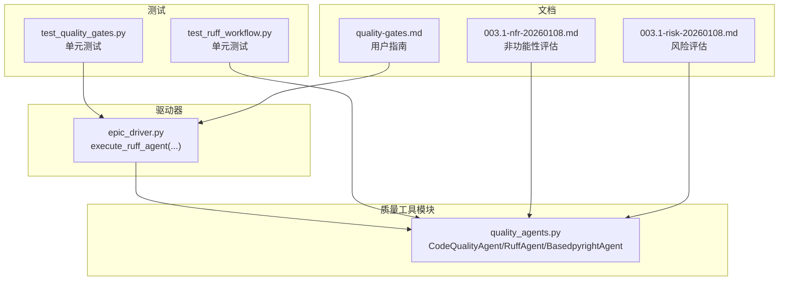
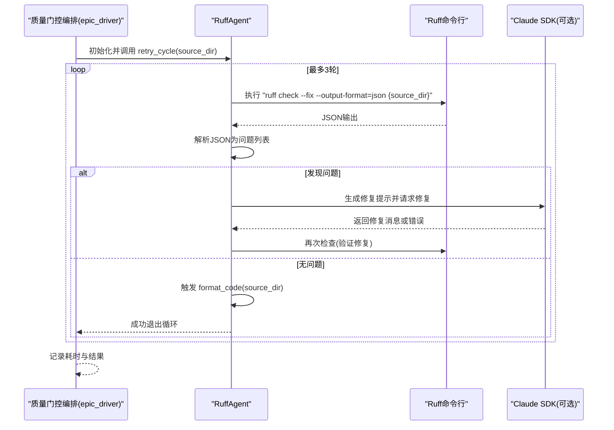
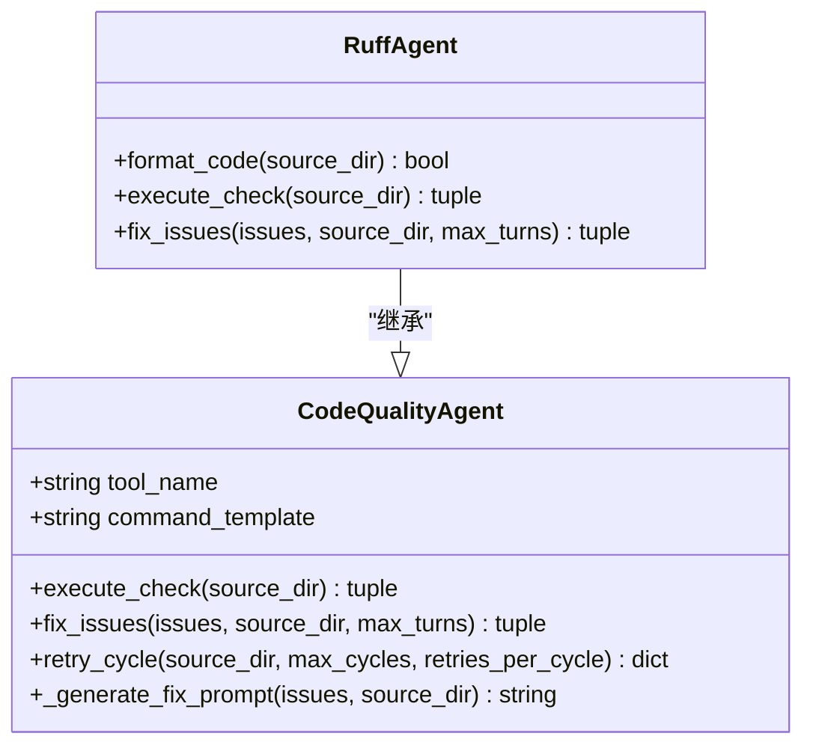
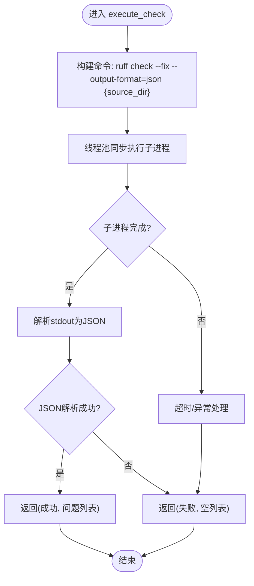
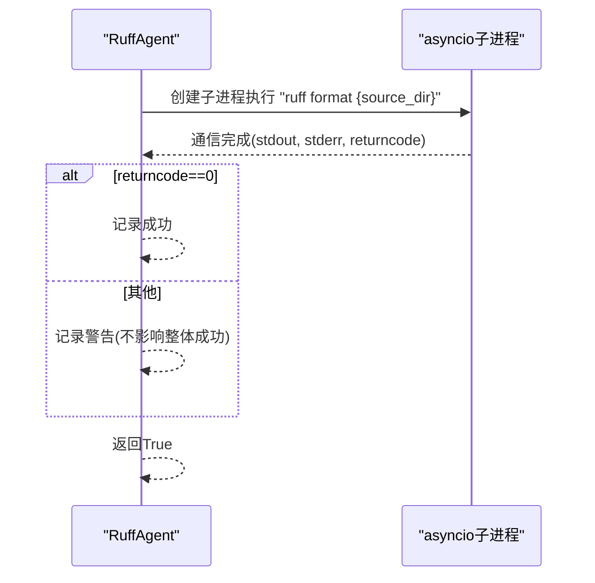
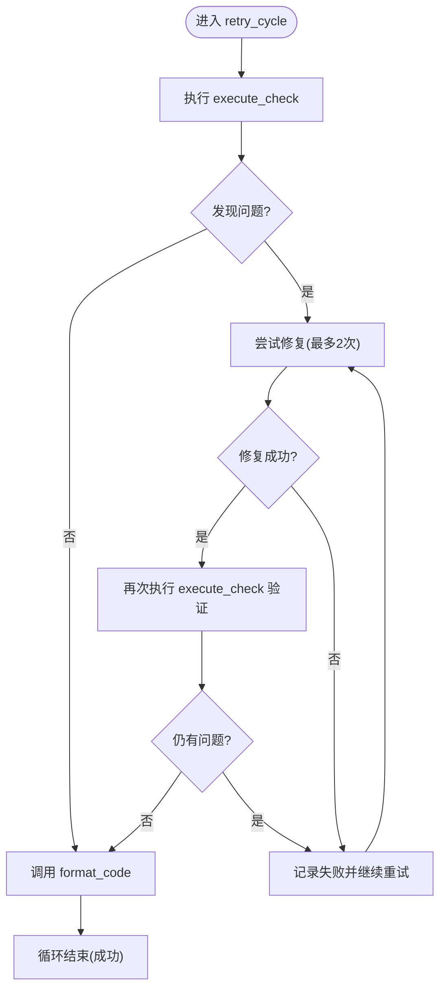
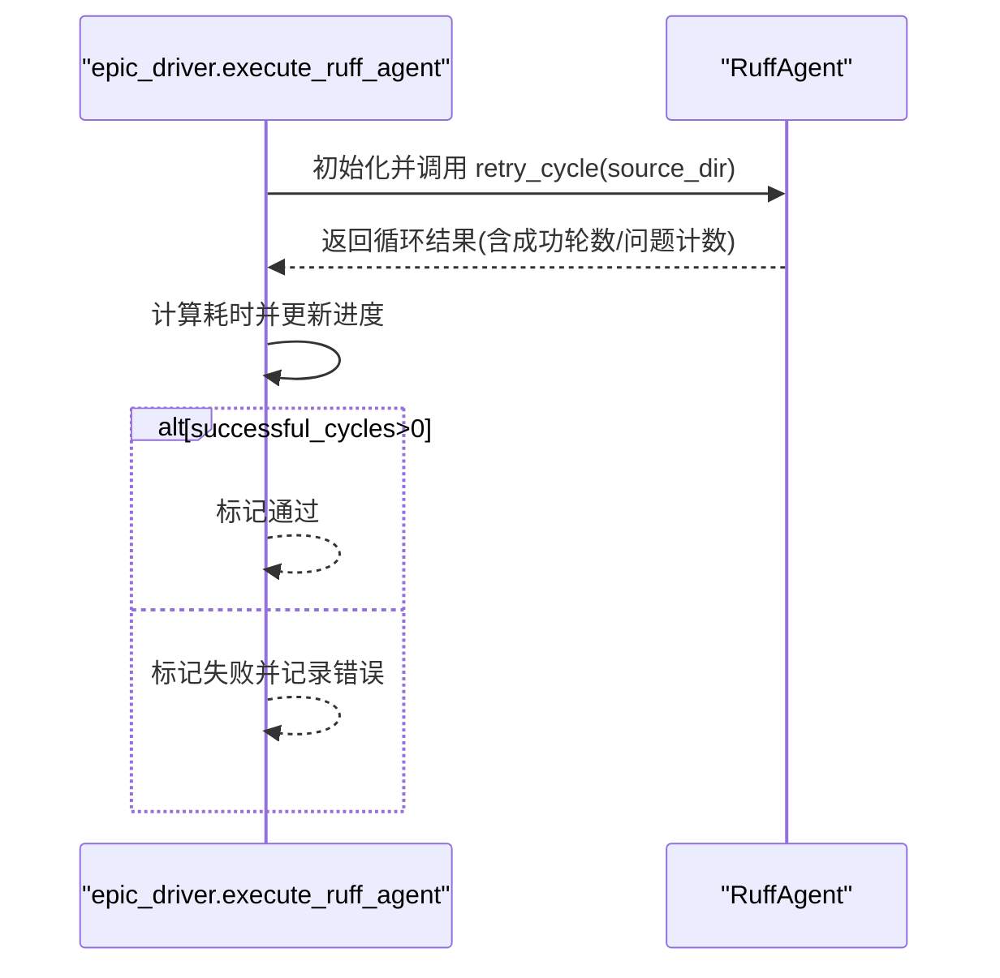
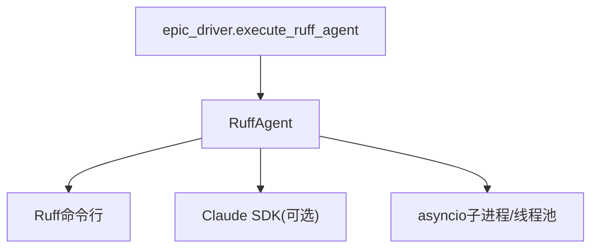

# Ruff代码检查

<cite>
**本文引用的文件**
- [quality_agents.py](file://autoBMAD/epic_automation/quality_agents.py)
- [epic_driver.py](file://autoBMAD/epic_automation/epic_driver.py)
- [test_quality_gates.py](file://tests-copy/epic_automation/test_quality_gates.py)
- [test_ruff_workflow.py](file://tests-copy/unit/test_ruff_workflow.py)
- [quality-gates.md](file://docs-copy/user-guide/quality-gates.md)
- [003.1-nfr-20260108.md](file://docs-copy/qa/assessments/003.1-nfr-20260108.md)
- [003.1-risk-20260108.md](file://docs-copy/qa/assessments/003.1-risk-20260108.md)
</cite>

## 目录
1. [简介](#简介)
2. [项目结构](#项目结构)
3. [核心组件](#核心组件)
4. [架构总览](#架构总览)
5. [详细组件分析](#详细组件分析)
6. [依赖关系分析](#依赖关系分析)
7. [性能与可靠性考量](#性能与可靠性考量)
8. [故障排查指南](#故障排查指南)
9. [结论](#结论)
10. [附录](#附录)

## 简介
本文件围绕Ruff代码检查系统展开，重点阐述RuffAgent的实现与质量门控中的角色。RuffAgent基于CodeQualityAgent抽象，通过调用Ruff命令执行“检查+自动修复”，并在检查循环结束后执行代码格式化，形成“发现问题—修复—验证—格式化”的闭环。文档将详细说明：
- execute_check方法如何执行“ruff check --fix --output-format=json”并解析JSON输出；
- format_code方法在检查循环完成后对代码进行格式化，并在不中断主流程的前提下运行；
- RuffAgent继承CodeQualityAgent的实现方式及其在质量门控中的作用；
- 以测试用例为依据的修复闭环流程说明。

## 项目结构
RuffAgent位于质量工具模块中，配合epic驱动器在质量门控阶段执行；用户指南文档提供配置与使用建议；测试覆盖了RuffAgent的执行、JSON解析、格式化等关键路径。

图表来源
- [quality_agents.py](file://autoBMAD/epic_automation/quality_agents.py#L41-L1012)
- [epic_driver.py](file://autoBMAD/epic_automation/epic_driver.py#L166-L228)
- [test_quality_gates.py](file://tests-copy/epic_automation/test_quality_gates.py#L40-L100)
- [test_ruff_workflow.py](file://tests-copy/unit/test_ruff_workflow.py#L1-L295)
- [quality-gates.md](file://docs-copy/user-guide/quality-gates.md#L1-L120)
- [003.1-nfr-20260108.md](file://docs-copy/qa/assessments/003.1-nfr-20260108.md#L1-L256)
- [003.1-risk-20260108.md](file://docs-copy/qa/assessments/003.1-risk-20260108.md#L32-L123)

章节来源
- [quality_agents.py](file://autoBMAD/epic_automation/quality_agents.py#L41-L1012)
- [epic_driver.py](file://autoBMAD/epic_automation/epic_driver.py#L166-L228)
- [test_quality_gates.py](file://tests-copy/epic_automation/test_quality_gates.py#L40-L100)
- [test_ruff_workflow.py](file://tests-copy/unit/test_ruff_workflow.py#L1-L295)
- [quality-gates.md](file://docs-copy/user-guide/quality-gates.md#L1-L120)
- [003.1-nfr-20260108.md](file://docs-copy/qa/assessments/003.1-nfr-20260108.md#L1-L256)
- [003.1-risk-20260108.md](file://docs-copy/qa/assessments/003.1-risk-20260108.md#L32-L123)

## 核心组件
- CodeQualityAgent：抽象基类，定义通用的质量检查与修复框架，包含execute_check、fix_issues、retry_cycle等方法。
- RuffAgent：继承自CodeQualityAgent，专门针对Ruff工具，提供Ruff特定的命令模板、格式化能力与重试循环。
- epic_driver.execute_ruff_agent：在质量门控阶段调用RuffAgent，负责生命周期管理与结果判定。

章节来源
- [quality_agents.py](file://autoBMAD/epic_automation/quality_agents.py#L41-L1012)
- [epic_driver.py](file://autoBMAD/epic_automation/epic_driver.py#L166-L228)

## 架构总览
RuffAgent在质量门控中的位置如下：

图表来源
- [epic_driver.py](file://autoBMAD/epic_automation/epic_driver.py#L166-L228)
- [quality_agents.py](file://autoBMAD/epic_automation/quality_agents.py#L41-L1012)

## 详细组件分析

### RuffAgent类与继承关系
RuffAgent继承自CodeQualityAgent，重写或扩展以下能力：
- 命令模板：使用“ruff check --fix --output-format=json {source_dir}”。
- format_code：在检查循环完成后执行“ruff format {source_dir}”，并以非阻塞方式处理取消与异常。
- 继承自父类的retry_cycle：执行“检查—修复—再检查”的循环，最多3轮，每轮最多2次重试。

图表来源
- [quality_agents.py](file://autoBMAD/epic_automation/quality_agents.py#L41-L1012)

章节来源
- [quality_agents.py](file://autoBMAD/epic_automation/quality_agents.py#L41-L1012)

### execute_check方法：执行Ruff检查与JSON解析
- 命令构建：使用父类提供的command_template，将source_dir注入到模板中，得到“ruff check --fix --output-format=json {source_dir}”。
- 子进程执行：采用线程池隔离取消作用域，避免anyio取消传播导致的子进程异常；设置超时与错误捕获。
- 输出解析：若stdout非空且可解码为UTF-8，则尝试解析为JSON；解析失败时记录错误并返回False。
- 返回值：(success, issues_list)，其中issues_list为空表示无问题。

图表来源
- [quality_agents.py](file://autoBMAD/epic_automation/quality_agents.py#L61-L154)

章节来源
- [quality_agents.py](file://autoBMAD/epic_automation/quality_agents.py#L61-L154)

### format_code方法：检查循环后的代码格式化
- 命令执行：构造“ruff format {source_dir}”，使用asyncio子进程执行，避免在取消作用域中产生异常。
- 取消处理：在格式化过程中若收到取消，会终止并等待子进程退出，然后记录警告并继续流程。
- 失败处理：格式化执行完成即视为完成，不以返回码严格判定，失败仅记录警告，不影响整体成功状态。

图表来源
- [quality_agents.py](file://autoBMAD/epic_automation/quality_agents.py#L478-L530)

章节来源
- [quality_agents.py](file://autoBMAD/epic_automation/quality_agents.py#L478-L530)

### 修复与验证闭环：从问题到格式化的流程
- 循环控制：retry_cycle最多3轮，每轮最多2次重试。若某轮修复成功，立即跳出循环并触发format_code。
- 修复生成：当存在问题时，调用fix_issues，内部通过Claude SDK生成修复提示并请求修复；若SDK不可用或返回错误，记录并允许重试。
- 验证与格式化：每轮修复后再次执行execute_check以验证修复效果；若无问题，则在循环内调用format_code进行格式化，确保最终代码风格一致。

图表来源
- [quality_agents.py](file://autoBMAD/epic_automation/quality_agents.py#L279-L421)

章节来源
- [quality_agents.py](file://autoBMAD/epic_automation/quality_agents.py#L279-L421)

### 在质量门控中的角色与调用链
- epic_driver.execute_ruff_agent：在质量门控第一阶段调用RuffAgent，导入并实例化RuffAgent，执行retry_cycle，统计耗时并根据successful_cycles判断是否通过。
- 测试覆盖：单元测试验证execute_ruff_agent在成功、跳过、失败等场景下的行为，确保与编排器的集成稳定。

图表来源
- [epic_driver.py](file://autoBMAD/epic_automation/epic_driver.py#L166-L228)
- [test_quality_gates.py](file://tests-copy/epic_automation/test_quality_gates.py#L40-L100)

章节来源
- [epic_driver.py](file://autoBMAD/epic_automation/epic_driver.py#L166-L228)
- [test_quality_gates.py](file://tests-copy/epic_automation/test_quality_gates.py#L40-L100)

## 依赖关系分析
- RuffAgent依赖：
  - Ruff命令行工具（通过子进程调用）。
  - 可选的Claude SDK（用于生成修复提示），若不可用则降级处理。
  - asyncio子进程与线程池，用于隔离取消作用域与避免阻塞。
- 质量门控依赖：
  - epic_driver在质量门控阶段调用RuffAgent，作为第一道质量门。

图表来源
- [quality_agents.py](file://autoBMAD/epic_automation/quality_agents.py#L41-L1012)
- [epic_driver.py](file://autoBMAD/epic_automation/epic_driver.py#L166-L228)

章节来源
- [quality_agents.py](file://autoBMAD/epic_automation/quality_agents.py#L41-L1012)
- [epic_driver.py](file://autoBMAD/epic_automation/epic_driver.py#L166-L228)

## 性能与可靠性考量
- 异步执行与资源管理：使用asyncio子进程与线程池，避免阻塞事件循环；在取消时主动终止子进程并等待退出，防止僵尸进程。
- JSON解析与错误恢复：对无效JSON输出进行容错处理，记录原始输出便于诊断。
- 重试策略：最大3轮，每轮最多2次重试，避免无限循环；在SDK取消时允许重试，提升稳定性。
- 安全性：命令模板与路径对象校验，避免注入与任意代码执行；移除外部超时机制，降低取消作用域传播风险。

章节来源
- [003.1-nfr-20260108.md](file://docs-copy/qa/assessments/003.1-nfr-20260108.md#L1-L256)
- [003.1-risk-20260108.md](file://docs-copy/qa/assessments/003.1-risk-20260108.md#L32-L123)
- [quality_agents.py](file://autoBMAD/epic_automation/quality_agents.py#L61-L154)

## 故障排查指南
- 工具未安装或路径错误：execute_check会返回失败并提示工具未安装或目录不存在。
- JSON解析失败：当Ruff输出非有效JSON时，记录原始输出并返回失败，便于定位问题。
- SDK不可用或取消：fix_issues在SDK不可用或取消时返回False并允许重试，避免流程中断。
- 取消作用域传播：在format_code与execute_check中均对取消进行显式处理，记录警告并继续执行，保证流程可控。

章节来源
- [test_ruff_workflow.py](file://tests-copy/unit/test_ruff_workflow.py#L1-L295)
- [quality_agents.py](file://autoBMAD/epic_automation/quality_agents.py#L478-L530)

## 结论
RuffAgent通过标准化的CodeQualityAgent框架，实现了“检查—修复—验证—格式化”的闭环流程，并在质量门控中承担关键角色。其设计强调安全性、可靠性与可维护性，配合测试与文档，能够稳定地集成到自动化工作流中。

## 附录
- 用户指南：包含Ruff与Basedpyright的配置示例、常见问题与最佳实践，便于在本地与CI中正确使用质量门控。
- 非功能性评估与风险评估：确认实现满足安全、性能、可靠性和可维护性要求，风险等级为极低。

章节来源
- [quality-gates.md](file://docs-copy/user-guide/quality-gates.md#L1-L120)
- [003.1-nfr-20260108.md](file://docs-copy/qa/assessments/003.1-nfr-20260108.md#L1-L256)
- [003.1-risk-20260108.md](file://docs-copy/qa/assessments/003.1-risk-20260108.md#L32-L123)