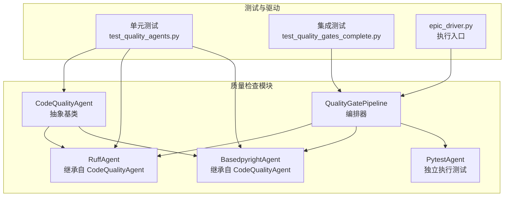
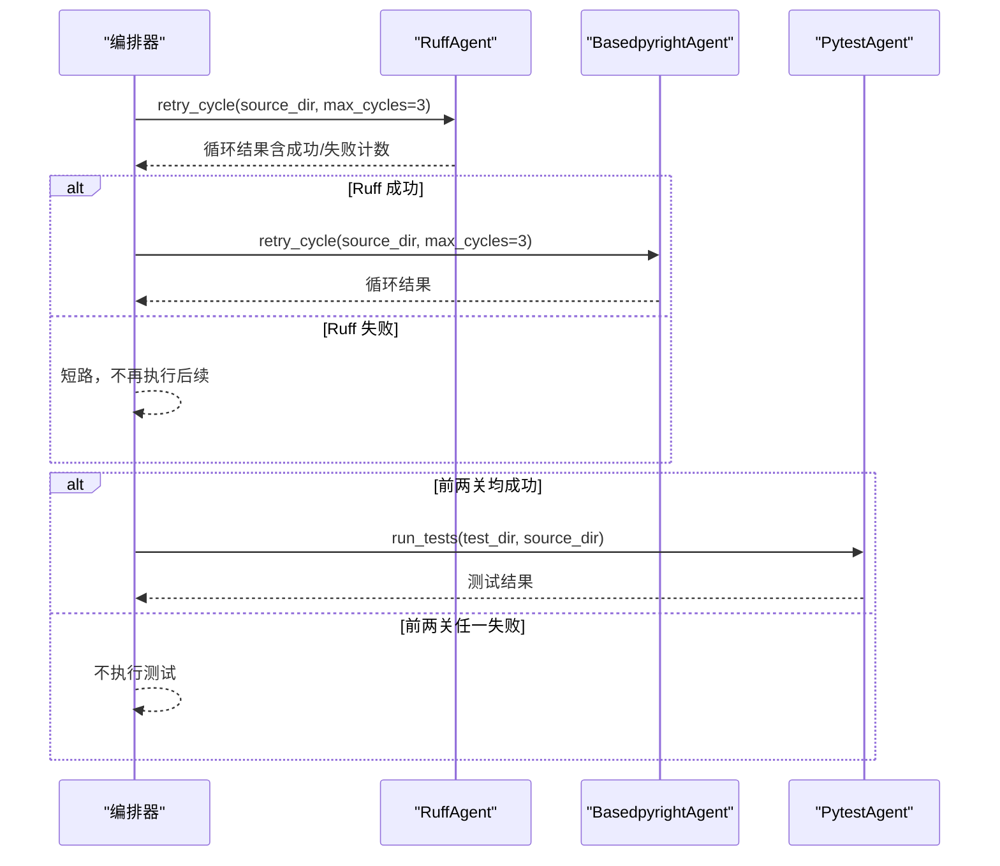
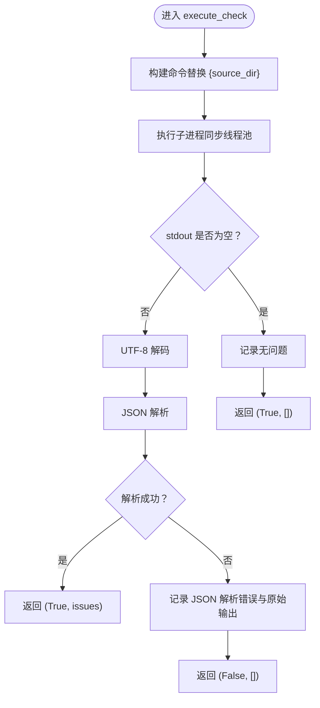
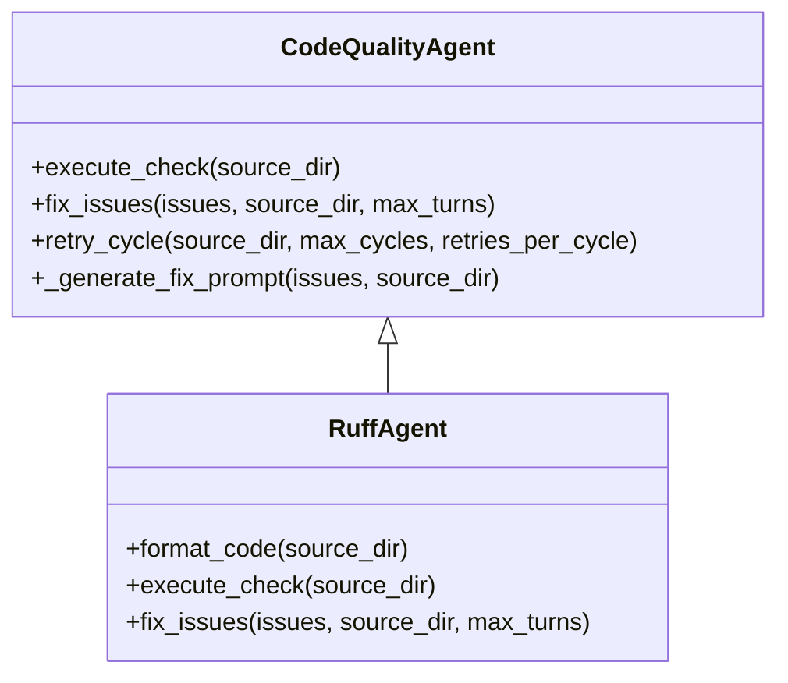
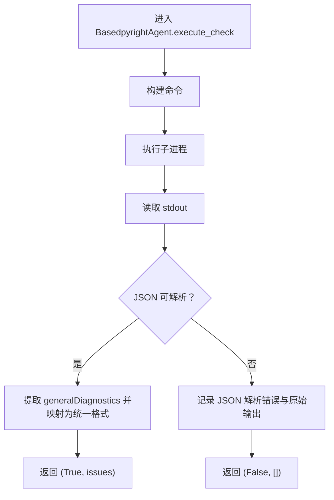
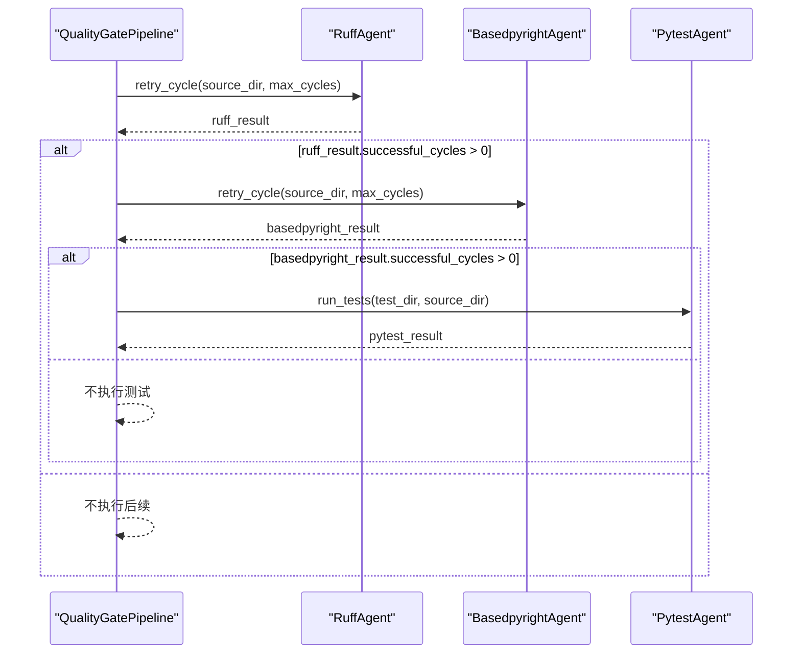
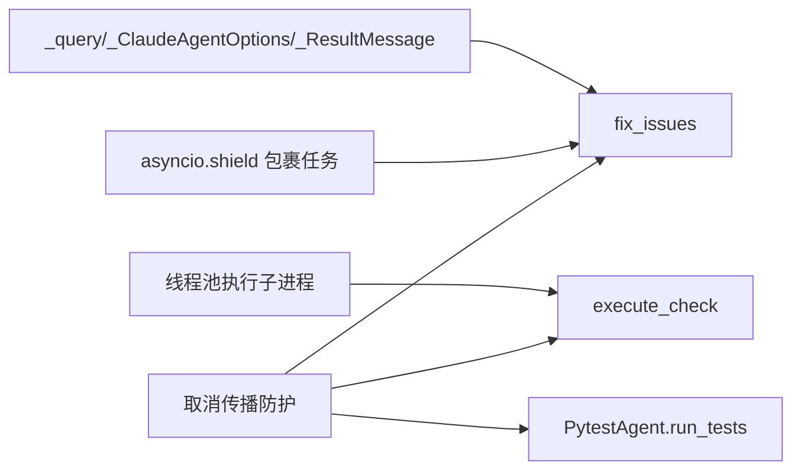
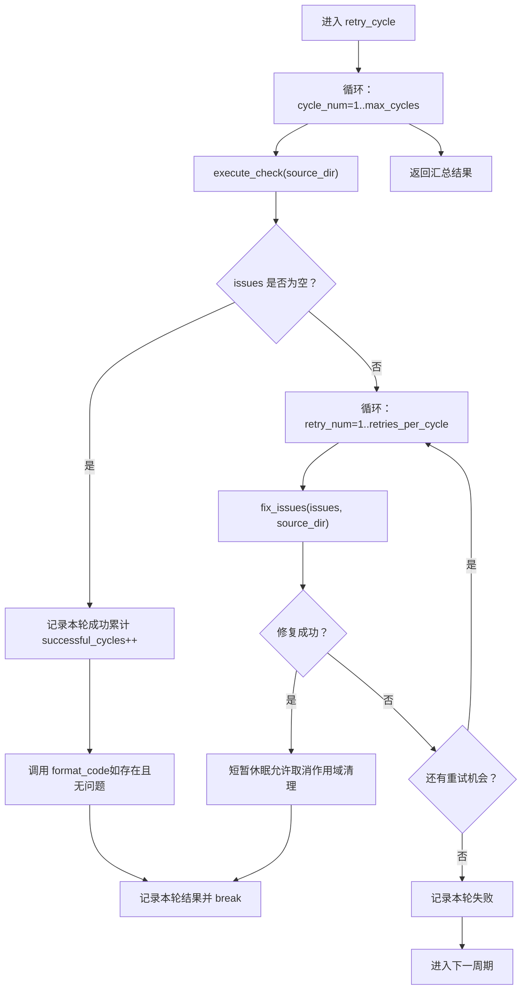

# 代码质量检查

<cite>
**本文引用的文件**
- [quality_agents.py](file://autoBMAD/epic_automation/quality_agents.py)
- [test_quality_agents.py](file://tests-copy/epic_automation/test_quality_agents.py)
- [test_quality_gates_complete.py](file://tests-copy/integration/test_quality_gates_complete.py)
- [epic_driver.py](file://autoBMAD/epic_automation/epic_driver.py)
- [README.md](file://README.md)
- [003.1-risk-20260108.md](file://docs-copy/qa/assessments/003.1-risk-20260108.md)
</cite>

## 目录
1. [简介](#简介)
2. [项目结构](#项目结构)
3. [核心组件](#核心组件)
4. [架构总览](#架构总览)
5. [详细组件分析](#详细组件分析)
6. [依赖关系分析](#依赖关系分析)
7. [性能与可靠性考量](#性能与可靠性考量)
8. [故障排查指南](#故障排查指南)
9. [结论](#结论)
10. [附录](#附录)

## 简介
本文件面向“代码质量检查系统”的实现与使用，聚焦以下目标：
- 详解 CodeQualityAgent、RuffAgent 和 BasedpyrightAgent 的职责与实现
- 说明系统如何集成 Ruff 进行代码检查与自动修复，以及如何使用 Claude SDK 生成修复建议
- 解释 execute_check 方法如何通过子进程执行工具命令并解析 JSON 输出
- 解释 fix_issues 方法如何使用 Claude SDK 生成修复建议，并说明其取消传播防护
- 文档化 retry_cycle 方法的重试机制（最多 3 个周期，每个周期最多 2 次重试）
- 结合测试与示例，说明当检查发现问题时，系统如何触发修复并重新验证的闭环流程
- 解释 RuffAgent 中 format_code 方法在循环完成后的执行逻辑

## 项目结构
该系统位于 autoBMAD/epic_automation 子模块中，核心文件为 quality_agents.py，配套测试位于 tests-copy/epic_automation 与 tests-copy/integration。质量门禁流水线由 QualityGatePipeline 组织，按顺序执行 Ruff、BasedPyright 与 Pytest。

图表来源
- [quality_agents.py](file://autoBMAD/epic_automation/quality_agents.py#L41-L1012)
- [test_quality_agents.py](file://tests-copy/epic_automation/test_quality_agents.py#L1-L200)
- [test_quality_gates_complete.py](file://tests-copy/integration/test_quality_gates_complete.py#L208-L243)
- [epic_driver.py](file://autoBMAD/epic_automation/epic_driver.py#L162-L198)

章节来源
- [quality_agents.py](file://autoBMAD/epic_automation/quality_agents.py#L41-L1012)
- [test_quality_agents.py](file://tests-copy/epic_automation/test_quality_agents.py#L1-L200)
- [test_quality_gates_complete.py](file://tests-copy/integration/test_quality_gates_complete.py#L208-L243)
- [epic_driver.py](file://autoBMAD/epic_automation/epic_driver.py#L162-L198)

## 核心组件
- CodeQualityAgent：抽象基类，提供统一的工具执行、JSON 输出解析、修复建议生成、重试循环等能力
- RuffAgent：面向 Ruff 的专用实现，负责执行 ruff check --fix --output-format=json 并在循环结束后执行 ruff format
- BasedpyrightAgent：面向 BasedPyright 的专用实现，负责执行 basedpyright --outputformat=json 并将诊断转换为统一格式
- PytestAgent：独立执行 pytest，解析返回码与输出
- QualityGatePipeline：编排器，依次执行 Ruff、BasedPyright、Pytest，并汇总结果

章节来源
- [quality_agents.py](file://autoBMAD/epic_automation/quality_agents.py#L41-L1012)

## 架构总览
系统采用“工具抽象 + 专用实现 + 编排器”的分层设计：
- 工具抽象层：CodeQualityAgent 提供 execute_check、fix_issues、retry_cycle 等通用能力
- 专用实现层：RuffAgent、BasedpyrightAgent 分别封装各自工具的命令模板、输出解析与修复提示
- 编排层：QualityGatePipeline 串联三个质量门，前一关失败则短路后续流程

图表来源
- [quality_agents.py](file://autoBMAD/epic_automation/quality_agents.py#L908-L1012)

章节来源
- [quality_agents.py](file://autoBMAD/epic_automation/quality_agents.py#L908-L1012)

## 详细组件分析

### CodeQualityAgent（抽象基类）
- 职责
  - 统一执行工具命令（子进程），解析 JSON 输出
  - 使用 Claude SDK 生成修复建议（通过 _query 接口）
  - 提供 retry_cycle 重试循环，控制最大循环次数与每轮重试次数
- 关键方法
  - execute_check(source_dir)：构建命令、执行子进程、解析 JSON、返回问题列表
  - fix_issues(issues, source_dir, max_turns)：构造提示词、调用 SDK、收集消息、返回修复结果
  - retry_cycle(source_dir, max_cycles, retries_per_cycle)：循环执行检查与修复，统计成功/失败与修复数量
  - _generate_fix_prompt(issues, source_dir)：生成 Claude SDK 的修复提示词
- 取消传播防护
  - 在 fix_issues 中使用 asyncio.shield 包裹任务，避免外部取消导致的异常扩散
  - 在 execute_check 中对子进程执行采用线程池隔离，避免 anyio 取消作用域传播
- JSON 输出解析
  - 对 stdout 进行 UTF-8 解码与 JSON 解析；失败时记录原始输出便于诊断

图表来源
- [quality_agents.py](file://autoBMAD/epic_automation/quality_agents.py#L61-L149)

章节来源
- [quality_agents.py](file://autoBMAD/epic_automation/quality_agents.py#L61-L149)
- [quality_agents.py](file://autoBMAD/epic_automation/quality_agents.py#L155-L278)
- [quality_agents.py](file://autoBMAD/epic_automation/quality_agents.py#L279-L421)

### RuffAgent（Ruff 集成）
- 命令模板
  - 使用 ruff check --fix --output-format=json {source_dir}
- 特殊行为
  - 在 retry_cycle 每次循环结束后，若无问题，调用 format_code 执行 ruff format
  - format_code 使用 asyncio subprocess 执行命令，不使用 asyncio.shield，避免取消传播
- 修复建议
  - 继承父类 fix_issues，使用 Claude SDK 生成修复建议
- 单元测试要点
  - 验证命令模板包含 ruff、check、--fix、--output-format=json、{source_dir}
  - 验证继承父类的 fix_issues 行为

图表来源
- [quality_agents.py](file://autoBMAD/epic_automation/quality_agents.py#L466-L563)
- [quality_agents.py](file://autoBMAD/epic_automation/quality_agents.py#L478-L530)

章节来源
- [quality_agents.py](file://autoBMAD/epic_automation/quality_agents.py#L466-L563)
- [test_quality_agents.py](file://tests-copy/epic_automation/test_quality_agents.py#L406-L417)

### BasedpyrightAgent（类型检查）
- 命令模板
  - 使用 basedpyright --outputformat=json {source_dir}
- 输出解析
  - 从 JSON 中提取 generalDiagnostics，转换为统一的 issues 列表（file、line、column、severity、message、rule、end_line、end_column）
- 修复建议
  - 继承父类 fix_issues，使用 Claude SDK 生成修复建议
- 提示词生成
  - _generate_fix_prompt 针对类型检查问题定制提示词，强调添加缺失类型注解、修正类型标注等

图表来源
- [quality_agents.py](file://autoBMAD/epic_automation/quality_agents.py#L581-L695)

章节来源
- [quality_agents.py](file://autoBMAD/epic_automation/quality_agents.py#L581-L695)
- [test_quality_agents.py](file://tests-copy/epic_automation/test_quality_agents.py#L418-L427)

### PytestAgent（测试执行）
- 功能
  - 在虚拟环境中查找 pytest，执行 pytest -v --tb=short --cov=source_dir
  - 处理返回码：返回 5 视为“未收集到测试”，按成功处理
  - 记录输出与错误信息
- 取消传播防护
  - 在执行过程中捕获 CancelledError，终止进程并等待清理

章节来源
- [quality_agents.py](file://autoBMAD/epic_automation/quality_agents.py#L762-L905)

### QualityGatePipeline（质量门禁流水线）
- 顺序执行
  - Ruff → BasedPyright → Pytest
- 短路逻辑
  - 任一关失败则 pipeline 标记失败并记录错误
- 结果汇总
  - 返回 success、各关结果与错误列表

图表来源
- [quality_agents.py](file://autoBMAD/epic_automation/quality_agents.py#L908-L1012)

章节来源
- [quality_agents.py](file://autoBMAD/epic_automation/quality_agents.py#L908-L1012)
- [test_quality_gates_complete.py](file://tests-copy/integration/test_quality_gates_complete.py#L580-L614)

## 依赖关系分析
- 外部依赖
  - Claude SDK：通过 _query、_ClaudeAgentOptions、_ResultMessage 使用，作为修复建议生成器
  - 子进程：Ruff、Basedpyright、Pytest 均通过子进程执行
- 内部耦合
  - CodeQualityAgent 为抽象基类，RuffAgent、BasedpyrightAgent 继承之
  - QualityGatePipeline 组合三个 Agent，形成顺序依赖
- 取消传播与隔离
  - fix_issues 使用 asyncio.shield 防止外部取消
  - execute_check 使用线程池执行子进程，避免 anyio 取消作用域传播
  - PytestAgent 在子进程执行中显式处理 CancelledError 并清理进程

图表来源
- [quality_agents.py](file://autoBMAD/epic_automation/quality_agents.py#L61-L149)
- [quality_agents.py](file://autoBMAD/epic_automation/quality_agents.py#L155-L278)
- [quality_agents.py](file://autoBMAD/epic_automation/quality_agents.py#L762-L905)

章节来源
- [quality_agents.py](file://autoBMAD/epic_automation/quality_agents.py#L61-L149)
- [quality_agents.py](file://autoBMAD/epic_automation/quality_agents.py#L155-L278)
- [quality_agents.py](file://autoBMAD/epic_automation/quality_agents.py#L762-L905)

## 性能与可靠性考量
- 性能
  - 异步执行避免阻塞；子进程执行采用线程池隔离，减少取消开销
  - Ruff 自动修复在本地就地完成，无需临时文件
- 可靠性
  - retry_cycle 限制最大循环与每轮重试次数，防止无限等待
  - JSON 输出严格解析与错误恢复，保留原始输出便于诊断
  - Pytest 返回码 5 的特殊处理，避免误判
- 安全
  - 子进程执行路径校验与多候选 venv 查找，降低运行风险

章节来源
- [README.md](file://README.md#L164-L183)
- [003.1-risk-20260108.md](file://docs-copy/qa/assessments/003.1-risk-20260108.md#L32-L75)

## 故障排查指南
- Ruff 未安装或不可用
  - 现象：RuffAgent 初始化失败或执行报错
  - 排查：确认系统已安装 Ruff 并可从 PATH 访问
- BasedPyright 输出格式不符
  - 现象：JSON 解析失败或 issues 为空
  - 排查：确认 basedpyright --outputformat=json 输出符合预期结构
- Claude SDK 不可用
  - 现象：fix_issues 返回“SDK not available”
  - 排查：确认已正确安装 Claude SDK 并具备访问权限
- 取消传播导致的异常
  - 现象：任务被取消或子进程未正常退出
  - 排查：检查 asyncio.shield 使用与 CancelledError 处理逻辑
- Pytest 未找到虚拟环境
  - 现象：返回“Virtual environment not found”
  - 排查：确认 venv 或 .venv 存在，或在项目根目录下

章节来源
- [quality_agents.py](file://autoBMAD/epic_automation/quality_agents.py#L61-L149)
- [quality_agents.py](file://autoBMAD/epic_automation/quality_agents.py#L581-L695)
- [quality_agents.py](file://autoBMAD/epic_automation/quality_agents.py#L762-L905)

## 结论
该代码质量检查系统通过抽象基类与专用实现分离关注点，借助编排器实现顺序质量门禁。RuffAgent 与 BasedpyrightAgent 分别覆盖静态检查与类型检查，配合 Claude SDK 的修复建议生成，形成“检查—修复—再验证”的闭环。retry_cycle 的重试机制与取消传播防护确保了稳定性与可维护性。PytestAgent 作为最后一道门，保障测试执行的可靠性。

## 附录

### 重试机制（retry_cycle）说明
- 循环次数：最多 3 个周期
- 每轮重试：最多 2 次
- 流程
  - 每轮先执行 execute_check，得到 issues
  - 若无问题，记录成功并提前结束（同时执行 format_code）
  - 若有问题，尝试 fix_issues，最多重试 2 次
  - 统计 total_cycles、successful_cycles、total_issues_found、total_issues_fixed

图表来源
- [quality_agents.py](file://autoBMAD/epic_automation/quality_agents.py#L279-L421)

章节来源
- [quality_agents.py](file://autoBMAD/epic_automation/quality_agents.py#L279-L421)

### 修复建议生成（fix_issues）与 Claude SDK 集成
- 生成提示词：_generate_fix_prompt 将前若干条问题摘要拼接为提示词
- 调用 SDK：使用 _query(prompt, options=ClaudeAgentOptions(max_turns=150))，返回异步迭代器
- 结果判定：若收到 ResultMessage 且非错误，则视为修复成功，计数为问题总数
- 取消处理：任务级 asyncio.shield 与 CancelledError 捕获，避免异常扩散

章节来源
- [quality_agents.py](file://autoBMAD/epic_automation/quality_agents.py#L155-L278)
- [quality_agents.py](file://autoBMAD/epic_automation/quality_agents.py#L423-L464)
- [quality_agents.py](file://autoBMAD/epic_automation/quality_agents.py#L716-L760)

### 闭环流程示例（含格式化）
- 场景：Ruff 发现若干问题
- 步骤
  1) execute_check 返回 issues
  2) fix_issues 调用 Claude SDK 生成修复建议
  3) 修复后再次 execute_check，若无问题则进入 format_code
  4) format_code 执行 ruff format，无论成功与否不影响整体成功状态
  5) retry_cycle 统计本轮修复数量并记录

章节来源
- [quality_agents.py](file://autoBMAD/epic_automation/quality_agents.py#L338-L361)
- [quality_agents.py](file://autoBMAD/epic_automation/quality_agents.py#L478-L530)

### CLI 驱动与跳过逻辑
- epic_driver.py 提供 execute_ruff_agent 与 execute_basedpyright_agent，支持 --skip-quality 标志跳过质量门禁
- 集成测试验证：当标志开启时，返回 skipped=True 的结果

章节来源
- [epic_driver.py](file://autoBMAD/epic_automation/epic_driver.py#L162-L198)
- [test_quality_gates_complete.py](file://tests-copy/integration/test_quality_gates_complete.py#L580-L614)