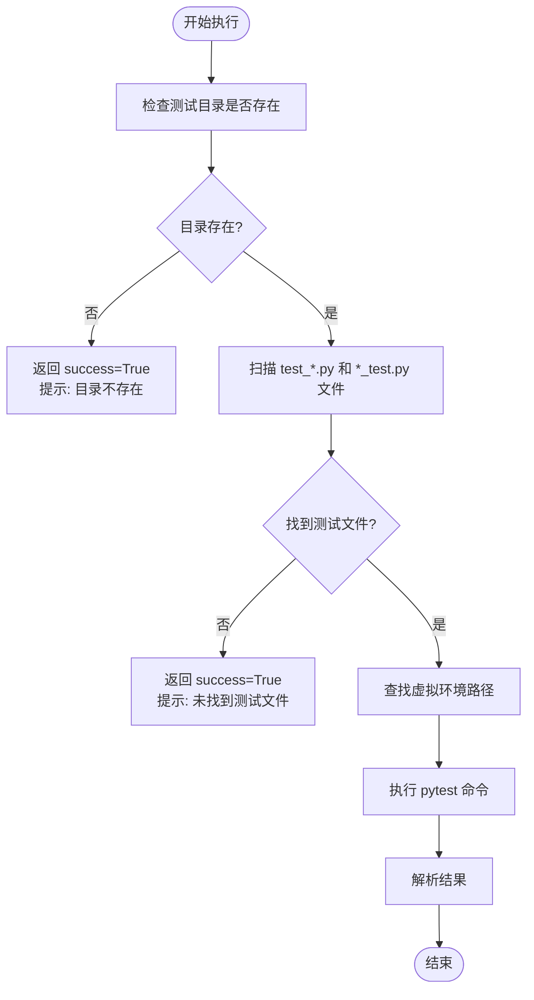

# Pytest测试代理

<cite>
**本文档引用的文件**   
- [qa_tools_integration.py](file://autoBMAD/epic_automation/qa_tools_integration.py)
- [epic_driver.py](file://autoBMAD/epic_automation/epic_driver.py)
- [quality_agents.py](file://autoBMAD/epic_automation/quality_agents.py)
</cite>

## 目录
1. [简介](#简介)
2. [核心功能与工作流程](#核心功能与工作流程)
3. [初始化与执行机制](#初始化与执行机制)
4. [虚拟环境路径查找](#虚拟环境路径查找)
5. [异步子进程执行与保护](#异步子进程执行与保护)
6. [测试结果处理与返回码解析](#测试结果处理与返回码解析)
7. [异常处理与容错策略](#异常处理与容错策略)
8. [与质量门控系统的集成](#与质量门控系统的集成)
9. [总结](#总结)

## 简介

PytestAgent是BMAD自动化系统中的关键组件，负责在SM-Dev-QA循环中执行pytest测试。它作为质量门控流程的最终环节，确保代码在部署前通过全面的自动化测试验证。该代理不仅执行测试，还负责解析结果、处理特殊情况，并与整体工作流协调，是保障软件质量的核心工具。

**Section sources**
- [epic_driver.py](file://autoBMAD/epic_automation/epic_driver.py#L298-L448)

## 核心功能与工作流程

PytestAgent的核心功能是在开发阶段完成后，自动执行项目中的pytest测试套件。其工作流程紧密集成在SM-Dev-QA循环中，具体步骤如下：
1.  **触发条件**：在BasedPyright检查成功完成后，质量门控流程进入第三阶段，触发PytestAgent的执行。
2.  **环境检查**：代理首先检查测试目录是否存在以及是否包含有效的测试文件。
3.  **虚拟环境定位**：通过`_find_venv_path`方法查找项目关联的虚拟环境，以确保使用正确的Python解释器和依赖包。
4.  **命令构建与执行**：构建并执行`pytest`命令，运行测试套件。
5.  **结果解析与决策**：分析测试执行的返回码和输出，判断测试是否通过，并将结果反馈给主流程。

此流程确保了只有在代码静态检查和动态测试均通过的情况下，才能进入下一阶段，从而实现了严格的质量控制。

**Section sources**
- [epic_driver.py](file://autoBMAD/epic_automation/epic_driver.py#L488-L497)
- [quality_agents.py](file://autoBMAD/epic_automation/quality_agents.py#L789-L878)

## 初始化与执行机制

PytestAgent的初始化和执行是通过`run_tests`方法实现的。该方法接收`test_dir`和`source_dir`作为参数，分别指定测试目录和源代码目录。

当`run_tests`被调用时，它首先会进行一系列的前置检查：
- **测试目录检查**：如果指定的`test_dir`不存在或不是目录，代理会返回一个`success=True`的结果，但会包含一条提示信息，说明测试目录不存在，因此跳过了测试执行。
- **测试文件扫描**：即使目录存在，代理也会检查其中是否包含以`test_*.py`或`*_test.py`命名的Python测试文件。如果未找到任何测试文件，同样会返回`success=True`，并附带“未找到测试文件”的提示信息。

这种设计允许工作流在没有测试或测试尚未编写的情况下继续进行，避免了不必要的中断，同时提供了清晰的反馈。



**Diagram sources **
- [quality_agents.py](file://autoBMAD/epic_automation/quality_agents.py#L800-L809)

## 虚拟环境路径查找

为了确保在正确的环境中执行测试，PytestAgent实现了`_find_venv_path`方法来定位虚拟环境。该方法会按优先级顺序检查一系列预定义的路径：

1.  当前工作目录下的 `venv` 和 `.venv` 目录。
2.  项目根目录（`quality_agents.py`文件所在目录的上三级）下的 `venv` 和 `.venv` 目录。

一旦找到存在的虚拟环境目录，该方法即返回其`Path`对象。如果所有候选路径都不存在，则返回`None`。

在构建`pytest`命令时，代理会根据操作系统平台选择正确的可执行文件路径：
- **Windows平台**：使用 `venv_path / "Scripts" / "pytest.exe"`
- **非Windows平台**：使用 `venv_path / "bin" / "pytest"`

这种跨平台的兼容性设计确保了代理在不同操作系统上都能正确找到并调用`pytest`。

```mermaid
classDiagram
class PytestAgent {
+_find_venv_path() Path | None
+_is_windows() bool
+run_tests(test_dir : str, source_dir : str) dict[str, Any]
}
PytestAgent --> "1" VirtualEnvironment : "查找"
VirtualEnvironment : +path : Path
VirtualEnvironment : +exists() : bool
```

**Diagram sources **
- [quality_agents.py](file://autoBMAD/epic_automation/quality_agents.py#L884-L904)

## 异步子进程执行与保护

PytestAgent使用`asyncio.create_subprocess_shell`来异步执行`pytest`命令。这是实现非阻塞、高效执行的关键。

为了防止子进程操作被外部的取消请求中断，代理使用了`asyncio.shield`来保护关键的子进程操作。具体实现如下：

```python
async def run_pytest():
    process = await asyncio.create_subprocess_shell(...)
    try:
        stdout, stderr = await process.communicate()
        return stdout, stderr, process
    except asyncio.CancelledError:
        # 清理逻辑
        process.terminate()
        await process.wait()
        raise # 重新抛出取消异常

# 使用 shield 保护子进程的启动和通信
stdout, stderr, process = await asyncio.shield(run_pytest())
```

`asyncio.shield`的作用是，即使外部的协程被取消，`run_pytest`内部的`await process.communicate()`操作也会继续执行直到完成或超时。这确保了测试进程能够被优雅地终止，而不会留下僵尸进程，保证了系统的稳定性和资源的正确释放。

**Section sources**
- [quality_agents.py](file://autoBMAD/epic_automation/quality_agents.py#L833-L854)

## 测试结果处理与返回码解析

PytestAgent对测试结果的处理非常细致，特别是对`exit code 5`的特殊处理。

- **正常情况**：当`pytest`的返回码为`0`时，表示所有测试通过，代理返回`success=True`。返回码非`0`则表示有测试失败或错误，返回`success=False`。
- **特殊情况 (exit code 5)**：`pytest`返回`5`表示“没有收集到任何测试”（no tests collected）。这可能发生在测试文件存在但pytest无法识别其为测试用例的情况下。PytestAgent对此进行了特殊处理：**如果代理在执行前已经扫描并确认了测试文件的存在，但`pytest`返回了`5`，代理仍会返回`success=True`**。这被视为一种“软成功”，因为它表明测试套件是存在的，只是执行时出现了配置或收集问题，而不是代码逻辑错误。同时，代理会记录警告信息，提示“未收集到测试”。

这种处理逻辑避免了因测试框架配置问题而阻塞整个CI/CD流程，同时保留了问题的可见性。

**Section sources**
- [quality_agents.py](file://autoBMAD/epic_automation/quality_agents.py#L860-L872)

## 异常处理与容错策略

PytestAgent实现了全面的异常处理机制，以应对各种潜在的错误情况：

1.  **前置检查异常**：在执行测试前，对目录和文件的检查都包裹在异常处理中，确保任何文件系统错误都不会导致代理崩溃。
2.  **子进程异常**：`create_subprocess_shell`和`communicate`可能抛出的异常（如`FileNotFoundError`、`PermissionError`）都会被捕获。
3.  **编码异常**：在解码子进程的`stdout`和`stderr`时，使用了`safe_decode`函数，能够处理`UnicodeDecodeError`，回退到`latin-1`编码，防止因输出包含非UTF-8字符而导致解析失败。
4.  **取消异常**：如前所述，通过`CancelledError`的捕获和清理逻辑，实现了对协程取消的优雅响应。

所有捕获的异常都会被记录到日志中，并作为错误信息包含在返回结果中，确保了问题的可追溯性。

**Section sources**
- [quality_agents.py](file://autoBMAD/epic_automation/quality_agents.py#L880-L882)

## 与质量门控系统的集成

PytestAgent是`QualityGateOrchestrator`（质量门控协调器）的一部分，该协调器定义了完整的质量检查流水线：Ruff → BasedPyright → Pytest。

其集成方式如下：
1.  **顺序执行**：协调器按顺序执行三个质量门控。PytestAgent的执行是第三步，**只有在前两步（Ruff和BasedPyright）都成功通过后才会触发**。
2.  **结果聚合**：协调器会收集PytestAgent的执行结果，并将其与其他门控的结果一起汇总到最终的报告中。
3.  **决策依据**：整个质量门控流程的成功与否，取决于所有三个阶段的结果。如果PytestAgent返回`success=False`，则整个流程失败，工作流将停止或进入修复模式。

这种集成方式确保了代码质量的层层把关，PytestAgent作为最终的动态验证环节，起到了至关重要的作用。

```mermaid
sequenceDiagram
participant Orchestrator as QualityGateOrchestrator
participant PytestAgent as PytestAgent
participant Subprocess as pytest subprocess
Orchestrator->>PytestAgent : execute_pytest_agent(test_dir)
activate PytestAgent
PytestAgent->>PytestAgent : 检查目录和文件
alt 目录/文件不存在
PytestAgent-->>Orchestrator : 返回 success=True (带提示)
deactivate PytestAgent
else 存在测试
PytestAgent->>PytestAgent : _find_venv_path()
PytestAgent->>PytestAgent : 构建命令
PytestAgent->>Subprocess : asyncio.shield(create_subprocess_shell)
activate Subprocess
Subprocess-->>PytestAgent : 返回 stdout, stderr, returncode
deactivate Subprocess
PytestAgent->>PytestAgent : 解析结果 (特殊处理 exit code 5)
PytestAgent-->>Orchestrator : 返回最终结果
deactivate PytestAgent
end
```

**Diagram sources **
- [epic_driver.py](file://autoBMAD/epic_automation/epic_driver.py#L298-L448)
- [quality_agents.py](file://autoBMAD/epic_automation/quality_agents.py#L789-L878)

## 总结

PytestAgent是一个功能完备、健壮且集成度高的测试执行代理。它通过智能的初始化检查、跨平台的虚拟环境支持、受保护的异步执行、对特殊返回码的合理处理以及全面的异常捕获，确保了在SM-Dev-QA循环中能够可靠地执行和报告测试结果。其与质量门控系统的紧密集成，使其成为保障软件交付质量不可或缺的一环。