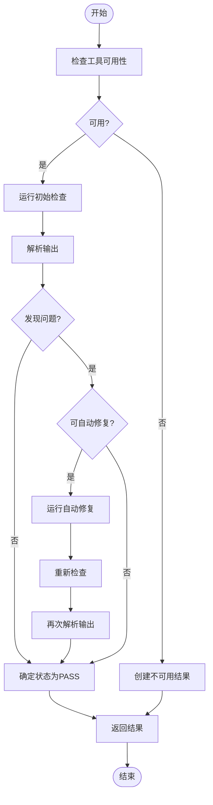
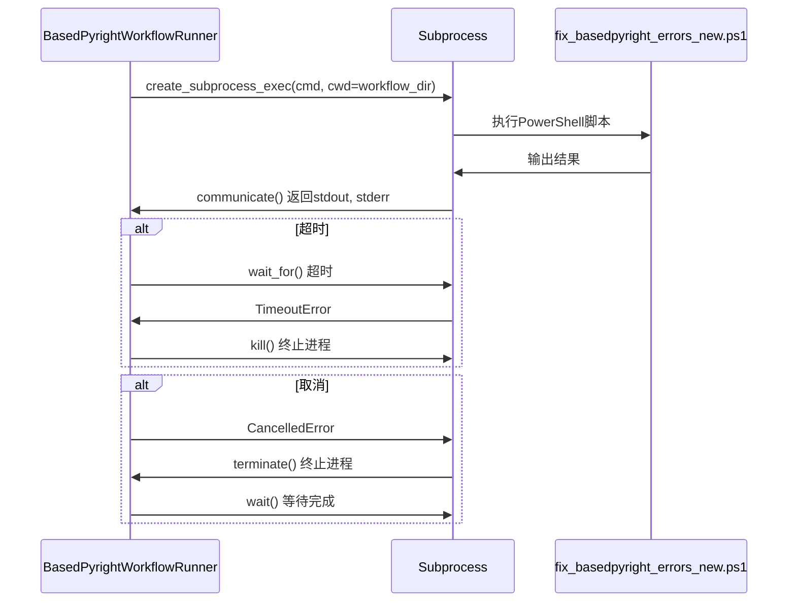
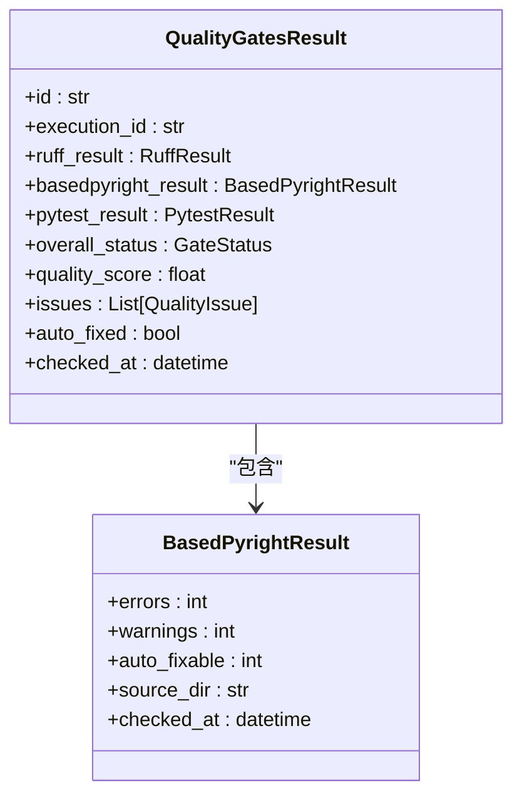
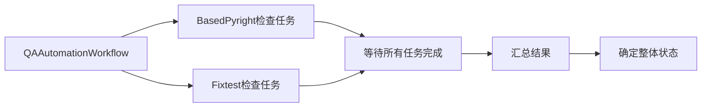

# BasedPyright工作流

<cite>
**本文档引用的文件**  
- [qa_tools_integration.py](file://autoBMAD/epic_automation/qa_tools_integration.py#L27-L741)
- [architecture.md](file://docs-copy/architecture.md#L320-L360)
- [test_qa_integration.py](file://tests-copy/test_qa_integration.py#L156-L309)
- [test_basedpyright_workflow.py](file://tests-copy/unit/test_basedpyright_workflow.py#L1-L105)
</cite>

## 目录
1. [简介](#简介)
2. [核心组件](#核心组件)
3. [执行流程分析](#执行流程分析)
4. [与PowerShell脚本的集成](#与powershell脚本的集成)
5. [外部进程安全执行机制](#外部进程安全执行机制)
6. [结果解析与结构化](#结果解析与结构化)
7. [质量门控中的作用](#质量门控中的作用)
8. [并行执行策略](#并行执行策略)
9. [SM-Dev-QA循环中的执行时机](#sm-dev-qa循环中的执行时机)
10. [常见类型错误处理方案](#常见类型错误处理方案)
11. [性能优化建议](#性能优化建议)

## 简介
BasedPyright工作流是BMAD自动化系统中的关键质量保障组件，负责执行静态类型分析并集成自动修复功能。该工作流通过`BasedPyrightWorkflowRunner`类实现，能够调用BasedPyright工具对Python代码进行类型检查，解析JSON格式的检查结果，并根据可自动修复的错误数量决定是否触发修复流程。工作流与PowerShell脚本`fix_basedpyright_errors_new.ps1`深度集成，通过`asyncio.create_subprocess_exec`安全地执行外部进程，确保在SM-Dev-QA循环中的可靠执行。

## 核心组件
`BasedPyrightWorkflowRunner`是BasedPyright工作流的核心实现类，封装了类型检查、结果解析和自动修复等关键功能。该类通过异步方式运行BasedPyright检查，支持配置超时时间和最大重试次数。工作流首先检查BasedPyright-Workflow目录的可用性，验证必需的PowerShell脚本是否存在，然后执行类型检查流程。

**Section sources**
- [qa_tools_integration.py](file://autoBMAD/epic_automation/qa_tools_integration.py#L27-L741)

## 执行流程分析
工作流的执行流程始于`run_check`方法，该方法首先验证工具的可用性，然后执行初始检查。检查结果通过`_parse_basedpyright_output`方法解析，提取错误、警告和可自动修复问题的数量。当检测到可自动修复的问题且重试次数未达到上限时，工作流会调用`_run_auto_fix`方法执行修复，然后重新运行检查以验证修复效果。

**Diagram sources**
- [qa_tools_integration.py](file://autoBMAD/epic_automation/qa_tools_integration.py#L60-L145)

## 与PowerShell脚本的集成
BasedPyright工作流通过`_run_auto_fix`方法与PowerShell脚本`fix_basedpyright_errors_new.ps1`集成。该方法首先验证脚本文件的存在性，然后构建执行命令`["powershell", "-File", "fix_basedpyright_errors_new.ps1"]`。工作流使用`asyncio.create_subprocess_exec`异步执行脚本，设置标准输出和错误输出管道，并通过`asyncio.wait_for`设置超时保护。执行结果的返回码用于判断修复是否成功，非零返回码表示修复完成但存在警告。

**Section sources**
- [qa_tools_integration.py](file://autoBMAD/epic_automation/qa_tools_integration.py#L211-L261)

## 外部进程安全执行机制
工作流使用`asyncio.create_subprocess_exec`安全地执行外部进程，通过`asyncio.shield`保护子进程操作免受取消影响。执行命令时，工作流设置工作目录为`basedpyright-workflow`目录，捕获标准输出和错误输出，并通过`asyncio.wait_for`设置超时。当发生取消操作时，工作流会尝试终止进程并等待其完成，确保资源的正确清理。对于编码错误，工作流提供UTF-8和latin-1的双重解码机制，确保输出的正确解析。

**Diagram sources**
- [qa_tools_integration.py](file://autoBMAD/epic_automation/qa_tools_integration.py#L168-L210)

## 结果解析与结构化
工作流通过`_parse_basedpyright_output`方法解析检查结果，从标准输出中提取错误和警告的数量。解析过程采用简单的启发式方法：在输出行中查找包含"error"或"warning"关键字的行，并尝试提取其中的数字。可自动修复问题的数量通过`min(errors, 10)`的简单规则确定，最多限制为10个。最终结果被结构化为包含状态、工具名称、时间戳、源目录、错误数量、警告数量、可自动修复数量和重试次数的字典。

**Diagram sources**
- [architecture.md](file://docs-copy/architecture.md#L320-L360)
- [qa_tools_integration.py](file://autoBMAD/epic_automation/qa_tools_integration.py#L262-L307)

## 质量门控中的作用
BasedPyright工作流在质量门控中扮演关键角色，其检查结果直接影响整体质量评估。当检查发现错误时，工作流状态被设置为`QA_FAIL`；当存在可自动修复的问题时，状态为`QA_CONCERNS`；当无错误时，状态为`QA_PASS`。这些结果被集成到`QualityGatesResult`模型中，与其他检查工具的结果共同决定整体质量状态。工作流的执行结果还用于生成质量评分和改进建议，为开发团队提供明确的改进方向。

**Section sources**
- [qa_tools_integration.py](file://autoBMAD/epic_automation/qa_tools_integration.py#L126-L132)
- [architecture.md](file://docs-copy/architecture.md#L320-L360)

## 并行执行策略
在`QAAutomationWorkflow`中，BasedPyright工作流与其他检查工具（如Fixtest-Workflow）并行执行。工作流使用`asyncio.create_task`为每个检查工具创建异步任务，然后通过`asyncio.gather`同时等待所有任务完成。这种并行执行策略显著提高了质量检查的效率，避免了串行执行的时间开销。任务管理机制确保所有任务都正确完成，防止任务泄漏。

**Diagram sources**
- [qa_tools_integration.py](file://autoBMAD/epic_automation/qa_tools_integration.py#L625-L638)

## SM-Dev-QA循环中的执行时机
BasedPyright工作流在SM-Dev-QA循环的QA阶段执行，通常在代码提交后或每日构建时触发。工作流作为自动化质量检查的一部分，与其他工具协同工作，确保代码质量符合标准。执行时机由`QAAutomationWorkflow`协调，确保在开发工作完成后立即进行质量验证。工作流的执行结果直接影响后续的开发决策，如是否需要修复问题或是否可以进入下一阶段。

**Section sources**
- [qa_tools_integration.py](file://autoBMAD/epic_automation/qa_tools_integration.py#L607-L663)

## 常见类型错误处理方案
对于常见的类型错误，工作流采用自动修复与人工干预相结合的策略。简单的类型注解缺失问题由PowerShell脚本自动修复，而复杂的类型推断问题则标记为需要人工审查。工作流通过限制可自动修复问题的数量（最多10个）来防止过度修复，确保代码质量的可控性。对于编码错误，工作流提供详细的错误信息和上下文，帮助开发人员快速定位和解决问题。

**Section sources**
- [qa_tools_integration.py](file://autoBMAD/epic_automation/qa_tools_integration.py#L300-L301)

## 性能优化建议
为优化BasedPyright工作流的性能，建议采取以下措施：合理设置超时时间以平衡检查深度和执行速度；利用并行执行策略同时运行多个检查工具；缓存检查结果以避免重复分析；优化PowerShell脚本的执行效率；定期监控工作流的执行时间和资源消耗。此外，应避免在大型代码库上频繁运行完整检查，而是采用增量检查策略，只检查变更的文件。

**Section sources**
- [qa_tools_integration.py](file://autoBMAD/epic_automation/qa_tools_integration.py#L30-L39)
- [qa_tools_integration.py](file://autoBMAD/epic_automation/qa_tools_integration.py#L60-L69)