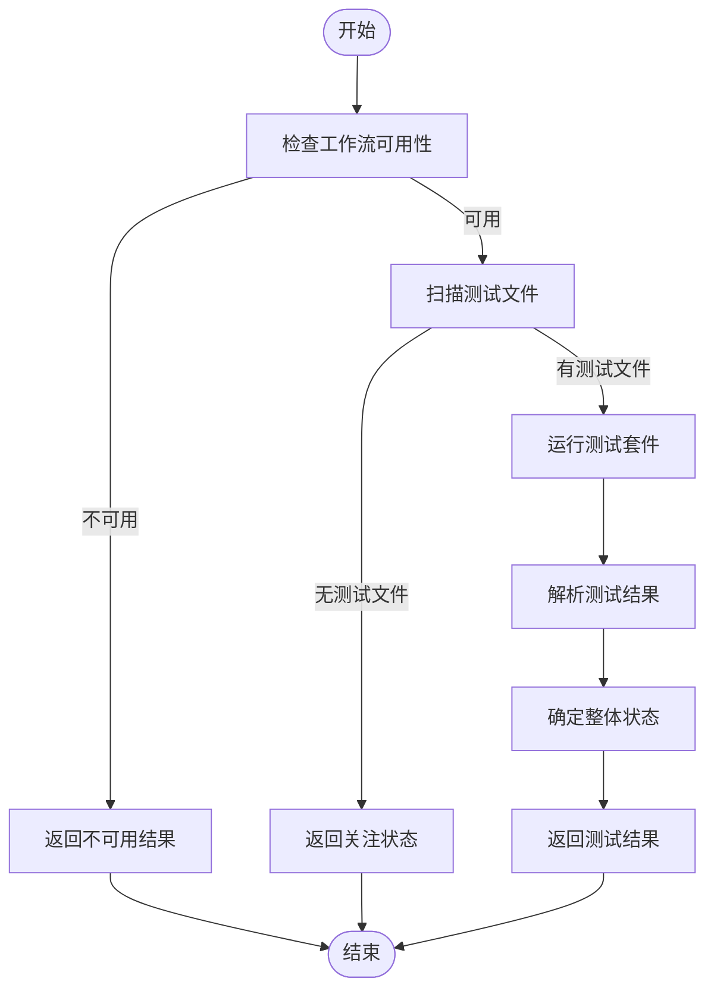
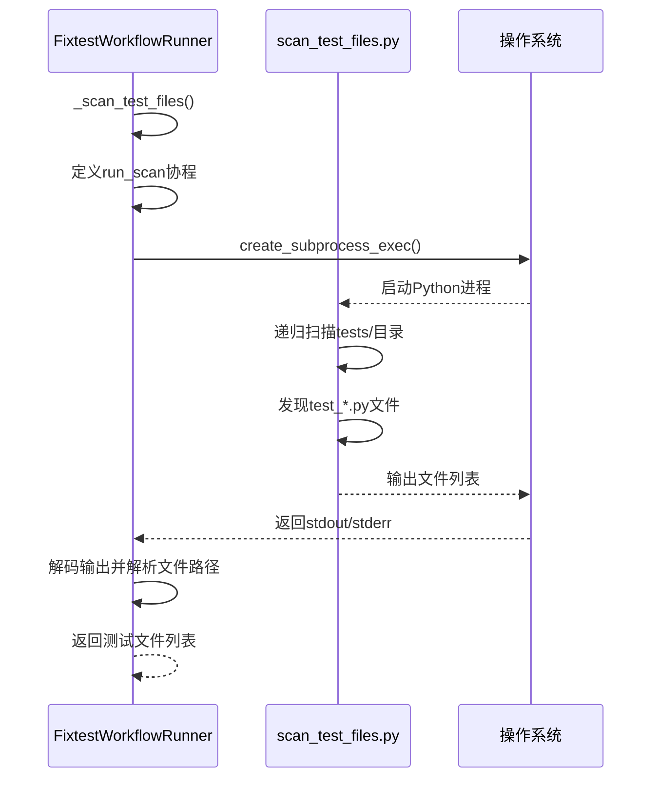
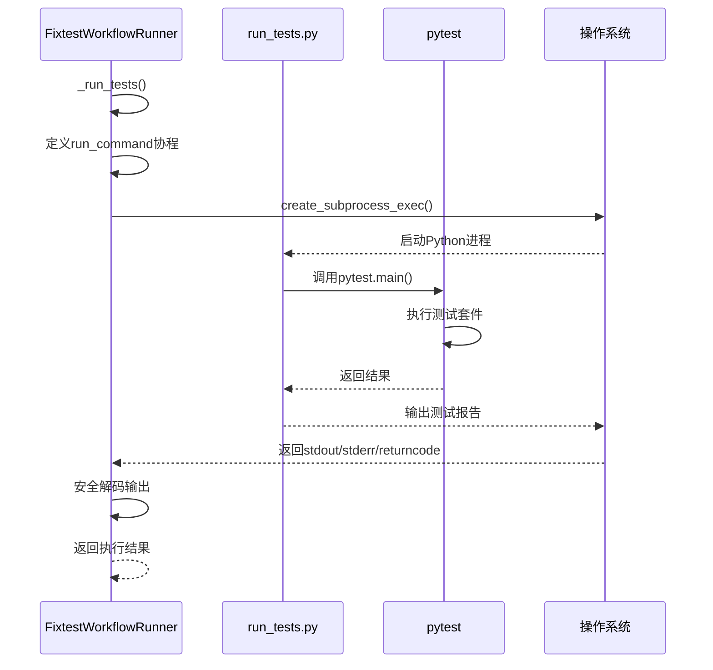
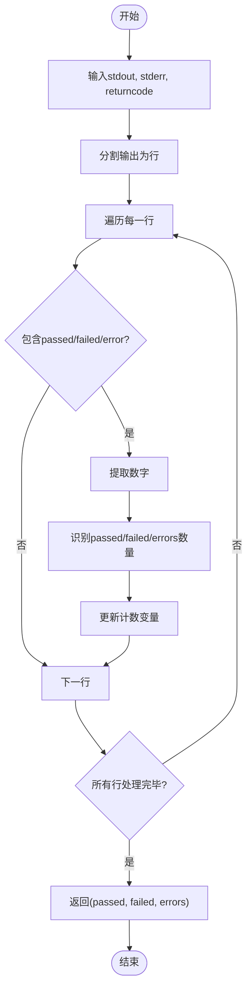
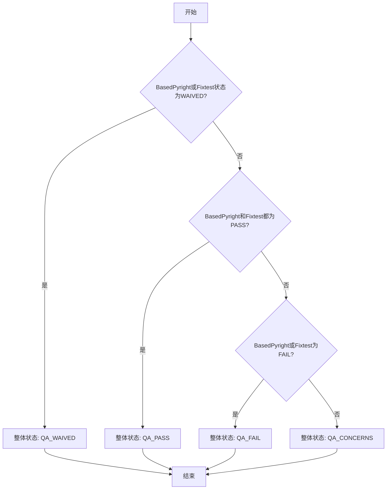

# Fixtest工作流

<cite>
**本文档引用的文件**   
- [qa_tools_integration.py](file://autoBMAD/epic_automation/qa_tools_integration.py)
- [1.integration-testing.yml](file://docs-copy/qa/gates/1.integration-testing.yml)
- [source-tree.md](file://docs-copy/architecture/source-tree.md)
- [workflow_tools.md](file://claude_docs/workflow_tools.md)
</cite>

## 目录
1. [简介](#简介)
2. [核心架构与行为](#核心架构与行为)
3. [_scan_test_files方法分析](#_scan_test_files方法分析)
4. [_run_tests方法分析](#_run_tests方法分析)
5. [结果解析机制](#结果解析机制)
6. [测试状态聚合与质量门控](#测试状态聚合与质量门控)
7. [asyncio.shield保护机制](#asyncioshield保护机制)
8. [集成测试配置关联](#集成测试配置关联)
9. [CI/CD应用模式](#cicd应用模式)
10. [总结](#总结)

## 简介

Fixtest工作流是一个集成的测试执行框架，旨在自动化发现、运行和报告Python测试套件。该工作流作为质量保证体系的关键组件，通过递归扫描测试文件、调用pytest框架执行测试并解析结果，为CI/CD流程提供可靠的测试验证能力。其设计强调稳定性与可靠性，特别采用asyncio.shield保护机制防止测试进程因外部取消操作而成为僵尸进程。

**Section sources**
- [qa_tools_integration.py](file://autoBMAD/epic_automation/qa_tools_integration.py#L323-L581)

## 核心架构与行为

Fixtest工作流的核心由`FixtestWorkflowRunner`类实现，该类封装了完整的测试执行生命周期。工作流从初始化开始，验证必要的脚本文件（scan_test_files.py、run_tests.py、fix_tests.ps1）是否存在，然后按顺序执行两个主要阶段：测试文件扫描和测试套件执行。整个流程通过异步编程模型实现，确保在高并发CI/CD环境中能够高效运行。

工作流的执行逻辑遵循严格的错误处理和重试机制。当工具不可用时，会返回预定义的不可用结果；在执行过程中捕获超时和异常，确保流程的健壮性。测试结果以结构化字典形式返回，包含状态、时间戳、源目录、通过/失败/错误的测试数量等关键指标，便于后续的质量门控决策。

**Diagram sources**
- [qa_tools_integration.py](file://autoBMAD/epic_automation/qa_tools_integration.py#L323-L426)

**Section sources**
- [qa_tools_integration.py](file://autoBMAD/epic_automation/qa_tools_integration.py#L323-L426)

## _scan_test_files方法分析

`_scan_test_files`方法负责递归查找项目中的测试文件，是测试执行的第一步。该方法通过调用外部脚本`scan_test_files.py`来实现文件发现功能。执行时，它构建一个命令列表，使用Python解释器运行该脚本，并在指定的工作流目录中执行。

为了防止外部取消操作中断文件扫描过程，该方法采用了`asyncio.shield`保护机制。内部定义了一个`run_scan`协程函数，使用`asyncio.create_subprocess_exec`创建子进程，并设置标准输出和标准错误的管道。通过`asyncio.wait_for`设置120秒的超时限制，确保扫描操作不会无限期挂起。

当子进程完成时，方法会检查返回码。非零返回码表示扫描过程中存在警告，但不会导致流程失败。输出被解码为UTF-8字符串后，通过简单的文本匹配逻辑（检查行中是否包含"test"和".py"）来提取测试文件路径。这种方法虽然简单，但能有效识别大多数Python测试文件。

**Diagram sources**
- [qa_tools_integration.py](file://autoBMAD/epic_automation/qa_tools_integration.py#L428-L477)
- [workflow_tools.md](file://claude_docs/workflow_tools.md#L432-L461)

**Section sources**
- [qa_tools_integration.py](file://autoBMAD/epic_automation/qa_tools_integration.py#L428-L477)

## _run_tests方法分析

`_run_tests`方法负责调用pytest框架执行测试套件并捕获结果。与文件扫描类似，该方法通过执行`run_tests.py`脚本启动测试过程。命令构建简单直接，仅指定Python解释器和脚本名称，所有配置由脚本内部处理。

该方法同样使用`asyncio.shield`保护测试执行过程，这是防止测试进程成为僵尸进程的关键。内部`run_command`协程创建子进程，设置管道以捕获输出，并通过`process.communicate()`等待执行完成。`asyncio.wait_for`使用实例化的超时值（默认120秒），提供灵活的超时控制。

当测试执行被取消时（`asyncio.CancelledError`），方法会优雅地清理子进程，尝试终止并等待其退出，防止僵尸进程的产生。执行成功后，输出被安全解码（支持UTF-8和latin-1编码），返回标准输出、标准错误和返回码，供后续结果解析使用。

**Diagram sources**
- [qa_tools_integration.py](file://autoBMAD/epic_automation/qa_tools_integration.py#L484-L531)
- [workflow_tools.md](file://claude_docs/workflow_tools.md#L462-L485)

**Section sources**
- [qa_tools_integration.py](file://autoBMAD/epic_automation/qa_tools_integration.py#L484-L531)

## 结果解析机制

Fixtest工作流通过`_parse_test_output`方法解析测试执行结果，将原始输出转化为结构化的测试状态。该方法接收标准输出、标准错误和返回码，分析其中的测试统计信息。

解析逻辑基于对pytest输出格式的模式匹配。方法将标准输出和标准错误合并处理，逐行分析文本。当检测到包含"passed"、"failed"或"error"关键词的行时，将其视为结果摘要。通过分割文本并查找数字，提取通过、失败和错误的测试数量。

例如，对于输出"5 passed, 2 failed, 1 error in 10.50s"，方法会识别出5个通过、2个失败和1个错误的测试。这种解析方式简单有效，能够处理大多数标准的pytest输出格式。解析结果以元组形式返回，便于在`run_check`方法中更新结果字典。

**Diagram sources**
- [qa_tools_integration.py](file://autoBMAD/epic_automation/qa_tools_integration.py#L533-L567)

**Section sources**
- [qa_tools_integration.py](file://autoBMAD/epic_automation/qa_tools_integration.py#L533-L567)

## 测试状态聚合与质量门控

测试结果的聚合与质量门控决策由`_determine_overall_status`方法实现。该方法接收BasedPyright和Fixtest两个工具的结果，综合判断整体质量状态。

决策逻辑遵循严格的优先级规则：首先，如果任一工具状态为"WAIVED"（豁免），则整体状态为"QA_WAIVED"；其次，如果两个工具都通过（"QA_PASS"），则整体通过；再次，如果任一工具失败（"QA_FAIL"），则整体失败；否则，状态为"QA_CONCERNS"（关注）。

这种逻辑确保了质量门控的严格性，任何关键工具的失败都会导致整体失败，而警告或关注状态则需要人工审查。最终结果被编译成包含时间戳、各工具结果、整体状态和摘要的综合字典，为CI/CD流程提供明确的决策依据。

**Diagram sources**
- [qa_tools_integration.py](file://autoBMAD/epic_automation/qa_tools_integration.py#L665-L694)

**Section sources**
- [qa_tools_integration.py](file://autoBMAD/epic_automation/qa_tools_integration.py#L665-L694)

## asyncio.shield保护机制

`asyncio.shield`是Fixtest工作流中防止测试进程成为僵尸进程的关键保护机制。在异步编程中，当一个协程被取消时，它会传播`CancelledError`异常，可能导致正在运行的子进程被中断而无法正常清理。

通过将子进程操作包装在`asyncio.shield`中，即使外部协程被取消，内部的子进程操作也会继续执行直到完成。这确保了测试执行和文件扫描等关键操作的原子性。当`CancelledError`被捕获时，代码会尝试优雅地终止子进程（`process.terminate()`），并等待其退出（`await process.wait()`），防止僵尸进程的产生。

在极端情况下，如果取消操作仍然传播到被保护的协程，代码会记录警告并等待底层的`concurrent.futures.Future`完成，确保子进程最终被清理。这种双重保护机制大大增强了工作流在复杂异步环境中的稳定性。

**Section sources**
- [qa_tools_integration.py](file://autoBMAD/epic_automation/qa_tools_integration.py#L434-L456)
- [qa_tools_integration.py](file://autoBMAD/epic_automation/qa_tools_integration.py#L490-L511)

## 集成测试配置关联

Fixtest工作流与集成测试配置文件`1.integration-testing.yml`紧密关联，该文件定义了质量门控的具体标准。根据该配置，Fixtest的测试结果是决定故事是否通过的关键因素之一。

在`1.integration-testing.yml`中，Pytest测试的通过率是核心指标。配置要求达到100%的通过率，任何失败的测试都会导致质量门控失败。例如，在一个评估中，142个测试中有11个失败（92.25%通过率）直接导致了"FAIL"的门控决策。

这表明Fixtest工作流不仅是执行测试的工具，更是质量保证体系中的决策点。其输出结果直接影响开发流程的推进，确保只有通过所有测试的代码才能进入下一阶段。

**Section sources**
- [1.integration-testing.yml](file://docs-copy/qa/gates/1.integration-testing.yml#L1-L70)

## CI/CD应用模式

在CI/CD环境中，Fixtest工作流作为自动化测试阶段的核心组件被广泛应用。典型的CI/CD流水线会在代码提交或合并请求时触发，首先运行基于Pyright的静态分析，然后执行Fixtest工作流进行单元和集成测试。

工作流的异步设计使其能够高效地集成到现代CI/CD平台中。通过并行执行多个质量检查（如BasedPyright和Fixtest），显著缩短了反馈周期。测试结果被聚合为统一报告，不仅用于决定构建是否成功，还用于更新项目文档和故事状态。

此外，工作流的模块化设计允许在不同环境中灵活配置。例如，在开发环境中可以缩短超时时间以快速反馈，而在生产构建中则可以启用更严格的检查和更长的超时。这种灵活性使其成为CI/CD流程中不可或缺的组成部分。

**Section sources**
- [qa_tools_integration.py](file://autoBMAD/epic_automation/qa_tools_integration.py#L583-L741)

## 总结

Fixtest工作流是一个设计精良的测试执行框架，通过递归扫描测试文件、调用pytest执行测试套件和解析结果，为软件项目提供可靠的自动化测试能力。其核心优势在于使用`asyncio.shield`保护关键操作，防止因外部取消导致的僵尸进程问题，确保了在复杂异步环境中的稳定性。

工作流与质量门控配置紧密集成，其测试结果直接影响CI/CD流程的决策。通过将测试发现、执行和结果解析封装在清晰的API中，它为自动化质量保证提供了坚实的基础。未来可进一步增强结果解析的准确性，支持更多测试框架，并提供更详细的测试报告，以满足日益增长的质量需求。