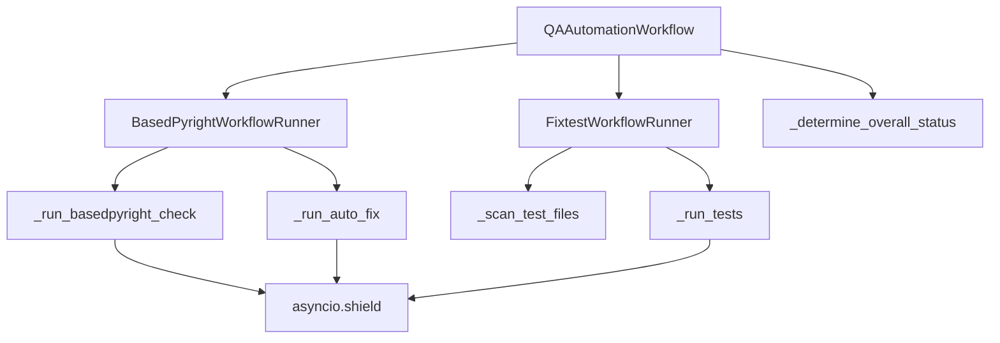
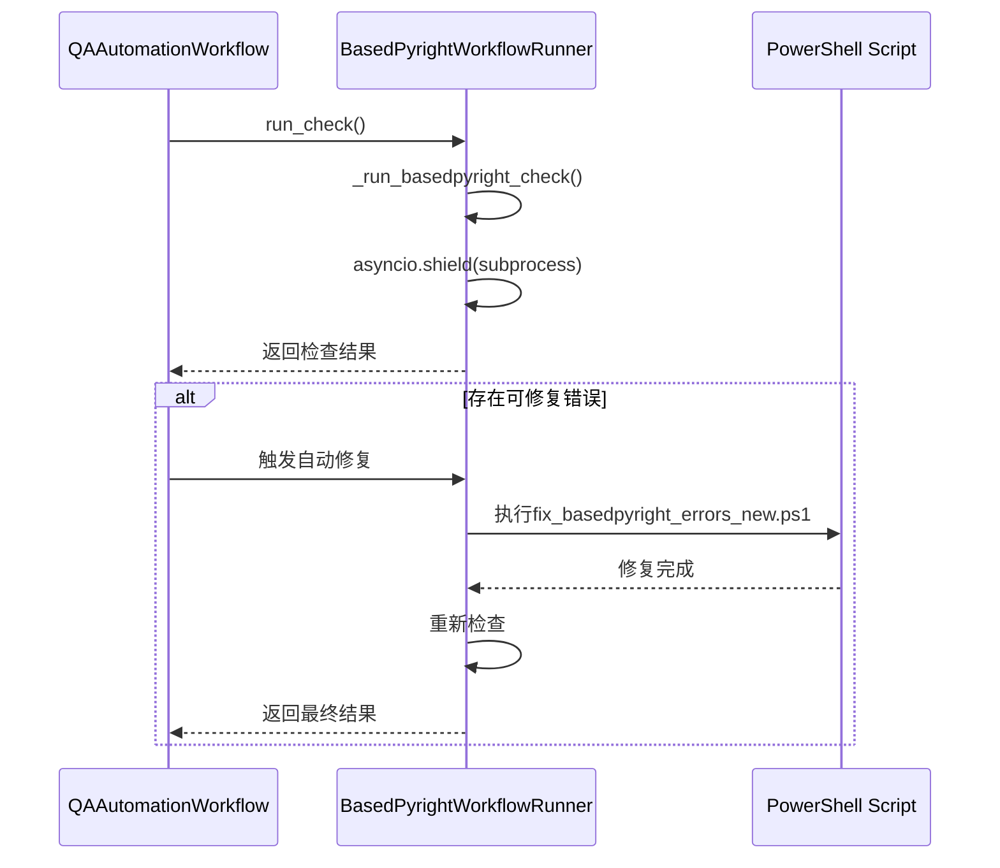
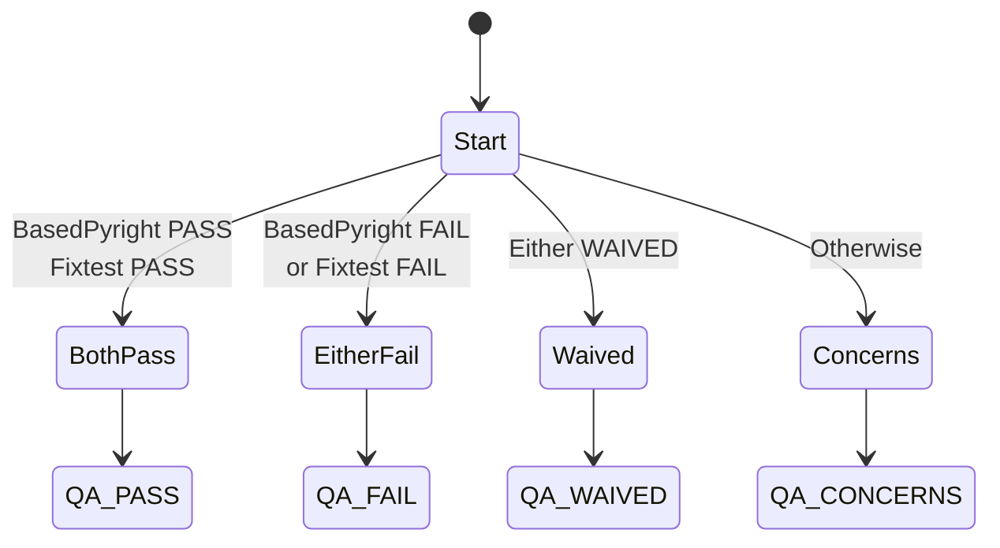

# QA自动化工作流

<cite>
**本文档引用的文件**
- [qa_tools_integration.py](file://autoBMAD/epic_automation/qa_tools_integration.py)
- [qa_agent.py](file://autoBMAD/epic_automation/qa_agent.py)
- [story_parser.py](file://autoBMAD/epic_automation/story_parser.py)
</cite>

## 目录
1. [简介](#简介)
2. [核心组件](#核心组件)
3. [QAAutomationWorkflow架构](#qautomationworkflow架构)
4. [BasedPyrightWorkflowRunner分析](#basedpyrightworkflownrunner分析)
5. [FixtestWorkflowRunner分析](#fixtestworkflownrunner分析)
6. [执行流程与结果聚合](#执行流程与结果聚合)
7. [错误处理与资源保护](#错误处理与资源保护)
8. [状态决策机制](#状态决策机制)

## 简介
QA自动化工作流是一个基于工作流的系统，旨在协调和执行质量保证检查。该系统以QAAutomationWorkflow作为主协调器，同时并行执行两个关键的质量检查工具：BasedPyrightWorkflowRunner和FixtestWorkflowRunner。前者负责类型检查和自动修复，后者负责测试套件的执行。整个系统设计用于在开发过程中确保代码质量和功能完整性，通过综合评估多个维度的检查结果来决定整体质量状态。

## 核心组件
QAAutomationWorkflow系统由三个主要组件构成：QAAutomationWorkflow（主协调器）、BasedPyrightWorkflowRunner（类型检查器）和FixtestWorkflowRunner（测试执行器）。这些组件协同工作，形成一个完整的质量保证流程。主协调器负责启动和管理两个并行的质量检查任务，并最终聚合结果以确定整体质量状态。每个子组件都实现了特定的质量检查功能，包括静态类型分析、测试执行和结果解析。

**本节引用**
- [qa_tools_integration.py](file://autoBMAD/epic_automation/qa_tools_integration.py#L582-L741)

## QAAutomationWorkflow架构
QAAutomationWorkflow作为系统的主协调器，负责初始化和管理两个质量检查工具的执行。它通过构造函数接收两个工作流目录路径和超时设置，创建BasedPyrightWorkflowRunner和FixtestWorkflowRunner实例。在执行过程中，它使用asyncio.gather并发地运行两个检查任务，确保高效的资源利用。系统通过_run_basedpyright_check和_run_tests方法中的asyncio.shield机制保护子进程操作，防止取消操作导致资源泄漏。



**图表来源**
- [qa_tools_integration.py](file://autoBMAD/epic_automation/qa_tools_integration.py#L582-L741)

**本节引用**
- [qa_tools_integration.py](file://autoBMAD/epic_automation/qa_tools_integration.py#L582-L741)

## BasedPyrightWorkflowRunner分析
BasedPyrightWorkflowRunner负责执行类型检查和可能的自动修复。其核心方法_run_basedpyright_check通过subprocess运行BasedPyright检查，并使用asyncio.shield保护操作免受取消影响。检查结果通过_parse_basedpyright_output方法解析，提取错误、警告和可自动修复问题的数量。当发现可修复问题且重试次数未达上限时，系统会调用PowerShell脚本fix_basedpyright_errors_new.ps1进行自动修复。这种机制允许系统在发现类型错误后尝试自我修复，提高开发效率。



**图表来源**
- [qa_tools_integration.py](file://autoBMAD/epic_automation/qa_tools_integration.py#L26-L206)

**本节引用**
- [qa_tools_integration.py](file://autoBMAD/epic_automation/qa_tools_integration.py#L26-L206)

## FixtestWorkflowRunner分析
FixtestWorkflowRunner负责测试套件的执行和结果分析。它首先通过_scan_test_files方法扫描测试文件，然后通过_run_tests方法执行测试套件。与BasedPyright类似，_run_tests方法也使用asyncio.shield保护子进程操作。测试结果通过_parse_test_output方法解析，提取通过、失败和错误的测试数量。系统根据这些指标确定测试状态，为最终的质量评估提供数据支持。

```mermaid
flowchart TD
A[FixtestWorkflowRunner] --> B[_scan_test_files]
B --> C{找到测试文件?}
C --> |是| D[_run_tests]
C --> |否| E[返回警告]
D --> F[asyncio.shield(subprocess)]
F --> G[_parse_test_output]
G --> H[返回测试结果]
```

**图表来源**
- [qa_tools_integration.py](file://autoBMAD/epic_automation/qa_tools_integration.py#L322-L532)

**本节引用**
- [qa_tools_integration.py](file://autoBMAD/epic_automation/qa_tools_integration.py#L322-L532)

## 执行流程与结果聚合
QAAutomationWorkflow的执行流程始于run_qa_checks方法，该方法并行启动BasedPyright和Fixtest检查。系统通过asyncio.gather等待两个任务完成，并确保所有任务都正确结束。完成后，_determine_overall_status方法根据两个检查的结果计算综合状态。结果聚合逻辑考虑了各种状态组合，如两者都通过则整体通过，任一失败则整体失败。最后，_generate_summary方法创建一个人类可读的摘要，包含推荐措施。

**本节引用**
- [qa_tools_integration.py](file://autoBMAD/epic_automation/qa_tools_integration.py#L607-L741)

## 错误处理与资源保护
系统在关键的子进程操作中使用asyncio.shield机制来防止取消操作导致资源泄漏。在_run_basedpyright_check、_run_auto_fix和_run_tests等方法中，异步命令被包装在asyncio.shield中，确保即使外部任务被取消，子进程也能正常完成或被正确清理。此外，系统实现了超时处理和异常捕获，确保在各种错误情况下都能优雅降级并提供详细的错误日志。

**本节引用**
- [qa_tools_integration.py](file://autoBMAD/epic_automation/qa_tools_integration.py#L168-L209)

## 状态决策机制
系统的状态决策机制基于ProcessingStatus枚举，定义了QA_PASS、QA_CONCERNS、QA_FAIL和QA_WAIVED等状态。_determine_overall_status方法根据两个检查工具的结果决定最终状态：如果任一工具被豁免，则整体豁免；如果两者都通过，则整体通过；如果任一失败，则整体失败；否则标记为有顾虑。这种决策逻辑确保了质量门控的严格性和灵活性。



**图表来源**
- [story_parser.py](file://autoBMAD/epic_automation/story_parser.py#L80-L95)

**本节引用**
- [story_parser.py](file://autoBMAD/epic_automation/story_parser.py#L80-L95)