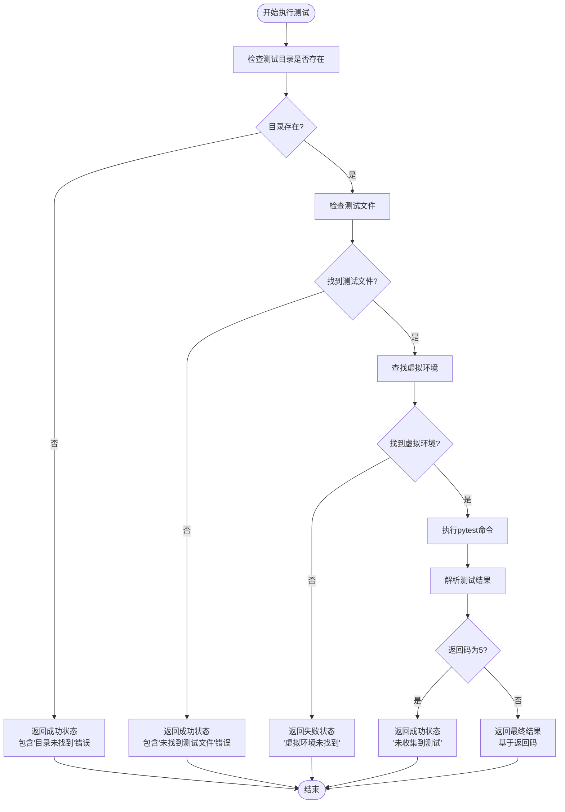
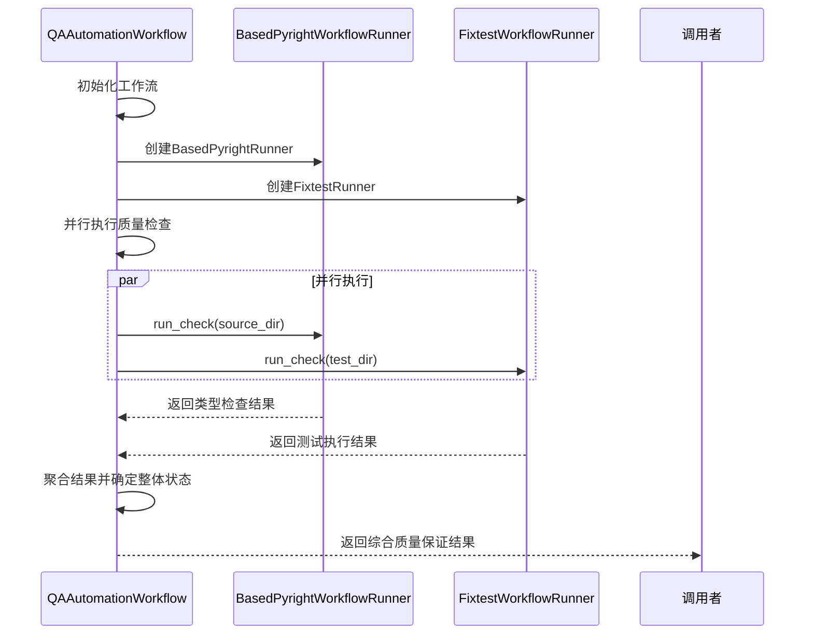
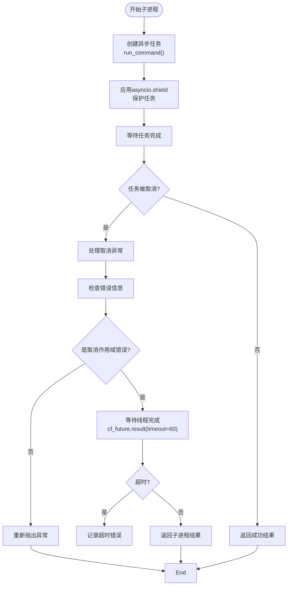
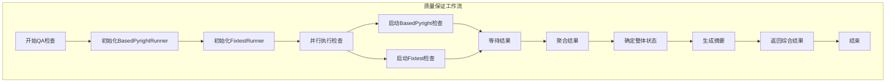

# 测试自动化

<cite>
**本文档引用的文件**
- [qa_agent.py](file://autoBMAD/epic_automation/qa_agent.py)
- [qa_tools_integration.py](file://autoBMAD/epic_automation/qa_tools_integration.py)
- [quality_agents.py](file://autoBMAD/epic_automation/quality_agents.py)
</cite>

## 目录
1. [简介](#简介)
2. [PytestAgent实现](#pytestagent实现)
3. [QAAutomationWorkflow实现](#qautomationworkflow实现)
4. [基于asyncio.shield的保护机制](#基于asyncioshield的保护机制)
5. [整体测试自动化流程](#整体测试自动化流程)
6. [结果聚合逻辑](#结果聚合逻辑)

## 简介
测试自动化系统是BMAD自动化框架的核心组件，负责执行全面的质量保证检查和测试验证。该系统通过集成PytestAgent和QAAutomationWorkflow两个主要组件，实现了从代码质量检查到功能测试的完整自动化流程。PytestAgent专门负责执行pytest测试套件并处理测试结果，而QAAutomationWorkflow则协调多个质量检查工具并行执行。系统特别设计了对测试目录不存在等异常情况的处理逻辑，并使用asyncio.shield机制保护子进程操作免受取消作用域的影响。

## PytestAgent实现

PytestAgent是专门负责执行pytest测试的组件，它实现了完整的测试执行流程和结果处理机制。该组件能够扫描指定的测试目录，执行测试套件，并解析测试结果。

当测试目录不存在时，PytestAgent会进行特殊处理。根据代码实现，如果测试目录不存在或不是目录，系统会记录警告信息并返回一个特殊的成功状态，同时包含"Test directory not found - skipping pytest"的错误信息。这种设计确保了在缺少测试目录的情况下，自动化流程不会中断，而是优雅地跳过测试执行阶段。

**图表来源**
- [quality_agents.py](file://autoBMAD/epic_automation/quality_agents.py#L771-L882)

**本节来源**
- [quality_agents.py](file://autoBMAD/epic_automation/quality_agents.py#L762-L882)

## QAAutomationWorkflow实现

QAAutomationWorkflow是质量保证自动化的协调器，负责并行执行BasedPyrightWorkflowRunner和FixtestWorkflowRunner两个工作流。该工作流通过并发执行类型检查和测试执行，显著提高了质量保证流程的效率。

BasedPyrightWorkflowRunner负责运行类型检查，其工作流程包括：首先执行基于BasedPyright的类型检查，解析输出结果以提取错误和警告数量，然后尝试自动修复发现的问题。如果存在可自动修复的错误，系统会运行PowerShell脚本进行修复，然后重新检查以验证修复效果。这种循环检查和修复的机制确保了代码质量的持续改进。

FixtestWorkflowRunner负责扫描测试文件、执行测试并解析结果。其工作流程包括：首先扫描测试目录以发现所有测试文件，然后执行pytest测试套件，最后解析测试输出以提取通过、失败和错误的测试数量。系统会检查输出中的摘要信息，如"5 passed, 2 failed, 1 error in 10.50s"，并从中提取测试计数。

**图表来源**
- [qa_tools_integration.py](file://autoBMAD/epic_automation/qa_tools_integration.py#L582-L740)

**本节来源**
- [qa_tools_integration.py](file://autoBMAD/epic_automation/qa_tools_integration.py#L27-L580)

## 基于asyncio.shield的保护机制

系统在_run_basedpyright_check和_run_tests方法中使用asyncio.shield来保护子进程操作，这是一种关键的错误处理和取消作用域隔离机制。asyncio.shield的主要作用是防止外部取消请求中断正在进行的关键操作，确保子进程能够完成其执行或被正确清理。

在_run_basedpyright_check方法中，系统创建了一个内部异步函数run_command，该函数使用asyncio.create_subprocess_exec启动子进程。关键的保护机制体现在await asyncio.shield(run_command())这一行，它确保了即使外部任务被取消，子进程操作也会继续执行直到完成或超时。如果发生asyncio.CancelledError异常，系统会先尝试终止子进程并等待其清理，然后再重新抛出异常。

这种保护机制特别重要，因为它防止了在复杂异步环境中常见的"取消作用域污染"问题。当一个异步操作被取消时，取消信号可能会传播到所有相关的任务，导致关键的清理操作无法完成。通过使用asyncio.shield，系统确保了子进程操作的原子性，即使在外部取消的情况下也能正确处理资源清理。

**图表来源**
- [quality_agents.py](file://autoBMAD/epic_automation/quality_agents.py#L82-L132)

**本节来源**
- [quality_agents.py](file://autoBMAD/epic_automation/quality_agents.py#L82-L132)

## 整体测试自动化流程

整体测试自动化流程由QAAutomationWorkflow协调执行，它并行运行BasedPyright类型检查和Fixtest测试执行，然后聚合结果以确定整体质量状态。流程首先检查两个工具的可用性，然后同时启动两个检查任务。

系统使用asyncio.gather来并行执行两个检查任务，这确保了类型检查和测试执行可以同时进行，最大限度地利用系统资源。一旦两个任务完成，系统会根据各自的返回状态确定整体质量状态。状态确定逻辑遵循优先级规则：如果任一工具不可用，则整体状态为QA_WAIVED；如果两个检查都通过，则整体状态为QA_PASS；如果任一检查失败，则整体状态为QA_FAIL；否则为QA_CONCERNS。

**图表来源**
- [qa_tools_integration.py](file://autoBMAD/epic_automation/qa_tools_integration.py#L607-L663)

**本节来源**
- [qa_tools_integration.py](file://autoBMAD/epic_automation/qa_tools_integration.py#L607-L663)

## 结果聚合逻辑

结果聚合逻辑是测试自动化系统的核心，它将来自不同工具的分散结果整合成一个统一的视图。系统为每个检查工具生成详细的结果字典，包括状态、时间戳、源目录、错误计数等信息。对于BasedPyright，结果包含错误、警告和可自动修复问题的数量；对于Fixtest，结果包含通过、失败和错误的测试数量。

聚合过程首先收集各个工具的原始结果，然后应用状态确定逻辑来计算整体质量状态。系统使用ProcessingStatus枚举来表示不同的状态值，包括QA_PASS、QA_CONCERNS、QA_FAIL和QA_WAIVED。整体状态的确定遵循严格的优先级规则，确保了决策的一致性和可预测性。

最终的综合结果包含一个详细的摘要，其中包括整体状态、各工具状态、关键指标和建议。建议部分根据检查结果动态生成，例如"修复X个BasedPyright错误"或"解决Y个失败的测试"。这种结构化的结果表示方式使得开发人员可以快速理解质量状况并采取相应的行动。

**本节来源**
- [qa_tools_integration.py](file://autoBMAD/epic_automation/qa_tools_integration.py#L665-L740)