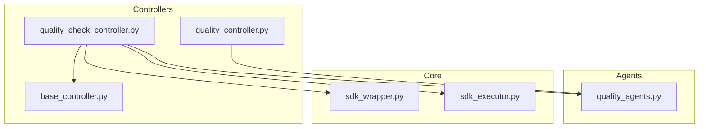
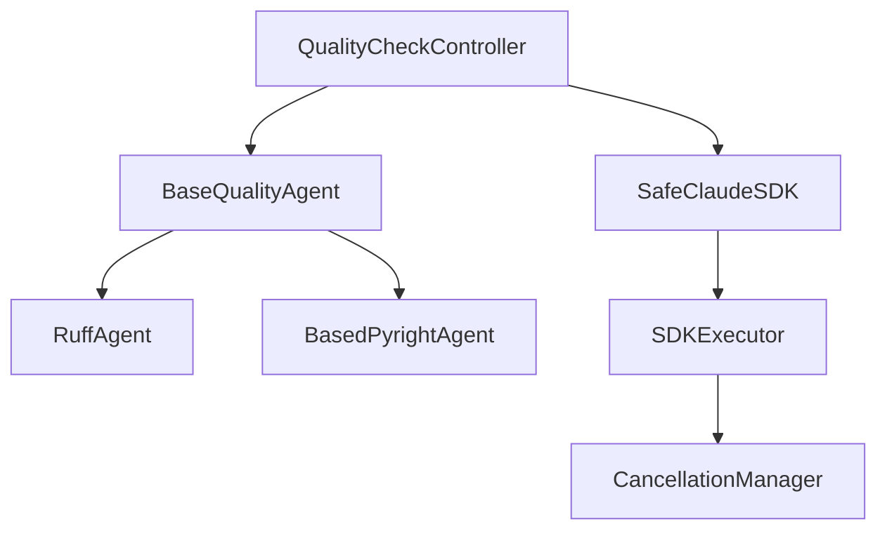
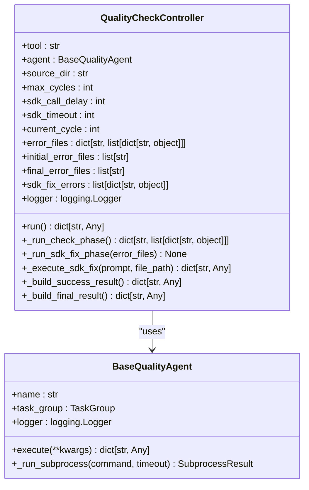
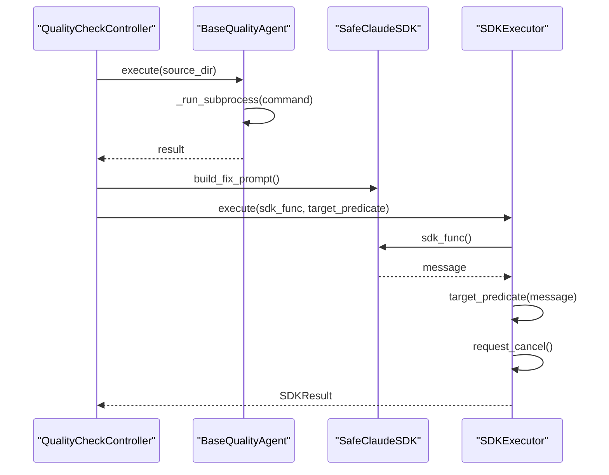
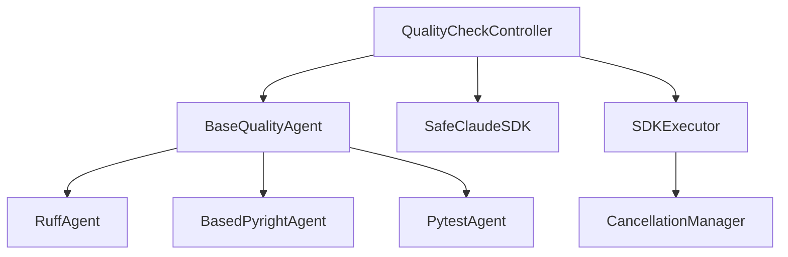

# 质量检查控制器

<cite>
**本文档引用的文件**   
- [quality_check_controller.py](file://autoBMAD/epic_automation/controllers/quality_check_controller.py)
- [base_controller.py](file://autoBMAD/epic_automation/controllers/base_controller.py)
- [quality_controller.py](file://autoBMAD/epic_automation/controllers/quality_controller.py)
- [quality_agents.py](file://autoBMAD/epic_automation/agents/quality_agents.py)
- [sdk_wrapper.py](file://autoBMAD/epic_automation/sdk_wrapper.py)
- [sdk_executor.py](file://autoBMAD/epic_automation/core/sdk_executor.py)
- [test_quality_check_controller.py](file://tests-copy/unit/test_quality_check_controller.py)
</cite>

## 目录
1. [简介](#简介)
2. [项目结构](#项目结构)
3. [核心组件](#核心组件)
4. [架构概述](#架构概述)
5. [详细组件分析](#详细组件分析)
6. [依赖分析](#依赖分析)
7. [性能考虑](#性能考虑)
8. [故障排除指南](#故障排除指南)
9. [结论](#结论)

## 简介
质量检查控制器（QualityCheckController）是autoBMAD自动化系统中的关键组件，负责实现检查 → SDK修复 → 回归检查的闭环流程。该控制器通过多轮循环执行，能够自动检测代码质量问题，并调用SDK进行修复，最终确保代码质量达标。它支持Ruff和BasedPyright两种工具，能够有效维护错误文件列表并决定循环终止条件。

## 项目结构
质量检查控制器位于`autoBMAD/epic_automation/controllers/`目录下，与其他控制器和代理组件协同工作。其主要依赖包括质量代理（quality_agents）、SDK包装器（sdk_wrapper）和SDK执行器（sdk_executor）等模块。

**图表来源**
- [quality_check_controller.py](file://autoBMAD/epic_automation/controllers/quality_check_controller.py)
- [quality_controller.py](file://autoBMAD/epic_automation/controllers/quality_controller.py)
- [base_controller.py](file://autoBMAD/epic_automation/controllers/base_controller.py)

**章节来源**
- [quality_check_controller.py](file://autoBMAD/epic_automation/controllers/quality_check_controller.py)

## 核心组件
质量检查控制器的核心功能包括：
- 控制多轮循环执行
- 维护错误文件列表
- 调用SDK进行自动修复
- 决定循环终止条件

该控制器通过`run`方法启动主流程，首先执行首轮全量检查，若发现错误则进入修复循环，最多执行3轮。每轮循环中，先调用SDK修复，然后进行回归检查，直到所有错误被修复或达到最大循环次数。

**章节来源**
- [quality_check_controller.py](file://autoBMAD/epic_automation/controllers/quality_check_controller.py#L73-L119)

## 架构概述
质量检查控制器采用分层架构设计，上层为控制器，中层为代理，底层为SDK执行器。控制器负责流程控制，代理负责具体的质量检查和修复逻辑，SDK执行器负责与外部SDK交互。

**图表来源**
- [quality_check_controller.py](file://autoBMAD/epic_automation/controllers/quality_check_controller.py)
- [quality_agents.py](file://autoBMAD/epic_automation/agents/quality_agents.py)
- [sdk_wrapper.py](file://autoBMAD/epic_automation/sdk_wrapper.py)
- [sdk_executor.py](file://autoBMAD/epic_automation/core/sdk_executor.py)

## 详细组件分析

### 质量检查控制器分析
质量检查控制器的主要方法包括`run`、`_run_check_phase`、`_run_sdk_fix_phase`和`_execute_sdk_fix`。`run`方法是主入口，控制整个检查和修复流程。`_run_check_phase`方法执行质量检查，返回按文件分组的错误。`_run_sdk_fix_phase`方法针对每个错误文件调用SDK进行修复。`_execute_sdk_fix`方法执行单个文件的SDK修复调用。

#### 类图

**图表来源**
- [quality_check_controller.py](file://autoBMAD/epic_automation/controllers/quality_check_controller.py)
- [quality_agents.py](file://autoBMAD/epic_automation/agents/quality_agents.py)

**章节来源**
- [quality_check_controller.py](file://autoBMAD/epic_automation/controllers/quality_check_controller.py#L25-L323)

### 质量代理分析
质量代理（Quality Agents）是质量检查控制器的重要依赖，负责具体的质量检查和修复逻辑。主要包括RuffAgent、BasedPyrightAgent和PytestAgent。

#### 序列图

**图表来源**
- [quality_check_controller.py](file://autoBMAD/epic_automation/controllers/quality_check_controller.py)
- [quality_agents.py](file://autoBMAD/epic_automation/agents/quality_agents.py)
- [sdk_wrapper.py](file://autoBMAD/epic_automation/sdk_wrapper.py)
- [sdk_executor.py](file://autoBMAD/epic_automation/core/sdk_executor.py)

**章节来源**
- [quality_agents.py](file://autoBMAD/epic_automation/agents/quality_agents.py#L86-L800)

## 依赖分析
质量检查控制器依赖于多个组件，包括质量代理、SDK包装器和SDK执行器。这些组件共同协作，实现了完整的质量检查和修复流程。

**图表来源**
- [quality_check_controller.py](file://autoBMAD/epic_automation/controllers/quality_check_controller.py)
- [quality_agents.py](file://autoBMAD/epic_automation/agents/quality_agents.py)
- [sdk_wrapper.py](file://autoBMAD/epic_automation/sdk_wrapper.py)
- [sdk_executor.py](file://autoBMAD/epic_automation/core/sdk_executor.py)

**章节来源**
- [quality_check_controller.py](file://autoBMAD/epic_automation/controllers/quality_check_controller.py)
- [quality_agents.py](file://autoBMAD/epic_automation/agents/quality_agents.py)
- [sdk_wrapper.py](file://autoBMAD/epic_automation/sdk_wrapper.py)
- [sdk_executor.py](file://autoBMAD/epic_automation/core/sdk_executor.py)

## 性能考虑
质量检查控制器在设计时考虑了性能因素，通过以下方式优化性能：
- 使用异步编程模型，提高并发处理能力
- 在SDK调用间添加延时，避免频繁调用导致的性能问题
- 使用TaskGroup管理任务，确保资源的有效利用

## 故障排除指南
在使用质量检查控制器时，可能会遇到以下问题：
- SDK调用失败：检查网络连接和SDK配置
- 文件读取错误：检查文件路径和权限
- 循环次数过多：调整最大循环次数或优化修复逻辑

**章节来源**
- [test_quality_check_controller.py](file://tests-copy/unit/test_quality_check_controller.py)

## 结论
质量检查控制器是autoBMAD自动化系统中的关键组件，通过闭环流程实现了代码质量的自动检查和修复。其分层架构设计和异步编程模型确保了系统的高效性和可维护性。未来可以进一步优化性能，增加对更多工具的支持，提升系统的智能化水平。