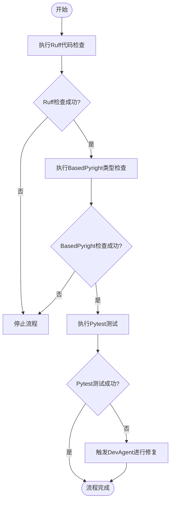
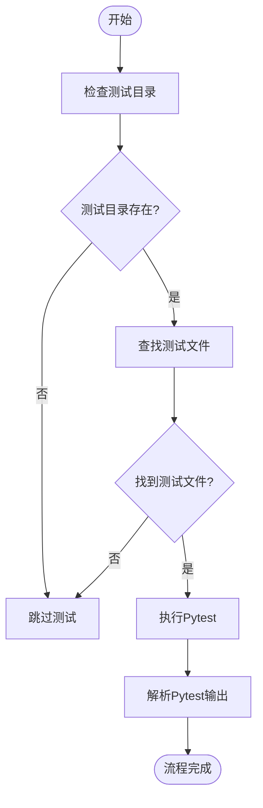
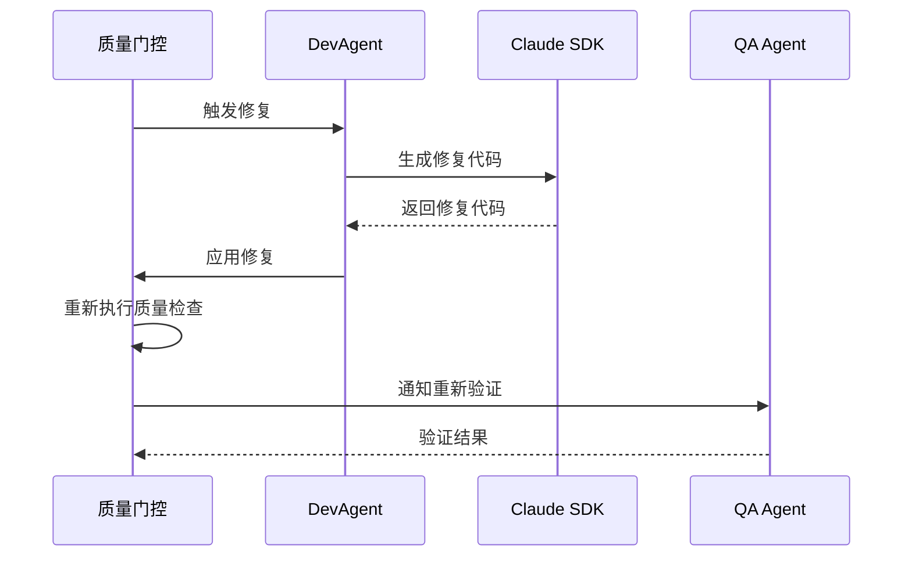
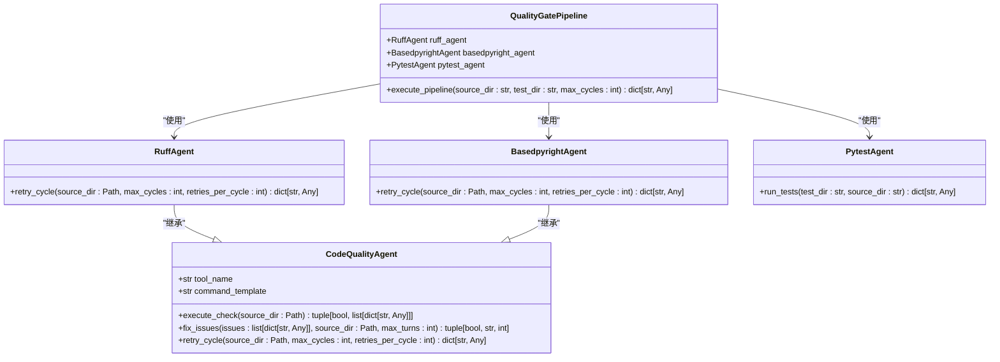

# 质量门控系统

<cite>
**本文档引用的文件**   
- [quality_agents.py](file://autoBMAD/epic_automation/quality_agents.py)
- [qa_agent.py](file://autoBMAD/epic_automation/qa_agent.py)
- [dev_agent.py](file://autoBMAD/epic_automation/dev_agent.py)
- [epic_driver.py](file://autoBMAD/epic_automation/epic_driver.py)
- [test_quality_gates.py](file://tests-copy/epic_automation/test_quality_gates.py)
- [test_quality_gates_complete.py](file://tests-copy/integration/test_quality_gates_complete.py)
- [INTEGRATION_TEST_REPORT.md](file://tests-copy/integration/INTEGRATION_TEST_REPORT.md)
- [README.md](file://docs-copy/user-guide/quality-gates.md)
</cite>

## 目录
1. [简介](#简介)
2. [核心组件](#核心组件)
3. [质量门控执行流程](#质量门控执行流程)
4. [测试自动化执行流程](#测试自动化执行流程)
5. [闭环修复机制](#闭环修复机制)
6. [公共接口与配置](#公共接口与配置)
7. [依赖关系与架构](#依赖关系与架构)
8. [故障排除](#故障排除)
9. [结论](#结论)

## 简介
质量门控系统是一个自动化管道，用于在软件开发过程中强制执行代码质量和测试标准。该系统通过集成Ruff、BasedPyright和Pytest等工具，确保代码在合并前符合预定义的质量标准。当质量检查失败时，系统会触发DevAgent进行修复，并重新验证，形成一个闭环的自动化修复流程。本文档详细介绍了CodeQualityAgent和TestAutomationAgent的实现，以及系统如何集成各种工具来执行质量检查和测试。

## 核心组件
质量门控系统的核心组件包括CodeQualityAgent、TestAutomationAgent、DevAgent和QA Agent。CodeQualityAgent负责执行代码质量检查和修复，支持Ruff和BasedPyright两种工具。TestAutomationAgent负责执行Pytest测试套件。DevAgent和QA Agent则负责在质量检查失败时进行修复和重新验证。

**Section sources**
- [quality_agents.py](file://autoBMAD/epic_automation/quality_agents.py#L41-L1012)
- [qa_agent.py](file://autoBMAD/epic_automation/qa_agent.py#L109-L989)
- [dev_agent.py](file://autoBMAD/epic_automation/dev_agent.py#L57-L931)

## 质量门控执行流程
质量门控系统的执行流程由`QualityGateOrchestrator`类管理，该类定义了`execute_quality_gates`方法，该方法按顺序执行Ruff、BasedPyright和Pytest三个阶段的质量检查。



**Diagram sources**
- [epic_driver.py](file://autoBMAD/epic_automation/epic_driver.py#L449-L499)

**Section sources**
- [epic_driver.py](file://autoBMAD/epic_automation/epic_driver.py#L93-L500)

## 测试自动化执行流程
测试自动化执行流程由`TestAutomationAgent`类管理，该类负责执行Pytest测试套件。`execute_test_automation`方法首先检查测试目录是否存在，然后执行Pytest命令，并解析输出结果。



**Diagram sources**
- [quality_agents.py](file://autoBMAD/epic_automation/quality_agents.py#L762-L899)

**Section sources**
- [quality_agents.py](file://autoBMAD/epic_automation/quality_agents.py#L762-L899)

## 闭环修复机制
当质量检查失败时，系统会触发DevAgent进行修复。DevAgent使用Claude SDK生成修复代码，并重新执行质量检查。如果修复成功，系统会更新故事状态为“Ready for Review”，并通知QA Agent进行重新验证。



**Diagram sources**
- [dev_agent.py](file://autoBMAD/epic_automation/dev_agent.py#L239-L304)
- [qa_agent.py](file://autoBMAD/epic_automation/qa_agent.py#L222-L319)

**Section sources**
- [dev_agent.py](file://autoBMAD/epic_automation/dev_agent.py#L239-L304)
- [qa_agent.py](file://autoBMAD/epic_automation/qa_agent.py#L222-L319)

## 公共接口与配置
质量门控系统提供了多个公共接口和配置选项，允许用户自定义质量检查和测试执行的行为。

### CodeQualityAgent 接口
```python
class CodeQualityAgent:
    def __init__(self, tool_name: str, command_template: str)
    async def execute_check(self, source_dir: Path) -> tuple[bool, list[dict[str, Any]]]
    async def fix_issues(self, issues: list[dict[str, Any]], source_dir: Path, max_turns: int = 150) -> tuple[bool, str, int]
    async def retry_cycle(self, source_dir: Path, max_cycles: int = 3, retries_per_cycle: int = 2) -> dict[str, Any]
```

### TestAutomationAgent 接口
```python
class TestAutomationAgent:
    def __init__(self, state_manager: StateManager, epic_id: str, skip_tests: bool = False)
    async def run_test_automation(self, test_dir: str, source_dir: str) -> dict[str, Any]
```

### 配置选项
- `skip_quality`: 是否跳过代码质量检查
- `skip_tests`: 是否跳过测试执行
- `max_cycles`: 最大重试周期数
- `retries_per_cycle`: 每个周期的最大重试次数

**Section sources**
- [quality_agents.py](file://autoBMAD/epic_automation/quality_agents.py#L41-L422)
- [quality_agents.py](file://autoBMAD/epic_automation/quality_agents.py#L762-L899)

## 依赖关系与架构
质量门控系统的架构由多个组件组成，这些组件通过明确的接口进行交互。`QualityGatePipeline`类负责协调`RuffAgent`、`BasedpyrightAgent`和`PytestAgent`的执行顺序。



**Diagram sources**
- [quality_agents.py](file://autoBMAD/epic_automation/quality_agents.py#L907-L1012)

**Section sources**
- [quality_agents.py](file://autoBMAD/epic_automation/quality_agents.py#L907-L1012)

## 故障排除
当质量门控系统遇到问题时，可以参考以下故障排除指南：

1. **检查日志输出**：查看`QualityGateOrchestrator`的日志输出，确定哪个阶段失败。
2. **验证工具安装**：确保Ruff、BasedPyright和Pytest已正确安装。
3. **检查配置选项**：确认`skip_quality`和`skip_tests`配置选项是否正确设置。
4. **手动执行工具**：在命令行中手动执行Ruff、BasedPyright和Pytest，验证它们是否正常工作。

**Section sources**
- [epic_driver.py](file://autoBMAD/epic_automation/epic_driver.py#L93-L500)
- [quality_agents.py](file://autoBMAD/epic_automation/quality_agents.py#L41-L1012)

## 结论
质量门控系统通过自动化执行代码质量和测试标准，确保了软件开发过程中的代码质量。该系统通过集成Ruff、BasedPyright和Pytest等工具，提供了一个全面的质量检查管道。当质量检查失败时，系统能够自动触发修复流程，形成一个闭环的自动化修复机制。通过合理配置和使用，该系统可以显著提高软件开发的效率和质量。