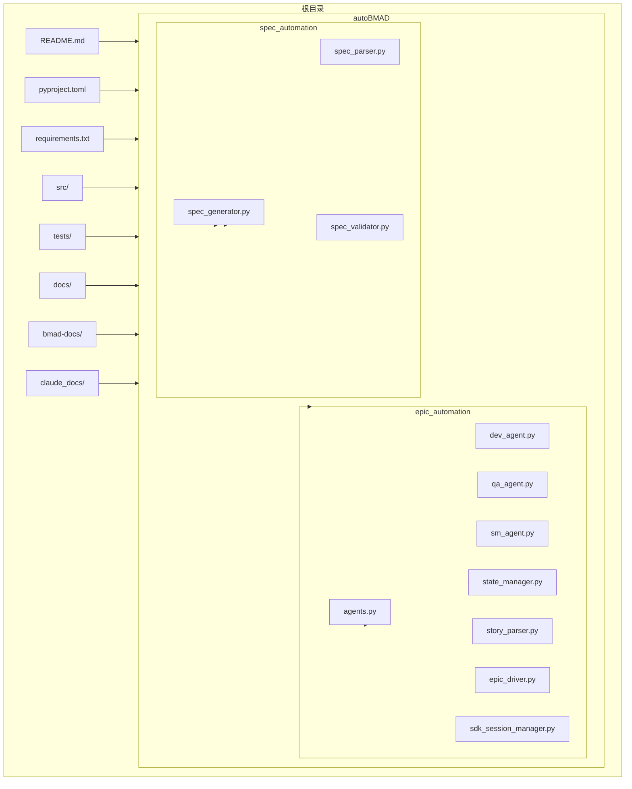
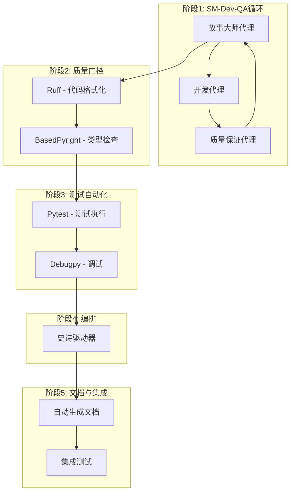
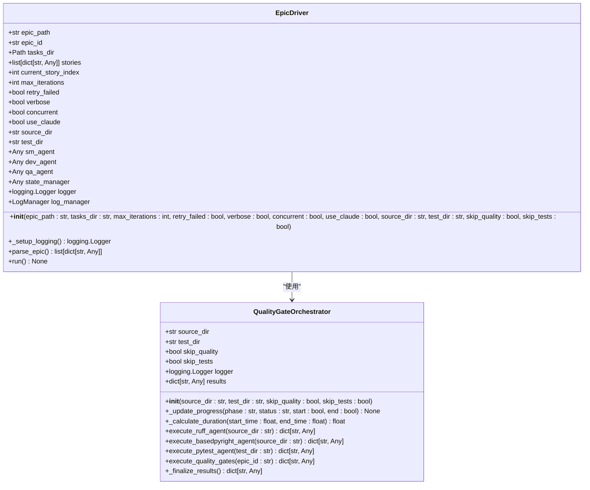
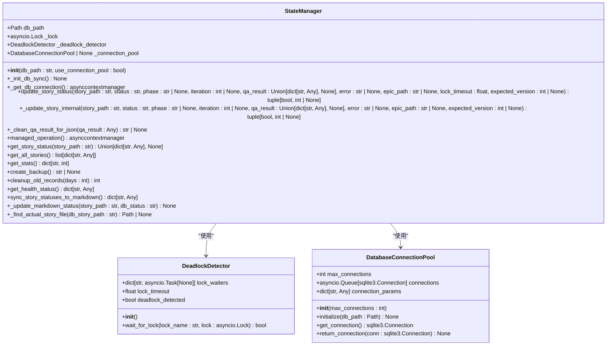
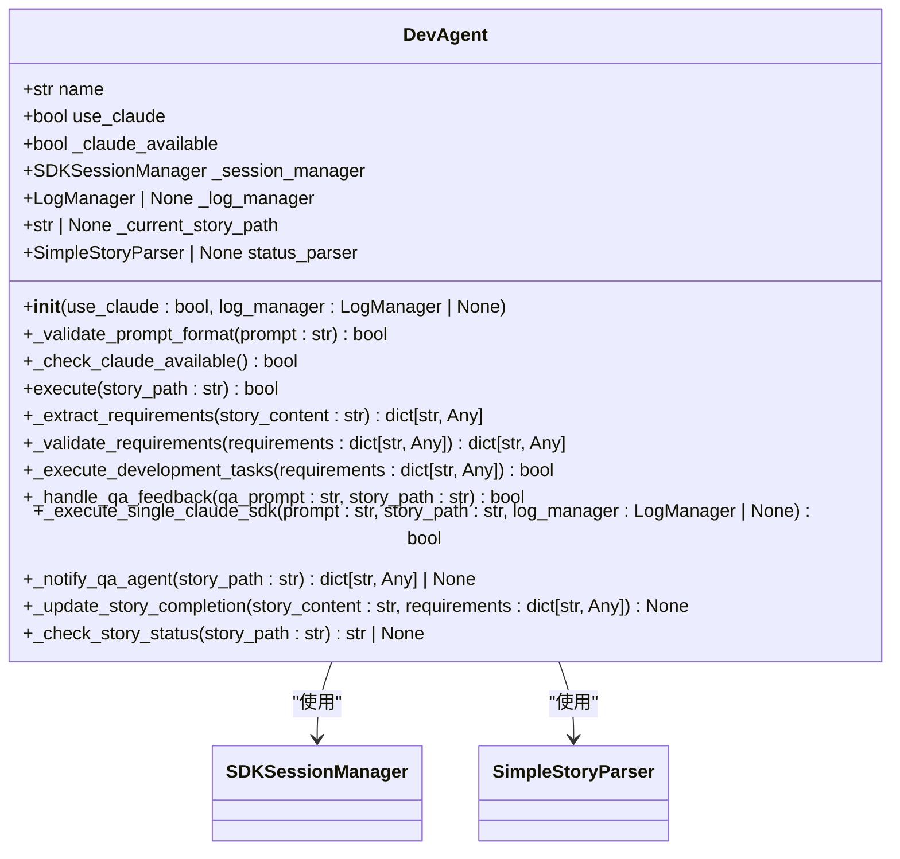
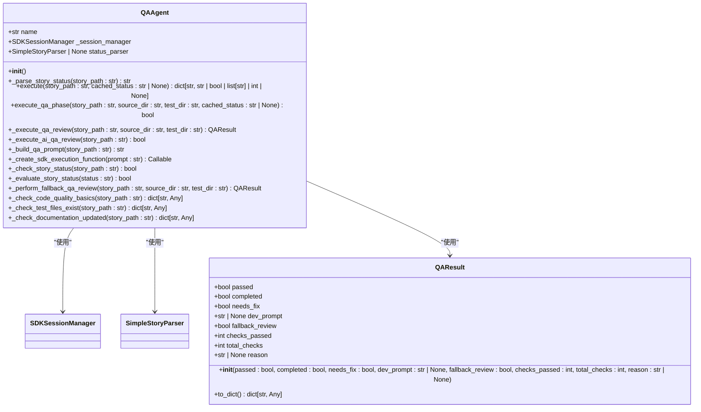
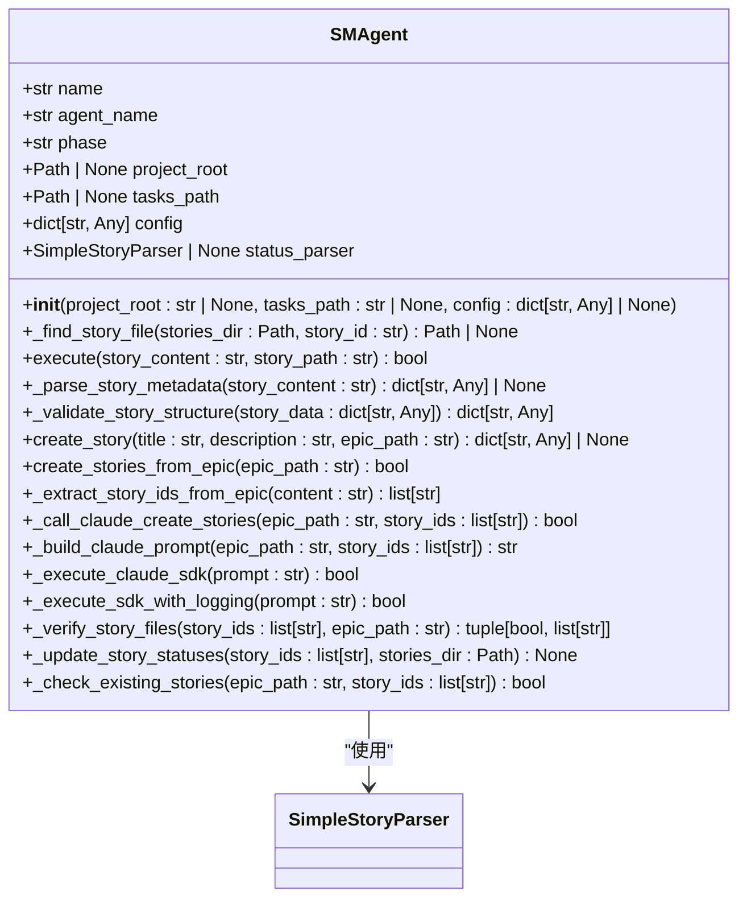
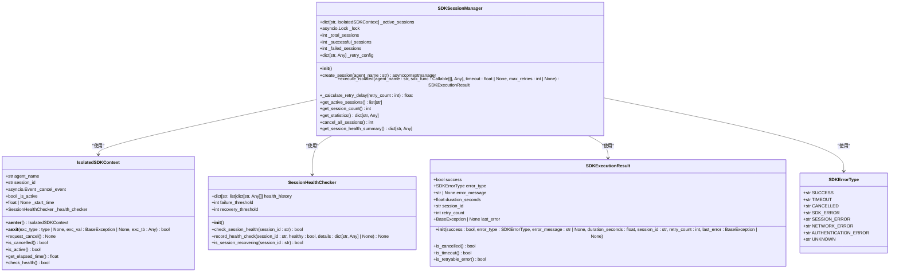
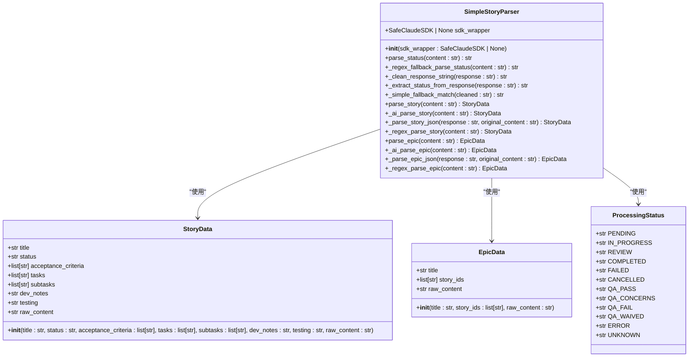
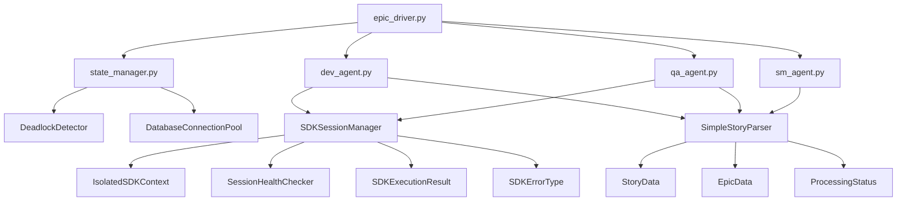

# 项目概述

<cite>
**本文档引用的文件**  
- [README.md](file://README.md)
- [pyproject.toml](file://pyproject.toml)
- [autoBMAD/epic_automation/__init__.py](file://autoBMAD/epic_automation/__init__.py)
- [autoBMAD/epic_automation/epic_driver.py](file://autoBMAD/epic_automation/epic_driver.py)
- [autoBMAD/epic_automation/state_manager.py](file://autoBMAD/epic_automation/state_manager.py)
- [autoBMAD/epic_automation/dev_agent.py](file://autoBMAD/epic_automation/dev_agent.py)
- [autoBMAD/epic_automation/qa_agent.py](file://autoBMAD/epic_automation/qa_agent.py)
- [autoBMAD/epic_automation/sm_agent.py](file://autoBMAD/epic_automation/sm_agent.py)
- [autoBMAD/epic_automation/sdk_session_manager.py](file://autoBMAD/epic_automation/sdk_session_manager.py)
- [autoBMAD/epic_automation/story_parser.py](file://autoBMAD/epic_automation/story_parser.py)
</cite>

## 目录
1. [简介](#简介)
2. [项目结构](#项目结构)
3. [核心组件](#核心组件)
4. [架构概述](#架构概述)
5. [详细组件分析](#详细组件分析)
6. [依赖分析](#依赖分析)
7. [性能考虑](#性能考虑)
8. [故障排除指南](#故障排除指南)
9. [结论](#结论)

## 简介
pytQt_template项目是一个名为autoBMAD（突破性敏捷AI驱动开发方法）的智能自动化系统，旨在通过一个完整的五阶段工作流处理史诗级任务（epics），并集成代码质量门控和测试自动化。该项目的核心目标是实现后端自动化，通过SM-Dev-QA循环自动化处理史诗级任务，并集成Ruff、BasedPyright和Pytest质量门控，从而提升开发效率和代码质量。

autoBMAD系统通过一个集成的5阶段工作流来处理史诗级任务，包括SM-Dev-QA循环、质量门控、测试自动化、编排和文档与集成。该系统利用异步处理、状态管理和调试集成等核心设计理念，确保在软件开发生命周期中高效运行。项目不仅为初学者提供了高层次的概念性理解，也为高级开发者提供了技术深度，包括系统边界、主要组件交互和预期使用场景。

**Section sources**
- [README.md](file://README.md#L7-L134)

## 项目结构
pytQt_template项目的目录结构清晰，分为多个模块和子目录，以支持其复杂的自动化功能。项目根目录包含主要的配置文件、测试文件和文档，而`autoBMAD`目录则包含了核心的自动化逻辑。

项目的主要目录包括：
- `BUGFIX_20260107/`：包含调试和修复相关的配置和脚本。
- `autoBMAD/`：核心自动化模块，包含史诗级任务处理、规范自动化和日志管理。
- `bmad-docs/`：详细的文档，涵盖核心概念、模块和工作流。
- `claude_docs/`：与Claude AI相关的文档，包括工作流、方法论和开发规则。
- `docs/`：项目文档，包括史诗、故事和验证报告。
- `spec_automation/`：规范自动化模块，用于生成和验证测试规范。
- `src/`：源代码，包括气泡排序算法和命令行接口。
- `tests/`：测试文件，确保代码质量和功能正确性。

这种结构化的布局使得项目易于维护和扩展，同时也便于开发者快速定位和理解各个组件的功能。

**Diagram sources**
- [README.md](file://README.md#L63-L134)
- [pyproject.toml](file://pyproject.toml#L1-L110)

**Section sources**
- [README.md](file://README.md#L63-L134)
- [pyproject.toml](file://pyproject.toml#L1-L110)

## 核心组件
pytQt_template项目的核心组件包括`epic_driver.py`、`state_manager.py`、`dev_agent.py`、`qa_agent.py`、`sm_agent.py`、`sdk_session_manager.py`和`story_parser.py`。这些组件共同协作，实现了从史诗级任务解析到自动化处理的完整流程。

`epic_driver.py`是系统的主要编排器，负责管理整个工作流的执行，包括SM-Dev-QA循环、质量门控和测试自动化。`state_manager.py`使用SQLite数据库跟踪故事的进度，确保状态的一致性和持久性。`dev_agent.py`和`qa_agent.py`分别负责开发和质量保证任务，通过与Claude SDK集成实现自动化。`sm_agent.py`负责故事的创建和管理，确保史诗级任务的正确分解。`sdk_session_manager.py`和`story_parser.py`则提供了SDK会话管理和故事解析的功能，确保系统的稳定性和可靠性。

**Section sources**
- [autoBMAD/epic_automation/epic_driver.py](file://autoBMAD/epic_automation/epic_driver.py#L1-L800)
- [autoBMAD/epic_automation/state_manager.py](file://autoBMAD/epic_automation/state_manager.py#L1-L800)
- [autoBMAD/epic_automation/dev_agent.py](file://autoBMAD/epic_automation/dev_agent.py#L1-L800)
- [autoBMAD/epic_automation/qa_agent.py](file://autoBMAD/epic_automation/qa_agent.py#L1-L800)
- [autoBMAD/epic_automation/sm_agent.py](file://autoBMAD/epic_automation/sm_agent.py#L1-L760)
- [autoBMAD/epic_automation/sdk_session_manager.py](file://autoBMAD/epic_automation/sdk_session_manager.py#L1-L440)
- [autoBMAD/epic_automation/story_parser.py](file://autoBMAD/epic_automation/story_parser.py#L1-L800)

## 架构概述
pytQt_template项目的架构设计围绕着一个中心化的编排器`epic_driver`，它协调多个代理（agents）和工具，实现从史诗级任务到具体实现的自动化流程。系统的核心是SM-Dev-QA循环，其中故事大师（Story Master, SM）代理创建故事，开发（Dev）代理实现功能，质量保证（QA）代理进行审查。

整个工作流分为五个阶段：SM-Dev-QA循环、质量门控、测试自动化、编排和文档与集成。每个阶段都有明确的输入和输出，确保流程的顺畅和可追溯性。质量门控阶段集成了Ruff、BasedPyright和Pytest，确保代码质量和测试覆盖率。编排阶段由`epic_driver`管理，确保所有阶段按顺序执行，并处理阶段间的依赖关系。

**Diagram sources**
- [README.md](file://README.md#L63-L134)
- [autoBMAD/epic_automation/epic_driver.py](file://autoBMAD/epic_automation/epic_driver.py#L1-L800)

## 详细组件分析
### 史诗驱动器分析
`epic_driver.py`是pytQt_template项目的核心组件，负责管理整个自动化工作流。它通过解析史诗级任务文档，提取故事信息，并协调SM-Dev-QA循环的执行。`epic_driver`还负责质量门控和测试自动化的执行，确保代码质量和测试覆盖率。

`epic_driver`的主要功能包括：
- 解析史诗级任务文档，提取故事ID和相关信息。
- 协调SM-Dev-QA循环，确保故事的正确创建、实现和审查。
- 执行质量门控，包括Ruff、BasedPyright和Pytest。
- 管理测试自动化，确保所有测试通过。
- 生成文档和集成测试，确保系统的完整性和一致性。

**Diagram sources**
- [autoBMAD/epic_automation/epic_driver.py](file://autoBMAD/epic_automation/epic_driver.py#L1-L800)

**Section sources**
- [autoBMAD/epic_automation/epic_driver.py](file://autoBMAD/epic_automation/epic_driver.py#L1-L800)

### 状态管理器分析
`state_manager.py`是pytQt_template项目中的关键组件，负责跟踪和管理故事的进度。它使用SQLite数据库存储故事的状态信息，包括史诗路径、故事路径、状态、迭代次数、QA结果、错误消息、创建和更新时间、阶段和版本。

`state_manager`的主要功能包括：
- 初始化数据库模式，确保表和索引的正确创建。
- 更新和获取故事状态，支持乐观锁和死锁检测。
- 提供数据库连接池，提高并发性能。
- 创建数据库备份和清理旧记录，确保数据的完整性和性能。

**Diagram sources**
- [autoBMAD/epic_automation/state_manager.py](file://autoBMAD/epic_automation/state_manager.py#L1-L800)

**Section sources**
- [autoBMAD/epic_automation/state_manager.py](file://autoBMAD/epic_automation/state_manager.py#L1-L800)

### 开发代理分析
`dev_agent.py`是pytQt_template项目中的开发代理，负责实现故事中的功能。它通过与Claude SDK集成，自动执行开发任务，并确保代码质量和测试覆盖率。

`dev_agent`的主要功能包括：
- 初始化开发代理，配置日志和会话管理。
- 执行开发任务，包括代码生成和测试。
- 处理QA反馈，根据QA代理的建议进行代码修复。
- 通知QA代理进行审查，确保代码质量。

**Diagram sources**
- [autoBMAD/epic_automation/dev_agent.py](file://autoBMAD/epic_automation/dev_agent.py#L1-L800)

**Section sources**
- [autoBMAD/epic_automation/dev_agent.py](file://autoBMAD/epic_automation/dev_agent.py#L1-L800)

### 质量保证代理分析
`qa_agent.py`是pytQt_template项目中的质量保证代理，负责审查开发代理生成的代码，并确保其符合质量标准。它通过与Claude SDK集成，自动执行QA检查，并生成详细的报告。

`qa_agent`的主要功能包括：
- 初始化QA代理，配置日志和会话管理。
- 执行QA审查，包括代码质量和测试覆盖率。
- 处理开发反馈，根据开发代理的建议进行代码修复。
- 生成QA报告，确保代码质量。

**Diagram sources**
- [autoBMAD/epic_automation/qa_agent.py](file://autoBMAD/epic_automation/qa_agent.py#L1-L800)

**Section sources**
- [autoBMAD/epic_automation/qa_agent.py](file://autoBMAD/epic_automation/qa_agent.py#L1-L800)

### 故事大师代理分析
`sm_agent.py`是pytQt_template项目中的故事大师代理，负责创建和管理故事。它通过与Claude SDK集成，自动创建故事，并确保其符合史诗级任务的要求。

`sm_agent`的主要功能包括：
- 初始化故事大师代理，配置日志和会话管理。
- 创建故事，包括标题、描述和验收标准。
- 验证故事结构，确保其完整性和一致性。
- 更新故事状态，确保其正确流转。

**Diagram sources**
- [autoBMAD/epic_automation/sm_agent.py](file://autoBMAD/epic_automation/sm_agent.py#L1-L760)

**Section sources**
- [autoBMAD/epic_automation/sm_agent.py](file://autoBMAD/epic_automation/sm_agent.py#L1-L760)

### SDK会话管理器分析
`sdk_session_manager.py`是pytQt_template项目中的SDK会话管理器，负责管理与Claude SDK的会话。它通过隔离的执行上下文，确保会话的独立性和安全性。

`sdk_session_manager`的主要功能包括：
- 创建隔离的SDK会话，确保会话的独立性。
- 执行SDK调用，处理超时和重试。
- 管理会话生命周期，确保会话的正确创建和销毁。
- 提供会话健康检查，确保会话的稳定性。

**Diagram sources**
- [autoBMAD/epic_automation/sdk_session_manager.py](file://autoBMAD/epic_automation/sdk_session_manager.py#L1-L440)

**Section sources**
- [autoBMAD/epic_automation/sdk_session_manager.py](file://autoBMAD/epic_automation/sdk_session_manager.py#L1-L440)

### 故事解析器分析
`story_parser.py`是pytQt_template项目中的故事解析器，负责解析故事和史诗级任务文档。它通过AI优先、正则回退的策略，确保解析的准确性和可靠性。

`story_parser`的主要功能包括：
- 初始化故事解析器，配置SDK包装器。
- 解析故事状态，使用AI和正则表达式。
- 解析故事文档，提取标题、状态、验收标准等信息。
- 解析史诗级任务文档，提取故事ID列表。

**Diagram sources**
- [autoBMAD/epic_automation/story_parser.py](file://autoBMAD/epic_automation/story_parser.py#L1-L800)

**Section sources**
- [autoBMAD/epic_automation/story_parser.py](file://autoBMAD/epic_automation/story_parser.py#L1-L800)

## 依赖分析
pytQt_template项目的依赖关系复杂，涉及多个模块和外部工具。核心依赖包括`epic_driver`、`state_manager`、`dev_agent`、`qa_agent`、`sm_agent`、`sdk_session_manager`和`story_parser`。这些组件通过`__init__.py`文件进行集成，确保系统的模块化和可维护性。

`epic_driver`依赖于`state_manager`、`dev_agent`、`qa_agent`和`sm_agent`，通过这些代理实现SM-Dev-QA循环。`state_manager`依赖于`DeadlockDetector`和`DatabaseConnectionPool`，确保数据库操作的稳定性和性能。`dev_agent`和`qa_agent`依赖于`SDKSessionManager`和`SimpleStoryParser`，确保与Claude SDK的集成和故事解析的准确性。`sm_agent`依赖于`SimpleStoryParser`，确保故事的正确创建和管理。

**Diagram sources**
- [autoBMAD/epic_automation/__init__.py](file://autoBMAD/epic_automation/__init__.py#L1-L63)
- [autoBMAD/epic_automation/epic_driver.py](file://autoBMAD/epic_automation/epic_driver.py#L1-L800)
- [autoBMAD/epic_automation/state_manager.py](file://autoBMAD/epic_automation/state_manager.py#L1-L800)
- [autoBMAD/epic_automation/dev_agent.py](file://autoBMAD/epic_automation/dev_agent.py#L1-L800)
- [autoBMAD/epic_automation/qa_agent.py](file://autoBMAD/epic_automation/qa_agent.py#L1-L800)
- [autoBMAD/epic_automation/sm_agent.py](file://autoBMAD/epic_automation/sm_agent.py#L1-L760)
- [autoBMAD/epic_automation/sdk_session_manager.py](file://autoBMAD/epic_automation/sdk_session_manager.py#L1-L440)
- [autoBMAD/epic_automation/story_parser.py](file://autoBMAD/epic_automation/story_parser.py#L1-L800)

**Section sources**
- [autoBMAD/epic_automation/__init__.py](file://autoBMAD/epic_automation/__init__.py#L1-L63)
- [autoBMAD/epic_automation/epic_driver.py](file://autoBMAD/epic_automation/epic_driver.py#L1-L800)
- [autoBMAD/epic_automation/state_manager.py](file://autoBMAD/epic_automation/state_manager.py#L1-L800)
- [autoBMAD/epic_automation/dev_agent.py](file://autoBMAD/epic_automation/dev_agent.py#L1-L800)
- [autoBMAD/epic_automation/qa_agent.py](file://autoBMAD/epic_automation/qa_agent.py#L1-L800)
- [autoBMAD/epic_automation/sm_agent.py](file://autoBMAD/epic_automation/sm_agent.py#L1-L760)
- [autoBMAD/epic_automation/sdk_session_manager.py](file://autoBMAD/epic_automation/sdk_session_manager.py#L1-L440)
- [autoBMAD/epic_automation/story_parser.py](file://autoBMAD/epic_automation/story_parser.py#L1-L800)

## 性能考虑
pytQt_template项目在设计时充分考虑了性能因素，通过异步处理、数据库连接池和会话健康检查等机制，确保系统的高效运行。`state_manager`使用SQLite数据库连接池，提高了并发性能。`sdk_session_manager`通过隔离的执行上下文和会话健康检查，确保了会话的稳定性和可靠性。

此外，`epic_driver`通过并行执行多个任务，减少了整体处理时间。`dev_agent`和`qa_agent`通过与Claude SDK的集成，实现了高效的代码生成和审查。`sm_agent`通过批量创建故事，减少了与外部工具的交互次数。

## 故障排除指南
在使用pytQt_template项目时，可能会遇到一些常见问题。以下是一些故障排除建议：

- **质量门控失败**：检查Ruff、BasedPyright和Pytest的配置，确保它们正确安装和配置。运行`ruff check --fix src/`和`basedpyright src/`来修复常见问题。
- **测试失败**：运行`pytest tests/ -v --tb=long`来获取详细的测试输出，检查测试用例和代码逻辑。
- **安装问题**：重新创建虚拟环境并安装依赖项，确保所有依赖项正确安装。
- **取消范围错误**：这些错误是预期的，并且被系统自动处理。无需用户干预，系统会继续正常执行。

**Section sources**
- [README.md](file://README.md#L562-L612)

## 结论
pytQt_template项目通过一个集成的五阶段工作流，实现了从史诗级任务到具体实现的自动化处理。系统的核心是SM-Dev-QA循环，通过`epic_driver`、`state_manager`、`dev_agent`、`qa_agent`、`sm_agent`、`sdk_session_manager`和`story_parser`等组件的协同工作，确保了代码质量和开发效率。项目的设计考虑了性能和可靠性，通过异步处理、数据库连接池和会话健康检查等机制，确保了系统的高效运行。对于初学者，项目提供了高层次的概念性理解；对于高级开发者，项目提供了技术深度，包括系统边界、主要组件交互和预期使用场景。