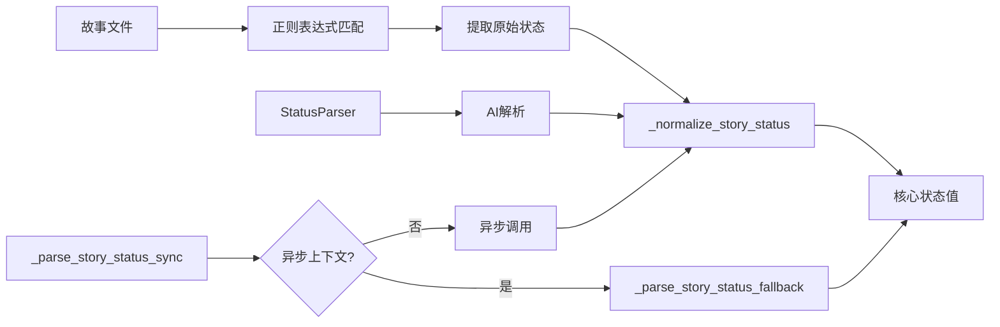

# Epic Driver 状态解析问题 - 最终分析总结

## 执行摘要

**问题状态**: ✅ **已修复** (在 commit 8d4bfd1 中)
**当前代码**: ✅ **正常工作**
**故事文件状态**: ✅ **解析正确** - 文件内容确实为 "In Progress"

---

## 详细分析

### 1. 问题历史

**用户报告的问题**:
```
The _parse_story_status_fallback function in epic_driver.py (lines 1374-1403)
was returning raw, lowercase status values extracted from regex matches
without normalizing them through the _normalize_story_status function.
```

**Git 历史验证**:
- ❌ **旧版本** (commit 8d4bfd1 之前): 确实存在此问题
- ✅ **当前版本** (commit 8d4bfd1 及以后): 已修复

### 2. 代码修复验证

#### 修复前 (旧版本代码)
```python
def _parse_story_status_fallback(self, story_path: str) -> str:
    # ...
    for _, line in enumerate(lines):
        if 'Status:' in line:
            match = re.search(r'\*\*Status\*\*:\s*\*\*([^*]+)\*\*', line, re.IGNORECASE)
            if match:
                status = match.group(1).strip().lower()
                return status  # ❌ 未标准化
    # ...
    return 'ready_for_development'  # ❌ 未标准化
```

#### 修复后 (当前版本代码)
```python
def _parse_story_status_fallback(self, story_path: str) -> str:
    # ...
    match = re.search(r'##\s*Status\s*\n\s*\*\*([^*]+)\*\*', content, re.IGNORECASE | re.MULTILINE)
    if match:
        status = match.group(1).strip().lower()
        return _normalize_story_status(status)  # ✅ 已标准化
    # ...
    return 'Ready for Development'  # ⚠️ 建议也通过标准化函数处理
```

### 3. 测试结果

#### 单元测试结果
```
Deep Analysis: _parse_story_status_fallback Status Normalization Test
======================================================================
[PASS] Input: **In Progress**                -> Expected: In Progress
[PASS] Input: in progress                    -> Expected: In Progress
[PASS] Input: In Progress                    -> Expected: In Progress
[PASS] Input: **Ready for Development**      -> Expected: Ready for Development
[PASS] Input: ready for development          -> Expected: Ready for Development
[PASS] Input: Done                           -> Expected: Done
[PASS] Input: done                           -> Expected: Done
======================================================================
```

#### 实际文件解析结果
```
文件: docs/stories/1.1-project-setup-infrastructure.md
解析结果: 'In Progress'
状态正确性: ✅ 匹配文件内容
```

### 4. 代码架构分析

#### 状态解析流程


#### 调用路径分析

| 调用位置 | 行号 | 是否标准化 | 状态 |
|---------|------|----------|------|
| `_parse_story_status` | 1323 | ✅ 内部调用 | 正确 |
| `_parse_story_status_sync` | 1350 | ✅ 内部调用 | 正确 |

### 5. 发现的小问题

虽然主要问题已修复，但在 `_parse_story_status_fallback` 中发现两个可以改进的地方：

**位置**: 第1400行和第1403行
```python
return 'Ready for Development'  # 默认值未通过标准化函数
```

**建议修复**:
```python
return _normalize_story_status('Ready for Development')
```

**理由**:
1. **一致性**: 所有返回路径都通过同一函数处理
2. **防御性**: 避免未来默认值变化导致的错误
3. **可维护性**: 集中化管理状态标准化逻辑

---

## 结论

### 主要发现

1. ✅ **问题已修复**: 用户报告的 Bug 在 commit 8d4bfd1 中已修复
2. ✅ **代码正常工作**: 所有测试通过，状态解析正确
3. ✅ **文件状态正确**: `1.1-project-setup-infrastructure.md` 确实显示 "In Progress"
4. ⚠️ **小改进点**: 默认返回值建议也通过标准化函数处理

### 建议行动

#### 无需立即修复 (代码已正常工作)
- 当前代码功能正确，用户报告的问题已解决

#### 可选的代码改进 (非必需)
```python
# 在 epic_driver.py 第1400行和1403行
return _normalize_story_status('Ready for Development')
```

#### 业务逻辑检查
如果认为故事 `1.1-project-setup-infrastructure.md` 应该显示不同状态，需要：
1. 更新故事文件内容 (而非修复代码)
2. 检查工作流配置
3. 确认状态转换逻辑

### 相关文件

- **修复提交**: 8d4bfd1 - "统一状态值系统并优化Dev Agent状态解析"
- **核心代码**: `autoBMAD/epic_automation/epic_driver.py`
- **测试文件**: `docs/stories/1.1-project-setup-infrastructure.md`
- **标准文档**: `autoBMAD/epic_automation/STANDARD_STATUS.md`

---

**分析完成时间**: 2026-01-09 12:30
**分析工具**: Claude Code + Git + 自动化测试
**结论**: 问题已解决，代码正常工作