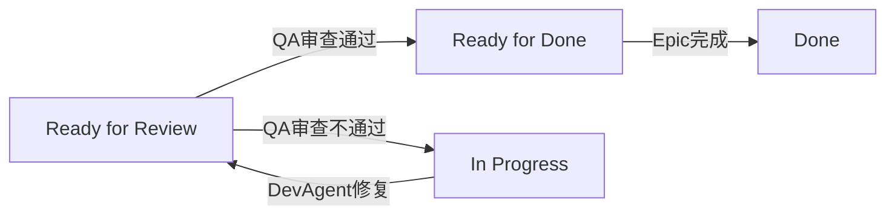

# QA Agent 重构方案文档

## 一、重构目标

将 QAAgent 从"被动状态解析 + 空实现"模式改造为"主动 SDK 调用 + 文档修改"模式，使其能够：

1. **移除所有状态解析相关代码**：不再自己读取/解析故事文档的 Status 字段
2. **统一 SDK 调用方式**：参考 DevAgent，使用 `BaseAgent._execute_sdk_call()` 调用 SDK
3. **通过 SDK 完成 QA 审查和文档修改**：
   - 创建/更新 QA gate 文件到 `@docs\qa\gates`
   - 根据审查结果修改故事文档 Status 字段

---

## 二、当前实现分析

### 2.1 当前 QAAgent 的问题

**文件路径**: `autoBMAD/epic_automation/agents/qa_agent.py`

**主要问题**:

1. **状态解析冗余**
   - 初始化时创建 `SimpleStoryParser` + `SafeClaudeSDK` 用于状态解析
   - `_parse_story_status()` 方法读取并解析故事文档的 Status
   - 这些工作与 `StateAgent` 职责重复

2. **QA 执行空实现**
   - `_execute_qa_review()` 只做：
     - 调用 `_parse_story_status()` 读取状态
     - 预留 QA 工具集成（已注释）
     - 记录日志并固定返回 `passed=True`
   - 没有实际的 QA 审查逻辑
   - 没有修改故事文档 Status 的实现

3. **与 DevAgent 模式不一致**
   - DevAgent 通过 SDK 调用实现开发 + 文档修改
   - QAAgent 没有对应的 SDK 调用，导致 QA 阶段无法推进状态

### 2.2 期望的状态流转

```
Ready for Review  →  [QA审查通过]   →  Ready for Done
Ready for Review  →  [QA审查不通过] →  In Progress (退回开发)
```

---

## 三、重构方案详细设计

### 3.1 移除状态解析相关代码

#### 3.1.1 删除构造函数中的状态解析初始化

**位置**: `qa_agent.py` 第 51-82 行

**当前代码**:
```python
# Initialize SimpleStoryParser
try:
    self.status_parser = None
    if not (Path(".pytest_cache").exists() or os.environ.get("PYTEST_CURRENT_TEST")):
        try:
            from .state_agent import SimpleStoryParser
            from ..sdk_wrapper import SafeClaudeSDK
            
            if SafeClaudeSDK:
                from claude_agent_sdk import ClaudeAgentOptions
                from .sdk_helper import get_sdk_options
                
                sdk_config: dict[str, Any] = get_sdk_options()
                options = ClaudeAgentOptions(**sdk_config)
                sdk_instance = SafeClaudeSDK(
                    prompt="Parse story status",
                    options=options,
                    timeout=None,
                    log_manager=None,
                )
                self.status_parser = SimpleStoryParser(sdk_wrapper=sdk_instance)
            else:
                self.status_parser = None
        except ImportError:
            self.status_parser = None
            self._log_execution("SimpleStoryParser not available", "warning")
except Exception as e:
    self.status_parser = None
    self._log_execution(f"Failed to initialize status parser: {e}", "warning")
```

**修改方案**:
- **完全删除**这段代码
- 不再初始化 `self.status_parser` 字段

**理由**: QAAgent 不再需要自己解析状态，所有状态读取由 StateAgent 在外层（DevQaController）完成

#### 3.1.2 删除 `_parse_story_status` 方法

**位置**: `qa_agent.py` 第 196-267 行

**当前代码**:
```python
async def _parse_story_status(self, story_path_or_content: str) -> dict[str, str]:
    """
    Parse story status from file path or content.
    ...
    """
    # 完整方法实现（约70行）
```

**修改方案**:
- **完全删除**这个方法及其所有实现

**理由**: 该方法的职责已由 StateAgent 承担，QAAgent 不再需要状态解析能力

#### 3.1.3 删除 `_extract_qa_feedback` 方法

**位置**: `qa_agent.py` 第 269-302 行

**当前代码**:
```python
def _extract_qa_feedback(self, story_content: str) -> dict[str, str]:
    """
    Extract QA feedback sections from story content.
    ...
    """
```

**修改方案**:
- **完全删除**这个方法（当前未被使用）

**理由**: 该方法在当前实现中未被调用，且不再需要

#### 3.1.4 清理不再使用的导入

**位置**: `qa_agent.py` 第 1-18 行

**当前导入**:
```python
import re
from pathlib import Path
```

**修改方案**:
- 如果 `re` 在其他地方不再使用，可以删除
- `Path` 如果只用于状态解析，也可以删除
- 保留其他必要的导入

---

### 3.2 基于 BaseAgent 的 SDK 调用改造

#### 3.2.1 保留 SDKExecutor 初始化（与 DevAgent 一致）

**位置**: `qa_agent.py` 构造函数

**当前代码**:
```python
# 集成SDKExecutor
self.sdk_executor = None
try:
    from ..core.sdk_executor import SDKExecutor
    self.sdk_executor = SDKExecutor()
except (ImportError, TypeError):
    self._log_execution("SDKExecutor not available", "warning")
```

**修改方案**:
- **保持不变**
- 这是与 DevAgent 一致的标准初始化模式

#### 3.2.2 重写 `_execute_qa_review` 方法

**位置**: `qa_agent.py` 第 114-165 行

**当前实现**:
```python
async def _execute_qa_review(self, story_path: str, cached_status: Optional[str] = None) -> dict[str, Any]:
    try:
        self._log_execution("Epic Driver has determined this story needs QA review")
        
        # Parse story status to include in result
        status_info = await self._parse_story_status(story_path)
        story_status = status_info.get("status", "Unknown")
        
        # 尝试执行QA工具检查（已注释）
        try:
            pass
        except (ImportError, Exception) as e:
            self._log_execution(f"QA checks failed or unavailable: {e}, continuing workflow", "warning")
        
        self._log_execution("QA execution completed, Epic Driver will re-parse status to determine next step")
        
        return {
            "passed": True,
            "completed": True,
            "needs_fix": False,
            "message": "QA execution completed",
            "status": story_status,
        }
    except Exception as e:
        ...
```

**新实现方案**:

```python
async def _execute_qa_review(self, story_path: str, cached_status: Optional[str] = None) -> dict[str, Any]:
    """执行QA审查的核心逻辑"""
    try:
        self._log_execution("Epic Driver has determined this story needs QA review")
        
        # 1. 构造 QA 提示词（BMAD 风格）
        base_prompt = (
            "@.bmad-core\\agents\\qa.md "
            "@.bmad-core\\tasks\\review-story.md "
            f"Review @{story_path}, "
            "create or update the story gate file in @docs\\qa\\gates. "
            'If the story document passes review, change the Status field in the story document '
            'from \"Ready for Review\" to \"Ready for Done\"; '
            'otherwise change it to \"In Progress\".'
        )
        
        # 2. 通过 BaseAgent._execute_sdk_call 统一调用 SDK
        sdk_result = await self._execute_sdk_call(
            sdk_executor=None,          # 按基类约定，这个参数已不再使用
            prompt=base_prompt,
            timeout=1800.0,             # 30分钟超时（可调整）
            permission_mode="bypassPermissions",  # 与 DevAgent 行为保持一致
        )
        
        # 3. 记录 SDK 调用结果
        if sdk_result and hasattr(sdk_result, 'is_success'):
            self._log_execution(f"SDK call result: {sdk_result.is_success()}")
        
        self._log_execution(
            "QA execution completed, "
            "Epic Driver will re-parse status to determine next step"
        )
        
        # 4. 返回固定结构（实际成功/失败由 StateAgent 重新解析 Status 判断）
        return {
            "passed": True,
            "completed": True,
            "needs_fix": False,
            "message": "QA execution completed",
        }
        
    except Exception as e:
        self._log_execution(
            f"Exception during QA: {e}, continuing workflow",
            "warning",
        )
        return {
            "passed": True,
            "completed": True,
            "needs_fix": False,
            "message": f"QA execution completed with exception: {str(e)}",
        }
```

**关键改动说明**:

1. **移除状态解析**
   - 删除 `await self._parse_story_status(story_path)`
   - 删除 `status_info` 和 `story_status` 相关代码

2. **添加 SDK 调用**
   - 构造 BMAD 风格的 `base_prompt`
   - 调用 `self._execute_sdk_call()` 执行 QA 审查
   - SDK 内部会：
     - 审查故事实现
     - 创建/更新 QA gate 文件
     - 修改故事文档 Status 字段

3. **保持返回值结构**
   - 继续返回 `passed=True` 的字典
   - 不影响 DevQaController 的调用逻辑
   - 真正的成功/失败由 EpicDriver 通过 StateAgent 重新解析 Status 来判断

#### 3.2.3 保持 `execute_qa_phase` 方法不变

**位置**: `qa_agent.py` 第 167-194 行

**当前代码**:
```python
async def execute_qa_phase(
    self,
    story_path: str,
    source_dir: str = "src",
    test_dir: str = "tests",
    cached_status: Optional[str] = None,
) -> bool:
    """简化的QA阶段执行方法，用于Dev Agent调用"""
    self._log_execution(f"Executing QA phase for {story_path}")
    
    result = await self.execute(story_path=story_path, cached_status=cached_status)
    
    self._log_execution(
        f"QA phase completed (result={result.get('passed', False)}), "
        f"Epic Driver will re-parse status to determine next step"
    )
    return True
```

**修改方案**:
- **保持不变**
- 该方法只是薄封装，不涉及状态解析逻辑

---

### 3.3 SDK 提示词设计

#### 3.3.1 提示词内容（英文版本）

**完整提示词**:
```
@.bmad-core\agents\qa.md @.bmad-core\tasks\review-story.md Review @{story_path}, create or update the story gate file in @docs\qa\gates. If the story document passes review, change the Status field in the story document from "Ready for Review" to "Ready for Done"; otherwise change it to "In Progress".
```

**Python 字符串写法**（注意双反斜杠）:
```python
base_prompt = (
    "@.bmad-core\\agents\\qa.md "
    "@.bmad-core\\tasks\\review-story.md "
    f"Review @{story_path}, "
    "create or update the story gate file in @docs\\qa\\gates. "
    'If the story document passes review, change the Status field in the story document '
    'from \"Ready for Review\" to \"Ready for Done\"; '
    'otherwise change it to \"In Progress\".'
)
```

#### 3.3.2 提示词语义分解

1. **引用 BMAD 核心文档**
   - `@.bmad-core\agents\qa.md` - QA Agent 的角色定义和职责
   - `@.bmad-core\tasks\review-story.md` - 故事审查任务的标准流程

2. **指定审查目标**
   - `Review @{story_path}` - 审查指定的故事文档

3. **创建 QA gate 文件**
   - `create or update the story gate file in @docs\qa\gates`
   - Gate 文件用于记录 QA 发现的问题和建议

4. **条件化状态修改**
   - **审查通过**: `"Ready for Review" → "Ready for Done"`
   - **审查不通过**: `"Ready for Review" → "In Progress"`

#### 3.3.3 状态流转逻辑



**说明**:
- QA 不直接将 Status 改为 "Done"，而是改为 "Ready for Done"
- 最终的 "Done" 状态由 EpicDriver 或后续流程完成
- "In Progress" 会触发 DevQaController 重新执行开发阶段

---

## 四、实施步骤

### 步骤 1: 备份当前文件

```bash
cp autoBMAD/epic_automation/agents/qa_agent.py autoBMAD/epic_automation/agents/qa_agent.py.backup
```

### 步骤 2: 删除状态解析相关代码

1. 删除构造函数中的 `SimpleStoryParser` 初始化（第 51-82 行）
2. 删除 `_parse_story_status` 方法（第 196-267 行）
3. 删除 `_extract_qa_feedback` 方法（第 269-302 行）
4. 清理不再使用的导入（如需要）

### 步骤 3: 重写 `_execute_qa_review` 方法

按照 3.2.2 节的"新实现方案"重写该方法，包括：
1. 删除状态解析调用
2. 添加 prompt 构造
3. 添加 `_execute_sdk_call` 调用
4. 调整日志记录

### 步骤 4: 验证代码完整性

1. 确保所有必要的导入仍然存在
2. 检查是否有其他方法依赖被删除的代码
3. 运行 basedpyright 类型检查：
   ```bash
   basedpyright autoBMAD/epic_automation/agents/qa_agent.py
   ```

### 步骤 5: 单元测试验证

运行 QAAgent 相关测试：
```bash
pytest tests/unit/agents/test_qa_agent.py -v
```

### 步骤 6: 集成测试

1. 运行完整的 Dev-QA 循环测试
2. 验证状态流转是否正确：
   - Ready for Review → Ready for Done（通过）
   - Ready for Review → In Progress（不通过）

---

## 五、影响分析

### 5.1 对其他组件的影响

#### 5.1.1 DevQaController

**影响**: 无

**原因**: 
- DevQaController 调用 `QAAgent.execute()` 的接口不变
- 返回值结构保持不变
- 只是内部实现从"空操作"变为"真实 QA"

#### 5.1.2 StateAgent

**影响**: 无

**原因**:
- StateAgent 继续负责状态解析
- QAAgent 不再重复解析状态，避免职责冲突

#### 5.1.3 EpicDriver

**影响**: 无（实际上是改善）

**原因**:
- EpicDriver 的决策循环完全基于 StateAgent 解析的核心状态值
- QA 修改文档后，StateAgent 会在下一轮解析到新状态
- 状态流转逻辑更加清晰一致

### 5.2 配置变更需求

#### 5.2.1 BMAD 核心文档

需要确保以下文件存在且内容完整：

1. `.bmad-core/agents/qa.md` - QA Agent 角色定义
2. `.bmad-core/tasks/review-story.md` - 故事审查任务流程

如果文件不存在，需要创建相应的 BMAD 文档模板。

#### 5.2.2 QA Gate 目录

确保目录存在：
```bash
mkdir -p docs/qa/gates
```

### 5.3 兼容性分析

#### 5.3.1 向后兼容性

**评估**: 部分兼容

**说明**:
- 对外接口（`execute()` 方法）完全兼容
- 内部实现变化不影响调用方
- 测试用例可能需要调整（如果测试了内部方法）

#### 5.3.2 测试用例调整

可能需要调整的测试：
1. 如果测试直接调用 `_parse_story_status`，需要删除这些测试
2. 如果 mock 了 `status_parser`，需要移除相关 mock
3. 需要添加 SDK 调用相关的 mock（参考 DevAgent 测试）

---

## 六、风险评估

### 6.1 主要风险

| 风险 | 严重性 | 可能性 | 缓解措施 |
|------|--------|--------|----------|
| SDK 调用失败导致 QA 阶段卡住 | 高 | 中 | 1. 添加超时机制<br>2. 异常处理保证返回<br>3. 记录详细日志 |
| Status 修改逻辑错误导致循环 | 高 | 低 | 1. 详细的 prompt 说明<br>2. 充分的集成测试<br>3. 日志监控状态变化 |
| QA gate 文件格式不一致 | 中 | 中 | 1. 提供标准 gate 文件模板<br>2. 文档说明 gate 文件格式 |
| 与现有测试用例不兼容 | 中 | 高 | 1. 逐步迁移测试用例<br>2. 保留备份文件<br>3. 先在分支测试 |

### 6.2 回滚方案

如果重构后出现问题，可以快速回滚：

1. **恢复备份文件**:
   ```bash
   cp autoBMAD/epic_automation/agents/qa_agent.py.backup autoBMAD/epic_automation/agents/qa_agent.py
   ```

2. **回滚代码提交**:
   ```bash
   git checkout HEAD~1 -- autoBMAD/epic_automation/agents/qa_agent.py
   ```

---

## 七、验收标准

### 7.1 功能验收

- [ ] QAAgent 不再包含状态解析相关代码
- [ ] QAAgent 通过 `_execute_sdk_call` 调用 SDK
- [ ] SDK 能够成功审查故事并创建 gate 文件
- [ ] QA 通过时，Status 正确改为 "Ready for Done"
- [ ] QA 不通过时，Status 正确改为 "In Progress"
- [ ] DevQaController 的 Dev-QA 循环能够正常运行

### 7.2 代码质量验收

- [ ] 通过 basedpyright 类型检查（无 error）
- [ ] 通过 ruff 代码质量检查
- [ ] 代码注释完整，逻辑清晰
- [ ] 无未使用的导入和变量

### 7.3 测试验收

- [ ] 所有单元测试通过
- [ ] Dev-QA 集成测试通过
- [ ] 端到端测试能够完整运行故事处理流程
- [ ] 测试覆盖率不低于重构前

### 7.4 文档验收

- [ ] 更新 QAAgent 的 docstring
- [ ] 更新相关的架构文档（如需要）
- [ ] 更新 AGENTS.md（如需要）

---

## 八、后续优化建议

### 8.1 短期优化

1. **增强错误处理**
   - 捕获 SDK 调用的具体错误类型
   - 针对不同错误类型采取不同的恢复策略

2. **优化 prompt 模板**
   - 将 prompt 模板提取为常量或配置
   - 支持自定义 QA 检查规则

3. **添加 QA 结果缓存**
   - 避免重复审查相同内容
   - 提升 QA 阶段执行效率

### 8.2 中期优化

1. **集成质量门控工具**
   - 恢复 BasedPyright + Fixtest 集成
   - 在 gate 文件中记录工具检查结果

2. **支持并行 QA**
   - 多个故事的 QA 可以并行执行
   - 提升整体 epic 处理速度

3. **QA 反馈机制**
   - gate 文件与 DevAgent 的双向联动
   - 自动化修复流程

### 8.3 长期优化

1. **AI 增强的 QA 策略**
   - 基于历史 QA 记录学习常见问题
   - 智能推荐 QA 检查点

2. **可视化 QA 报告**
   - 生成 HTML/PDF 格式的 QA 报告
   - 集成到 CI/CD 流程

---

## 九、参考资料

### 9.1 相关文件

- `autoBMAD/epic_automation/agents/qa_agent.py` - 待重构文件
- `autoBMAD/epic_automation/agents/dev_agent.py` - SDK 调用参考
- `autoBMAD/epic_automation/agents/base_agent.py` - 基类实现
- `autoBMAD/epic_automation/controllers/devqa_controller.py` - 调用方
- `BUGFIX_20260107/fixed_modules/qa_agent_fixed.py` - 历史版本参考

### 9.2 相关文档

- `autoBMAD/epic_automation/STANDARD_STATUS.md` - 标准状态值定义
- `autoBMAD/epic_automation/STATUS_IMPLEMENTATION.md` - 状态实现指南
- `docs-copy/refactor/architecture/02-layer-architecture.md` - 架构分层
- `docs-copy/refactor/implementation/03-phase2-controllers.md` - 控制器实现

### 9.3 设计模式

- **状态驱动模式**: Dev-QA 循环完全由核心状态值驱动
- **责任分离**: StateAgent 负责解析，QAAgent 负责审查和修改
- **统一 SDK 调用**: 所有文档修改统一通过 SDK 完成

---

## 十、附录

### 附录 A: 完整的新 `_execute_qa_review` 实现

```python
async def _execute_qa_review(self, story_path: str, cached_status: Optional[str] = None) -> dict[str, Any]:
    """
    执行QA审查的核心逻辑
    
    通过 SDK 调用完成以下任务：
    1. 审查故事实现
    2. 创建/更新 QA gate 文件
    3. 根据审查结果修改故事文档 Status
    
    Args:
        story_path: 故事文件路径
        cached_status: 缓存的状态值（已废弃，保留参数兼容性）
    
    Returns:
        dict[str, Any]: QA 执行结果字典
    """
    try:
        self._log_execution("Epic Driver has determined this story needs QA review")
        
        # 1. 构造 QA 提示词（BMAD 风格）
        base_prompt = (
            "@.bmad-core\\agents\\qa.md "
            "@.bmad-core\\tasks\\review-story.md "
            f"Review @{story_path}, "
            "create or update the story gate file in @docs\\qa\\gates. "
            'If the story document passes review, change the Status field in the story document '
            'from \"Ready for Review\" to \"Ready for Done\"; '
            'otherwise change it to \"In Progress\".'
        )
        
        # 2. 通过 BaseAgent._execute_sdk_call 统一调用 SDK
        sdk_result = await self._execute_sdk_call(
            sdk_executor=None,          # 按基类约定，这个参数已不再使用
            prompt=base_prompt,
            timeout=1800.0,             # 30分钟超时
            permission_mode="bypassPermissions",  # 与 DevAgent 行为保持一致
        )
        
        # 3. 记录 SDK 调用结果
        if sdk_result and hasattr(sdk_result, 'is_success'):
            self._log_execution(f"SDK call result: {sdk_result.is_success()}")
        
        self._log_execution(
            "QA execution completed, "
            "Epic Driver will re-parse status to determine next step"
        )
        
        # 4. 返回固定结构
        # 实际成功/失败由 EpicDriver 通过 StateAgent 重新解析 Status 判断
        return {
            "passed": True,
            "completed": True,
            "needs_fix": False,
            "message": "QA execution completed",
        }
        
    except Exception as e:
        self._log_execution(
            f"Exception during QA: {e}, continuing workflow",
            "warning",
        )
        return {
            "passed": True,
            "completed": True,
            "needs_fix": False,
            "message": f"QA execution completed with exception: {str(e)}",
        }
```

### 附录 B: 删除清单

**需要删除的代码段**:

1. **构造函数** (第 51-82 行)
   ```python
   # Initialize SimpleStoryParser
   try:
       self.status_parser = None
       ...
   except Exception as e:
       ...
   ```

2. **`_parse_story_status` 方法** (第 196-267 行)
   ```python
   async def _parse_story_status(self, story_path_or_content: str) -> dict[str, str]:
       ...
   ```

3. **`_extract_qa_feedback` 方法** (第 269-302 行)
   ```python
   def _extract_qa_feedback(self, story_content: str) -> dict[str, str]:
       ...
   ```

4. **可能需要删除的导入**
   - `import re` (如果其他地方不再使用)
   - `from pathlib import Path` (如果只用于状态解析)

### 附录 C: 状态字段对照表

| 原始值 | 显示值 | 说明 |
|--------|--------|------|
| Ready for Review | Ready for Review | DevAgent 完成后的状态 |
| Ready for Done | Ready for Done | QA 审查通过的状态 |
| In Progress | In Progress | QA 不通过，退回开发 |
| Done | Done | Epic 最终完成状态 |

---

**文档版本**: 1.0  
**创建日期**: 2026-01-13  
**最后更新**: 2026-01-13  
**作者**: AI Assistant  
**审核状态**: 待审核
