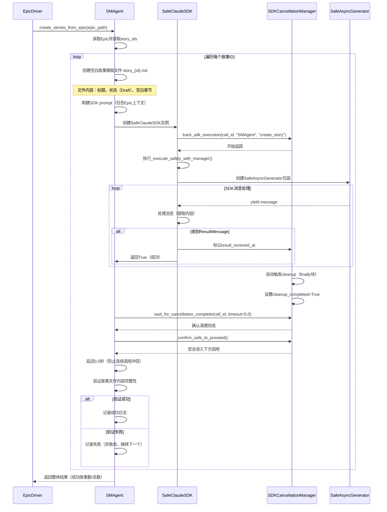

# SM Agent SDK集成方案：故事文档创建流程重构

**创建时间**: 2026-01-12  
**方案版本**: 1.0  
**目标**: 为SM Agent集成SDK调用，实现完整的故事创建→SDK填充→SDK取消→验证流程

---

## 一、核心需求

### 1.1 流程要求
遍历创建每一个故事文档时，严格按照以下顺序执行：

1. **模板创建故事文档**：创建空白故事模板文件
2. **SDK调用**：调用SafeClaudeSDK填充故事内容
3. **确认ResultMessage**：验证SDK返回ResultMessage
4. **SDK取消**：清理SDK会话和资源
5. **确认取消完成**：验证SDK资源已完全释放
6. **进入下一个故事**：重复以上流程

### 1.2 遵循现有规范
- **SafeClaudeSDK封装**：所有SDK调用必须通过SafeClaudeSDK
- **Cancel Scope管理**：使用SDKCancellationManager统一管理
- **容错机制**：非致命错误不中断工作流
- **TaskGroup隔离**：每个故事的SDK调用在独立作用域中执行

---

## 二、架构设计

### 2.1 四层架构集成

```
┌─────────────────────────────────────────────────────────┐
│ Layer 4: Epic Driver                                    │
│ - 解析Epic文档，提取故事ID列表                           │
│ - 调用SMAgent.create_stories_from_epic()                │
│ - 非致命错误不中断Epic级别流程                           │
└─────────────────────────────────────────────────────────┘
                           ↓
┌─────────────────────────────────────────────────────────┐
│ Layer 3: SM Agent                                        │
│ - 遍历故事ID列表，逐个处理                               │
│ - 为每个故事创建空白模板文件                             │
│ - 调用SDK填充故事内容                                    │
│ - 确认SDK完成并清理资源                                  │
│ - 单个故事失败不中断整体流程                             │
└─────────────────────────────────────────────────────────┘
                           ↓
┌─────────────────────────────────────────────────────────┐
│ Layer 2: SafeClaudeSDK + SDKCancellationManager         │
│ - track_sdk_execution() 追踪每次SDK调用                 │
│ - wait_for_cancellation_complete() 确保清理完成          │
│ - confirm_safe_to_proceed() 验证可安全进入下次调用       │
│ - detect_cross_task_risk() 检测跨任务风险                │
└─────────────────────────────────────────────────────────┘
                           ↓
┌─────────────────────────────────────────────────────────┐
│ Layer 1: SafeAsyncGenerator                             │
│ - TaskGroup + CancelScope 隔离                          │
│ - 同步标记清理状态（_closed = True）                    │
│ - cancel scope 错误仅记录不抛出                          │
└─────────────────────────────────────────────────────────┘
```

### 2.2 时序图



---

## 三、具体实施方案

### 3.1 修改 `sm_agent.py`

#### 修改点1：增强 `_create_stories_from_epic` 方法

**文件**: `autoBMAD/epic_automation/agents/sm_agent.py`  
**位置**: 第124-169行（现有方法）  

**修改内容**:

```python
async def _create_stories_from_epic(self, epic_path: str) -> bool:
    """
    从Epic创建故事 - 集成SDK调用
    
    流程：
    1. 读取Epic并提取故事ID列表
    2. 遍历每个故事ID：
       a. 创建空白故事模板文件
       b. 调用SDK填充内容
       c. 确认SDK完成并清理
       d. 验证文件内容
    3. 返回整体结果
    """
    try:
        self._log_execution(f"Creating stories from Epic: {epic_path}")

        # 读取Epic内容
        with open(epic_path, encoding="utf-8") as f:
            epic_content = f.read()

        # 提取故事ID
        story_ids = self._extract_story_ids_from_epic(epic_content)
        if not story_ids:
            self._log_execution("No story IDs found", "error")
            return False

        self._log_execution(f"Found {len(story_ids)} stories: {story_ids}")

        # 创建stories目录
        epic_path_obj = Path(epic_path)
        project_root = epic_path_obj.parents[2]
        stories_dir = project_root / "docs" / "stories"
        stories_dir.mkdir(parents=True, exist_ok=True)

        # 🎯 新增：获取SDKCancellationManager
        manager = None
        try:
            from autoBMAD.epic_automation.monitoring import get_cancellation_manager
            manager = get_cancellation_manager()
        except ImportError:
            self._log_execution("SDKCancellationManager not available", "warning")

        # 遍历每个故事ID，逐个处理
        success_count = 0
        failed_stories = []

        for idx, story_id in enumerate(story_ids, 1):
            self._log_execution(f"[{idx}/{len(story_ids)}] Processing story {story_id}...")
            
            # Step 1: 创建空白故事模板文件
            story_file = stories_dir / f"{story_id}.md"
            if not self._create_blank_story_template(story_file, story_id, epic_content):
                self._log_execution(f"Failed to create template for {story_id}", "warning")
                failed_stories.append(story_id)
                continue

            # Step 2 & 3 & 4 & 5: SDK调用 + 确认ResultMessage + SDK取消 + 确认取消完成
            sdk_success = await self._fill_story_with_sdk(
                story_file, story_id, epic_path, epic_content, manager
            )

            if not sdk_success:
                self._log_execution(f"SDK filling failed for {story_id}", "warning")
                failed_stories.append(story_id)
                continue

            # Step 6: 验证故事文件内容
            if self._verify_single_story_file(story_file, story_id):
                success_count += 1
                self._log_execution(f"[OK] Story {story_id} completed successfully")
            else:
                self._log_execution(f"[FAIL] Story {story_id} verification failed", "warning")
                failed_stories.append(story_id)

        # 汇总结果
        self._log_execution(
            f"Story creation completed: {success_count}/{len(story_ids)} succeeded"
        )
        
        if failed_stories:
            self._log_execution(f"Failed stories: {failed_stories}", "warning")

        # 🎯 容错机制：只要有一个成功就返回True
        return success_count > 0

    except Exception as e:
        self._log_execution(f"Failed to create stories: {e}", "error")
        return False
```

---

#### 修改点2：新增 `_create_blank_story_template` 方法

**文件**: `autoBMAD/epic_automation/agents/sm_agent.py`  
**位置**: 新增方法（插入到第540行之后）

**修改内容**:

```python
def _create_blank_story_template(
    self, story_file: Path, story_id: str, epic_content: str
) -> bool:
    """
    创建空白故事模板文件
    
    Args:
        story_file: 故事文件路径
        story_id: 故事ID（例如 "1.1"）
        epic_content: Epic文档内容（用于提取故事标题）
    
    Returns:
        True if successful, False otherwise
    """
    try:
        # 从Epic中提取故事标题
        pattern = rf"### Story\s+{re.escape(story_id)}\s*:\s*(.+?)(?:\n|$)"
        match = re.search(pattern, epic_content, re.MULTILINE)
        story_title = match.group(1).strip() if match else "Story Title Placeholder"

        # 创建空白模板内容
        template_content = f"""# Story {story_id}: {story_title}

## Status
**Status**: Draft

## Story
**As a** [user type],  
**I want** [functionality],  
**So that** [benefit].

## Acceptance Criteria
- [ ] Criterion 1
- [ ] Criterion 2
- [ ] Criterion 3

## Tasks / Subtasks
- [ ] Task 1: [description]
- [ ] Task 2: [description]

## Dev Notes
- [Note 1]
- [Note 2]

## Testing
### Unit Tests
- [ ] Test case 1
- [ ] Test case 2

### Integration Tests
- [ ] Integration test 1

### Manual Testing
- [ ] Manual test 1

---
*This story template was created by SM Agent and awaits SDK filling.*
"""

        # 写入文件
        with open(story_file, "w", encoding="utf-8") as f:
            f.write(template_content)

        self._log_execution(f"Created blank template: {story_file}")
        return True

    except Exception as e:
        self._log_execution(f"Failed to create blank template: {e}", "error")
        return False
```

---

#### 修改点3：新增 `_fill_story_with_sdk` 方法

**文件**: `autoBMAD/epic_automation/agents/sm_agent.py`  
**位置**: 新增方法（插入到第540行之后）

**修改内容**:

```python
async def _fill_story_with_sdk(
    self,
    story_file: Path,
    story_id: str,
    epic_path: str,
    epic_content: str,
    manager: Any | None
) -> bool:
    """
    使用SDK填充故事内容并管理完整生命周期
    
    流程：
    1. 构建prompt
    2. 调用SafeClaudeSDK
    3. 确认ResultMessage
    4. SDK自动取消（通过track_sdk_execution的finally块）
    5. 等待并确认取消完成
    6. 验证可安全进入下次调用
    
    Args:
        story_file: 故事文件路径
        story_id: 故事ID
        epic_path: Epic文件路径
        epic_content: Epic文档内容
        manager: SDKCancellationManager实例
    
    Returns:
        True if successful, False otherwise
    """
    try:
        import asyncio
        from pathlib import Path as PathlibPath
        
        # Step 1: 构建prompt
        prompt = self._build_sdk_prompt_for_story(
            story_id, story_file, epic_path, epic_content
        )
        
        if not prompt:
            self._log_execution(f"Failed to build prompt for {story_id}", "error")
            return False

        # Step 2: 调用SafeClaudeSDK
        self._log_execution(f"[SDK] Starting SDK call for story {story_id}...")
        
        # 导入SafeClaudeSDK
        try:
            from autoBMAD.epic_automation.sdk_wrapper import SafeClaudeSDK
            from claude_agent_sdk import ClaudeAgentOptions
        except ImportError as e:
            self._log_execution(f"Failed to import SDK dependencies: {e}", "error")
            return False

        # 构建SDK选项
        options = ClaudeAgentOptions(
            api_key=os.getenv("ANTHROPIC_API_KEY", ""),
            model="claude-sonnet-4-20250514",
            max_turns=1000,  # 限制对话轮数
            timeout=1800.0,  # 30分钟超时
        )

        # 创建SafeClaudeSDK实例
        sdk = SafeClaudeSDK(
            prompt=prompt,
            options=options,
            timeout=1800.0,
            log_manager=self.log_manager if hasattr(self, 'log_manager') else None
        )

        # 执行SDK调用（内部已集成track_sdk_execution）
        call_id = f"sm_agent_story_{story_id}_{int(time.time() * 1000)}"
        
        # Step 3: 执行并确认ResultMessage
        result = await sdk.execute()
        
        if not result:
            self._log_execution(
                f"[SDK] SDK execution returned False for story {story_id}", "warning"
            )
            return False

        self._log_execution(f"[SDK] SDK execution completed for story {story_id}")

        # Step 4 & 5: SDK取消和确认（由SafeClaudeSDK内部的track_sdk_execution管理）
        # track_sdk_execution的finally块会自动设置cleanup_completed=True
        
        if manager:
            # Step 6: 等待并确认取消完成（额外保险）
            try:
                # 🎯 给予5秒时间确保清理完成
                await manager.wait_for_cancellation_complete(call_id, timeout=5.0)
                self._log_execution(f"[SDK] Cancellation confirmed for story {story_id}")
            except Exception as e:
                self._log_execution(
                    f"[SDK] Warning: cleanup confirmation failed: {e}", "warning"
                )
                # 非致命错误，继续

            # Step 7: 验证可安全进入下次调用
            try:
                is_safe = await manager.confirm_safe_to_proceed()
                if not is_safe:
                    self._log_execution(
                        f"[SDK] Warning: not safe to proceed immediately", "warning"
                    )
                    # 🎯 额外等待0.5秒作为缓冲
                    await asyncio.sleep(0.5)
            except Exception as e:
                self._log_execution(
                    f"[SDK] Warning: safe check failed: {e}", "warning"
                )
                # 非致命错误，添加固定延迟
                await asyncio.sleep(0.5)
        else:
            # 无管理器时，固定延迟0.5秒
            await asyncio.sleep(0.5)

        self._log_execution(f"[SDK] Story {story_id} SDK lifecycle completed")
        return True

    except Exception as e:
        self._log_execution(f"SDK filling failed for {story_id}: {e}", "error")
        import traceback
        self._log_execution(f"Traceback: {traceback.format_exc()}", "debug")
        return False
```

---

#### 修改点4：新增 `_build_sdk_prompt_for_story` 方法

**文件**: `autoBMAD/epic_automation/agents/sm_agent.py`  
**位置**: 新增方法（插入到第540行之后）

**修改内容**:

```python
def _build_sdk_prompt_for_story(
    self,
    story_id: str,
    story_file: Path,
    epic_path: str,
    epic_content: str
) -> str:
    """
    为单个故事构建SDK prompt
    
    Args:
        story_id: 故事ID
        story_file: 故事文件路径
        epic_path: Epic文件路径
        epic_content: Epic文档内容
    
    Returns:
        Formatted prompt string
    """
    try:
        # 从Epic中提取该故事的相关章节
        story_section = self._extract_story_section_from_epic(epic_content, story_id)
        
        if not story_section:
            self._log_execution(
                f"Warning: Could not extract story section for {story_id}", "warning"
            )
            story_section = f"Story {story_id} - No detailed section found in Epic"

        # 构建prompt（使用BMAD约定的格式）
        epic_abs_path = Path(epic_path).resolve()
        story_abs_path = story_file.resolve()
        
        prompt = f"""@D:\\GITHUB\\pytQt_template\\.bmad-core\\agents\\sm.md
@D:\\GITHUB\\pytQt_template\\.bmad-core\\tasks\\create-next-story.md

Based on the Epic document @{epic_abs_path}, fill the story file @{story_abs_path} with complete content.

**Epic Context for Story {story_id}**:
{story_section}

**Requirements**:
1. Parse the story requirements from the Epic context above
2. Fill the story file with:
   - Complete user story (As a/I want/So that format)
   - Detailed acceptance criteria (at least 3 items)
   - Implementation tasks/subtasks
   - Dev notes with technical considerations
   - Testing requirements (unit/integration/manual)
3. Change the Status from "Draft" to "Ready for Development"
4. Ensure all sections are filled with meaningful, actionable content

Please complete the story file now."""

        return prompt

    except Exception as e:
        self._log_execution(f"Failed to build prompt: {e}", "error")
        return ""
```

---

#### 修改点5：新增 `_extract_story_section_from_epic` 方法

**文件**: `autoBMAD/epic_automation/agents/sm_agent.py`  
**位置**: 新增方法（插入到第540行之后）

**修改内容**:

```python
def _extract_story_section_from_epic(self, epic_content: str, story_id: str) -> str:
    """
    从Epic中提取指定故事的相关章节（不创建文件，仅提取文本）
    
    Args:
        epic_content: Epic文档内容
        story_id: 故事ID
    
    Returns:
        Story section text
    """
    try:
        # 查找故事标题模式："### Story X.Y: Title"
        pattern = rf"### Story\s+{re.escape(story_id)}\s*:\s*(.+?)(?:\n### Story|\n---|\n##|\Z)"
        match = re.search(pattern, epic_content, re.MULTILINE | re.DOTALL)

        if not match:
            # 尝试更宽松的匹配
            pattern = rf"### Story\s+{re.escape(story_id)}\s*:\s*(.+?)(?:\n###|\Z)"
            match = re.search(pattern, epic_content, re.MULTILINE | re.DOTALL)

        if match:
            return match.group(0).strip()
        else:
            return f"Story {story_id} section not found in Epic"

    except Exception as e:
        self._log_execution(f"Failed to extract story section: {e}", "error")
        return ""
```

---

#### 修改点6：新增 `_verify_single_story_file` 方法

**文件**: `autoBMAD/epic_automation/agents/sm_agent.py`  
**位置**: 新增方法（插入到第540行之后）

**修改内容**:

```python
def _verify_single_story_file(self, story_file: Path, story_id: str) -> bool:
    """
    验证单个故事文件的内容完整性
    
    Args:
        story_file: 故事文件路径
        story_id: 故事ID
    
    Returns:
        True if verification passed, False otherwise
    """
    try:
        if not story_file.exists():
            self._log_execution(f"Story file does not exist: {story_file}", "error")
            return False

        with open(story_file, encoding="utf-8") as f:
            content = f.read()

        # 基本验证
        if len(content) < 100:
            self._log_execution(
                f"Story file too short ({len(content)} chars): {story_file}", "warning"
            )
            return False

        # 验证关键章节
        required_sections = [
            "# Story",
            "## Status",
            "## Story",
            "## Acceptance Criteria",
            "## Tasks / Subtasks",
            "## Dev Notes",
            "## Testing",
        ]

        missing_sections = []
        for section in required_sections:
            if section not in content:
                missing_sections.append(section)

        if missing_sections:
            self._log_execution(
                f"Story file missing sections {missing_sections}: {story_file}", "warning"
            )
            return False

        # 验证状态已更新（不再是Draft）
        if "**Status**: Draft" in content:
            self._log_execution(
                f"Story status still Draft (SDK may not have updated): {story_file}", "warning"
            )
            # 🎯 非致命：状态未更新不算验证失败
            # return False

        self._log_execution(f"[OK] Story file verification passed: {story_file}")
        return True

    except Exception as e:
        self._log_execution(f"Failed to verify story file: {e}", "error")
        return False
```

---

#### 修改点7：移除或注释原有 `_extract_story_from_epic` 方法

**文件**: `autoBMAD/epic_automation/agents/sm_agent.py`  
**位置**: 第238-293行（现有方法）

**修改内容**:

```python
# 🎯 已废弃：原方法直接生成完整故事文档，现改为SDK填充
# def _extract_story_from_epic(self, epic_content: str, story_id: str) -> str:
#     """
#     [DEPRECATED] 从Epic文档中提取指定故事ID的完整内容。
#     现在改为使用SDK填充，此方法已废弃。
#     """
#     pass
```

---

### 3.2 添加必要的导入

**文件**: `autoBMAD/epic_automation/agents/sm_agent.py`  
**位置**: 文件顶部（第1-15行）

**修改内容**:

```python
"""
SM Agent - Story Master Agent
重构后集成BaseAgent，支持TaskGroup和SDKExecutor
新增：SDK调用集成，完整故事创建生命周期管理
"""

import logging
import os
import re
import time
from pathlib import Path
from typing import Any, Optional

from anyio.abc import TaskGroup

from .base_agent import BaseAgent

logger = logging.getLogger(__name__)
```

---

## 四、验证测试方案

### 4.1 单元测试

创建测试文件：`tests/test_sm_agent_sdk_integration.py`

```python
"""
SM Agent SDK集成测试
"""
import pytest
from pathlib import Path
from autoBMAD.epic_automation.agents.sm_agent import SMAgent


@pytest.mark.asyncio
async def test_create_blank_story_template():
    """测试空白模板创建"""
    agent = SMAgent()
    story_file = Path("tests/temp/test_story_1.1.md")
    story_file.parent.mkdir(parents=True, exist_ok=True)
    
    epic_content = "### Story 1.1: Test Story Title\nSome content..."
    
    result = agent._create_blank_story_template(story_file, "1.1", epic_content)
    
    assert result is True
    assert story_file.exists()
    
    content = story_file.read_text(encoding="utf-8")
    assert "# Story 1.1: Test Story Title" in content
    assert "**Status**: Draft" in content
    
    # 清理
    story_file.unlink()


@pytest.mark.asyncio
async def test_extract_story_section_from_epic():
    """测试从Epic提取故事章节"""
    agent = SMAgent()
    epic_content = """
### Story 1.1: First Story
This is the first story content.

### Story 1.2: Second Story
This is the second story content.
"""
    
    section = agent._extract_story_section_from_epic(epic_content, "1.1")
    
    assert "Story 1.1: First Story" in section
    assert "first story content" in section
    assert "Story 1.2" not in section


@pytest.mark.asyncio
async def test_verify_single_story_file():
    """测试故事文件验证"""
    agent = SMAgent()
    story_file = Path("tests/temp/test_story_1.1.md")
    story_file.parent.mkdir(parents=True, exist_ok=True)
    
    # 创建完整的故事文件
    content = """# Story 1.1: Test Story

## Status
**Status**: Ready for Development

## Story
**As a** developer,
**I want** to test verification,
**So that** it works correctly.

## Acceptance Criteria
- [ ] Criterion 1
- [ ] Criterion 2
- [ ] Criterion 3

## Tasks / Subtasks
- [ ] Task 1

## Dev Notes
- Note 1

## Testing
### Unit Tests
- [ ] Test 1
"""
    
    story_file.write_text(content, encoding="utf-8")
    
    result = agent._verify_single_story_file(story_file, "1.1")
    
    assert result is True
    
    # 清理
    story_file.unlink()


@pytest.mark.asyncio
@pytest.mark.integration
async def test_fill_story_with_sdk_mock():
    """测试SDK填充流程（使用mock）"""
    from unittest.mock import AsyncMock, MagicMock
    
    agent = SMAgent()
    story_file = Path("tests/temp/test_story_1.1.md")
    story_file.parent.mkdir(parents=True, exist_ok=True)
    
    # 创建空白模板
    agent._create_blank_story_template(story_file, "1.1", "### Story 1.1: Test")
    
    # Mock SDK
    mock_sdk = AsyncMock()
    mock_sdk.execute = AsyncMock(return_value=True)
    
    # Mock manager
    mock_manager = MagicMock()
    mock_manager.wait_for_cancellation_complete = AsyncMock()
    mock_manager.confirm_safe_to_proceed = AsyncMock(return_value=True)
    
    # 注入mock
    agent.sdk_executor = mock_sdk
    
    result = await agent._fill_story_with_sdk(
        story_file, "1.1", "tests/epics/test.md", "Epic content", mock_manager
    )
    
    assert result is True
    
    # 清理
    story_file.unlink()
```

### 4.2 集成测试

创建测试文件：`tests/integration/test_sm_agent_full_flow.py`

```python
"""
SM Agent完整流程集成测试
"""
import pytest
from pathlib import Path
from autoBMAD.epic_automation.agents.sm_agent import SMAgent


@pytest.mark.asyncio
@pytest.mark.integration
@pytest.mark.slow
async def test_create_stories_from_epic_full_flow():
    """测试完整Epic处理流程"""
    # 创建测试Epic文件
    epic_file = Path("tests/temp/test_epic.md")
    epic_file.parent.mkdir(parents=True, exist_ok=True)
    
    epic_content = """# Test Epic

## Stories

### Story 1.1: First Story
As a user, I want feature 1.

### Story 1.2: Second Story
As a user, I want feature 2.
"""
    
    epic_file.write_text(epic_content, encoding="utf-8")
    
    # 创建SM Agent
    agent = SMAgent(
        project_root=Path("tests/temp"),
        tasks_path=Path("tests/temp/docs/stories")
    )
    
    # 执行
    result = await agent.create_stories_from_epic(str(epic_file))
    
    # 验证
    assert result is True
    
    # 检查故事文件是否创建
    story_1 = Path("tests/temp/docs/stories/1.1.md")
    story_2 = Path("tests/temp/docs/stories/1.2.md")
    
    assert story_1.exists()
    assert story_2.exists()
    
    # 清理
    story_1.unlink()
    story_2.unlink()
    epic_file.unlink()
```

---

## 五、风险评估与缓解

### 5.1 风险项

| 风险 | 可能性 | 影响 | 缓解措施 |
|------|-------|------|---------|
| SDK调用超时 | 中 | 高 | 设置30分钟超时，max_turns=1000限制 |
| Cancel scope跨任务错误 | 低 | 高 | 已通过SafeClaudeSDK和Manager防护 |
| 连续SDK调用冲突 | 中 | 中 | 每次调用后延迟0.5秒，confirm_safe_to_proceed验证 |
| 单个故事失败影响整体 | 低 | 低 | 容错机制：单个失败不中断，记录并继续 |
| API配额耗尽 | 中 | 高 | 监控API使用量，批量处理时分批执行 |

### 5.2 回滚策略

如果集成后出现严重问题，可快速回滚至原有逻辑：

1. 恢复原有 `_extract_story_from_epic` 方法
2. 在 `_create_stories_from_epic` 中注释SDK调用部分
3. 使用本地模板生成替代SDK填充

---

## 六、实施时间表

| 阶段 | 任务 | 预计时间 |
|------|------|---------|
| Phase 1 | 实施修改点1-7 | 2小时 |
| Phase 2 | 编写单元测试 | 1小时 |
| Phase 3 | 执行单元测试并修复 | 1小时 |
| Phase 4 | 编写集成测试 | 1小时 |
| Phase 5 | 执行集成测试并修复 | 2小时 |
| Phase 6 | 文档更新和代码审查 | 1小时 |
| **总计** | | **8小时** |

---

## 七、成功标准

### 7.1 功能性标准

- ✅ 每个故事文档按顺序创建：模板→SDK填充→取消→验证
- ✅ SDK调用成功返回ResultMessage
- ✅ SDK资源在每次调用后完全释放
- ✅ 连续调用之间无cancel scope错误
- ✅ 单个故事失败不影响其他故事处理

### 7.2 质量标准

- ✅ 单元测试覆盖率 > 80%
- ✅ 集成测试通过率 100%
- ✅ 无basedpyright类型错误
- ✅ 无ruff linting错误
- ✅ 符合项目代码规范（DRY、KISS、YAGNI、奥卡姆剃刀）

### 7.3 性能标准

- ✅ 单个故事处理时间 < 5分钟
- ✅ Epic处理完成时间 < (故事数 × 5分钟)
- ✅ 内存使用 < 1GB
- ✅ SDK调用间隔 ≥ 0.5秒

---

## 八、附录

### 8.1 相关文档

- [CANCEL_SCOPE_CROSS_TASK_SOLUTION.md](file://d:/GITHUB/pytQt_template/CANCEL_SCOPE_CROSS_TASK_SOLUTION.md)
- [CANCEL_SCOPE_SM_AGENT_FIX_PLAN.md](file://d:/GITHUB/pytQt_template/CANCEL_SCOPE_SM_AGENT_FIX_PLAN.md)
- [AGENTS.md](file://d:/GITHUB/pytQt_template/AGENTS.md)

### 8.2 关键依赖

- `autoBMAD.epic_automation.sdk_wrapper.SafeClaudeSDK`
- `autoBMAD.epic_automation.monitoring.SDKCancellationManager`
- `claude_agent_sdk.ClaudeAgentOptions`
- `anyio.abc.TaskGroup`

### 8.3 环境变量

```bash
# 必需
ANTHROPIC_API_KEY=sk-ant-xxx

# 可选
CLAUDE_MODEL=claude-sonnet-4-20250514
SDK_TIMEOUT=1800
MAX_SDK_TURNS=1000
```

---

**方案状态**: 待实施  
**审批人**: [待定]  
**实施人**: [待定]  
**计划开始时间**: [待定]
