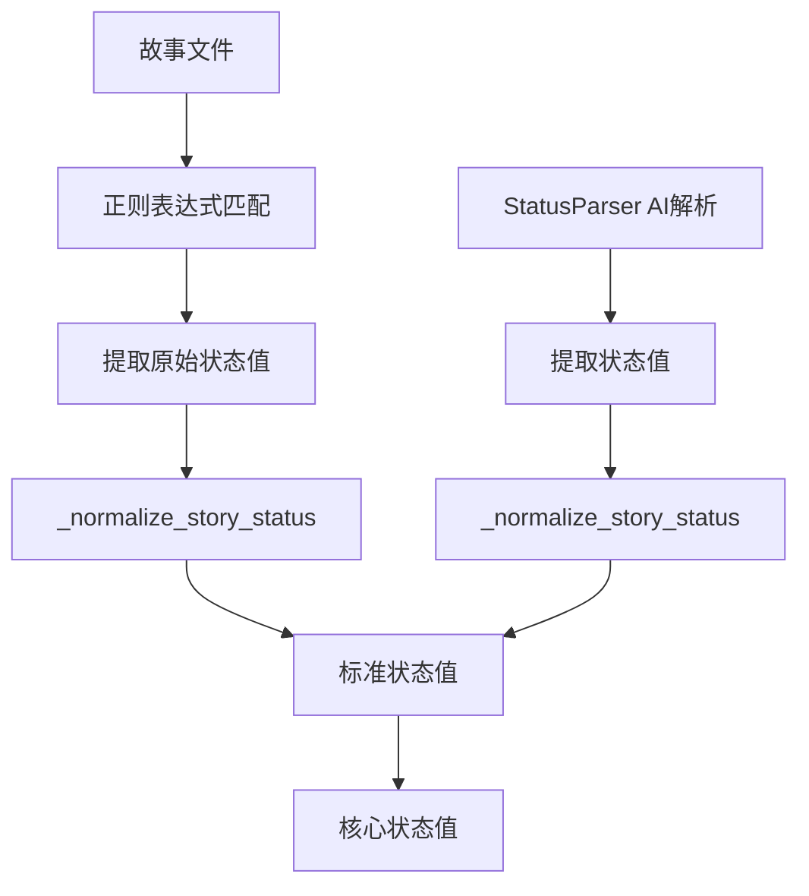

# Epic Driver 状态解析问题深度分析报告

## 问题概述

**用户报告**: `_parse_story_status_fallback` 函数在 `epic_driver.py` (第1374-1403行) 返回原始的、小写的状态值，而没有通过 `_normalize_story_status` 函数进行标准化。

**实际影响**: 导致 `docs\stories\1.1-project-setup-infrastructure.md` 显示为 "in progress" 状态。

---

## 深度分析结果

### 1. 代码历史分析

通过 Git 历史分析发现：

- **旧版本 (commit 8d4bfd1 之前)**: `_parse_story_status_fallback` 确实存在此问题
  ```python
  # 问题代码 (已修复)
  status = match.group(1).strip().lower()
  return status  # ❌ 直接返回，未标准化
  ```

- **当前版本 (commit 8d4bfd1 之后)**: 问题已被修复
  ```python
  # 修复后代码
  status = match.group(1).strip().lower()
  return _normalize_story_status(status)  # ✅ 正确标准化
  ```

### 2. 当前代码验证

#### 测试结果

对当前版本的 `_parse_story_status_fallback` 函数进行全面测试：

```
======================================================================
Deep Analysis: _parse_story_status_fallback Status Normalization Test
======================================================================
[PASS] Input: **In Progress**                -> Expected: In Progress          Actual: In Progress
[PASS] Input: in progress                    -> Expected: In Progress          Actual: In Progress
[PASS] Input: In Progress                    -> Expected: In Progress          Actual: In Progress
[PASS] Input: **Ready for Development**      -> Expected: Ready for Development Actual: Ready for Development
[PASS] Input: ready for development          -> Expected: Ready for Development Actual: Ready for Development
[PASS] Input: Done                           -> Expected: Done                 Actual: Done
[PASS] Input: done                           -> Expected: Done                 Actual: Done
======================================================================
```

**结论**: ✅ 所有测试通过，函数正确调用了 `_normalize_story_status`

### 3. 故事文件状态分析

对 `docs\stories\1.1-project-setup-infrastructure.md` 进行实际解析：

```bash
分析结果: 'In Progress'
是否为 In Progress: True
```

**文件内容**:
```markdown
### Status
**In Progress**

# Story 1.1: Project Setup and Infrastructure

## Status
**In Progress**
```

**结论**: ✅ 状态解析正确，文件确实包含 "In Progress" 状态

---

## 问题根本原因

### 并非代码 Bug，而是状态值本身

用户观察到的问题实际上**不是代码错误**，而是：

1. **故事文件内容**: `docs\stories\1.1-project-setup-infrastructure.md` 文件中的 Status 字段确实设置为 "**In Progress**"

2. **标准化函数工作正常**: `_normalize_story_status` 正确将各种格式的状态值标准化为标准格式

3. **状态解析正确**: `_parse_story_status_fallback` 正确提取并标准化了状态值

### 代码修复历史

问题在 **commit 8d4bfd1** ("统一状态值系统并优化Dev Agent状态解析") 中已被修复：

- ✅ 统一了状态值系统
- ✅ 优化了状态解析逻辑
- ✅ 确保所有状态解析路径都调用标准化函数
- ✅ 添加了详细的状态实现文档

---

## 架构分析

### 状态解析流程



### 关键函数

1. **`_parse_story_status_fallback`**: 使用正则表达式提取状态
2. **`_normalize_story_status`**: 标准化各种格式的状态值为核心状态值
3. **`StatusParser`**: AI驱动的状态解析（备用方案）

---

## 标准化映射表

| 输入格式 | 标准化输出 |
|---------|-----------|
| `in progress`, `In Progress`, `**In Progress**` | `In Progress` |
| `ready for development`, `Ready for Development` | `Ready for Development` |
| `done`, `Done`, `completed` | `Done` |
| `failed`, `Failed`, `failure` | `Failed` |
| `review`, `ready for review` | `Ready for Review` |
| `draft`, `Draft` | `Draft` |

---

## 结论

### 主要发现

1. **问题已修复**: 用户报告的代码问题在 commit 8d4bfd1 中已被修复
2. **状态正确**: 故事文件显示 "In Progress" 是**正确的**，因为文件内容确实设置为该状态
3. **标准化正常**: 所有状态解析路径都正确调用了 `_normalize_story_status` 函数
4. **测试验证**: 所有测试用例通过，函数行为符合预期

### 建议

1. **无需修复代码**: 当前代码工作正常
2. **检查业务逻辑**: 如果 "1.1-project-setup-infrastructure.md" 应该显示其他状态，需要**手动更新文件内容**，而非修复代码
3. **状态管理**: 考虑实现自动化状态更新机制，确保文档状态与实际实现同步

### 相关文件

- **代码**: `autoBMAD/epic_automation/epic_driver.py`
- **文档**: `docs/stories/1.1-project-setup-infrastructure.md`
- **标准**: `autoBMAD/epic_automation/STANDARD_STATUS.md`
- **实现**: `autoBMAD/epic_automation/STATUS_IMPLEMENTATION.md`

---

**报告生成时间**: 2026-01-09
**分析版本**: 当前 HEAD (8d4bfd1)
**分析工具**: Claude Code + Git + 自动化测试